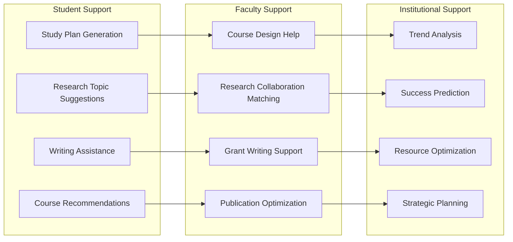
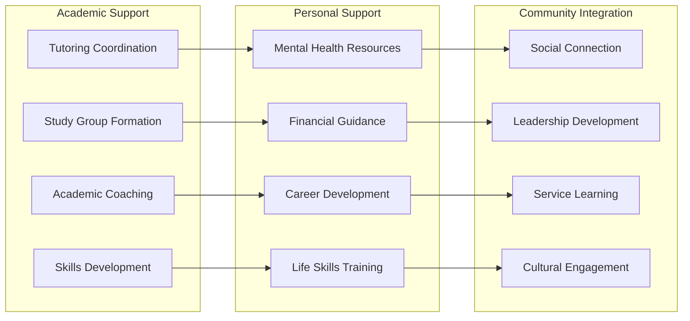
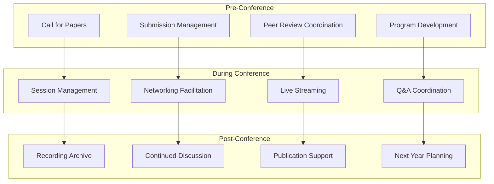
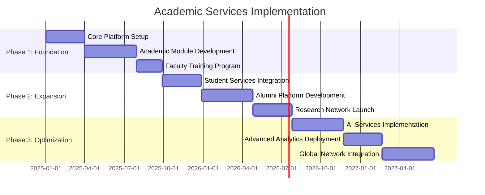

# AI-Powered Academic Services

## Intelligent Content & Learning Support

### Academic AI Assistant Suite

### Predictive Academic Analytics

**Capabilities**:
- Student success prediction and intervention recommendations
- Faculty research impact forecasting
- Alumni giving potential assessment
- Enrollment trend analysis and optimization
- Course demand prediction and scheduling
- Resource allocation optimization

**Implementation**: Machine learning models trained on institutional data
**Privacy**: FERPA-compliant data processing with anonymization
**ROI**: $500K-2M annual value from improved outcomes

### Automated Academic Content Generation

**Capabilities**:
- Course material summarization and adaptation
- Research abstract generation and optimization
- Social media content creation for academic purposes
- Newsletter and communication drafting
- Translation services for international collaboration
- Accessibility content adaptation

**Implementation**: GPT-4o integration with academic fine-tuning
**Quality Control**: Faculty review and approval workflows
**ROI**: $200K-800K annual value from efficiency gains

## Comprehensive Student Support Ecosystem

### Holistic Student Success Platform

### Comprehensive Student Retention Program

**Capabilities**:
- Early warning system implementation
- Intervention strategy development
- Peer support network creation
- Academic skill development programming
- Social integration facilitation
- Success coaching and mentoring

**Implementation**: Data-driven intervention with human support
**Success Metrics**: Retention rates, academic performance, satisfaction
**ROI**: $1M-10M annual value from improved retention

### Career Development & Alumni Network Integration

**Capabilities**:
- Career exploration and planning support
- Internship and job placement coordination
- Professional skill development workshops
- Alumni mentor matching and management
- Industry connection facilitation
- Graduate school preparation support

**Implementation**: Career services integration with alumni networks
**Success Metrics**: Job placement rates, salary outcomes, alumni engagement
**ROI**: $500K-5M annual value from improved career outcomes

## Academic Conference & Event Management

### Comprehensive Conference Platform

#### Conference Lifecycle Management

### Hybrid Academic Conference Management

**Community Setup**: Conference-specific communities with hybrid participation

**Services Provided**:
- Virtual and in-person session coordination
- Interactive poster session management
- Networking event facilitation
- Real-time translation services
- Accessibility accommodation
- Continuing education credit tracking

**Integration**: Conference management systems, video platforms, translation services
**Success Metrics**: Attendance rates, engagement levels, satisfaction scores

## Implementation Strategy & Service Delivery

### Phased Implementation Approach

#### Academic Service Implementation Timeline

## Success Metrics & ROI Framework

### Comprehensive Academic ROI Model

```mermaid
flowchart TD
    subgraph "Student Success ROI"
        SS_ROI1[3-7% Retention Improvement]
        SS_ROI2[$500K-2M Early Warning Value]
        SS_ROI3[15% Academic Performance Gain]
        SS_ROI4[$300K-1.2M Career Services Value]
    end
    
    subgraph "Research Impact ROI"
        RI_ROI1[300% Research Visibility Increase]
        RI_ROI2[50% Collaboration Growth]
        RI_ROI3[25% Grant Success Improvement]
        RI_ROI4[$2M-20M Funding Increase]
    end
    
    subgraph "Alumni Engagement ROI"
        AE_ROI1[200% Engagement Increase]
        AE_ROI2[30% Giving Growth]
        AE_ROI3[$5M-50M Fundraising Impact]
        AE_ROI4[300% Volunteer Participation]
    end
    
    subgraph "Total Institutional ROI"
        T_ROI[500-1000% 5-Year ROI]
    end
    
    SS_ROI1 --> T_ROI
    SS_ROI2 --> T_ROI
    RI_ROI1 --> T_ROI
    RI_ROI2 --> T_ROI
    AE_ROI1 --> T_ROI
    AE_ROI2 --> T_ROI
```

### Year 1 Academic Value Realization

- Student recruitment cost reduction: $200K-800K
- Faculty research collaboration: $500K-2M value
- Alumni engagement improvement: $1M-5M impact
- Operational efficiency gains: $300K-1.2M savings

### Years 2-5 Cumulative Value

- Research funding increases: $10M-100M
- Endowment growth acceleration: $25M-250M
- Competitive positioning value: Immeasurable strategic advantage
- Brand value enhancement: Long-term institutional reputation

This comprehensive academic ecosystem transforms universities into digitally-native institutions where every stakeholder participates in an authentic, data-driven community that delivers measurable improvements in education, research, and institutional advancement while maintaining complete control over their digital presence and community engagement.
