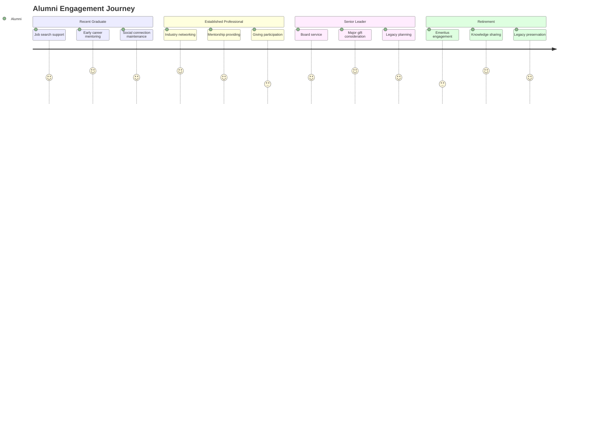
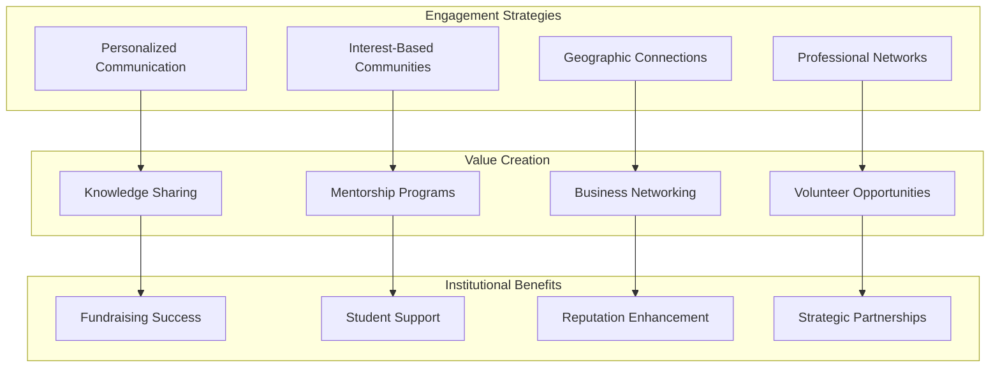
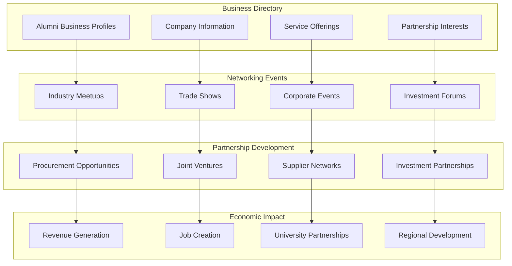

# Alumni Engagement & Advancement

## Lifetime Alumni Community Platform

### Alumni Lifecycle Management

### Alumni Career Network Platform

**Community Setup**: Industry and geographic alumni communities with professional focus

**Services Provided**:
- Job posting and recruitment support
- Mentorship matching and coordination
- Industry insight sharing
- Professional development workshops
- Business networking events
- Career transition support

**Integration**: Career services, HR systems, professional databases
**Success Metrics**: Job placement rates, mentorship satisfaction, network growth

### Alumni Giving & Stewardship

**Community Setup**: Donor communities organized by giving level and interest areas

**Services Provided**:
- Impact storytelling and updates
- Giving opportunity presentation
- Stewardship and recognition
- Major gift cultivation
- Planned giving education
- Legacy society engagement

**Integration**: Advancement systems, financial platforms, recognition programs
**Success Metrics**: Giving participation, donation amounts, donor retention

## Sophisticated Alumni Engagement Platform

### Alumni Lifecycle Value Creation

### Advanced Alumni Giving Strategy

**Capabilities**:
- Donor prospect identification and research
- Personalized cultivation strategies
- Impact storytelling and stewardship
- Major gift campaign coordination
- Planned giving program development
- Recognition and appreciation events

**Implementation**: Professional fundraising teams with alumni insights
**Success Metrics**: Giving participation, donation amounts, donor satisfaction
**ROI**: $5M-50M annual value from increased giving

### Alumni Business Network Development

**Capabilities**:
- Alumni business directory creation and maintenance
- Business networking event coordination
- Partnership opportunity identification
- Economic impact measurement and reporting
- Corporate engagement and sponsorship
- Procurement and vendor connection facilitation

**Implementation**: Business development professionals with alumni relations
**Success Metrics**: Business connections, economic impact, corporate partnerships
**ROI**: $2M-20M annual value from business network development

#### Alumni Economic Impact Network

## Alumni Revenue Streams

### Alumni Network Monetization

**Alumni Network Access**: $500-2,000/alumni/year for premium community features
- Exclusive industry networking events
- Professional development workshops
- Career transition support
- Business partnership opportunities
- Continuing education access
- Legacy society membership

**Alumni Career Services**: $100-1,000/service for premium career support
- Executive coaching and mentoring
- Industry-specific career guidance
- Leadership development programs
- Board placement services
- Corporate consulting opportunities
- Entrepreneurship support

### Alumni Business Development

**Corporate Partnership Revenue**: $10,000-100,000/year for industry connections
- Alumni business directory access
- Corporate recruitment partnerships
- Industry advisory board participation
- Technology transfer opportunities
- Research collaboration facilitation
- Vendor relationship development

**Fundraising Platform Revenue**: 2-5% of funds raised through platform
- Major gift campaign management
- Annual giving program optimization
- Planned giving administration
- Corporate sponsorship coordination
- Foundation grant applications
- Capital campaign support

### Alumni Engagement ROI

**Year 1 Alumni Value Realization**:
- Fundraising efficiency improvements: $500K-2M
- Corporate partnership development: $1M-5M
- Career services enhancement: $200K-800K
- Network value creation: $300K-1.2M

**Years 2-5 Cumulative Alumni Value**:
- Endowment growth acceleration: $25M-250M
- Corporate partnership revenue: $5M-50M
- Alumni business network value: $10M-100M
- Institutional reputation enhancement: Immeasurable strategic advantage
