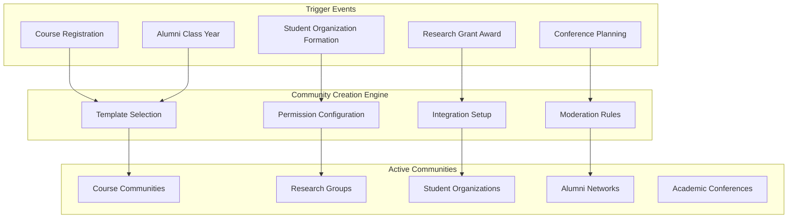
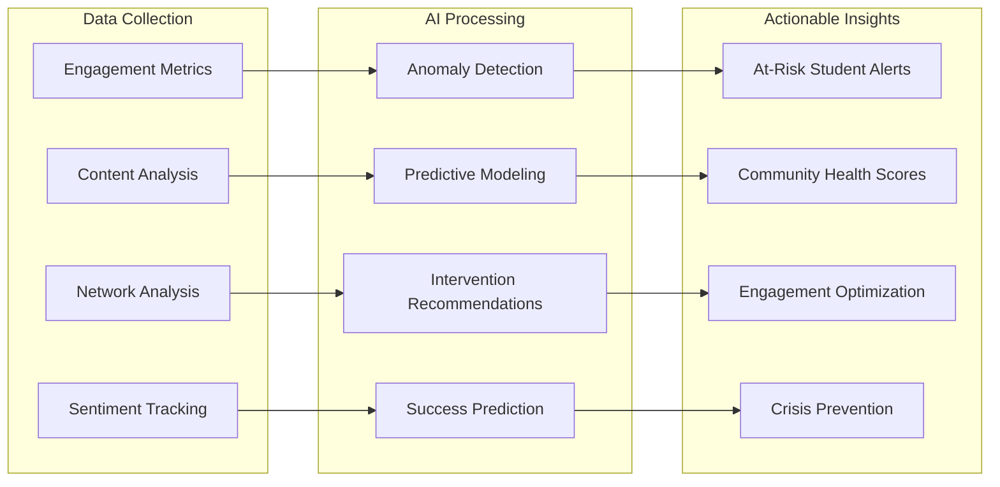

# Community Services Architecture

## Core Community Services Architecture

### Community Creation & Management Engine

#### Automated Community Provisioning

### Community Types & Specifications

#### Academic Course Communities

- **Automatic Creation**: Triggered by course registration in SIS
- **Membership**: Auto-enrolled students, faculty, TAs
- **Lifecycle**: Follows academic calendar (creation, active period, archive)
- **Features**: Assignment discussions, study groups, resource sharing
- **Integration**: Canvas/Blackboard LMS, gradebook sync, attendance tracking
- **Privacy**: FERPA-compliant student record protection
- **Moderation**: Professor oversight, TA moderation, academic integrity monitoring

#### Research Collaboration Communities

- **Creation Triggers**: Grant applications, research project initiation, publication collaboration
- **Membership**: Principal investigators, co-investigators, graduate students, lab members
- **Features**: Data sharing, methodology discussions, publication collaboration
- **Integration**: Research management systems, grant tracking, publication databases
- **Security**: IRB compliance, intellectual property protection, secure data sharing
- **Cross-Institutional**: Federation with partner universities and research institutions

#### Student Organization Communities

- **Creation Process**: Student petition, advisor approval, constitution submission
- **Governance**: Officer roles, election systems, budget tracking
- **Features**: Event planning, member recruitment, communication channels
- **Integration**: Campus event management, budget systems, student affairs
- **Oversight**: Advisor monitoring, institutional policy compliance

## Advanced Community Intelligence

### AI-Powered Community Health Monitoring

### Community Health Metrics

- **Engagement Velocity**: Post frequency, response times, interaction depth
- **Network Density**: Connection patterns, influence mapping, collaboration frequency
- **Content Quality**: Academic relevance, resource sharing, knowledge creation
- **Member Satisfaction**: Sentiment analysis, feedback scores, retention rates
- **Goal Achievement**: Learning outcomes, research progress, event success
