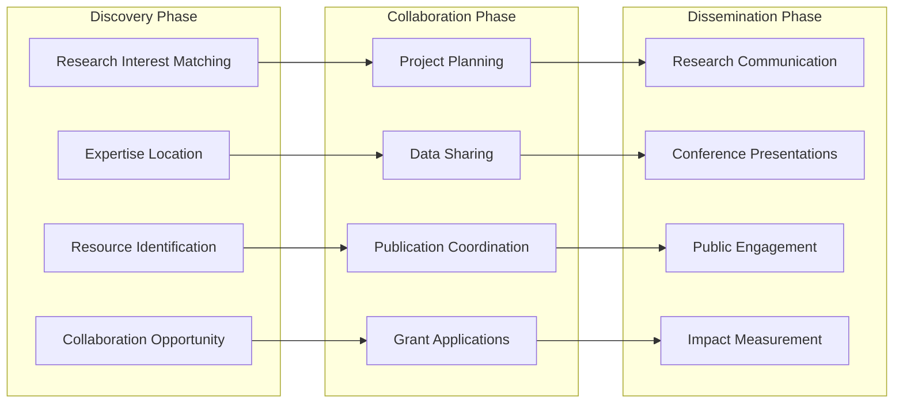
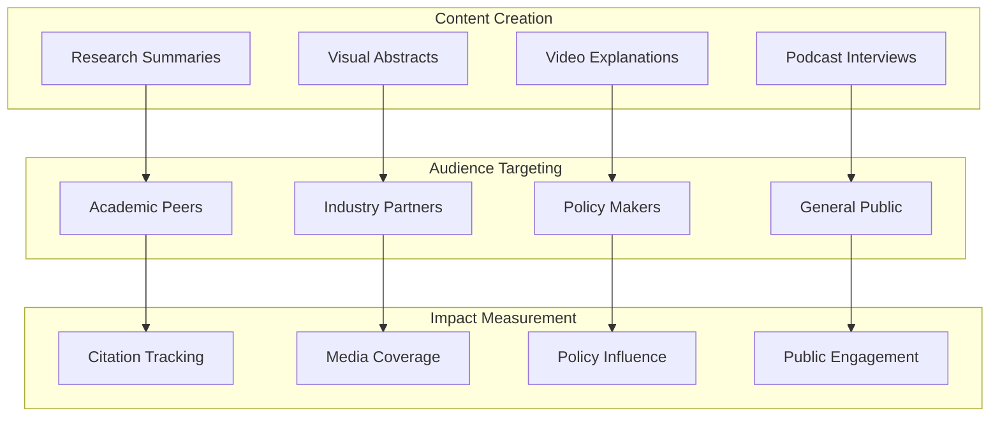
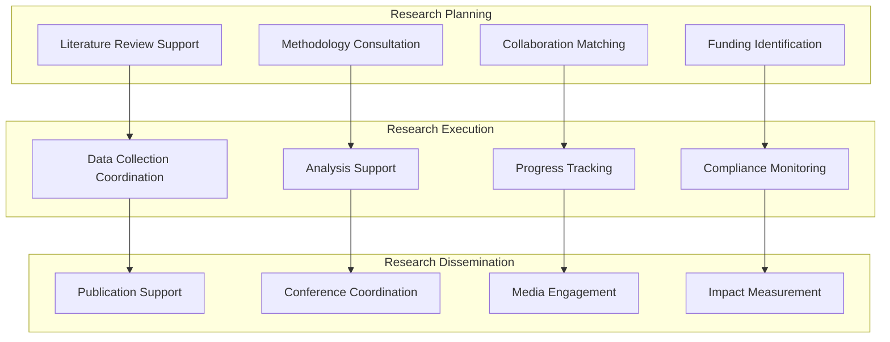

# Faculty Research & Collaboration

## Cross-Institutional Research Networks

### Research Collaboration Ecosystem

### Interdisciplinary Research Communities

**Community Setup**: Theme-based research communities crossing traditional disciplines

**Services Provided**:
- Researcher discovery and matching
- Methodology sharing and consultation
- Equipment and resource sharing
- Joint funding opportunity identification
- Collaborative publication support
- Conference and symposium coordination

**Integration**: Research databases, funding systems, publication platforms
**Success Metrics**: Collaboration frequency, grant success rates, publication impact

### Global Research Partnership Networks

**Community Setup**: International research communities with federated university connections

**Services Provided**:
- Cross-border collaboration facilitation
- Cultural and regulatory guidance
- Translation and communication support
- Time zone coordination tools
- Virtual research exchange programs
- International conference coordination

**Integration**: International offices, research administration, legal compliance
**Success Metrics**: International partnerships, global research impact, student exchanges

## Research Impact & Communication

### Research Dissemination Platform

### Public Scholarship Initiative

**Community Setup**: Public-facing research communication communities

**Services Provided**:
- Plain language research translation
- Media training and support
- Public lecture coordination
- Community engagement events
- Policy briefing development
- Social impact storytelling

**Integration**: Media relations, community outreach, policy offices
**Success Metrics**: Media mentions, public engagement, policy citations

## Advanced Research Support Services

### Research Impact Amplification

**Capabilities**:
- Strategic research communication planning
- Media relations and press release coordination
- Public engagement event planning
- Policy maker outreach and briefings
- Industry partnership facilitation
- Citation and impact tracking

**Implementation**: Professional communication teams with academic expertise
**Success Metrics**: Media coverage, citation rates, policy influence
**ROI**: $1M-5M annual value from increased research impact

### Grant Application Support Ecosystem

**Capabilities**:
- Funding opportunity identification and matching
- Collaborative grant application coordination
- Proposal writing support and review
- Budget development and compliance
- Submission tracking and management
- Post-award administration support

**Implementation**: Grant writing experts with institutional knowledge
**Success Metrics**: Application quality, success rates, funding amounts
**ROI**: $2M-20M annual value from increased grant success

## Research Excellence Services

### Comprehensive Research Support Platform

#### Research Lifecycle Management

#### Research Impact Amplification Service
**Capabilities**:
- Strategic research communication planning
- Media relations and press release coordination
- Public engagement event planning
- Policy maker outreach and briefings
- Industry partnership facilitation
- Citation and impact tracking

**Implementation**: Professional communication teams with academic expertise
**Success Metrics**: Media coverage, citation rates, policy influence
**ROI**: $1M-5M annual value from increased research impact

#### Grant Application Support Ecosystem
**Capabilities**:
- Funding opportunity identification and matching
- Collaborative grant application coordination
- Proposal writing support and review
- Budget development and compliance
- Submission tracking and management
- Post-award administration support

**Implementation**: Grant writing experts with institutional knowledge
**Success Metrics**: Application quality, success rates, funding amounts
**ROI**: $2M-20M annual value from increased grant success

### Research Revenue Streams

**Academic Revenue Streams**:
- **Research Collaboration Platform**: $25,000-250,000/year for cross-institutional research networks
- **Corporate Partnership Portal**: $10,000-100,000/year for industry-university connections
- **Grant Writing Support**: $5,000-50,000/successful grant application
- **Research Impact Services**: $10,000-100,000/year for research amplification
- **Publication Support**: $1,000-10,000/publication for enhanced dissemination
- **Conference Management**: 10-20% commission on conference revenue
