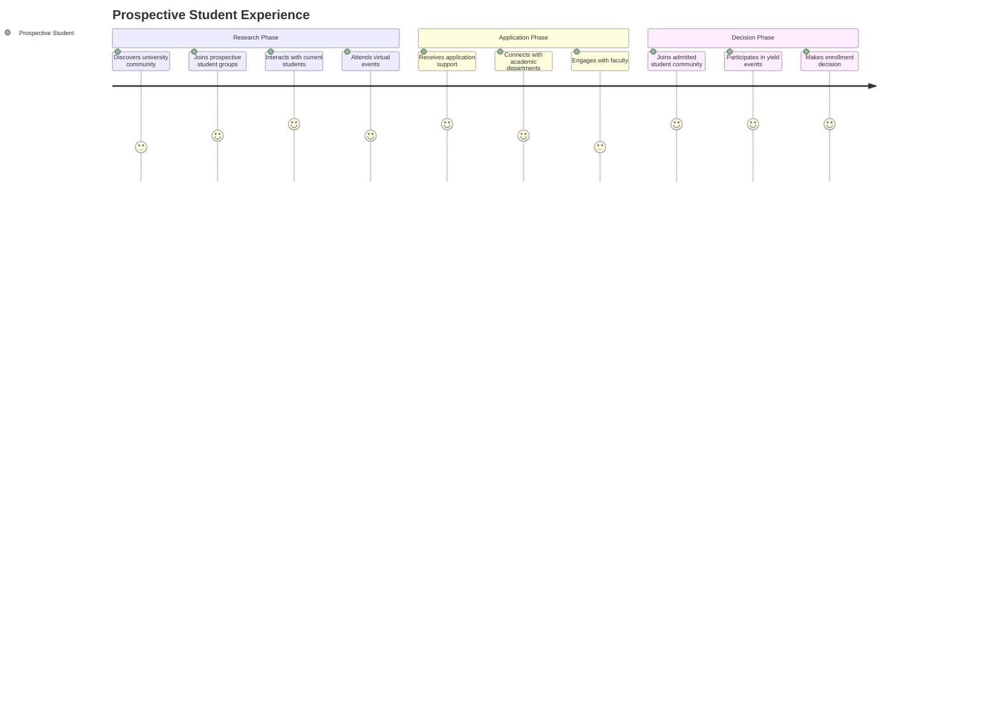
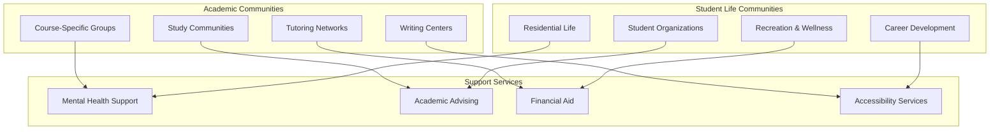
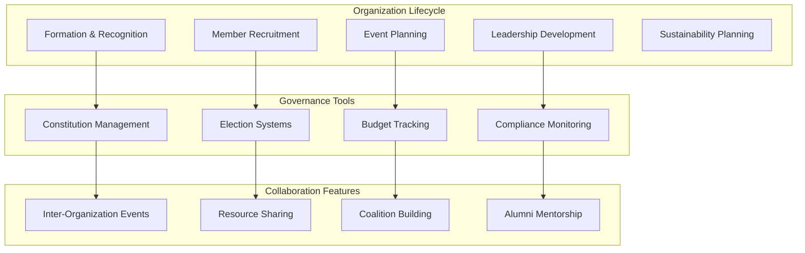
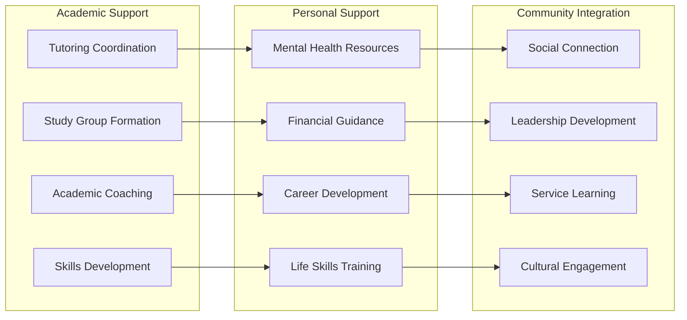

# Student Lifecycle Management

## Comprehensive Academic Use Cases

### Student Lifecycle Management

#### Prospective Student Journey

**Virtual Campus Discovery Community**

#### International Student Recruitment

**Community Setup**: Country-specific recruitment communities with cultural liaisons

**Services Provided**:
- Multilingual support communities (Spanish, Mandarin, Arabic, Hindi, French)
- Cultural integration workshops and discussions
- Visa and immigration guidance communities
- Pre-arrival academic preparation groups
- Local student ambassador connections

**Integration**: Immigration services, international student office, academic advising
**Success Metrics**: Application conversion rates, enrollment confirmations, student satisfaction

#### Graduate Program Recruitment

**Community Setup**: Department-specific graduate communities with faculty research showcasing

**Services Provided**:
- Research interest matching with faculty
- Graduate student mentor connections
- Funding opportunity discussions
- Application process guidance
- Virtual lab tours and research presentations

**Integration**: Graduate school systems, research databases, funding trackers
**Success Metrics**: Application quality, program fit, research productivity

## Current Student Engagement & Success

### Academic Support Ecosystem

### First-Year Experience Communities

**Community Setup**: Cohort-based first-year communities with peer mentors

**Services Provided**:
- Orientation and transition support
- Academic skill development workshops
- Social integration activities
- Campus resource navigation
- Peer mentor matching and support
- Parent and family engagement

**Integration**: Academic advising, residence life, student affairs
**Success Metrics**: Retention rates, GPA improvement, satisfaction scores, social integration

### STEM Student Success Initiative

**Community Setup**: Discipline-specific STEM communities with academic support

**Services Provided**:
- Study group formation and coordination
- Peer tutoring networks
- Research opportunity discovery
- Industry mentor connections
- Graduate school preparation
- Diversity and inclusion programming

**Integration**: STEM departments, career services, research offices
**Success Metrics**: Course completion rates, research participation, career placement

### At-Risk Student Intervention

**Community Setup**: Confidential support communities with counseling integration

**Services Provided**:
- Early warning system alerts
- Peer support group facilitation
- Academic intervention coordination
- Mental health resource connections
- Financial aid counseling
- Success coaching and mentoring

**Integration**: Student information systems, counseling services, academic advising
**Success Metrics**: Intervention success rates, student retention, academic improvement

## Student Organization & Leadership Development

### Comprehensive Organization Management

### Student Government Digital Democracy

**Community Setup**: Campus-wide student government community with democratic tools

**Services Provided**:
- Digital voting and election management
- Policy discussion and debate forums
- Budget transparency and input collection
- Campus issue reporting and resolution
- Student feedback aggregation and analysis
- Administrative communication and updates

**Integration**: University administration, budget systems, policy databases
**Success Metrics**: Voter participation, policy engagement, issue resolution rates

### Greek Life Community Management

**Community Setup**: Chapter-specific communities with inter-Greek collaboration

**Services Provided**:
- Recruitment and rush management
- Event coordination and promotion
- Risk management and safety protocols
- Alumni engagement and mentorship
- Academic achievement tracking
- Community service coordination

**Integration**: Greek life office, risk management, alumni relations
**Success Metrics**: Membership retention, academic performance, safety compliance

## Comprehensive Student Support Ecosystem

### Holistic Student Success Platform

### Comprehensive Student Retention Program
**Capabilities**:
- Early warning system implementation
- Intervention strategy development
- Peer support network creation
- Academic skill development programming
- Social integration facilitation
- Success coaching and mentoring

**Implementation**: Data-driven intervention with human support
**Success Metrics**: Retention rates, academic performance, satisfaction
**ROI**: $1M-10M annual value from improved retention

### Career Development & Alumni Network Integration
**Capabilities**:
- Career exploration and planning support
- Internship and job placement coordination
- Professional skill development workshops
- Alumni mentor matching and management
- Industry connection facilitation
- Graduate school preparation support

**Implementation**: Career services integration with alumni networks
**Success Metrics**: Job placement rates, salary outcomes, alumni engagement
**ROI**: $500K-5M annual value from improved career outcomes
