# API Integration Framework: Local Partnership Architecture

## Comprehensive Third-Party API Integration for Local Community Economy

### Overview

The FediFlow API Integration Framework enables deep partnerships with local businesses and services, creating a robust ecosystem where community members can monetize their content while supporting local economic development. This system integrates with existing business platforms to create seamless revenue-sharing opportunities.

## Core API Architecture

### **Authentication & Security Framework**

```typescript
interface FediFlowAPIAuth {
  globalFediId: string;
  institutionDomain: string;
  authTokens: {
    primary: JWTToken;
    refresh: RefreshToken;
    platformSpecific: Map<Platform, Token>;
  };
  permissions: {
    contentMonetization: boolean;
    businessIntegration: boolean;
    revenueSharing: boolean;
    dataAnalytics: boolean;
  };
  securityLevel: 'community' | 'creator' | 'business' | 'enterprise';
}

interface APISecurityConfig {
  encryption: 'AES-256-GCM';
  keyRotation: '24h';
  rateLimit: {
    standard: '1000/hour';
    premium: '10000/hour';
    enterprise: 'unlimited';
  };
  auditLogging: boolean;
  complianceFrameworks: ['GDPR', 'CCPA', 'FERPA', 'SOC2'];
}
```

### **Universal API Gateway**

```mermaid
graph TB
    subgraph "FediFlow API Gateway"
        AUTH[🔐 Authentication Layer]
        ROUTING[🔄 Request Routing]
        VALIDATION[✅ Input Validation]
        RATE_LIMIT[⚡ Rate Limiting]
        LOGGING[📊 Audit Logging]
    end
    
    subgraph "Business Category APIs"
        RESTAURANT[🍽️ Restaurant POS]
        RETAIL[🛍️ E-commerce]
        REAL_ESTATE[🏠 Property Management]
        HEALTHCARE[🏥 Healthcare Systems]
        EDUCATION[🎓 Educational Services]
        HOSPITALITY[🏨 Hospitality]
        FITNESS[💪 Fitness Centers]
        AUTOMOTIVE[🚗 Automotive Services]
    end
    
    subgraph "Revenue Processing"
        PAYMENT[💳 Payment Processing]
        COMMISSION[💰 Commission Distribution]
        ANALYTICS[📈 Performance Analytics]
        REPORTING[📊 Revenue Reporting]
    end
    
    AUTH --> ROUTING
    ROUTING --> VALIDATION
    VALIDATION --> RATE_LIMIT
    RATE_LIMIT --> LOGGING
    
    LOGGING --> RESTAURANT
    LOGGING --> RETAIL
    LOGGING --> REAL_ESTATE
    LOGGING --> HEALTHCARE
    LOGGING --> EDUCATION
    LOGGING --> HOSPITALITY
    LOGGING --> FITNESS
    LOGGING --> AUTOMOTIVE
    
    RESTAURANT --> PAYMENT
    RETAIL --> COMMISSION
    REAL_ESTATE --> ANALYTICS
    HEALTHCARE --> REPORTING
```



## Industry-Specific API Integrations

### **Restaurant & Food Service Integration**

#### **POS System Integration**
```typescript
interface RestaurantAPIIntegration {
  posProviders: {
    square: SquareAPI;
    toast: ToastAPI;
    resy: ResyAPI;
    opentable: OpenTableAPI;
    doordash: DoorDashAPI;
    ubereats: UberEatsAPI;
    grubhub: GrubHubAPI;
  };
  
  contentMonetization: {
    menuPhotography: {
      commission: '10-15%';
      usage: 'social_media_posts';
      exclusivity: 'local_only';
    };
    reviewContent: {
      videoReviews: '$25-100/review';
      writtenReviews: '$10-50/review';
      socialMediaPosts: '$5-25/post';
    };
    eventDocumentation: {
      liveStreaming: '$100-500/event';
      photography: '$200-1000/event';
      videography: '$500-2000/event';
    };
  };
  
  businessBenefits: {
    authenticContent: 'student_generated_reviews';
    socialProof: 'campus_community_endorsement';
    eventMarketing: 'institutional_event_promotion';
    seasonalCampaigns: 'semester_based_marketing';
  };
}
```

#### **Implementation Flow**


### **Retail & E-commerce Integration**

#### **Platform Integrations**
```typescript
interface RetailAPIIntegration {
  ecommerceProviders: {
    shopify: ShopifyAPI;
    woocommerce: WooCommerceAPI;
    bigcommerce: BigCommerceAPI;
    squarespace: SquarespaceAPI;
    etsy: EtsyAPI;
    amazon: AmazonAPI;
    facebook: FacebookShopsAPI;
  };
  
  contentOpportunities: {
    productPhotography: {
      commission: '8-12%';
      usage: 'product_listings';
      licensing: 'perpetual_commercial';
    };
    unboxingVideos: {
      payment: '$50-300/video';
      platforms: ['PeerTube', 'Owncast'];
      audienceReach: 'campus_community';
    };
    affiliateContent: {
      commission: '3-8%';
      cookieDuration: '30-90 days';
      platforms: 'all_federated_platforms';
    };
    seasonalCampaigns: {
      backToSchool: '$500-2000/campaign';
      holidays: '$1000-5000/campaign';
      graduation: '$300-1500/campaign';
    };
  };
  
  inventoryIntegration: {
    campusSpecificProducts: boolean;
    studentDiscountCodes: string[];
    exclusiveProductLines: boolean;
    sustainabilityFocus: boolean;
  };
}
```

### **Real Estate & Housing Integration**

#### **Property Management APIs**
```typescript
interface RealEstateAPIIntegration {
  propertyProviders: {
    yardi: YardiAPI;
    realpage: RealPageAPI;
    appfolio: AppFolioAPI;
    buildium: BuildiumAPI;
    costar: CoStarAPI;
    zillow: ZillowAPI;
    apartments: ApartmentsAPI;
  };
  
  contentServices: {
    propertyPhotography: {
      rate: '$100-500/property';
      usage: 'listing_photos';
      exclusivity: 'local_market';
    };
    virtualTours: {
      rate: '$300-1500/property';
      platforms: ['PeerTube', 'Owncast'];
      equipment: 'provided_by_property';
    };
    neighborhoodGuides: {
      rate: '$200-1000/guide';
      update_frequency: 'quarterly';
      local_expertise: 'student_perspective';
    };
    moveInContent: {
      tutorials: '$100-500/video';
      testimonials: '$50-250/testimonial';
      campusProximity: 'verified_student_experience';
    };
  };
  
  studentHousingFocus: {
    campusProximity: boolean;
    studentBudgetOptimization: boolean;
    academicCalendarIntegration: boolean;
    roommateFinding: boolean;
  };
}
```

### **Healthcare & Wellness Integration**

#### **Healthcare API Framework**
```typescript
interface HealthcareAPIIntegration {
  healthcareProviders: {
    epic: EpicAPI;
    cerner: CernerAPI;
    athenahealth: AthenaAPI;
    allscripts: AllscriptsAPI;
    teladoc: TeladocAPI;
    zocdoc: ZocDocAPI;
    healthtap: HealthTapAPI;
  };
  
  contentCompliance: {
    hipaCompliance: boolean;
    medicalDisclaimer: string;
    professionalReview: boolean;
    educationalFocus: boolean;
  };
  
  wellnessContent: {
    mentalHealthResources: {
      rate: '$100-1000/resource';
      peerSupport: 'anonymous_sharing';
      professionalGuidance: 'licensed_review';
    };
    fitnessContent: {
      campusGymTours: '$200-800/tour';
      workoutTutorials: '$50-300/video';
      nutritionGuides: '$100-500/guide';
    };
    preventiveCare: {
      healthScreeningInfo: '$150-600/campaign';
      vaccinationDrives: '$300-1200/event';
      wellnessEvents: '$200-1000/event';
    };
  };
}
```

### **Educational Services Integration**

#### **Learning Platform APIs**
```typescript
interface EducationAPIIntegration {
  learningPlatforms: {
    canvas: CanvasAPI;
    blackboard: BlackboardAPI;
    moodle: MoodleAPI;
    coursera: CourseraAPI;
    edx: EdXAPI;
    udemy: UdemyAPI;
    skillshare: SkillshareAPI;
  };
  
  academicContent: {
    tutorialCreation: {
      rate: '$25-200/tutorial';
      subjectExpertise: 'peer_verification';
      qualityAssurance: 'instructor_review';
    };
    studyGuides: {
      rate: '$50-500/guide';
      semesterRelevance: boolean;
      collaborative: 'multi_student_creation';
    };
    examPreparation: {
      rate: '$100-1000/course';
      successMetrics: 'grade_improvement';
      peerTesting: 'student_validation';
    };
  };
  
  institutionalIntegration: {
    creditValidation: boolean;
    professorialOversight: boolean;
    curriculumAlignment: boolean;
    assessmentIntegration: boolean;
  };
}
```

## Revenue Distribution Architecture

### **Multi-Party Payment Processing**

```typescript
interface RevenueDistribution {
  paymentProcessors: {
    stripe: StripeAPI;
    paypal: PayPalAPI;
    square: SquareAPI;
    adyen: AdyenAPI;
  };
  
  distributionRules: {
    creator: {
      percentage: '60-75%';
      minimumPayout: '$25';
      paymentSchedule: 'weekly';
    };
    institution: {
      percentage: '15-25%';
      allocation: 'platform_maintenance';
      reinvestment: 'creator_tools';
    };
    localBusiness: {
      percentage: '5-15%';
      value: 'marketing_roi';
      analytics: 'performance_tracking';
    };
    platform: {
      percentage: '5-10%';
      services: 'api_maintenance';
      development: 'feature_enhancement';
    };
  };
  
  escrowServices: {
    contentDelivery: 'milestone_based';
    qualityAssurance: '48_hour_review';
    disputeResolution: 'automated_mediation';
  };
}
```

### **Revenue Optimization Engine**

```mermaid
graph TB
    subgraph "Content Creation"
        CREATOR[👨‍🎓 Creator]
        CONTENT[📝 Content Creation]
        QUALITY[✅ Quality Review]
    end
    
    subgraph "Business Integration"
        LOCAL_BIZ[🏪 Local Business]
        API_CONNECT[🔌 API Integration]
        CAMPAIGN[📢 Marketing Campaign]
    end
    
    subgraph "Revenue Processing"
        PAYMENT[💳 Payment Gateway]
        ESCROW[🏦 Escrow Service]
        DISTRIBUTION[💰 Revenue Distribution]
    end
    
    subgraph "Performance Analytics"
        METRICS[📊 Performance Metrics]
        ROI[📈 ROI Analysis]
        OPTIMIZATION[⚡ Optimization Recommendations]
    end
    
    CREATOR --> CONTENT
    CONTENT --> QUALITY
    QUALITY --> LOCAL_BIZ
    
    LOCAL_BIZ --> API_CONNECT
    API_CONNECT --> CAMPAIGN
    CAMPAIGN --> PAYMENT
    
    PAYMENT --> ESCROW
    ESCROW --> DISTRIBUTION
    DISTRIBUTION --> METRICS
    
    METRICS --> ROI
    ROI --> OPTIMIZATION
    OPTIMIZATION --> CREATOR
```



## Advanced Integration Features

### **AI-Powered Partnership Matching**

```typescript
interface PartnershipAI {
  contentAnalysis: {
    qualityScore: number;
    audienceAlignment: number;
    brandCompatibility: number;
    performancePrediction: number;
  };
  
  businessMatching: {
    geographicRelevance: number;
    demographicAlignment: number;
    budgetCompatibility: number;
    collaborationHistory: number;
  };
  
  revenueOptimization: {
    pricingRecommendations: number;
    seasonalTrends: TrendData[];
    competitorAnalysis: MarketData;
    growthProjections: ProjectionData;
  };
}
```

### **Cross-Platform Content Syndication**

```typescript
interface ContentSyndication {
  platformOptimization: {
    mastodon: 'short_updates_hashtags';
    peertube: 'educational_long_form';
    pixelfed: 'visual_storytelling';
    writefreely: 'detailed_analysis';
    funkwhale: 'podcast_summaries';
    mobilizon: 'event_promotion';
    owncast: 'live_streaming';
    castopod: 'professional_podcasts';
  };
  
  automaticDistribution: {
    contentAdaptation: boolean;
    platformSpecificFormatting: boolean;
    optimizedPosting: boolean;
    performanceTracking: boolean;
  };
  
  crossPlatformAnalytics: {
    unifiedDashboard: boolean;
    aggregatedMetrics: boolean;
    platformComparison: boolean;
    optimizationSuggestions: boolean;
  };
}
```

## Implementation Timeline & Milestones

### **Phase 1: Foundation APIs (Months 1-4)**
- ✅ Authentication and security framework
- ✅ Restaurant and retail API integrations
- ✅ Basic revenue distribution system
- **Target**: 50+ local business partnerships

### **Phase 2: Advanced Integrations (Months 5-8)**
- 🔄 Real estate and healthcare APIs
- 🔄 Educational platform integrations
- 🔄 AI-powered partnership matching
- **Target**: 200+ business partnerships, $100K+ monthly revenue

### **Phase 3: Ecosystem Optimization (Months 9-12)**
- ⏳ Cross-platform content syndication
- ⏳ Advanced analytics and optimization
- ⏳ Enterprise-level integrations
- **Target**: 500+ partnerships, $500K+ monthly revenue

### **Phase 4: Regional Expansion (Months 13-18)**
- ⏳ Multi-institutional deployment
- ⏳ Regional business networks
- ⏳ Advanced AI-driven optimization
- **Target**: Regional market leadership, $2M+ annual revenue

## Security & Compliance Framework

### **Data Protection Standards**

```typescript
interface SecurityCompliance {
  dataEncryption: {
    inTransit: 'TLS 1.3';
    atRest: 'AES-256-GCM';
    keyManagement: 'HSM-based';
  };
  
  accessControl: {
    authentication: 'multi_factor';
    authorization: 'role_based_access';
    sessionManagement: 'jwt_with_refresh';
  };
  
  auditCompliance: {
    logging: 'comprehensive_audit_trail';
    monitoring: 'real_time_anomaly_detection';
    reporting: 'automated_compliance_reports';
  };
  
  privacyCompliance: {
    gdpr: 'full_compliance';
    ccpa: 'full_compliance';
    ferpa: 'educational_data_protection';
    coppa: 'minor_protection';
  };
}
```

### **Business Partnership Agreements**

```typescript
interface PartnershipAgreement {
  contentRights: {
    usage: 'limited_commercial';
    attribution: 'creator_credit_required';
    exclusivity: 'local_market_only';
    duration: 'campaign_specific';
  };
  
  revenueSharing: {
    transparency: 'full_financial_disclosure';
    paymentTerms: 'net_15_days';
    disputeResolution: 'automated_mediation';
    performanceMetrics: 'agreed_kpis';
  };
  
  qualityStandards: {
    contentGuidelines: 'brand_alignment';
    reviewProcess: 'multi_stage_approval';
    revisionPolicy: 'unlimited_reasonable_revisions';
    cancellationTerms: 'mutual_termination_rights';
  };
}
```

## Success Metrics & KPIs

### **Business Partnership Performance**

| Metric | Target | Current | Growth |
|---|---|---|---|
| **Active Business Partnerships** | 500+ | - | New |
| **Monthly API Calls** | 1M+ | - | New |
| **Revenue Generated** | $500K+/month | - | New |
| **Creator Participation** | 2,000+ | - | New |
| **Business Satisfaction** | 90%+ | - | New |
| **Revenue Per Creator** | $250+/month | - | New |
| **Local Economic Impact** | $2M+/year | - | New |

### **Technical Performance Metrics**

```typescript
interface TechnicalKPIs {
  apiPerformance: {
    averageResponseTime: '<200ms';
    uptime: '99.9%';
    throughput: '10K requests/second';
    errorRate: '<0.1%';
  };
  
  integrationHealth: {
    successfulConnections: '>99%';
    dataAccuracy: '99.9%';
    syncLatency: '<5 minutes';
    failoverTime: '<30 seconds';
  };
  
  securityMetrics: {
    vulnerabilityScore: 'A+';
    incidentCount: '0 critical';
    complianceScore: '100%';
    auditResults: 'clean';
  };
}
```

## Conclusion

The FediFlow API Integration Framework creates a comprehensive ecosystem where educational institutions, local businesses, and community members collaborate through content creation and revenue sharing. This framework maintains all existing FediFlow features while adding substantial value through local economic integration and member monetization opportunities.

**Key Benefits:**
- **For Institutions**: Enhanced engagement and additional revenue streams
- **For Students/Creators**: Monetization opportunities and skill development
- **For Local Businesses**: Authentic marketing and community connection
- **For Communities**: Economic development and social cohesion

The framework is designed to scale from individual institutions to regional networks, creating a sustainable model for federated social media that benefits all stakeholders while maintaining user privacy and community values.
