# Business Institution Licensing: Economic Anchor Integration

## Comprehensive Business Organization Framework for FediFlow Platform

FediFlow extends beyond academic and community institutions to serve as the foundational federated social infrastructure for **business institutions, economic development organizations, industry conveners, and professional networks**. This creates a comprehensive ecosystem where business organizations can leverage federated technology for member engagement, economic development, and revenue generation.

### **Business Institution Categories**

```mermaid
graph TB
    subgraph "Economic Anchor Institutions"
        UNIVERSITIES[🎓 Universities & Colleges]
        HOSPITALS[🏥 Hospitals & Health Networks]
        AIRPORTS[✈️ Airports & Seaports]
        BANKS[🏦 Regional Banks & Credit Unions]
        UTILITIES[⚡ Major Utility Providers]
        GOVERNMENT[🏛️ Government Agencies]
        EMPLOYERS[🏭 Large Employers]
        TRANSIT[🚇 Transit Authorities]
        FOUNDATIONS[💰 Foundations & Trusts]
        MILITARY[🛡️ Military Bases]
        INDIGENOUS[🌿 Indigenous Economic Development]
        LIBRARIES[📚 Public Libraries as Innovation Centers]
    end
    
    subgraph "Industry Conveners & Intermediaries"
        CHAMBERS[🏢 Chambers of Commerce]
        TRADE_BOARDS[📊 Boards of Trade]
        TRADE_ASSOC[🤝 Trade Associations]
        PROF_ASSOC[👔 Professional Associations]
        BUSINESS_COUNCILS[💼 Business Councils]
        EXPORT_COUNCILS[🌍 Export/Import Councils]
        STANDARDS[📋 Industry Standards Bodies]
        EMPLOYER_COUNCILS[👥 Employer Councils]
        ROUNDTABLES[🔄 Industrial Roundtables]
        COMPETE_COUNCILS[📈 Competitiveness Councils]
        ECON_ADVISORY[🎯 Economic Advisory Boards]
        FED_INDUSTRIES[🏭 Federation of Industries]
    end
    
    subgraph "Sector-Focused Networks"
        TECH_ALLIANCE[💻 Technology Alliances]
        CONSTRUCTION[🔨 Construction Associations]
        CREATIVE[🎨 Creative Industry Networks]
        AGRI_COOP[🌾 Agri-Food Cooperatives]
        MINING[⛏️ Mining Councils]
        GREEN_BUILD[🌱 Green Building Councils]
        TRANSPORT[🚛 Transportation/Logistics Clusters]
        CYBER_SEC[🔐 Cybersecurity Consortiums]
        HEALTH_INNOV[🏥 Health Innovation Hubs]
        MEDIA_PROD[🎬 Film & Media Production Networks]
        TOURISM[🗺️ Tourism Boards & DMOs]
        SPACE[🚀 Space Industry Collaboratives]
        RENEWABLE[🌞 Renewable Energy Networks]
    end
    
    UNIVERSITIES --> CHAMBERS
    HOSPITALS --> TECH_ALLIANCE
    AIRPORTS --> TRANSPORT
    BANKS --> BUSINESS_COUNCILS
    UTILITIES --> RENEWABLE
    GOVERNMENT --> ECON_ADVISORY
```



### **Business Institution Value Propositions**

#### **Economic Development Integration**
- **Member Business Networking**: Connect organization members with local business opportunities
- **Supply Chain Optimization**: Facilitate B2B connections and partnerships within the federated network
- **Workforce Development**: Create pathways between educational institutions and business organizations
- **Innovation Collaboration**: Cross-sector innovation projects and knowledge sharing
- **Market Intelligence**: Shared economic data and business intelligence across federated organizations

#### **Revenue Generation for Business Organizations**
```mermaid
sankey-beta
    "Membership Services" "Business Revenue",150000
    "Event Coordination" "Business Revenue",200000
    "Professional Development" "Business Revenue",300000
    "B2B Marketplace" "Business Revenue",500000
    "Industry Consulting" "Business Revenue",250000
    "Certification Programs" "Business Revenue",180000
    "Sponsored Content" "Business Revenue",120000
    "Data Analytics Services" "Business Revenue",100000
    
    "Business Revenue" "Total Business Institution",1800000
```

---

## I. Economic Anchor Institutions Integration

### **Universities and Colleges**
**Federated Use Cases**: Alumni networks, research collaboration, student-industry partnerships, continuing education

```typescript
interface UniversityIntegration {
  academicServices: {
    alumniNetworking: 'cross_institutional_connections';
    researchCollaboration: 'federated_research_projects';
    industryPartnerships: 'student_placement_programs';
    continuingEducation: 'professional_development_courses';
  };
  
  revenueStreams: {
    corporateTraining: '$50K-500K annually';
    researchPartnerships: '$100K-2M annually';
    alumniDonations: '$200K-5M annually';
    industrySponsorship: '$75K-1M annually';
  };
  
  federatedFeatures: {
    crossInstitutionalPrograms: boolean;
    sharedResearchPlatforms: boolean;
    globalAlumniNetwork: boolean;
    industryCollaborationHub: boolean;
  };
}
```

### **Hospitals and Health Networks**
**Federated Use Cases**: Medical professional networks, patient community support, health education, research collaboration

```typescript
interface HealthcareIntegration {
  healthServices: {
    professionalNetworking: 'medical_staff_collaboration';
    patientCommunities: 'support_groups_wellness';
    healthEducation: 'community_health_programs';
    researchNetworks: 'clinical_trial_collaboration';
  };
  
  revenueStreams: {
    professionalEducation: '$100K-1M annually';
    communityWellness: '$50K-500K annually';
    healthcareConsulting: '$200K-2M annually';
    medicalDevicePartnerships: '$150K-1.5M annually';
  };
  
  complianceFramework: {
    hipaaCompliance: boolean;
    patientPrivacy: boolean;
    medicalDataSecurity: boolean;
    professionalStandards: boolean;
  };
}
```

### **Regional Banks and Credit Unions**
**Federated Use Cases**: Small business lending networks, financial education, local economic development, fintech partnerships

```typescript
interface FinancialIntegration {
  financialServices: {
    businessLending: 'cross_institutional_loan_programs';
    financialEducation: 'community_financial_literacy';
    economicDevelopment: 'local_business_support';
    fintechPartnerships: 'innovation_financial_products';
  };
  
  revenueStreams: {
    loanOrigination: '$500K-5M annually';
    financialAdvisory: '$100K-1M annually';
    investmentServices: '$200K-2M annually';
    businessBanking: '$300K-3M annually';
  };
  
  regulatoryCompliance: {
    bankingRegulations: boolean;
    kycCompliance: boolean;
    fraudPrevention: boolean;
    creditReporting: boolean;
  };
}
```

---

## II. Industry Conveners & Intermediaries Integration

### **Chambers of Commerce**
**Primary Value**: Local business networking, advocacy, economic development coordination

```mermaid
flowchart LR
    subgraph "Chamber Services"
        NETWORKING[🤝 Business Networking<br/>Member connections, referrals]
        ADVOCACY[📢 Business Advocacy<br/>Policy representation, lobbying]
        EDUCATION[📚 Business Education<br/>Training, workshops, seminars]
        EVENTS[🎪 Business Events<br/>Conferences, trade shows, mixers]
    end
    
    subgraph "Federated Benefits"
        CROSS_CHAMBER[🌐 Cross-Chamber Collaboration<br/>Multi-regional partnerships]
        SHARED_RESOURCES[📋 Shared Resources<br/>Best practices, templates]
        COLLECTIVE_BUYING[💰 Collective Purchasing<br/>Member discount programs]
        DIGITAL_PRESENCE[💻 Enhanced Digital Presence<br/>Professional networking platform]
    end
    
    subgraph "Revenue Enhancement"
        MEMBERSHIP_GROWTH[📈 Membership Growth<br/>Enhanced value proposition]
        PREMIUM_SERVICES[⭐ Premium Services<br/>Advanced business tools]
        EVENT_REVENUE[🎫 Event Revenue<br/>Virtual and hybrid events]
        SPONSORSHIP[💼 Corporate Sponsorship<br/>Business partnership opportunities]
    end
    
    NETWORKING --> CROSS_CHAMBER
    ADVOCACY --> SHARED_RESOURCES
    EDUCATION --> COLLECTIVE_BUYING
    EVENTS --> DIGITAL_PRESENCE
    
    CROSS_CHAMBER --> MEMBERSHIP_GROWTH
    SHARED_RESOURCES --> PREMIUM_SERVICES
    COLLECTIVE_BUYING --> EVENT_REVENUE
    DIGITAL_PRESENCE --> SPONSORSHIP
```



### **Trade Associations**
**Primary Value**: Industry-specific advocacy, standards development, professional certification

```typescript
interface TradeAssociationIntegration {
  industryServices: {
    standardsDevelopment: 'collaborative_industry_standards';
    professionalCertification: 'cross_association_credentials';
    marketResearch: 'shared_industry_intelligence';
    governmentRelations: 'collective_advocacy_efforts';
  };
  
  federatedAdvantages: {
    crossIndustryCollaboration: 'supply_chain_partnerships';
    sharedBestPractices: 'industry_knowledge_transfer';
    collectiveBargaining: 'enhanced_negotiation_power';
    globalNetworking: 'international_trade_opportunities';
  };
  
  revenueOpportunities: {
    certificationPrograms: '$200K-2M annually';
    industryConferences: '$500K-5M annually';
    marketResearchSales: '$100K-1M annually';
    consultingServices: '$300K-3M annually';
  };
}
```

### **Professional Associations**
**Primary Value**: Professional development, certification, networking, career advancement

```mermaid
graph TD
    subgraph "Professional Development"
        CERT_PROGRAMS[🎓 Certification Programs<br/>Professional credentials, continuing education]
        CAREER_SERVICES[💼 Career Services<br/>Job placement, career coaching]
        MENTORSHIP[👥 Mentorship Networks<br/>Peer learning, expert guidance]
        SKILL_DEVELOPMENT[📚 Skill Development<br/>Training, workshops, courses]
    end
    
    subgraph "Industry Networking"
        PEER_NETWORKS[🤝 Peer Networks<br/>Professional connections]
        EXPERT_PANELS[🎯 Expert Panels<br/>Industry thought leadership]
        CONFERENCE_SERIES[🎪 Conference Series<br/>Knowledge sharing events]
        RESEARCH_COLLAB[🔬 Research Collaboration<br/>Industry research projects]
    end
    
    subgraph "Business Integration"
        INDUSTRY_PARTNERSHIPS[🏢 Industry Partnerships<br/>Corporate collaboration]
        CONSULTING_SERVICES[📊 Consulting Services<br/>Professional expertise]
        POLICY_ADVOCACY[📢 Policy Advocacy<br/>Industry representation]
        STANDARDS_SETTING[📋 Standards Setting<br/>Professional guidelines]
    end
    
    CERT_PROGRAMS --> PEER_NETWORKS
    CAREER_SERVICES --> EXPERT_PANELS
    MENTORSHIP --> CONFERENCE_SERIES
    SKILL_DEVELOPMENT --> RESEARCH_COLLAB
    
    PEER_NETWORKS --> INDUSTRY_PARTNERSHIPS
    EXPERT_PANELS --> CONSULTING_SERVICES
    CONFERENCE_SERIES --> POLICY_ADVOCACY
    RESEARCH_COLLAB --> STANDARDS_SETTING
```



---

## III. Sector-Focused Networks Integration

### **Technology Alliances**
**Primary Value**: Innovation collaboration, technology transfer, startup ecosystem development

```typescript
interface TechnologyAllianceIntegration {
  innovationServices: {
    technologyTransfer: 'cross_alliance_ip_sharing';
    startupIncubation: 'collaborative_entrepreneur_support';
    researchProjects: 'multi_organization_r_and_d';
    talentDevelopment: 'tech_workforce_programs';
  };
  
  platformIntegration: {
    codeCollaboration: 'forgefed_integration';
    knowledgeSharing: 'writefreely_technical_docs';
    videoTutorials: 'peertube_education_content';
    communityDiscussion: 'lemmy_technical_forums';
  };
  
  revenueGeneration: {
    membershipTiers: '$10K-100K annually per member';
    consultingServices: '$500K-5M annually';
    trainingPrograms: '$200K-2M annually';
    eventHosting: '$100K-1M annually';
  };
}
```

### **Creative Industry Networks**
**Primary Value**: Artist collaboration, creative project funding, intellectual property protection

```mermaid
flowchart TD
    subgraph "Creative Collaboration"
        ARTIST_NETWORKS[🎨 Artist Networks<br/>Creative professional connections]
        PROJECT_FUNDING[💰 Project Funding<br/>Crowdfunding, grants, investments]
        IP_PROTECTION[📜 IP Protection<br/>Copyright, trademark assistance]
        PORTFOLIO_PLATFORMS[🖼️ Portfolio Platforms<br/>Creative work showcasing]
    end
    
    subgraph "Federated Creative Tools"
        PIXELFED_INTEGRATION[📸 Visual Portfolios<br/>Photography, art, design]
        PEERTUBE_CONTENT[🎬 Video Content<br/>Film, animation, tutorials]
        FUNKWHALE_AUDIO[🎵 Audio Content<br/>Music, podcasts, sound design]
        WRITEFREELY_STORIES[✍️ Written Content<br/>Scripts, articles, creative writing]
    end
    
    subgraph "Revenue Streams"
        COMMISSION_SALES[💰 Commission Sales<br/>Art sales, licensing]
        COLLABORATION_FEES[🤝 Collaboration Fees<br/>Joint creative projects]
        EDUCATIONAL_CONTENT[📚 Educational Content<br/>Creative tutorials, courses]
        BRAND_PARTNERSHIPS[🏢 Brand Partnerships<br/>Commercial creative work]
    end
    
    ARTIST_NETWORKS --> PIXELFED_INTEGRATION
    PROJECT_FUNDING --> PEERTUBE_CONTENT
    IP_PROTECTION --> FUNKWHALE_AUDIO
    PORTFOLIO_PLATFORMS --> WRITEFREELY_STORIES
    
    PIXELFED_INTEGRATION --> COMMISSION_SALES
    PEERTUBE_CONTENT --> COLLABORATION_FEES
    FUNKWHALE_AUDIO --> EDUCATIONAL_CONTENT
    WRITEFREELY_STORIES --> BRAND_PARTNERSHIPS
```



---

## IV. Business Support Organizations Integration

### **Small Business Development Centers (SBDCs)**
**Primary Value**: Entrepreneurship support, business consulting, access to capital, market development

```typescript
interface SBDCIntegration {
  supportServices: {
    businessConsulting: 'expert_advisor_network';
    capitalAccess: 'funding_opportunity_sharing';
    marketDevelopment: 'customer_connection_facilitation';
    trainingPrograms: 'entrepreneur_education_courses';
  };
  
  federatedResources: {
    mentorNetwork: 'cross_sbdc_expertise_sharing';
    resourceLibrary: 'shared_business_templates_tools';
    clientReferrals: 'business_opportunity_matching';
    successStories: 'entrepreneur_case_studies';
  };
  
  impactMetrics: {
    businessesLaunched: 'number per year';
    jobsCreated: 'employment impact';
    revenueGenerated: 'economic impact';
    capitalAccessed: 'funding facilitated';
  };
}
```

### **Business Improvement Areas (BIAs)**
**Primary Value**: Local business district revitalization, marketing coordination, infrastructure improvement

```mermaid
graph TB
    subgraph "District Revitalization"
        INFRASTRUCTURE[🏗️ Infrastructure Improvement<br/>Streetscaping, signage, accessibility]
        MARKETING[📢 Coordinated Marketing<br/>District branding, promotional campaigns]
        EVENTS[🎪 District Events<br/>Festivals, markets, cultural activities]
        SAFETY[🛡️ Safety & Security<br/>Lighting, security, cleanliness]
    end
    
    subgraph "Business Support"
        NETWORKING[🤝 Business Networking<br/>Local business connections]
        ADVOCACY[📢 Government Advocacy<br/>Policy representation]
        SHARED_SERVICES[⚙️ Shared Services<br/>Collective purchasing, marketing]
        TRAINING[📚 Business Training<br/>Skills development, best practices]
    end
    
    subgraph "Community Integration"
        RESIDENT_ENGAGEMENT[👥 Resident Engagement<br/>Community involvement]
        VISITOR_ATTRACTION[🗺️ Visitor Attraction<br/>Tourism, destination marketing]
        CULTURAL_PROGRAMMING[🎨 Cultural Programming<br/>Arts, entertainment, heritage]
        SUSTAINABILITY[🌱 Sustainability Initiatives<br/>Green business practices]
    end
    
    INFRASTRUCTURE --> NETWORKING
    MARKETING --> ADVOCACY
    EVENTS --> SHARED_SERVICES
    SAFETY --> TRAINING
    
    NETWORKING --> RESIDENT_ENGAGEMENT
    ADVOCACY --> VISITOR_ATTRACTION
    SHARED_SERVICES --> CULTURAL_PROGRAMMING
    TRAINING --> SUSTAINABILITY
```



---

## V. Economic Development Organizations Integration

### **Municipal and Regional EDOs**
**Primary Value**: Investment attraction, business retention, workforce development, economic planning

```typescript
interface EDOIntegration {
  economicDevelopment: {
    investmentAttraction: 'foreign_direct_investment_facilitation';
    businessRetention: 'existing_business_expansion_support';
    workforceDevelopment: 'skills_training_coordination';
    economicPlanning: 'strategic_economic_development_planning';
  };
  
  federatedCapabilities: {
    crossRegionalMarketing: 'collaborative_investment_promotion';
    sharedResources: 'economic_development_best_practices';
    dataSharing: 'economic_intelligence_collaboration';
    jointInitiatives: 'multi_regional_projects';
  };
  
  successMetrics: {
    investmentAttracted: 'dollar value annually';
    jobsCreated: 'employment opportunities';
    businessesExpanded: 'growth facilitated';
    economicImpact: 'gdp contribution';
  };
}
```

### **Innovation Districts and Tech Parks**
**Primary Value**: Technology cluster development, startup ecosystem, research commercialization

```mermaid
flowchart LR
    subgraph "Innovation Ecosystem"
        STARTUP_INCUBATION[🚀 Startup Incubation<br/>Early-stage company support]
        RESEARCH_COMMERCIALIZATION[🔬 Research Commercialization<br/>University-industry collaboration]
        TALENT_ATTRACTION[👥 Talent Attraction<br/>Skilled workforce development]
        INVESTMENT_FACILITATION[💰 Investment Facilitation<br/>Venture capital connections]
    end
    
    subgraph "Infrastructure & Services"
        PHYSICAL_SPACE[🏢 Physical Space<br/>Labs, offices, shared facilities]
        DIGITAL_INFRASTRUCTURE[💻 Digital Infrastructure<br/>High-speed connectivity, cloud services]
        BUSINESS_SERVICES[📊 Business Services<br/>Legal, accounting, marketing support]
        NETWORKING_EVENTS[🎪 Networking Events<br/>Conferences, meetups, pitch events]
    end
    
    subgraph "Knowledge Exchange"
        RESEARCH_COLLABORATION[🤝 Research Collaboration<br/>Cross-institutional projects]
        IP_COMMERCIALIZATION[📜 IP Commercialization<br/>Technology transfer]
        INDUSTRY_PARTNERSHIPS[🏢 Industry Partnerships<br/>Corporate innovation programs]
        INTERNATIONAL_CONNECTIONS[🌍 International Connections<br/>Global innovation networks]
    end
    
    STARTUP_INCUBATION --> PHYSICAL_SPACE
    RESEARCH_COMMERCIALIZATION --> DIGITAL_INFRASTRUCTURE
    TALENT_ATTRACTION --> BUSINESS_SERVICES
    INVESTMENT_FACILITATION --> NETWORKING_EVENTS
    
    PHYSICAL_SPACE --> RESEARCH_COLLABORATION
    DIGITAL_INFRASTRUCTURE --> IP_COMMERCIALIZATION
    BUSINESS_SERVICES --> INDUSTRY_PARTNERSHIPS
    NETWORKING_EVENTS --> INTERNATIONAL_CONNECTIONS
```



---

## VI. Revenue Architecture for Business Institutions

### **Comprehensive Revenue Model**

```mermaid
sankey-beta
    "Membership Services" "Core Business Revenue",300000
    "Event Management" "Core Business Revenue",400000
    "Professional Development" "Core Business Revenue",500000
    "Consulting Services" "Core Business Revenue",600000
    "Certification Programs" "Core Business Revenue",350000
    "B2B Marketplace" "Core Business Revenue",750000
    "Industry Analytics" "Core Business Revenue",200000
    "Sponsorship Programs" "Core Business Revenue",450000
    "Training & Education" "Core Business Revenue",300000
    "Technology Licensing" "Core Business Revenue",250000
    
    "Core Business Revenue" "Total Institution Revenue",4100000
    
    "Cross-Institution Collaboration" "Network Revenue",500000
    "Shared Resource Access" "Network Revenue",300000
    "Joint Marketing Initiatives" "Network Revenue",400000
    "Collective Purchasing" "Network Revenue",200000
    "Data Sharing Programs" "Network Revenue",350000
    
    "Network Revenue" "Total Network Value",1750000
    
    "Platform Commission" "FediFlow Revenue",250000
    "Technology Services" "FediFlow Revenue",150000
    "Support & Maintenance" "FediFlow Revenue",100000
    "Analytics & Insights" "FediFlow Revenue",75000
    
    "FediFlow Revenue" "Platform Sustainability",575000
```

### **Business Institution Pricing Tiers**

| Institution Type | Annual License | Features | Revenue Potential |
|---|---|---|---|
| **Small Business Organizations** | $5K-15K | Basic federation, 500 members | $50K-200K annually |
| **Regional Chambers/Associations** | $15K-50K | Full platform, 2,000 members | $200K-800K annually |
| **Industry Trade Organizations** | $50K-150K | Enterprise features, 10,000+ members | $800K-3M annually |
| **Economic Anchor Institutions** | $150K-500K | Custom integration, unlimited members | $3M-15M annually |
| **Multi-Regional Networks** | $500K-1M+ | White-label platform, cross-network features | $15M+ annually |

---

## VII. Implementation Framework

### **Phase 1: Foundation (Months 1-6)**
- **Core Business Institution Onboarding**: Chambers of Commerce, Trade Associations
- **Platform Adaptation**: Business-focused features and interfaces
- **Revenue System Integration**: Membership management, event coordination
- **Target**: 25 business institutions, $500K annual recurring revenue

### **Phase 2: Expansion (Months 7-12)**
- **Sector-Specific Networks**: Technology alliances, creative industry networks
- **Economic Development Integration**: EDOs, innovation districts
- **Cross-Institution Collaboration**: Shared resources, joint initiatives
- **Target**: 100 business institutions, $2M annual recurring revenue

### **Phase 3: Scale (Months 13-18)**
- **Economic Anchor Integration**: Universities, hospitals, financial institutions
- **International Expansion**: Global business networks, trade organizations
- **Advanced Analytics**: Economic impact measurement, ROI optimization
- **Target**: 300+ institutions, $8M+ annual recurring revenue

### **Success Metrics**

```typescript
interface BusinessInstitutionMetrics {
  institutionGrowth: {
    totalInstitutions: number;
    newInstitutionsPerMonth: number;
    institutionRetentionRate: number;
    averageInstitutionLifetimeValue: number;
  };
  
  memberEngagement: {
    totalMembers: number;
    activeMembers: number;
    crossInstitutionConnections: number;
    collaborativeProjects: number;
  };
  
  economicImpact: {
    businessesSupported: number;
    jobsCreated: number;
    economicValueGenerated: number;
    investmentFacilitated: number;
  };
  
  revenuePerformance: {
    annualRecurringRevenue: number;
    revenueGrowthRate: number;
    customerAcquisitionCost: number;
    customerLifetimeValue: number;
  };
}
```

## Conclusion

The integration of business institutions into the FediFlow platform creates a comprehensive economic ecosystem that serves organizations across all sectors of the economy. By providing specialized features for chambers of commerce, trade associations, economic development organizations, and economic anchor institutions, FediFlow becomes the foundational infrastructure for business networking, collaboration, and economic development.

**Key Strategic Advantages:**
- **Universal Business Network**: Connect all types of business organizations in a federated ecosystem
- **Economic Development Acceleration**: Facilitate cross-sector collaboration and resource sharing
- **Revenue Diversification**: Multiple revenue streams for both institutions and the platform
- **Competitive Differentiation**: First-mover advantage in federated business networking
- **Scalable Growth Model**: Expandable to regional, national, and international networks

This comprehensive approach positions FediFlow as the essential platform for business institution collaboration, making it indispensable for economic development and business networking across all sectors and regions.
