# Member Content Creator Implementation Guide

## Getting Started as a FediFlow Content Creator

This comprehensive guide walks through the process of becoming an active content creator in the FediFlow ecosystem, from initial setup to advanced monetization strategies across all 11+ federated platforms.

### Quick Start: 5-Minute Creator Setup

```mermaid
flowchart LR
    subgraph "Creator Onboarding Flow"
        REGISTER[📝 Creator Registration<br/>Institutional verification]
        PROFILE[👤 Profile Setup<br/>Skills, interests, goals]
        PLATFORMS[🌐 Platform Selection<br/>Choose 3-5 primary platforms]
        CONTENT[📝 First Content<br/>Introduction post]
        MONETIZE[💰 Revenue Setup<br/>Payment processing]
    end
    
    subgraph "Platform Integration"
        MASTODON_SETUP[🐘 Mastodon Profile]
        PEERTUBE_SETUP[📺 PeerTube Channel]
        PIXELFED_SETUP[📸 Pixelfed Gallery]
        OTHERS[... Other Platforms]
    end
    
    subgraph "Success Metrics"
        ENGAGEMENT[📊 Engagement Tracking]
        REVENUE[💰 Revenue Monitoring]
        GROWTH[📈 Growth Analytics]
    end
    
    REGISTER --> PROFILE
    PROFILE --> PLATFORMS
    PLATFORMS --> CONTENT
    CONTENT --> MONETIZE
    
    PLATFORMS --> MASTODON_SETUP
    PLATFORMS --> PEERTUBE_SETUP
    PLATFORMS --> PIXELFED_SETUP
    PLATFORMS --> OTHERS
    
    MONETIZE --> ENGAGEMENT
    ENGAGEMENT --> REVENUE
    REVENUE --> GROWTH
```



### **Creator Journey Progression Map**

```mermaid
journey
    title Creator Development Journey
    section Week 1-2: Setup
      Account Creation       : 3: Creator
      Profile Optimization   : 4: Creator
      Platform Learning     : 3: Creator
      First Content        : 4: Creator
    section Month 1-3: Foundation
      Consistent Posting    : 4: Creator
      Audience Building    : 3: Creator
      Revenue Setup       : 4: Creator
      Community Engagement: 5: Creator
    section Month 4-6: Growth
      Multi-Platform Sync  : 4: Creator
      Local Partnerships   : 5: Creator
      Advanced Content    : 4: Creator
      Mentorship Begin    : 5: Creator
    section Month 7-12: Mastery
      Leadership Roles     : 5: Creator
      Innovation Projects  : 5: Creator
      Ecosystem Contribution: 5: Creator
      Legacy Building     : 5: Creator
```

### Step 1: Creator Profile Optimization

**Platform-Specific Profile Setup**:

| Platform | Profile Focus | Content Strategy | Time Investment | Revenue Potential |
|---|---|---|---|---|
| **Mastodon** | Professional networking, daily updates | Short-form thoughts, community engagement | 15-30 min/day | $50-300/month |
| **PeerTube** | Educational content, expertise sharing | Video tutorials, lectures, discussions | 2-4 hours/week | $300-1500/month |
| **Pixelfed** | Visual storytelling, behind-the-scenes | Photography, infographics, visual content | 1-2 hours/week | $100-600/month |
| **WriteFreely** | Long-form expertise, thought leadership | Articles, research, industry insights | 3-5 hours/week | $200-1200/month |
| **Lemmy** | Community building, knowledge sharing | Forum discussions, Q&A, moderation | 1-3 hours/week | $100-500/month |
| **Funkwhale** | Audio content, podcasting | Podcasts, audio stories, music curation | 2-3 hours/week | $150-800/month |
| **Mobilizon** | Event organization, community coordination | Event planning, meetups, workshops | 1-2 hours/week | $200-1000/month |
| **BookWyrm** | Literary community, reading groups | Book reviews, reading recommendations | 30 min-1 hour/week | $50-250/month |
| **Owncast** | Live content, real-time engagement | Live streaming, Q&A sessions, events | 1-3 hours/week | $200-1200/month |
| **ForgeFed** | Technical collaboration, code sharing | Open source projects, tutorials | 2-5 hours/week | $300-1500/month |
| **Castopod** | Professional podcasting, audio content | High-quality podcasts, interviews | 3-4 hours/week | $400-2000/month |

### Step 2: Content Creation Strategy

#### **Cross-Platform Content Themes**

**Academic & Educational Content**:
- **Research Communication**: Transform academic research into accessible content across platforms
- **Tutorial Development**: Create step-by-step guides for skills and knowledge areas
- **Peer Learning**: Facilitate study groups and collaborative learning experiences
- **Professional Development**: Share career advice and industry insights

**Community & Local Content**:
- **Local Business Features**: Highlight community businesses and services
- **Event Documentation**: Cover local events, meetings, and community gatherings
- **Cultural Preservation**: Document local history, traditions, and stories
- **Civic Engagement**: Promote democratic participation and community involvement

**Professional & Career Content**:
- **Industry Expertise**: Share professional knowledge and best practices
- **Mentorship Programs**: Offer guidance to students and early career professionals
- **Networking Events**: Organize and promote professional development opportunities
- **Entrepreneurship Support**: Document and support local business development

#### **Content Optimization Strategies**

```typescript
interface ContentOptimization {
  platformSpecific: {
    mastodon: {
      hashtags: string[];
      threading: boolean;
      engagementTiming: string;
    };
    peertube: {
      chapters: boolean;
      playlists: string[];
      thumbnailOptimization: boolean;
    };
    pixelfed: {
      filters: string[];
      collections: string[];
      visualBranding: boolean;
    };
    // ... all 11+ platforms
  };
  
  crossPlatform: {
    contentSyndication: boolean;
    audienceSegmentation: boolean;
    revenueOptimization: boolean;
    brandConsistency: boolean;
  };
  
  monetization: {
    sponsorshipOpportunities: Sponsor[];
    affiliatePrograms: Affiliate[];
    directSales: Product[];
    serviceOfferings: Service[];
  };
}
```

### Step 3: Revenue Diversification

#### **Multiple Income Stream Development**

**Direct Content Monetization**:
1. **Premium Subscriptions**: Offer exclusive content on WriteFreely and PeerTube
2. **Course Creation**: Develop educational content with built-in payment processing
3. **Consulting Services**: Leverage expertise for one-on-one or group consulting
4. **Digital Products**: Create and sell templates, guides, and resources

**Community-Based Revenue**:
1. **Local Business Partnerships**: Create content featuring local businesses for commission
2. **Event Hosting**: Organize and monetize community events through Mobilizon
3. **Peer Services**: Offer tutoring, design, writing, or technical services
4. **Sponsorship Content**: Partner with brands for authentic sponsored content

**Platform-Specific Opportunities**:
1. **Live Streaming**: Monetize real-time content through Owncast donations and subscriptions
2. **Audio Content**: Develop podcast sponsorships and premium audio content
3. **Code Collaboration**: Offer technical consulting and development services
4. **Visual Content**: License photography and create print-on-demand products

### Step 4: Community Building & Engagement

#### **Cross-Platform Community Strategy**

**Audience Development Tactics**:
- **Content Consistency**: Maintain regular posting schedule across primary platforms
- **Cross-Platform Promotion**: Use each platform to promote content on others
- **Community Interaction**: Actively engage with followers and other creators
- **Collaboration Opportunities**: Partner with other creators for joint content

**Engagement Optimization**:
- **Real-Time Interaction**: Use Owncast for live Q&A and community building
- **Discussion Facilitation**: Create engaging discussions on Lemmy and Mastodon
- **Event Organization**: Host regular community events through Mobilizon
- **Knowledge Sharing**: Contribute valuable insights across all platforms

#### **Local Community Integration**

**Regional Value Creation**:
1. **Business Collaboration**: Partner with local businesses for mutual promotion
2. **Event Coverage**: Document and promote local events and activities
3. **Community Service**: Use platform presence to support local causes
4. **Economic Development**: Contribute to local economic growth through content

### Step 5: Analytics & Growth Optimization

#### **Performance Tracking Dashboard**


**Key Performance Indicators**:

| Metric Category | Success Indicators | Optimization Actions | Growth Targets |
|---|---|---|---|
| **Content Performance** | Engagement rate >8%, quality score >80 | Content timing, format optimization | +25% quarterly growth |
| **Revenue Generation** | Multiple income streams, consistent growth | Pricing optimization, service expansion | $500-5000+ monthly |
| **Community Impact** | Local partnerships, educational value | Community collaboration, knowledge sharing | Regional recognition |
| **Platform Mastery** | Active on 5+ platforms, cross-platform synergy | Platform-specific optimization, content syndication | Platform expertise badges |

### Step 6: Advanced Creator Development

#### **Creator Advancement Pathway**

**Professional Development Program**:
1. **Creator Training Workshops**: Monthly skills development sessions
2. **Platform Mastery Certification**: Expertise recognition across federated platforms
3. **Business Development Support**: Guidance for scaling creator businesses
4. **Cross-Institutional Collaboration**: Opportunities for multi-institutional projects

**Leadership Opportunities**:
1. **Creator Mentorship**: Guide new creators in the ecosystem
2. **Platform Advisory Roles**: Provide feedback on platform development
3. **Community Leadership**: Take leadership roles in local and institutional communities
4. **Innovation Projects**: Participate in cutting-edge creator economy initiatives

#### **Success Story Examples**

**Academic Creator Success**:
- **Dr. Sarah Chen** (Biology Faculty): $4,200/month through educational content across PeerTube, WriteFreely, and Mastodon
- **Marcus Rodriguez** (Graduate Student): $1,800/month combining tutoring services, research communication, and local business partnerships

**Community Creator Success**:
- **Emily Thompson** (Local Librarian): $2,100/month through community event coverage, local business features, and digital literacy workshops
- **James Park** (Alumni Entrepreneur): $5,600/month through mentorship services, business content, and professional networking

### **Platform Optimization Strategy Diagram**


### **Content Creation Workflow**

```mermaid
graph TD
    subgraph "Content Planning"
        IDEA[💡 Content Idea]
        RESEARCH[🔍 Research & Validation]
        AUDIENCE[👥 Audience Analysis]
        TIMING[⏰ Optimal Timing]
    end
    
    subgraph "Content Creation"
        DRAFT[📝 Content Draft]
        REVIEW[👀 Quality Review]
        OPTIMIZE[⚡ Platform Optimization]
        SCHEDULE[📅 Publishing Schedule]
    end
    
    subgraph "Multi-Platform Distribution"
        PRIMARY[🎯 Primary Platform]
        SECONDARY[📢 Secondary Platforms]
        SYNDICATION[🔄 Cross-Platform Sync]
        PROMOTION[📣 Cross-Promotion]
    end
    
    subgraph "Engagement & Monetization"
        INTERACT[💬 Community Interaction]
        ANALYZE[📊 Performance Analysis]
        MONETIZE[💰 Revenue Optimization]
        ITERATE[🔄 Content Iteration]
    end
    
    IDEA --> RESEARCH
    RESEARCH --> AUDIENCE
    AUDIENCE --> TIMING
    TIMING --> DRAFT
    
    DRAFT --> REVIEW
    REVIEW --> OPTIMIZE
    OPTIMIZE --> SCHEDULE
    SCHEDULE --> PRIMARY
    
    PRIMARY --> SECONDARY
    SECONDARY --> SYNDICATION
    SYNDICATION --> PROMOTION
    PROMOTION --> INTERACT
    
    INTERACT --> ANALYZE
    ANALYZE --> MONETIZE
    MONETIZE --> ITERATE
    ITERATE --> IDEA
```


