# Deployment Roadmap: Platform-Driven Transformation

## Strategic Implementation Guide for Institutional Federation

This roadmap provides detailed guidance for deploying FediFlow's platform-driven transformation strategy, converting traditional institutions into intelligent, networked nodes within our federated ecosystem. The roadmap covers 5-50 institution deployment scenarios with specific timelines, milestones, and success metrics.

### **Deployment Overview**


---

## 🎯 **Phase 1: Foundation (Months 1-6)**

### **Institution Assessment Framework**

#### **Target Institution Selection**
```typescript
interface PilotInstitutionCriteria {
  institutionTypes: {
    chambers: {
      target: 5;
      criteria: ['500-2000_members', 'digital_readiness_score_6+', 'leadership_commitment'];
      examples: ['Regional Chamber of Commerce', 'Metro Business Alliance'];
    };
    
    tradeAssociations: {
      target: 5;
      criteria: ['established_industry_presence', 'active_certification_programs', 'government_relations'];
      examples: ['State Restaurant Association', 'Regional Manufacturing Council'];
    };
    
    professionalAssociations: {
      target: 5;
      criteria: ['professional_development_focus', 'continuing_education_programs', 'networking_events'];
      examples: ['State Bar Association', 'Regional Engineering Society'];
    };
    
    economicDevelopment: {
      target: 5;
      criteria: ['municipal_backing', 'investment_attraction_focus', 'business_retention_programs'];
      examples: ['City Economic Development Corporation', 'Regional Investment Authority'];
    };
    
    anchors: {
      target: 5;
      criteria: ['major_regional_presence', 'community_engagement_commitment', 'innovation_focus'];
      examples: ['Regional University', 'Community Hospital Network'];
    };
  };
  
  selectionMatrix: {
    digitalReadiness: 'weight: 25%';
    leadershipCommitment: 'weight: 30%';
    memberEngagement: 'weight: 20%';
    financialStability: 'weight: 15%';
    networkPotential: 'weight: 10%';
  };
}
```

#### **Assessment Methodology**

```mermaid
flowchart TD
    subgraph "Digital Maturity Assessment"
        TECH_AUDIT[🔍 Technology Audit<br/>Current systems, integration complexity]
        PROCESS_MAP[📊 Process Mapping<br/>Workflow analysis, automation opportunities]
        SKILL_ASSESS[👥 Staff Skills Assessment<br/>Digital literacy, training needs]
        DATA_AUDIT[📋 Data Quality Audit<br/>Data integrity, migration requirements]
    end
    
    subgraph "Organizational Readiness"
        LEADERSHIP[👔 Leadership Interviews<br/>Vision alignment, change commitment]
        CULTURE[🤝 Culture Assessment<br/>Innovation openness, collaboration willingness]
        BUDGET[💰 Budget Planning<br/>Investment capacity, ROI expectations]
        TIMELINE[⏰ Timeline Assessment<br/>Implementation urgency, milestone flexibility]
    end
    
    subgraph "Transformation Potential"
        IMPACT_MODEL[📈 Impact Modeling<br/>Value creation opportunities]
        NETWORK_VALUE[🌐 Network Value Assessment<br/>Contribution to ecosystem]
        SCALE_POTENTIAL[🚀 Scaling Potential<br/>Growth capacity, expansion possibilities]
        SUCCESS_PROBABILITY[🎯 Success Probability<br/>Risk assessment, mitigation strategies]
    end
    
    TECH_AUDIT --> IMPACT_MODEL
    PROCESS_MAP --> NETWORK_VALUE
    SKILL_ASSESS --> SCALE_POTENTIAL
    DATA_AUDIT --> SUCCESS_PROBABILITY
    
    LEADERSHIP --> IMPACT_MODEL
    CULTURE --> NETWORK_VALUE
    BUDGET --> SCALE_POTENTIAL
    TIMELINE --> SUCCESS_PROBABILITY
```


### **Core Infrastructure Development**

#### **API Gateway Implementation**
```typescript
interface CoreAPIGateway {
  authenticationLayer: {
    oAuth2Implementation: 'enterprise_grade_security';
    ssoIntegration: 'seamless_cross_platform_access';
    roleBasedAccess: 'granular_permission_management';
    apiKeyManagement: 'secure_third_party_integrations';
  };
  
  dataOrchestration: {
    realTimeSyncing: 'instant_data_propagation';
    conflictResolution: 'intelligent_merge_strategies';
    backupRecovery: 'automated_data_protection';
    auditLogging: 'comprehensive_activity_tracking';
  };
  
  integrationConnectors: {
    legacySystems: ['salesforce', 'hubspot', 'quickbooks', 'mailchimp'];
    modernSaaS: ['slack', 'zoom', 'asana', 'stripe'];
    customSystems: 'flexible_api_wrapper_generation';
    federatedPlatforms: ['mastodon', 'peertube', 'pixelfed', 'lemmy'];
  };
  
  performanceOptimization: {
    loadBalancing: 'intelligent_traffic_distribution';
    caching: 'smart_content_delivery_network';
    monitoring: 'real_time_performance_analytics';
    scaling: 'automatic_resource_adjustment';
  };
}
```

### **Success Metrics & KPIs**

| Metric | Target | Measurement Method | Review Frequency |
|---|---|---|---|
| **Successful Onboarding Rate** | 90% | Institution completion of setup process | Monthly |
| **Time to Value** | <30 days | First measurable productivity improvement | Per institution |
| **API Integration Success** | 85% | Successful legacy system connections | Weekly |
| **User Adoption Rate** | 70% | Active users vs. total institution users | Monthly |
| **Productivity Improvement** | 50% | Task completion time reduction | Quarterly |
| **Data Quality Score** | 80% | Clean, complete, accurate data percentage | Monthly |

---

## 🔄 **Phase 2: Integration (Months 7-12)**

### **Advanced Automation Deployment**

#### **No-Code Workflow Builder**

```mermaid
graph TB
    subgraph "Automation Categories"
        MEMBER_MGMT[👥 Member Management<br/>Onboarding, renewals, communications]
        EVENT_COORD[🎪 Event Coordination<br/>Registration, reminders, follow-up]
        FINANCIAL[💰 Financial Operations<br/>Billing, payments, reporting]
        MARKETING[📢 Marketing Automation<br/>Campaigns, social media, content]
        ADMIN[📋 Administrative Tasks<br/>Scheduling, documentation, compliance]
    end
    
    subgraph "Workflow Templates"
        NEW_MEMBER[🆕 New Member Workflow<br/>Welcome series, profile setup, orientation]
        EVENT_PROMO[🎯 Event Promotion<br/>Announcement, registration, reminder sequence]
        PAYMENT_FOLLOW[💳 Payment Follow-up<br/>Invoice, reminder, collections process]
        CONTENT_PUBLISH[📝 Content Publishing<br/>Creation, approval, multi-platform distribution]
        COMPLIANCE_CHECK[✅ Compliance Monitoring<br/>Deadline tracking, requirement verification]
    end
    
    subgraph "Integration Points"
        CRM_SYNC[📊 CRM Synchronization<br/>Bidirectional data flow]
        EMAIL_PLATFORM[📧 Email Platform Integration<br/>Campaign management, analytics]
        PAYMENT_GATEWAY[💳 Payment Processing<br/>Transaction handling, reconciliation]
        SOCIAL_MEDIA[📱 Social Media Management<br/>Cross-platform posting, engagement]
        DOCUMENT_MGMT[📄 Document Management<br/>Storage, version control, sharing]
    end
    
    MEMBER_MGMT --> NEW_MEMBER
    EVENT_COORD --> EVENT_PROMO
    FINANCIAL --> PAYMENT_FOLLOW
    MARKETING --> CONTENT_PUBLISH
    ADMIN --> COMPLIANCE_CHECK
    
    NEW_MEMBER --> CRM_SYNC
    EVENT_PROMO --> EMAIL_PLATFORM
    PAYMENT_FOLLOW --> PAYMENT_GATEWAY
    CONTENT_PUBLISH --> SOCIAL_MEDIA
    COMPLIANCE_CHECK --> DOCUMENT_MGMT
```


### **Resource Sharing Platform Launch**

#### **Human Capital Exchange Implementation**
```typescript
interface ResourceSharingPlatform {
  talentMarketplace: {
    skillCategories: [
      'grant_writing', 'marketing', 'legal_services', 'accounting',
      'event_planning', 'web_development', 'graphic_design', 'consulting'
    ];
    
    engagementModels: {
      hourlyConsulting: 'short_term_expert_assistance';
      projectContracts: 'defined_scope_deliverable_work';
      staffSecondments: 'temporary_full_time_assignments';
      mentorshipPrograms: 'ongoing_guidance_relationships';
    };
    
    qualityAssurance: {
      skillVerification: 'competency_testing_and_certification';
      backgroundChecks: 'professional_reference_validation';
      insuranceCoverage: 'professional_liability_protection';
      disputeResolution: 'mediation_and_arbitration_services';
    };
    
    compensationFramework: {
      directPayment: 'traditional_fee_for_service';
      creditSystem: 'time_banking_for_resource_exchange';
      revenueSharing: 'performance_based_compensation';
      institutionalTrade: 'service_for_service_arrangements';
    };
  };
  
  sharedServices: {
    bulkPurchasing: 'collective_buying_power_for_software_and_services';
    jointMarketing: 'collaborative_promotional_campaigns';
    sharedInfrastructure: 'common_technology_resources';
    knowledgeRepository: 'best_practices_and_template_library';
  };
}
```

### **Expansion Metrics & Targets**

| Category | Month 7 Target | Month 12 Target | Growth Strategy |
|---|---|---|---|
| **Total Institutions** | 50 | 100 | Referral program, case study marketing |
| **Cross-Institution Projects** | 10 | 50 | Facilitated matchmaking, incentive programs |
| **Shared Resources Utilization** | 25% | 60% | Training, awareness campaigns |
| **Automation Workflows Active** | 200 | 800 | Template library, success showcases |
| **Average Productivity Gain** | 75% | 150% | Continuous optimization, feature enhancement |

---

## 🧠 **Phase 3: Intelligence (Months 13-18)**

### **AI-Powered Predictive Analytics**

#### **Intelligence Dashboard Implementation**
```mermaid
dashboard
    title Institutional Intelligence Suite
    
    card membershipGrowth "Predicted Membership Growth" +23.5%
    card revenueProjection "Revenue Forecast (6mo)" $2.4M
    card riskScore "Institution Risk Score" 8.2/10
    card networkValue "Network Value Contribution" $450K
    
    chart membershipTrends "Membership Trends & Forecast" {
        data [
            ["Jan", 1200, 1180],
            ["Feb", 1250, 1235],
            ["Mar", 1300, 1290],
            ["Apr", 1380, 1345],
            ["May", 1450, 1400],
            ["Jun", 1520, 1455]
        ]
        type line
        color ["#3b82f6", "#10b981"]
        labels ["Actual", "Predicted"]
    }
    
    chart performanceMatrix "Institution Performance Matrix" {
        data [
            ["Member Engagement", 85],
            ["Financial Health", 92],
            ["Digital Adoption", 78],
            ["Network Participation", 88],
            ["Innovation Index", 82]
        ]
        type radar
        color "#8b5cf6"
    }
    
    chart riskAnalysis "Risk Analysis Distribution" {
        data [
            ["Low Risk", 65],
            ["Medium Risk", 28],
            ["High Risk", 7]
        ]
        type pie
        color ["#10b981", "#f59e0b", "#ef4444"]
    }
```

#### **Capital Marketplace Development**
```typescript
interface CapitalMarketplace {
  fundingOpportunities: {
    grants: {
      federal: 'government_grant_database_integration';
      state: 'regional_funding_opportunity_tracking';
      foundation: 'philanthropic_grant_matching';
      corporate: 'csr_and_sponsorship_opportunities';
    };
    
    investment: {
      impactInvestors: 'mission_aligned_capital_sources';
      cdfis: 'community_development_financial_institutions';
      crowdfunding: 'community_supported_project_funding';
      angelInvestors: 'high_net_worth_individual_networks';
    };
    
    partnerships: {
      publicPrivate: 'government_business_collaboration_opportunities';
      corporateSponsorship: 'brand_partnership_and_sponsorship_deals';
      academicPartnership: 'university_research_collaboration_funding';
      internationalFunding: 'global_development_and_trade_funding';
    };
  };
  
  matchingAlgorithm: {
    projectProfiling: 'automated_opportunity_categorization_and_scoring';
    funderCompatibility: 'alignment_analysis_between_projects_and_funders';
    successPrediction: 'ml_based_application_success_probability';
    timingOptimization: 'deadline_and_decision_timeline_management';
  };
  
  applicationSupport: {
    proposalTemplates: 'industry_specific_application_frameworks';
    budgetOptimization: 'cost_structure_analysis_and_recommendations';
    narrativeDevelopment: 'ai_assisted_story_telling_and_impact_articulation';
    submissionTracking: 'application_status_monitoring_and_follow_up_management';
  };
}
```

### **Service API Marketplace Launch**

#### **Institution Services as APIs**

```mermaid
graph TB
    subgraph "Business Services APIs"
        MEMBER_VERIFY_API[✅ Member Verification<br/>Real-time membership status checking]
        EVENT_BOOKING_API[📅 Event Booking<br/>Cross-institutional event access]
        CERT_VERIFY_API[🏆 Certification Verification<br/>Professional credential validation]
        EXPERT_DIRECTORY_API[👨‍💼 Expert Directory<br/>Specialist location and booking]
    end
    
    subgraph "Economic Development APIs"
        INVESTMENT_MATCH_API[💰 Investment Matching<br/>Project-funder compatibility scoring]
        SITE_SELECTION_API[📍 Site Selection<br/>Location analysis and demographics]
        INCENTIVE_LOOKUP_API[🎁 Incentive Lookup<br/>Tax credits and grant identification]
        WORKFORCE_API[👥 Workforce Development<br/>Skills training and placement services]
    end
    
    subgraph "Professional Services APIs"
        CONSULTING_BOOK_API[💼 Consulting Booking<br/>Expert consultation scheduling]
        TRAINING_ACCESS_API[📚 Training Access<br/>Professional development programs]
        NETWORKING_API[🤝 Networking Facilitation<br/>Connection and introduction services]
        COMPLIANCE_CHECK_API[✅ Compliance Checking<br/>Regulatory requirement verification]
    end
    
    subgraph "Revenue & Analytics"
        USAGE_TRACKING[📊 Usage Analytics<br/>API consumption monitoring]
        REVENUE_SHARING[💰 Revenue Distribution<br/>Automated payment processing]
        PERFORMANCE_METRICS[📈 Performance Metrics<br/>Service quality measurement]
        PARTNER_ANALYTICS[🎯 Partner Analytics<br/>Cross-institutional insights]
    end
    
    MEMBER_VERIFY_API --> USAGE_TRACKING
    EVENT_BOOKING_API --> REVENUE_SHARING
    INVESTMENT_MATCH_API --> PERFORMANCE_METRICS
    CONSULTING_BOOK_API --> PARTNER_ANALYTICS
```


### **Phase 3 Success Milestones**

| Milestone | Target Date | Success Criteria | Business Impact |
|---|---|---|---|
| **AI Analytics Deployment** | Month 15 | 90% institutions using predictive features | 25% improvement in strategic planning |
| **Capital Marketplace Launch** | Month 16 | $5M+ in matched funding opportunities | 40% increase in successful grant applications |
| **Service API Adoption** | Month 17 | 50+ APIs published, 1000+ monthly calls | $500K+ in new revenue streams |
| **Network Effect Acceleration** | Month 18 | 75% institutions in active collaborations | 200% increase in cross-institutional projects |

---

## 🌐 **Phase 4: Ecosystem (Months 19-24)**

### **Governance DAO Implementation**

#### **Democratic Governance Structure**

```mermaid
graph TB
    subgraph "Stakeholder Council"
        CHAMBER_REPS[🏢 Chamber Representatives<br/>3 elected positions]
        TRADE_REPS[🤝 Trade Association Reps<br/>3 elected positions]
        PROF_REPS[👔 Professional Assoc Reps<br/>3 elected positions]
        EDO_REPS[📈 Economic Development Reps<br/>2 elected positions]
        ANCHOR_REPS[⚓ Anchor Institution Reps<br/>2 elected positions]
        COMMUNITY_REPS[👥 Community Representatives<br/>2 elected positions]
    end
    
    subgraph "Technical Committee"
        PLATFORM_ARCH[⚙️ Platform Architecture<br/>Technical standards oversight]
        API_STANDARDS[🔌 API Standards<br/>Integration protocol governance]
        SECURITY_BOARD[🛡️ Security Board<br/>Cybersecurity policy development]
        DATA_GOVERNANCE[📊 Data Governance<br/>Privacy and sharing protocols]
    end
    
    subgraph "Ethics & Innovation Board"
        AI_ETHICS[🤖 AI Ethics Panel<br/>Algorithm fairness oversight]
        INNOVATION_COUNCIL[💡 Innovation Council<br/>Feature prioritization and R&D]
        DISPUTE_RESOLUTION[🤝 Dispute Resolution<br/>Conflict mediation services]
        POLICY_ADVOCACY[📢 Policy Advocacy<br/>Industry standards representation]
    end
    
    CHAMBER_REPS --> PLATFORM_ARCH
    TRADE_REPS --> API_STANDARDS
    PROF_REPS --> SECURITY_BOARD
    EDO_REPS --> DATA_GOVERNANCE
    ANCHOR_REPS --> AI_ETHICS
    COMMUNITY_REPS --> INNOVATION_COUNCIL
```


#### **Global Federation Expansion**
```typescript
interface GlobalFederationStrategy {
  regionalExpansion: {
    northAmerica: {
      target: 'US_and_Canada_market_dominance';
      timeline: '18_months';
      partnerships: ['national_chamber_federations', 'provincial_trade_councils'];
      localization: ['bilingual_support', 'currency_multi_support', 'regulatory_compliance'];
    };
    
    europe: {
      target: 'EU_market_penetration';
      timeline: '24_months';
      partnerships: ['european_chamber_networks', 'industry_federations'];
      localization: ['gdpr_compliance', 'multi_language_support', 'local_payment_methods'];
    };
    
    asiaPacific: {
      target: 'key_market_establishment';
      timeline: '30_months';
      partnerships: ['regional_business_councils', 'trade_promotion_organizations'];
      localization: ['cultural_adaptation', 'mobile_first_design', 'local_integration_needs'];
    };
    
    emergingMarkets: {
      target: 'strategic_market_entry';
      timeline: '36_months';
      partnerships: ['development_banks', 'international_ngos'];
      localization: ['offline_capability', 'low_bandwidth_optimization', 'affordable_pricing'];
    };
  };
  
  crossBorderFeatures: {
    internationalTrade: 'trade_facilitation_and_export_support_tools';
    globalNetworking: 'cross_border_business_connection_platform';
    culturalBridge: 'multicultural_collaboration_and_communication_tools';
    complianceSupport: 'international_regulatory_guidance_and_compliance_assistance';
  };
}
```

### **Platform Economy Maturity**

#### **Self-Sustaining Ecosystem Metrics**
| Economic Indicator | Target | Current | Growth Trajectory |
|---|---|---|---|
| **Total Network Value** | $500M | $250M | 15% monthly growth |
| **Cross-Institution Transactions** | $50M annually | $15M annually | 25% quarterly growth |
| **Active API Marketplace Revenue** | $10M annually | $2M annually | 40% quarterly growth |
| **Institution Retention Rate** | 95% | 87% | +2% quarterly improvement |
| **Network Effect Multiplier** | 5x value creation | 2.8x | +0.5x quarterly improvement |

---

## 🚀 **Phase 5: Scale (Months 25-36)**

### **Market Leadership Position**

#### **Competitive Moat Development**

```mermaid
graph TB
    subgraph "Network Effects Moat"
        MEMBER_NETWORK[👥 Member Network<br/>10M+ professionals across institutions]
        DATA_NETWORK[📊 Data Network<br/>Rich institutional analytics and insights]
        SERVICE_NETWORK[🔧 Service Network<br/>Comprehensive API marketplace]
        KNOWLEDGE_NETWORK[🧠 Knowledge Network<br/>Collective intelligence and best practices]
    end
    
    subgraph "Technology Moat"
        AI_CAPABILITY[🤖 AI Superiority<br/>Advanced predictive analytics and automation]
        INTEGRATION_DEPTH[🔌 Integration Depth<br/>Deep institutional system connectivity]
        FEDERATION_LEADERSHIP[🌐 Federation Standards<br/>Protocol innovation and leadership]
        SECURITY_EXCELLENCE[🛡️ Security Excellence<br/>Enterprise-grade protection and compliance]
    end
    
    subgraph "Economic Moat"
        SWITCHING_COSTS[💰 High Switching Costs<br/>Deep operational integration]
        NETWORK_VALUE[📈 Network Value<br/>Exponential value with scale]
        ECOSYSTEM_DEPENDENCY[🔗 Ecosystem Dependency<br/>Mission-critical infrastructure]
        COST_ADVANTAGE[💸 Cost Advantage<br/>Economies of scale benefits]
    end
    
    MEMBER_NETWORK --> SWITCHING_COSTS
    DATA_NETWORK --> NETWORK_VALUE
    AI_CAPABILITY --> ECOSYSTEM_DEPENDENCY
    INTEGRATION_DEPTH --> COST_ADVANTAGE
```


### **Innovation Lab & Future Development**

#### **Next-Generation Technology Research**
```typescript
interface InnovationLabAgenda {
  emergingTechnologies: {
    blockchainIntegration: {
      focus: 'decentralized_governance_and_transparent_transactions';
      timeline: '18_months_to_prototype';
      applications: ['voting_systems', 'credential_verification', 'smart_contracts'];
    };
    
    quantumSecurity: {
      focus: 'quantum_resistant_encryption_and_security_protocols';
      timeline: '24_months_to_implementation';
      applications: ['data_protection', 'secure_communications', 'identity_management'];
    };
    
    augmentedReality: {
      focus: 'immersive_collaboration_and_virtual_presence_tools';
      timeline: '12_months_to_beta';
      applications: ['virtual_events', 'remote_collaboration', 'training_simulations'];
    };
    
    iotIntegration: {
      focus: 'smart_building_and_environmental_integration';
      timeline: '15_months_to_pilot';
      applications: ['facility_management', 'energy_optimization', 'security_systems'];
    };
  };
  
  aiAdvancement: {
    conversationalAI: 'natural_language_institutional_assistant';
    predictiveModeling: 'advanced_forecasting_and_scenario_planning';
    automatedDecisionMaking: 'ai_driven_operational_optimization';
    personalizedExperiences: 'individual_member_journey_customization';
  };
  
  federationEvolution: {
    protocolInnovation: 'next_generation_federation_standards';
    interoperabilityExpansion: 'universal_institutional_connectivity';
    governanceAutomation: 'smart_democratic_decision_making_systems';
    valueDistribution: 'algorithmic_fair_value_sharing_protocols';
  };
}
```

### **Global Ecosystem Maturity Metrics**

| Global KPI | Year 3 Target | Success Definition | Strategic Impact |
|---|---|---|---|
| **Total Institutions** | 1,000+ | Market leadership in institutional federation | Dominant ecosystem position |
| **Geographic Coverage** | 25+ countries | Global institutional network presence | International scalability proven |
| **Economic Value Created** | $2B+ annually | Measurable economic development impact | Industry transformation catalyst |
| **Innovation Patents** | 50+ filed | Intellectual property portfolio | Technology leadership protection |
| **Ecosystem Sustainability** | 100% self-funding | Independent revenue generation | Long-term viability assured |

---

## 📊 **Success Measurement & ROI Framework**

### **Institutional Transformation ROI**
```mermaid
sankey-beta
    "Efficiency Gains" "Total ROI Value",2500000
    "Revenue Growth" "Total ROI Value",3200000
    "Cost Savings" "Total ROI Value",1800000
    "Innovation Value" "Total ROI Value",1500000
    "Network Effects" "Total ROI Value",4000000
    
    "Total ROI Value" "Institutional Success",13000000
    
    "Platform Investment" "Total Costs",2000000
    "Implementation Costs" "Total Costs",1500000
    "Training & Support" "Total Costs",800000
    "Ongoing Operations" "Total Costs",1200000
    
    "Total Costs" "Investment Required",5500000
    
    "Net Value Creation" "Final ROI",7500000
```

### **Continuous Improvement Framework**
```typescript
interface ContinuousImprovementFramework {
  performanceMonitoring: {
    realTimeMetrics: 'live_dashboard_tracking_of_key_performance_indicators';
    benchmarkComparison: 'peer_institution_performance_analysis';
    trendAnalysis: 'historical_data_pattern_recognition';
    anomalyDetection: 'automated_problem_identification_and_alerting';
  };
  
  feedbackLoops: {
    userFeedbackSystems: 'regular_surveys_and_usability_testing';
    stakeholderReviews: 'quarterly_governance_council_assessments';
    technicalPerformanceReviews: 'monthly_system_optimization_evaluations';
    businessImpactAssessments: 'annual_roi_and_value_creation_analysis';
  };
  
  adaptiveImprovement: {
    featurePrioritization: 'data_driven_development_roadmap_adjustment';
    processOptimization: 'workflow_efficiency_enhancement_programs';
    technologyUpgrades: 'proactive_infrastructure_modernization';
    skillsDevelopment: 'ongoing_team_capability_building_programs';
  };
  
  innovationPipeline: {
    experimentalFeatures: 'beta_testing_programs_for_new_capabilities';
    partnershipOpportunities: 'strategic_alliance_development_and_evaluation';
    marketExpansion: 'new_vertical_and_geographic_opportunity_assessment';
    disruptiveTechnologies: 'emerging_technology_integration_planning';
  };
}
```

## Conclusion: Transformational Impact

This comprehensive deployment roadmap positions FediFlow to achieve **unprecedented transformation of institutional collaboration and economic development**. Through systematic implementation of our platform-driven transformation strategy, we create:

**🎯 Measurable Success Outcomes**
- 5x productivity improvements across all participating institutions
- 10x enhancement in strategic decision-making capabilities  
- $2B+ in economic value creation within 36 months
- 95%+ institution retention rate through deep integration

**🌟 Sustainable Competitive Advantages**
- First-mover advantage in institutional federation technology
- Insurmountable network effects creating market dominance
- Self-reinforcing ecosystem growth driving continuous expansion
- Global platform infrastructure enabling unlimited scalability

**🚀 Long-term Strategic Position**
- Essential infrastructure for institutional digital transformation
- Platform economy benefits that compound exponentially over time
- Industry standard-setting capability across all institution types
- Foundation for the future of collaborative institutional excellence

This roadmap ensures FediFlow becomes the **indispensable platform for institutional success in the digital age**, transforming how organizations collaborate, innovate, and create value in an interconnected world.
