# Creator Economy Overview

## Vision: Every Community Member as a Content Entrepreneur

Transform your institutional community into a thriving **creator economy** where students, faculty, alumni, staff, and community members build sustainable income streams through content creation, while strengthening institutional mission and community engagement across all 11+ federated platforms.

### **Creator Economy Architecture**

```mermaid
flowchart TD
    subgraph "Creator Roles & Specializations"
        STUDENT_CREATORS[👥 Student Creators<br/>Campus life, academics, social content<br/>$200-1,500/month potential]
        FACULTY_CREATORS[👨‍🏫 Faculty Creators<br/>Research, education, expertise<br/>$800-5,000/month potential]
        ALUMNI_CREATORS[🎓 Alumni Creators<br/>Career guidance, industry insights<br/>$500-3,000/month potential]
        STAFF_CREATORS[👔 Staff Creators<br/>Behind-scenes, institutional culture<br/>$300-2,000/month potential]
        COMMUNITY_CREATORS[🏘️ Community Creators<br/>Local stories, civic engagement<br/>$250-1,800/month potential]
    end
    
    subgraph "Multi-Platform Content Strategy"
        SOCIAL_CONTENT[📱 Social Media Content<br/>Mastodon, Pixelfed - Quick engagement]
        VIDEO_CONTENT[📺 Video Production<br/>PeerTube, Owncast - Educational & entertainment]
        WRITTEN_CONTENT[✍️ Written Content<br/>WriteFreely, Lemmy - Long-form, discussions]
        AUDIO_CONTENT[🎵 Audio Content<br/>Funkwhale, Castopod - Podcasts, interviews]
        EVENT_CONTENT[📅 Event Content<br/>Mobilizon - Community coordination]
        TECHNICAL_CONTENT[⚙️ Technical Content<br/>ForgeFed - Code, collaboration]
        LITERARY_CONTENT[📚 Literary Content<br/>BookWyrm - Reading, reviews]
    end
    
    subgraph "Monetization Streams"
        DIRECT_SALES[💰 Direct Content Sales<br/>Premium posts, courses, resources]
        SPONSORSHIPS[🤝 Brand Sponsorships<br/>Local business partnerships]
        SUBSCRIPTION_MODEL[📋 Subscription Services<br/>Premium content access]
        SERVICE_MARKETPLACE[🛠️ Service Offerings<br/>Tutoring, design, consulting]
        AFFILIATE_REVENUE[🔗 Affiliate Marketing<br/>Product recommendations]
        EVENT_MONETIZATION[🎪 Event Revenue<br/>Workshops, speaking, coordination]
        MERCHANDISE[🎁 Merchandise Sales<br/>Branded content, artwork]
        CONSULTING[💼 Professional Consulting<br/>Expertise-based services]
    end
    
    subgraph "Creator Support Ecosystem"
        TRAINING_PROGRAMS[📚 Creator Training<br/>Content skills, platform mastery]
        MENTORSHIP_NETWORK[🤝 Peer Mentorship<br/>Experienced creator guidance]
        RESOURCE_ACCESS[🛠️ Creator Resources<br/>Tools, equipment, software]
        ANALYTICS_INSIGHTS[📊 Performance Analytics<br/>Optimization recommendations]
        MARKETING_SUPPORT[📢 Marketing Assistance<br/>Promotion, brand building]
        LEGAL_SUPPORT[⚖️ Legal Protection<br/>Contracts, IP, compliance]
    end
    
    STUDENT_CREATORS --> SOCIAL_CONTENT
    FACULTY_CREATORS --> VIDEO_CONTENT
    ALUMNI_CREATORS --> WRITTEN_CONTENT
    STAFF_CREATORS --> AUDIO_CONTENT
    COMMUNITY_CREATORS --> EVENT_CONTENT
    
    SOCIAL_CONTENT --> DIRECT_SALES
    VIDEO_CONTENT --> SPONSORSHIPS
    WRITTEN_CONTENT --> SUBSCRIPTION_MODEL
    AUDIO_CONTENT --> SERVICE_MARKETPLACE
    EVENT_CONTENT --> AFFILIATE_REVENUE
    TECHNICAL_CONTENT --> EVENT_MONETIZATION
    LITERARY_CONTENT --> MERCHANDISE
    
    DIRECT_SALES --> TRAINING_PROGRAMS
    SPONSORSHIPS --> MENTORSHIP_NETWORK
    SUBSCRIPTION_MODEL --> RESOURCE_ACCESS
    SERVICE_MARKETPLACE --> ANALYTICS_INSIGHTS
    AFFILIATE_REVENUE --> MARKETING_SUPPORT
    EVENT_MONETIZATION --> LEGAL_SUPPORT
```



---

## Creator Development Pathway

### **Creator Tier System & Advancement**


### **Platform-Specific Creator Strategies**

| Platform | Content Focus | Creator Skills Needed | Revenue Potential | Time Investment |
|---|---|---|---|---|
| **Mastodon** | Quick updates, engagement, conversations | Social media, community building | $100-500/month | 30 min/day |
| **PeerTube** | Educational videos, tutorials, presentations | Video production, teaching | $500-2,500/month | 3-5 hours/week |
| **Pixelfed** | Visual storytelling, photography, art | Photography, visual design | $200-1,000/month | 2-3 hours/week |
| **WriteFreely** | Long-form articles, research, analysis | Writing, research, expertise | $300-1,500/month | 3-6 hours/week |
| **Lemmy** | Community discussions, Q&A, knowledge sharing | Subject expertise, moderation | $150-800/month | 1-2 hours/day |
| **Funkwhale** | Audio content, music, informal podcasts | Audio production, storytelling | $200-1,200/month | 2-4 hours/week |
| **Mobilizon** | Event planning, community coordination | Organization, marketing | $300-1,500/month | 2-3 hours/week |
| **BookWyrm** | Reading recommendations, literary discussion | Literary knowledge, criticism | $100-600/month | 1-2 hours/week |
| **Owncast** | Live streaming, real-time engagement | Presentation, interaction | $400-2,000/month | 2-4 hours/week |
| **ForgeFed** | Code projects, technical collaboration | Programming, documentation | $600-3,000/month | 4-8 hours/week |
| **Castopod** | Professional podcasting, interviews | Audio production, interviewing | $500-2,500/month | 3-6 hours/week |

---

## Revenue Optimization Framework

### **Multi-Stream Income Model**


### **Creator Analytics Dashboard**


### **Local Partnership Integration**

```mermaid
graph LR
    subgraph "Creator Content"
        BUSINESS_FEATURES[🏪 Business Features<br/>Local business spotlights]
        EVENT_COVERAGE[📅 Event Coverage<br/>Community event documentation]
        SERVICE_REVIEWS[⭐ Service Reviews<br/>Local service experiences]
        COMMUNITY_STORIES[📝 Community Stories<br/>Local resident profiles]
    end
    
    subgraph "Local Business Benefits"
        AUTHENTIC_MARKETING[📢 Authentic Promotion<br/>Community-driven marketing]
        CUSTOMER_ACQUISITION[👥 New Customers<br/>Creator audience reach]
        BRAND_STORYTELLING[🎭 Brand Narrative<br/>Community connection stories]
        DATA_INSIGHTS[📊 Market Intelligence<br/>Community preferences data]
    end
    
    subgraph "Revenue Generation"
        REFERRAL_FEES[💰 Referral Commissions<br/>5-15% of sales]
        SPONSORED_CONTENT[💵 Content Sponsorship<br/>$100-1,000 per piece]
        EVENT_PARTNERSHIPS[🎪 Event Collaboration<br/>Revenue sharing model]
        EXCLUSIVE_DEALS[🎯 Creator Discounts<br/>Audience-exclusive offers]
    end
    
    BUSINESS_FEATURES --> AUTHENTIC_MARKETING
    EVENT_COVERAGE --> CUSTOMER_ACQUISITION
    SERVICE_REVIEWS --> BRAND_STORYTELLING
    COMMUNITY_STORIES --> DATA_INSIGHTS
    
    AUTHENTIC_MARKETING --> REFERRAL_FEES
    CUSTOMER_ACQUISITION --> SPONSORED_CONTENT
    BRAND_STORYTELLING --> EVENT_PARTNERSHIPS
    DATA_INSIGHTS --> EXCLUSIVE_DEALS
```



---

## Success Stories & Case Studies

### **Creator Success Metrics**

```mermaid
journey
    title Successful Creator Journey
    section Month 1-3: Foundation
      Platform Setup     : 3: Creator
      First Content      : 4: Creator
      Audience Building  : 5: Creator
    section Month 4-6: Growth
      Content Consistency: 5: Creator
      Revenue Generation : 4: Creator
      Platform Expansion : 5: Creator
    section Month 7-12: Scale
      Multiple Platforms : 5: Creator
      Local Partnerships : 5: Creator
      Mentoring Others   : 5: Creator
    section Year 2+: Mastery
      Thought Leadership : 5: Creator
      Business Development: 5: Creator
      Community Impact   : 5: Creator
```

### **Platform Growth Trajectory**

| Milestone | Timeline | Revenue Target | Platform Mastery | Community Impact |
|---|---|---|---|---|
| **First Content** | Week 1 | $0 | 1 platform | Local introduction |
| **Consistent Creator** | Month 2 | $100/month | 2-3 platforms | Regular engagement |
| **Community Leader** | Month 6 | $500/month | 4-5 platforms | Local recognition |
| **Regional Influencer** | Year 1 | $1,500/month | 6+ platforms | Community partnerships |
| **Thought Leader** | Year 2+ | $3,000+/month | Platform mastery | Regional impact |

This creator economy framework transforms institutional communities into thriving entrepreneurial ecosystems where every member can build sustainable income streams while contributing to community growth and institutional mission achievement.