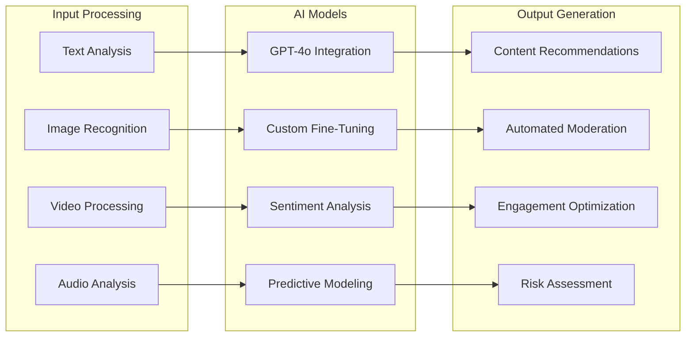
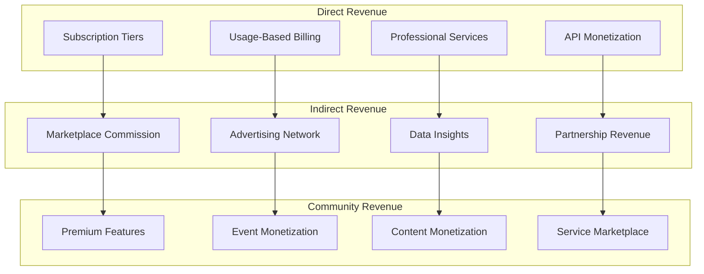
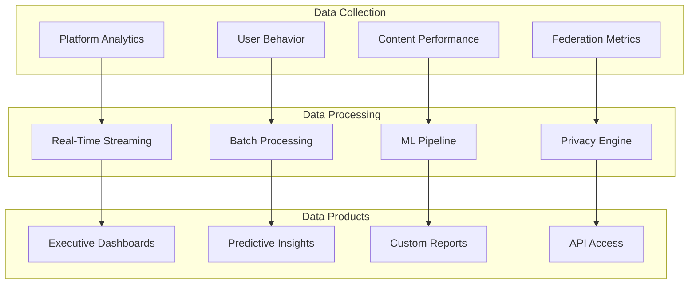
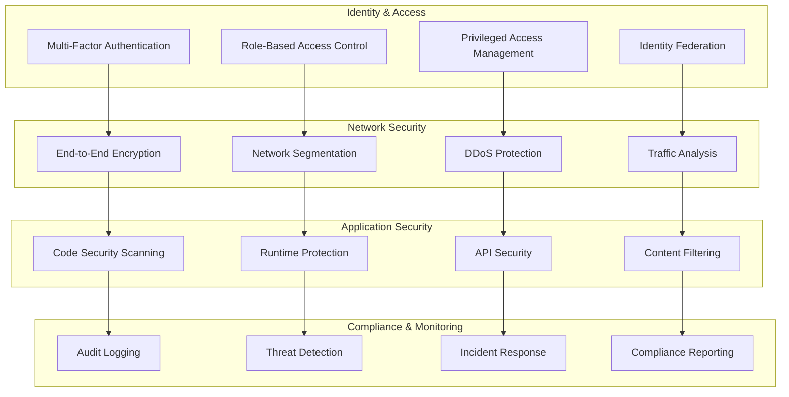
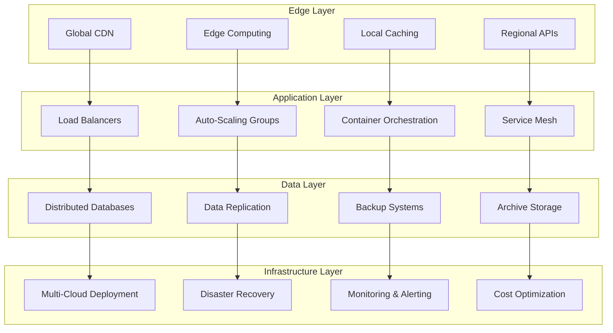
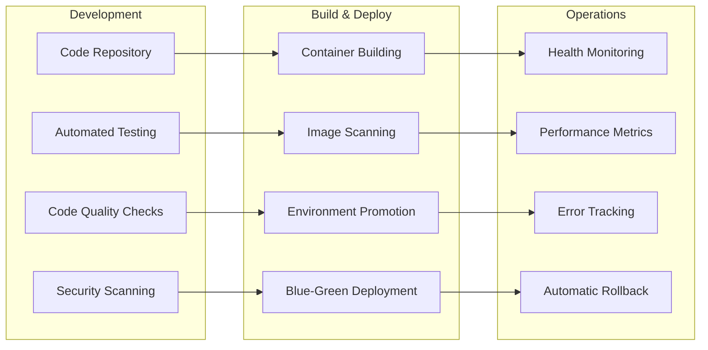

# Advanced Technology Architecture

FediFlow's advanced technology stack provides enterprise-grade capabilities including AI-powered intelligence, predictive analytics, and sophisticated automation across the entire platform ecosystem.

## AI & Intelligence Layer

### Content Intelligence Engine

### AI Services Revenue Model
- **Content Intelligence API**: $0.10-1.00 per content analysis depending on complexity
- **Predictive Analytics**: $5,000-50,000/month for advanced predictive modeling
- **Custom AI Training**: $25,000-250,000 for organization-specific AI model development
- **Real-Time Sentiment Analysis**: $1,000-10,000/month for continuous sentiment monitoring
- **Automated Content Generation**: $0.50-5.00 per generated content piece
- **Risk Assessment Services**: $2,000-20,000/month for comprehensive risk monitoring

## Revenue Engine Architecture

### Multi-Stream Revenue Platform

### Revenue Optimization Features
- **Dynamic Pricing Engine**: Real-time pricing optimization based on demand and usage patterns
- **Customer Lifetime Value Prediction**: AI-powered CLV modeling for account management
- **Churn Risk Assessment**: Early warning system for customer retention
- **Upsell Opportunity Detection**: Automated identification of expansion opportunities
- **Revenue Attribution**: Comprehensive tracking of revenue sources and attribution

## Data Sovereignty & Analytics Architecture

### Comprehensive Data Platform

### Data Sovereignty Features
- **On-Premises Data Processing**: Complete data residency control for sensitive organizations
- **Federated Learning**: Train AI models without centralizing sensitive data
- **Privacy-First Analytics**: Differential privacy and anonymization by default
- **Regulatory Compliance**: GDPR, CCPA, HIPAA, FERPA compliance built-in
- **Data Portability**: Standards-based data export and migration capabilities

## Security & Compliance Architecture

### Zero-Trust Security Model

### Compliance Frameworks
- **SOC 2 Type II**: Annual audits for security, availability, and confidentiality
- **ISO 27001**: Information security management system certification
- **FedRAMP**: Government cloud security authorization
- **HIPAA BAA**: Healthcare data protection compliance
- **GDPR & CCPA**: Privacy regulation compliance
- **Academic Standards**: FERPA compliance for educational institutions

## Scalability & Performance Architecture

### Global Infrastructure Design

### Performance Targets
- **Response Time**: Less than 100ms for 95% of API requests
- **Uptime**: 99.99% availability with less than 5 minutes monthly downtime
- **Scalability**: Support for 100M+ users with horizontal scaling
- **Throughput**: 1M+ API requests per second peak capacity
- **Storage**: Petabyte-scale storage with instant accessibility
- **Global Latency**: Less than 200ms response time worldwide

## Automation & DevOps

### Continuous Integration/Continuous Deployment

### Operational Excellence
- **Infrastructure as Code**: Terraform and CloudFormation for reproducible deployments
- **Immutable Infrastructure**: Container-based deployments with versioned infrastructure
- **Automated Testing**: Comprehensive test suites with 90%+ code coverage
- **Continuous Monitoring**: Real-time observability and alerting
- **Chaos Engineering**: Regular failure testing and resilience validation
- **Cost Optimization**: Automated resource scaling and cost monitoring

## Innovation & Research Pipeline

### Emerging Technology Integration

- **Quantum-Safe Cryptography**: Preparing for post-quantum security requirements
- **Edge AI Processing**: Bringing AI computation closer to users for reduced latency
- **Blockchain Integration**: Supporting decentralized identity and content verification
- **IoT Connectivity**: Enabling smart device integration with community platforms
- **Augmented Reality**: AR-enhanced community experiences and virtual events
- **Voice & Conversational AI**: Natural language interfaces for community interaction

### Research & Development Focus Areas

- **Federated Machine Learning**: Privacy-preserving collaborative AI training
- **Decentralized Identity**: Self-sovereign identity management for users
- **Content Authenticity**: Cryptographic proof of content origin and integrity
- **Cross-Platform Interoperability**: Enhanced federation protocol development
- **Sustainable Computing**: Green technology and carbon-neutral operations
- **Accessibility Innovation**: Advanced assistive technology integration
