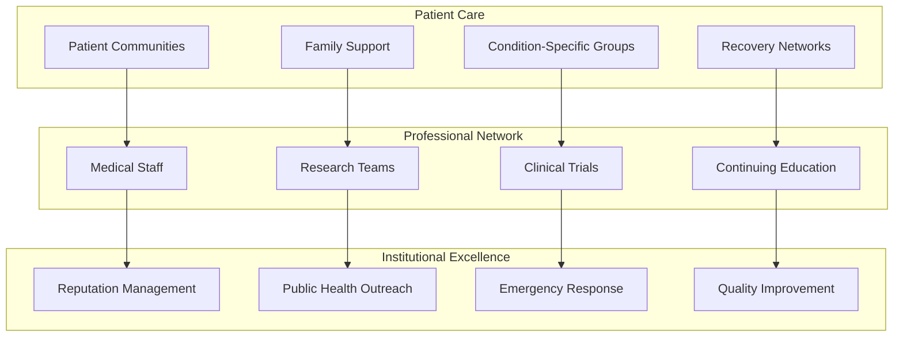
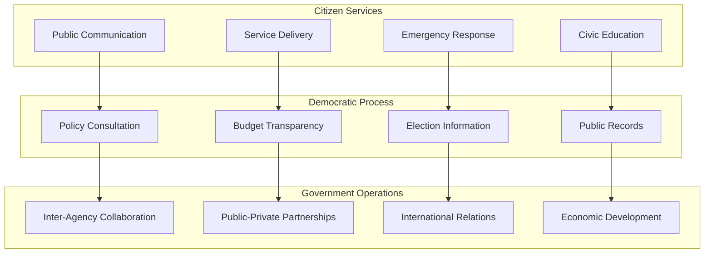
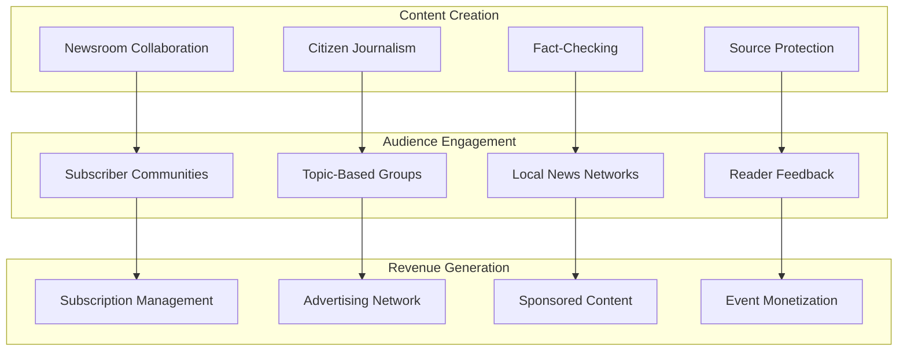
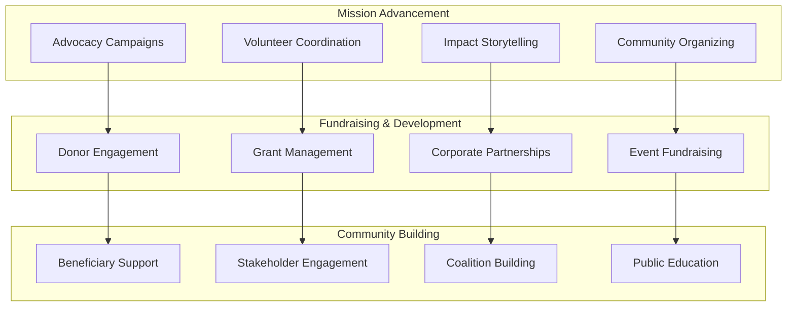
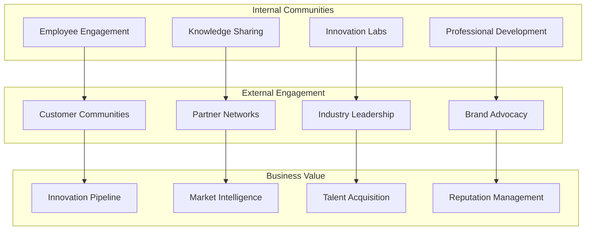

# Industry-Specific Ecosystem Modules

## Healthcare Excellence Ecosystem

### Comprehensive Healthcare Community Platform

### Healthcare Revenue Streams
- **Patient Engagement Platform**: $20-100/month per patient for premium health community access
- **Professional Medical Network**: $500-5,000/year for medical professionals
- **Clinical Trial Recruitment**: $5,000-50,000 per successful trial participant recruited
- **Medical Education Platform**: $1,000-10,000/course for accredited medical education
- **Healthcare Analytics**: $50,000-500,000/year for population health insights
- **Telemedicine Integration**: $50-200/consultation for integrated social-telemedicine

### Healthcare Institution ROI
**Year 1 ROI: 200-300%**
- Patient engagement improvement: $1,000,000-5,000,000
- Staff efficiency gains: $500,000-2,000,000
- Reputation enhancement: $2,000,000-10,000,000
- Quality improvement: $1,000,000-5,000,000

## Government & Public Sector Ecosystem

### Citizen Engagement & Democratic Participation

### Government Revenue Streams
- **Citizen Engagement Platform**: $10-50/month per citizen for premium government services
- **Business License Portal**: $500-5,000/year for expedited business services
- **Economic Development Network**: $10,000-100,000/year for business attraction and retention
- **Tourism Promotion Platform**: Revenue sharing with local tourism businesses
- **Public Records Access**: $5-50/request for expedited public records processing
- **E-Government Services**: $25-250/transaction for enhanced digital government services

### Government Agency ROI
**Year 1 ROI: 300-500%**
- Citizen service efficiency: $500,000-5,000,000
- Emergency response improvement: $1,000,000-10,000,000
- Economic development: $2,000,000-20,000,000
- Transparency & trust value: Immeasurable civic benefit

## Media & Journalism Ecosystem

### Next-Generation News & Information Platform

### Media Revenue Streams
- **Premium News Subscriptions**: $10-100/month for exclusive community access
- **Journalist Verification Network**: $100-1,000/year for verified journalist status
- **Local Business Directory**: $100-1,000/month for local business promotion
- **Event Ticketing**: 5-15% commission on community event ticket sales
- **Sponsored Content Platform**: $1,000-25,000/post for native advertising
- **Media Literacy Education**: $50-500/course for digital literacy training

## Nonprofit & NGO Ecosystem

### Impact-Driven Community Platform

### Nonprofit Revenue Streams
- **Donor Management Platform**: $500-5,000/year for comprehensive donor engagement
- **Volunteer Coordination System**: $100-1,000/month for volunteer management
- **Grant Application Support**: $5,000-50,000/grant for successful grant writing support
- **Event Management Platform**: 10-20% commission on fundraising event revenue
- **Impact Measurement Tools**: $2,000-20,000/year for impact tracking and reporting
- **Coalition Building Platform**: $1,000-10,000/year for cross-organization collaboration

## Corporate & Enterprise Ecosystem

### Employee Engagement & External Community Platform

### Corporate Revenue Streams
- **Employee Engagement Platform**: $25-100/month per employee for premium features
- **Customer Community Management**: $10,000-100,000/year for customer engagement
- **Innovation Collaboration Platform**: $50,000-500,000/year for open innovation
- **Industry Network Access**: $25,000-250,000/year for industry leadership positioning
- **Talent Pipeline Management**: $5,000-50,000/hire for talent acquisition
- **Brand Advocacy Network**: $10,000-100,000/year for brand advocacy management
