# Integration & API Ecosystem

## Platform Integration Architecture

### Third-Party Integration Hub

```mermaid
flowchart TB
    subgraph "CRM Systems"
        CRM1[Salesforce]
        CRM2[HubSpot]
        CRM3[Microsoft Dynamics]
    end
    
    subgraph "Educational Systems"
        EDU1[Canvas LMS]
        EDU2[Blackboard]
        EDU3[Moodle]
        EDU4[Student Information Systems]
    end
    
    subgraph "Business Systems"
        BUS1[Slack/Teams]
        BUS2[Office 365]
        BUS3[Google Workspace]
        BUS4[Zoom/WebEx]
    end
    
    subgraph "Analytics Platforms"
        ANA1[Google Analytics]
        ANA2[Tableau]
        ANA3[Power BI]
        ANA4[Mixpanel]
    end
    
    CRM1 --> FediFlow
    CRM2 --> FediFlow
    CRM3 --> FediFlow
    EDU1 --> FediFlow
    EDU2 --> FediFlow
    EDU3 --> FediFlow
    EDU4 --> FediFlow
    BUS1 --> FediFlow
    BUS2 --> FediFlow
    BUS3 --> FediFlow
    BUS4 --> FediFlow
    ANA1 --> FediFlow
    ANA2 --> FediFlow
    ANA3 --> FediFlow
    ANA4 --> FediFlow
```

## API Monetization Strategy

### API Revenue Streams

- **Basic API Access**: Included in subscription tiers
- **Premium API Endpoints**: $0.005-0.05 per call for advanced features
- **Real-Time API**: $0.01-0.10 per WebSocket connection hour
- **Bulk API Operations**: $0.0005-0.005 per call (minimum 10,000 calls)
- **Custom API Development**: $50,000-500,000 for organization-specific endpoints
- **API Partner Program**: 20-30% revenue share for certified integrations

## Marketplace & Partner Ecosystem

### Revenue Sharing Model

- **Application Marketplace**: 30% commission on third-party app sales
- **Service Provider Network**: 15-25% commission on service bookings
- **Content Creator Platform**: 10-20% commission on premium content sales
- **Training & Certification**: 40-60% revenue share with training partners
- **Integration Partners**: 20-30% revenue share for certified integrations

## Advanced Integration Features

### Enterprise Integration Capabilities

**Single Sign-On (SSO) Integration**:
- SAML 2.0 and OAuth 2.0 support
- Active Directory and LDAP integration
- Multi-factor authentication support
- Custom authentication providers

**Data Synchronization**:
- Real-time data sync with enterprise systems
- Batch data import/export capabilities
- Custom field mapping and transformation
- Conflict resolution and data validation

**Workflow Automation**:
- Zapier and Microsoft Power Automate integration
- Custom webhook endpoints
- Event-driven automation triggers
- Business process integration

### Developer Platform

**API Documentation & Tools**:
- Comprehensive API documentation
- Interactive API explorer
- SDKs for popular programming languages
- Code samples and tutorials

**Developer Support**:
- Developer portal and community
- Technical support and consulting
- Beta program access
- Developer certification programs

## Integration Implementation Strategy

### Phased Integration Rollout

**Phase 1: Core Integrations**
- Major CRM systems (Salesforce, HubSpot)
- Learning management systems (Canvas, Blackboard)
- Authentication providers (Active Directory, Google)
- Communication platforms (Slack, Microsoft Teams)

**Phase 2: Advanced Integrations**
- Business intelligence platforms (Tableau, Power BI)
- Marketing automation (Marketo, Pardot)
- Analytics platforms (Google Analytics, Mixpanel)
- Video conferencing (Zoom, WebEx)

**Phase 3: Specialized Integrations**
- Industry-specific systems
- Custom enterprise applications
- Legacy system integrations
- Emerging technology platforms

### Integration Success Metrics

**Technical Metrics**:
- API response times (less than 100ms average)
- Integration uptime (99.9%+)
- Data synchronization accuracy (99.99%+)
- Error rates (less than 0.1%)

**Business Metrics**:
- Integration adoption rates
- Customer satisfaction scores
- Revenue from API usage
- Partner ecosystem growth
