# Multi-Layer Architecture

## Comprehensive Ecosystem Architecture

### Multi-Layer Architecture Overview

## Core Platform Architecture

### Federated Platform Management Core

## Technical Scaling Architecture

### Infrastructure Scaling Plan

### Platform Resilience Strategy

- **Multi-Cloud Architecture**: Eliminate single cloud provider dependency
- **Service Mesh**: Comprehensive traffic management and circuit breaking
- **Chaos Engineering**: Quarterly resilience testing and failure simulation
- **Disaster Recovery**: Sub-5-minute RTO with zero data loss guarantees
- **Security Operations**: 24/7 SOC with AI-powered threat detection

## AI & Intelligence Layer

### Content Intelligence Engine

```mermaid
flowchart LR
    subgraph "Input Processing"
        IP1[Text Analysis]
        IP2[Image Recognition]
        IP3[Video Processing]
        IP4[Audio Analysis]
    end
    
    subgraph "AI Models"
        AI1[GPT-4o Integration]
        AI2[Custom Fine-Tuning]
        AI3[Sentiment Analysis]
        AI4[Predictive Modeling]
    end
    
    subgraph "Output Generation"
        OG1[Content Recommendations]
        OG2[Automated Moderation]
        OG3[Engagement Optimization]
        OG4[Risk Assessment]
    end
    
    IP1 --> AI1
    IP2 --> AI2
    IP3 --> AI3
    IP4 --> AI4
    AI1 --> OG1
    AI2 --> OG2
    AI3 --> OG3
    AI4 --> OG4
```

### AI Services Revenue Model

- **Content Intelligence API**: $0.10-1.00 per content analysis depending on complexity
- **Predictive Analytics**: $5,000-50,000/month for advanced predictive modeling
- **Custom AI Training**: $25,000-250,000 for organization-specific AI model development
- **Real-Time Sentiment Analysis**: $1,000-10,000/month for continuous sentiment monitoring
- **Automated Content Generation**: $0.50-5.00 per generated content piece
- **Risk Assessment Services**: $2,000-20,000/month for comprehensive risk monitoring

## Data Sovereignty & Analytics Architecture

### Comprehensive Data Platform

