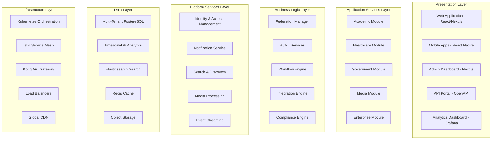
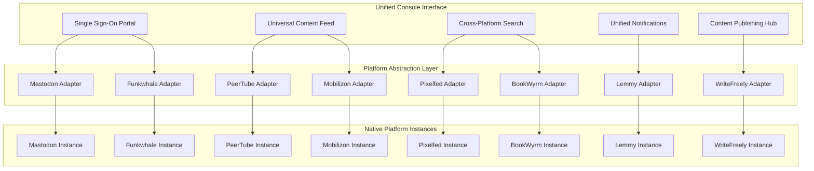
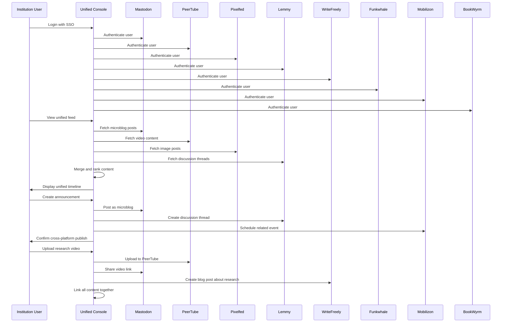

# FediFlow Enterprise: Comprehensive Technical Design Document
*Version 1.0 - Technical Architecture & Implementation Specification*

## Table of Contents

1. [Executive Summary](#1-executive-summary)
2. [System Architecture Overview](#2-system-architecture-overview)
3. [Core Platform Components](#3-core-platform-components)
4. [Industry-Specific Modules](#4-industry-specific-modules)
5. [Integration Architecture](#5-integration-architecture)
6. [Security & Compliance Framework](#6-security--compliance-framework)
7. [Scalability & Performance Architecture](#7-scalability--performance-architecture)
8. [Development & Deployment Pipeline](#8-development--deployment-pipeline)
9. [Data Architecture & Management](#9-data-architecture--management)
10. [Implementation Roadmap](#10-implementation-roadmap)
11. [Business Value & ROI Framework](#11-business-value--roi-framework)

---

## 1. Executive Summary

### 1.1 Platform Overview

FediFlow Enterprise represents the foundational infrastructure for the decentralized social web, providing institutions with complete data sovereignty, community control, and revenue generation capabilities. The platform addresses the critical gap between basic federated hosting solutions and enterprise-grade social media management needs.

**Core Value Proposition:**
- **Complete Data Sovereignty**: Organizations gain full control over their data, enabling proprietary analytics and strategic decision-making
- **Multi-Platform Federation**: Unified management of Mastodon, PeerTube, Pixelfed, Lemmy, and other federated platforms
- **Industry-Specific Solutions**: Tailored modules for academia, healthcare, government, media, and enterprise
- **Revenue Generation**: Multiple monetization streams including subscriptions, usage-based pricing, and professional services
- **Enterprise-Grade Infrastructure**: Scalable, secure, and compliant architecture designed for institutional needs

### 1.2 Technical Philosophy

**Design Principles:**
1. **Federation-First**: Native ActivityPub implementation with custom enterprise extensions
2. **Multi-Tenant by Design**: Complete isolation between institutions with shared infrastructure efficiency
3. **API-Centric**: Every feature accessible through comprehensive RESTful and GraphQL APIs
4. **Compliance-Ready**: Built-in support for GDPR, HIPAA, FERPA, and SOC 2 compliance
5. **Microservices Architecture**: Scalable, maintainable services with clear separation of concerns
6. **Cloud-Native**: Kubernetes-native deployment with multi-cloud support

### 1.3 Target Market & Use Cases

**Primary Markets:**
- **Academic Institutions**: 4,000+ universities globally requiring student engagement, research collaboration, and alumni relations
- **Healthcare Organizations**: 100,000+ healthcare providers needing patient communities and professional networks
- **Government Agencies**: 50,000+ agencies requiring citizen engagement and democratic participation
- **Media Organizations**: News outlets seeking subscription communities and journalist networks
- **Enterprise Organizations**: Corporations needing employee engagement and customer communities

---

## 2. System Architecture Overview

### 2.1 Multi-Layer Architecture Stack

The FediFlow Enterprise platform employs a sophisticated multi-layer architecture designed for scalability, maintainability, and enterprise requirements.



### 2.2 Architecture Patterns

**Multi-Tenant Architecture:**
The platform implements a schema-per-tenant approach, providing complete data isolation while maintaining operational efficiency. Each institution receives a dedicated database schema with shared infrastructure components.

**Event-Driven Architecture:**
Apache Kafka serves as the central event streaming platform, enabling real-time data processing, federation activity distribution, and cross-service communication.

**CQRS Pattern:**
Command Query Responsibility Segregation separates read and write operations, optimizing for both transactional consistency and analytical performance.

**Circuit Breaker Pattern:**
Istio service mesh implements circuit breaker patterns to prevent cascade failures and ensure system resilience.

### 2.3 Cross-Protocol Federation Management

**Unified Platform Console Overview:**
The FediFlow Enterprise platform provides a revolutionary unified console that manages all federated platforms through a single interface, eliminating the complexity of managing multiple separate instances while maintaining the benefits of protocol diversity.

**Integrated Federated Platforms:**

*Core Social Platforms:*
- **Mastodon**: Microblogging, real-time discussions, community announcements
- **PeerTube**: Video content, lectures, webinars, live streaming
- **Pixelfed**: Visual storytelling, campus life, research imagery
- **Lemmy**: Discussion forums, Q&A, knowledge bases

*Content & Media Platforms:*
- **WriteFreely**: Long-form blogs, academic papers, institutional communications
- **Funkwhale**: Podcasts, audio content, music sharing, recorded lectures
- **Mobilizon**: Event management, conference planning, meetups
- **BookWyrm**: Reading clubs, academic literature, research sharing

*Emerging Platforms:*
- **Owncast**: Live streaming for events and lectures
- **ForgeFed**: Code collaboration and development projects
- **Castopod**: Professional podcast hosting and distribution
- **Pleroma**: Lightweight microblogging alternative

**Unified User Experience Architecture:**


**Cross-Protocol ActivityPub Implementation:**
```javascript
class UnifiedFederationManager {
  constructor() {
    this.platformAdapters = {
      mastodon: new MastodonAdapter(),
      peertube: new PeerTubeAdapter(),
      pixelfed: new PixelfedAdapter(),
      lemmy: new LemmyAdapter(),
      writefreely: new WriteFreelyAdapter(),
      funkwhale: new FunkwhaleAdapter(),
      mobilizon: new MobilizonAdapter(),
      bookwyrm: new BookWyrmAdapter()
    };
    
    this.activityProcessor = new ActivityProcessor();
    this.contentTransformer = new ContentTransformer();
  }
  
  async publishContent(content, targetPlatforms, userContext) {
    const results = {};
    
    for (const platform of targetPlatforms) {
      try {
        // Transform content for platform-specific format
        const transformedContent = await this.contentTransformer
          .transform(content, platform, userContext);
        
        // Publish to specific platform
        const adapter = this.platformAdapters[platform];
        const result = await adapter.publish(transformedContent);
        
        // Store federation mapping
        await this.storeFederationMapping(content.id, platform, result.activityId);
        
        results[platform] = { success: true, activityId: result.activityId };
      } catch (error) {
        results[platform] = { success: false, error: error.message };
      }
    }
    
    return results;
  }
  
  async aggregateUserFeed(userId, platforms = 'all') {
    const feeds = {};
    const targetPlatforms = platforms === 'all' 
      ? Object.keys(this.platformAdapters) 
      : platforms;
    
    // Fetch content from all specified platforms
    const feedPromises = targetPlatforms.map(async platform => {
      const adapter = this.platformAdapters[platform];
      return {
        platform,
        content: await adapter.getUserFeed(userId)
      };
    });
    
    const results = await Promise.allSettled(feedPromises);
    
    // Merge and sort by timestamp
    const unifiedFeed = results
      .filter(result => result.status === 'fulfilled')
      .flatMap(result => result.value.content.map(item => ({
        ...item,
        platform: result.value.platform,
        unified_id: this.generateUnifiedId(item, result.value.platform)
      })))
      .sort((a, b) => new Date(b.published) - new Date(a.published));
    
    return unifiedFeed;
  }
}
```

---

## 3. Core Platform Components

### 3.1 Unified Platform Console

**Overview:**
The Unified Platform Console represents the revolutionary interface that allows institutions to manage all federated platforms through a single, comprehensive dashboard. Users can seamlessly create, discover, and interact with content across Mastodon, PeerTube, Pixelfed, Lemmy, WriteFreely, Funkwhale, Mobilizon, and BookWyrm without needing separate accounts or interfaces.

**Core Console Features:**

**Universal Content Dashboard:**
```javascript
class UniversalContentDashboard {
  constructor(userId, tenantId) {
    this.userId = userId;
    this.tenantId = tenantId;
    this.platformManagers = {
      mastodon: new MastodonManager(),
      peertube: new PeerTubeManager(),
      pixelfed: new PixelfedManager(),
      lemmy: new LemmyManager(),
      writefreely: new WriteFreelyManager(),
      funkwhale: new FunkwhaleManager(),
      mobilizon: new MobilizonManager(),
      bookwyrm: new BookWyrmManager()
    };
  }
  
  async getUnifiedFeed(filters = {}) {
    const platformFeeds = await Promise.allSettled([
      this.platformManagers.mastodon.getHomeFeed(this.userId),
      this.platformManagers.peertube.getSubscriptionFeed(this.userId),
      this.platformManagers.pixelfed.getTimelineFeed(this.userId),
      this.platformManagers.lemmy.getPersonalizedFeed(this.userId),
      this.platformManagers.writefreely.getFollowingFeed(this.userId),
      this.platformManagers.funkwhale.getLibraryFeed(this.userId),
      this.platformManagers.mobilizon.getEventFeed(this.userId),
      this.platformManagers.bookwyrm.getReadingFeed(this.userId)
    ]);
    
    // Merge and normalize content from all platforms
    const unifiedContent = this.mergeFeeds(platformFeeds);
    
    // Apply intelligent filtering and ranking
    return this.applyIntelligentRanking(unifiedContent, filters);
  }
  
  async crossPlatformSearch(query, platforms = 'all') {
    const searchResults = {};
    const targetPlatforms = platforms === 'all' 
      ? Object.keys(this.platformManagers) 
      : platforms;
    
    for (const platform of targetPlatforms) {
      try {
        const manager = this.platformManagers[platform];
        searchResults[platform] = await manager.search(query, {
          tenantScope: this.tenantId,
          userContext: this.userId
        });
      } catch (error) {
        searchResults[platform] = { error: error.message, results: [] };
      }
    }
    
    return this.unifySearchResults(searchResults);
  }
}
```

**Cross-Platform Content Publishing:**
```typescript
interface UnifiedContentCreator {
  platforms: PlatformTarget[];
  contentType: ContentType;
  scheduledPublishing: ScheduleOptions;
  crossPromotionSettings: CrossPromotionConfig;
}

class ContentPublishingHub {
  async publishToMultiplePlatforms(content: UniversalContent, config: UnifiedContentCreator) {
    const publishingTasks = config.platforms.map(async (platform) => {
      // Transform content for specific platform requirements
      const platformContent = await this.transformForPlatform(content, platform);
      
      // Apply platform-specific optimizations
      const optimizedContent = await this.optimizeForPlatform(platformContent, platform);
      
      // Publish with platform-specific API
      return await this.publishToPlatform(optimizedContent, platform, config);
    });
    
    const results = await Promise.allSettled(publishingTasks);
    
    // Handle cross-platform promotion
    await this.handleCrossPromotion(content, results, config.crossPromotionSettings);
    
    return this.consolidatePublishingResults(results);
  }
  
  private async transformForPlatform(content: UniversalContent, platform: PlatformTarget) {
    switch (platform.type) {
      case 'mastodon':
        return this.transformToMastodonPost(content);
      case 'peertube':
        return this.transformToPeerTubeVideo(content);
      case 'pixelfed':
        return this.transformToPixelfedPost(content);
      case 'lemmy':
        return this.transformToLemmyPost(content);
      case 'writefreely':
        return this.transformToWriteFreelyArticle(content);
      case 'funkwhale':
        return this.transformToFunkwhaleTrack(content);
      case 'mobilizon':
        return this.transformToMobilizonEvent(content);
      case 'bookwyrm':
        return this.transformToBookWyrmReview(content);
      default:
        throw new Error(`Unsupported platform: ${platform.type}`);
    }
  }
}
```

**Platform-Specific Implementations:**

**Mastodon Integration:**
```python
class MastodonManager:
    def __init__(self, instance_url, access_token):
        self.client = Mastodon(
            access_token=access_token,
            api_base_url=instance_url
        )
        
    async def create_status(self, content, visibility='public', reply_to=None):
        """Create a status post with media attachments and mentions"""
        media_ids = []
        
        # Upload media attachments if present
        if content.get('media_attachments'):
            for attachment in content['media_attachments']:
                media = await self.client.media_post(
                    media_file=attachment['file'],
                    description=attachment.get('alt_text', '')
                )
                media_ids.append(media['id'])
        
        # Create the status
        status = await self.client.status_post(
            status=content['text'],
            media_ids=media_ids,
            visibility=visibility,
            in_reply_to_id=reply_to,
            sensitive=content.get('sensitive', False),
            spoiler_text=content.get('content_warning', '')
        )
        
        return {
            'platform': 'mastodon',
            'id': status['id'],
            'url': status['url'],
            'created_at': status['created_at']
        }
```

**PeerTube Integration:**
```python
class PeerTubeManager:
    def __init__(self, instance_url, access_token):
        self.instance_url = instance_url
        self.access_token = access_token
        
    async def upload_video(self, video_data):
        """Upload video content with metadata and thumbnails"""
        
        # Prepare video upload
        upload_payload = {
            'name': video_data['title'],
            'description': video_data['description'],
            'category': video_data.get('category', 1),
            'licence': video_data.get('licence', 1),
            'language': video_data.get('language', 'en'),
            'tags': video_data.get('tags', []),
            'privacy': video_data.get('privacy', 1),  # 1 = public
            'channelId': video_data['channel_id']
        }
        
        # Upload video file
        files = {
            'videofile': video_data['video_file'],
            'thumbnailfile': video_data.get('thumbnail_file'),
            'previewfile': video_data.get('preview_file')
        }
        
        response = await self.client.post(
            f"{self.instance_url}/api/v1/videos/upload",
            data=upload_payload,
            files=files,
            headers={'Authorization': f'Bearer {self.access_token}'}
        )
        
        return {
            'platform': 'peertube',
            'id': response.json()['video']['id'],
            'url': response.json()['video']['url'],
            'status': 'processing'
        }
```

**Pixelfed Integration:**
```python
class PixelfedManager:
    def __init__(self, instance_url, access_token):
        self.instance_url = instance_url
        self.access_token = access_token
        
    async def create_photo_post(self, image_data):
        """Create a photo post with multiple images and story support"""
        
        # Upload images
        media_ids = []
        for image in image_data['images']:
            media_response = await self.client.post(
                f"{self.instance_url}/api/v1/media",
                files={'file': image['file']},
                data={'description': image.get('alt_text', '')},
                headers={'Authorization': f'Bearer {self.access_token}'}
            )
            media_ids.append(media_response.json()['id'])
        
        # Create status with images
        status_response = await self.client.post(
            f"{self.instance_url}/api/v1/statuses",
            json={
                'status': image_data['caption'],
                'media_ids': media_ids,
                'visibility': image_data.get('visibility', 'public'),
                'sensitive': image_data.get('sensitive', False)
            },
            headers={'Authorization': f'Bearer {self.access_token}'}
        )
        
        return {
            'platform': 'pixelfed',
            'id': status_response.json()['id'],
            'url': status_response.json()['url'],
            'media_count': len(media_ids)
        }
```

**Unified User Authentication:**
```typescript
class UnifiedAuthenticationManager {
  private platformTokens: Map<string, PlatformToken> = new Map();
  
  async authenticateUser(userId: string, tenantId: string): Promise<UnifiedSession> {
    // Generate unified session token
    const sessionToken = await this.generateUnifiedToken(userId, tenantId);
    
    // Initialize platform-specific connections
    const platformConnections = await this.initializePlatformConnections(
      userId, 
      tenantId
    );
    
    return {
      sessionToken,
      userId,
      tenantId,
      platformConnections,
      permissions: await this.getUserPermissions(userId, tenantId),
      expires: new Date(Date.now() + 24 * 60 * 60 * 1000) // 24 hours
    };
  }
  
  private async initializePlatformConnections(userId: string, tenantId: string) {
    const platforms = [
      'mastodon', 'peertube', 'pixelfed', 'lemmy', 
      'writefreely', 'funkwhale', 'mobilizon', 'bookwyrm'
    ];
    
    const connections = {};
    
    for (const platform of platforms) {
      try {
        const platformConfig = await this.getPlatformConfig(tenantId, platform);
        const userToken = await this.getUserPlatformToken(userId, platform);
        
        connections[platform] = {
          instanceUrl: platformConfig.instanceUrl,
          accessToken: userToken,
          connected: true,
          lastSync: new Date()
        };
      } catch (error) {
        connections[platform] = {
          connected: false,
          error: error.message
        };
      }
    }
    
    return connections;
  }
}
```

**Unified User Experience Flows:**

**Daily User Journey Example:**


**Real-World Implementation Example - Academic Use Case:**
```typescript
interface AcademicWorkflow {
  // Professor creates research presentation workflow
  async createResearchPresentation(researchData: ResearchContent): Promise<CrossPlatformResult> {
    const workflow = new CrossPlatformWorkflow();
    
    // 1. Upload presentation video to PeerTube
    const videoResult = await this.peertube.uploadVideo({
      title: researchData.title,
      description: researchData.abstract,
      category: 'education',
      tags: researchData.keywords,
      videoFile: researchData.presentationVideo,
      thumbnail: researchData.slideThumbnail,
      privacy: 'public',
      channel: 'research-presentations'
    });
    
    // 2. Create detailed blog post on WriteFreely
    const blogResult = await this.writefreely.createPost({
      title: `Research Insights: ${researchData.title}`,
      content: this.generateDetailedBlogPost(researchData),
      tags: researchData.keywords,
      collection: 'faculty-research'
    });
    
    // 3. Share announcement on Mastodon
    const mastodonResult = await this.mastodon.createStatus({
      text: `New research presentation: ${researchData.title}\n\n🎥 Watch: ${videoResult.url}\n📝 Read more: ${blogResult.url}\n\n#AcademicResearch #${researchData.department}`,
      visibility: 'public'
    });
    
    // 4. Create discussion thread on Lemmy
    const lemmyResult = await this.lemmy.createPost({
      title: `Discussion: ${researchData.title}`,
      body: `What are your thoughts on this research? Join the discussion after watching the presentation.`,
      community: 'academic-discussions',
      url: videoResult.url
    });
    
    // 5. Add to academic reading list on BookWyrm (if published paper exists)
    if (researchData.publication) {
      await this.bookwyrm.addToShelf({
        book: researchData.publication,
        shelf: 'faculty-publications',
        review: researchData.abstract
      });
    }
    
    // 6. Schedule follow-up presentation event on Mobilizon
    if (researchData.presentationDate) {
      await this.mobilizon.createEvent({
        title: `Live Q&A: ${researchData.title}`,
        description: `Join the researcher for a live discussion about their findings.`,
        datetime: researchData.presentationDate,
        location: researchData.venue,
        relatedContent: [videoResult.url, blogResult.url]
      });
    }
    
    return {
      video: videoResult,
      blog: blogResult,
      announcement: mastodonResult,
      discussion: lemmyResult,
      crossLinks: this.generateCrossLinks([videoResult, blogResult, mastodonResult, lemmyResult])
    };
  }
}
```

**Platform-Specific Advanced Features:**

**Lemmy Integration (Forums & Knowledge Management):**
```python
class LemmyManager:
    def __init__(self, instance_url, jwt_token):
        self.instance_url = instance_url
        self.jwt_token = jwt_token
        
    async def create_community_post(self, post_data):
        """Create a post in a specific Lemmy community"""
        payload = {
            'name': post_data['title'],
            'body': post_data['content'],
            'community_id': post_data['community_id'],
            'url': post_data.get('url'),
            'nsfw': post_data.get('nsfw', False),
            'language_id': post_data.get('language_id', 0)
        }
        
        response = await self.client.post(
            f"{self.instance_url}/api/v3/post",
            json=payload,
            headers={'Authorization': f'Bearer {self.jwt_token}'}
        )
        
        return {
            'platform': 'lemmy',
            'id': response.json()['post_view']['post']['id'],
            'community': response.json()['post_view']['community']['name'],
            'url': f"{self.instance_url}/post/{response.json()['post_view']['post']['id']}"
        }
        
    async def moderate_community(self, community_id, moderation_actions):
        """Advanced community moderation features"""
        for action in moderation_actions:
            if action['type'] == 'remove_post':
                await self.remove_post(action['post_id'], action['reason'])
            elif action['type'] == 'ban_user':
                await self.ban_user_from_community(
                    community_id, 
                    action['user_id'], 
                    action['duration'],
                    action['reason']
                )
```

**WriteFreely Integration (Blogging & Long-form Content):**
```python
class WriteFreelyManager:
    def __init__(self, instance_url, access_token):
        self.instance_url = instance_url
        self.access_token = access_token
        
    async def create_article(self, article_data):
        """Create a long-form article with rich formatting"""
        payload = {
            'body': article_data['content'],
            'title': article_data['title'],
            'font': article_data.get('font', 'norm'),
            'lang': article_data.get('language', 'en'),
            'rtl': article_data.get('right_to_left', False),
            'created': article_data.get('publish_date', datetime.utcnow().isoformat())
        }
        
        # Add to specific collection if specified
        if article_data.get('collection'):
            payload['collection'] = article_data['collection']
        
        response = await self.client.post(
            f"{self.instance_url}/api/posts",
            json=payload,
            headers={'Authorization': f'Token {self.access_token}'}
        )
        
        return {
            'platform': 'writefreely',
            'id': response.json()['data']['id'],
            'url': response.json()['data']['url'],
            'slug': response.json()['data']['slug']
        }
```

**Funkwhale Integration (Audio & Podcast Management):**
```python
class FunkwhaleManager:
    def __init__(self, instance_url, access_token):
        self.instance_url = instance_url
        self.access_token = access_token
        
    async def upload_audio_track(self, track_data):
        """Upload audio content with metadata"""
        
        # Create library if doesn't exist
        library = await self.ensure_library_exists(track_data['library_name'])
        
        # Upload audio file
        upload_payload = {
            'library': library['uuid'],
            'import_status': 'pending'
        }
        
        files = {
            'audio_file': track_data['audio_file']
        }
        
        # Add metadata
        metadata = {
            'title': track_data['title'],
            'artist': track_data['artist'],
            'album': track_data.get('album', ''),
            'description': track_data.get('description', ''),
            'tags': track_data.get('tags', []),
            'license': track_data.get('license', 'all-rights-reserved')
        }
        
        response = await self.client.post(
            f"{self.instance_url}/api/v1/uploads/",
            data=upload_payload,
            files=files,
            headers={'Authorization': f'Bearer {self.access_token}'}
        )
        
        # Add metadata to uploaded track
        if response.status_code == 201:
            upload_uuid = response.json()['uuid']
            await self.add_track_metadata(upload_uuid, metadata)
        
        return {
            'platform': 'funkwhale',
            'upload_uuid': upload_uuid,
            'library': library['uuid'],
            'status': 'processing'
        }
```

**Mobilizon Integration (Event Management):**
```python
class MobilizonManager:
    def __init__(self, instance_url, access_token):
        self.instance_url = instance_url
        self.access_token = access_token
        
    async def create_event(self, event_data):
        """Create and manage institutional events"""
        
        event_payload = {
            'title': event_data['title'],
            'description': event_data['description'],
            'begins_on': event_data['start_datetime'],
            'ends_on': event_data['end_datetime'],
            'status': event_data.get('status', 'CONFIRMED'),
            'visibility': event_data.get('visibility', 'PUBLIC'),
            'join_options': event_data.get('join_options', 'FREE'),
            'physical_address': event_data.get('location'),
            'online_address': event_data.get('online_url'),
            'options': {
                'maximum_attendee_capacity': event_data.get('max_capacity'),
                'remaining_attendee_capacity': event_data.get('max_capacity'),
                'show_remaining_attendee_capacity': True,
                'anonymous_participation': event_data.get('allow_anonymous', True)
            },
            'tags': event_data.get('tags', []),
            'category': event_data.get('category', 'MEETING')
        }
        
        response = await self.client.post(
            f"{self.instance_url}/api/events",
            json=event_payload,
            headers={'Authorization': f'Bearer {self.access_token}'}
        )
        
        return {
            'platform': 'mobilizon',
            'id': response.json()['id'],
            'uuid': response.json()['uuid'],
            'url': response.json()['url'],
            'local_url': f"{self.instance_url}/events/{response.json()['uuid']}"
        }
```

**BookWyrm Integration (Reading & Literature Management):**
```python
class BookWyrmManager:
    def __init__(self, instance_url, access_token):
        self.instance_url = instance_url
        self.access_token = access_token
        
    async def add_book_review(self, review_data):
        """Add book reviews and reading progress"""
        
        # Find or create book entry
        book = await self.find_or_create_book(review_data['book_data'])
        
        # Create review
        review_payload = {
            'book': book['id'],
            'name': review_data['review_title'],
            'content': review_data['review_content'],
            'rating': review_data.get('rating'),
            'privacy': review_data.get('privacy', 'public'),
            'sensitive': review_data.get('sensitive', False),
            'spoiler_alert': review_data.get('spoiler_alert', False)
        }
        
        response = await self.client.post(
            f"{self.instance_url}/api/v1/reviews",
            json=review_payload,
            headers={'Authorization': f'Bearer {self.access_token}'}
        )
        
        # Add to reading shelf
        if review_data.get('shelf'):
            await self.add_to_shelf(book['id'], review_data['shelf'])
        
        return {
            'platform': 'bookwyrm',
            'review_id': response.json()['id'],
            'book_id': book['id'],
            'url': response.json()['remote_id']
        }
        
    async def create_reading_group(self, group_data):
        """Create academic reading groups and book clubs"""
        group_payload = {
            'name': group_data['name'],
            'description': group_data['description'],
            'privacy': group_data.get('privacy', 'public'),
            'curation': group_data.get('curation', 'open')
        }
        
        response = await self.client.post(
            f"{self.instance_url}/api/v1/groups",
            json=group_payload,
            headers={'Authorization': f'Bearer {self.access_token}'}
        )
        
        return {
            'platform': 'bookwyrm',
            'group_id': response.json()['id'],
            'group_url': response.json()['local_path']
        }
```

**Cross-Platform Analytics & Intelligence:**
```typescript
class UnifiedAnalyticsEngine {
  async generateCrossPlatformReport(tenantId: string, dateRange: DateRange): Promise<UnifiedAnalyticsReport> {
    const platformMetrics = await Promise.all([
      this.getMastodonMetrics(tenantId, dateRange),
      this.getPeerTubeMetrics(tenantId, dateRange),
      this.getPixelfedMetrics(tenantId, dateRange),
      this.getLemmyMetrics(tenantId, dateRange),
      this.getWriteFreelyMetrics(tenantId, dateRange),
      this.getFunkwhaleMetrics(tenantId, dateRange),
      this.getMobilizonMetrics(tenantId, dateRange),
      this.getBookWyrmMetrics(tenantId, dateRange)
    ]);
    
    return {
      overview: this.calculateOverviewMetrics(platformMetrics),
      platformBreakdown: this.generatePlatformBreakdown(platformMetrics),
      crossPlatformInteractions: await this.analyzeCrossPlatformInteractions(tenantId, dateRange),
      contentPerformance: this.analyzeContentPerformance(platformMetrics),
      userEngagement: this.calculateEngagementMetrics(platformMetrics),
      federationHealth: await this.assessFederationHealth(tenantId, dateRange),
      recommendations: await this.generateOptimizationRecommendations(platformMetrics)
    };
  }
  
  private async analyzeCrossPlatformInteractions(tenantId: string, dateRange: DateRange) {
    // Analyze how content on one platform drives engagement on others
    const interactions = await this.crossPlatformInteractionService.analyze({
      tenantId,
      dateRange,
      metrics: [
        'video_to_discussion_conversion', // PeerTube -> Lemmy
        'blog_to_social_sharing',        // WriteFreely -> Mastodon
        'event_to_media_creation',       // Mobilizon -> Pixelfed
        'audio_to_community_discussion', // Funkwhale -> Lemmy
        'book_to_blog_reviews'           // BookWyrm -> WriteFreely
      ]
    });
    
    return interactions;
  }
}
```

This comprehensive unified platform console architecture enables institutions to manage their entire federated social media presence through a single interface while maintaining the benefits of protocol diversity and platform specialization. Users can seamlessly move between creating a research video on PeerTube, discussing it on Lemmy, sharing updates on Mastodon, writing detailed blog posts on WriteFreely, scheduling related events on Mobilizon, sharing related audio content on Funkwhale, posting visual content on Pixelfed, and managing academic literature on BookWyrm - all from one unified dashboard.

**Tenant Isolation Strategy:**
Each institution receives complete data isolation through dedicated database schemas while sharing computational resources for efficiency.

**Key Features:**
- **Dynamic Schema Provisioning**: Automatic schema creation and migration for new tenants
- **Resource Allocation**: CPU, memory, and storage allocation based on subscription tier
- **Custom Configuration**: Per-tenant configuration for branding, policies, and integrations
- **Usage Tracking**: Granular usage metrics for billing and optimization

**Database Schema Design:**
```sql
-- Tenant management table
CREATE TABLE tenants (
    id UUID PRIMARY KEY DEFAULT gen_random_uuid(),
    name VARCHAR(255) NOT NULL,
    domain VARCHAR(255) UNIQUE NOT NULL,
    subscription_tier VARCHAR(50) NOT NULL,
    settings JSONB DEFAULT '{}'::jsonb,
    created_at TIMESTAMPTZ DEFAULT NOW()
);

-- Dynamic tenant schema creation
CREATE SCHEMA IF NOT EXISTS tenant_{{tenant_id}};

-- Tenant-specific user table
CREATE TABLE tenant_{{tenant_id}}.users (
    id UUID PRIMARY KEY DEFAULT gen_random_uuid(),
    username VARCHAR(255) UNIQUE NOT NULL,
    email VARCHAR(255) UNIQUE NOT NULL,
    actor_url VARCHAR(500) UNIQUE,
    federation_enabled BOOLEAN DEFAULT true,
    created_at TIMESTAMPTZ DEFAULT NOW()
);
```

### 3.3 AI-Powered Content Intelligence

**Machine Learning Pipeline:**
The AI system provides intelligent content moderation, sentiment analysis, and engagement optimization.

**Core ML Components:**
- **Content Moderation**: GPT-4 integration for context-aware content filtering
- **Sentiment Analysis**: Real-time sentiment tracking across communities
- **Topic Classification**: Automatic categorization of content for improved discovery
- **Engagement Prediction**: ML models predicting content performance
- **Risk Assessment**: Early warning systems for potential community issues

**Implementation Architecture:**
```python
class ContentIntelligenceEngine:
    def __init__(self):
        self.moderation_model = GPT4ModerationModel()
        self.sentiment_analyzer = SentimentAnalysisModel()
        self.topic_classifier = TopicClassificationModel()
        
    async def analyze_content(self, content, context):
        results = await asyncio.gather(
            self.moderation_model.analyze(content, context),
            self.sentiment_analyzer.analyze(content),
            self.topic_classifier.classify(content)
        )
        
        return {
            'moderation_score': results[0],
            'sentiment': results[1],
            'topics': results[2],
            'recommendations': self.generate_recommendations(results)
        }
```

### 3.4 Comprehensive Revenue Engine Architecture

**Multi-Stream Revenue Platform Overview:**
FediFlow's revenue architecture creates sustainable value through diversified streams that benefit all stakeholders while ensuring no learner is excluded due to cost barriers.

**Revenue Architecture by Stream:**

| Stream | Model Type | Who Pays | Who Benefits | Annual Value Range |
|--------|------------|----------|--------------|-------------------|
| Institutional Licensing | B2B SaaS (white-labeled access) | Schools, faculties, departments | All students, staff, and alumni | $75K-$200K |
| Corporate Sponsorships | B2B2C (sponsor access/features) | Employers, donors, foundations | Students, professionals, institutions | $250K-$1.5M |
| Event Monetization | Platform revenue share | Attendees & partners | Institutions & community | $100K-$500K |
| API/Integration Marketplace | Platform commission model | Developers & 3rd parties | Institutions, developers, users | $200K-$1M |
| Data Insights & Reports | B2B analytics & benchmarks | Employers, researchers, funders | Institutions & networks | $50K-$250K |
| Engagement-Based Unlocking | Earned access via participation | No direct payments | Students, alumni, learners | Value-add retention |
| Community Credit System | Token-based access bartering | Sponsors, donors (top-ups) | Users earn or gift access | Engagement multiplier |

#### Revenue Stream Implementation Details

**1. Institutional Licensing Engine:**
```typescript
class InstitutionalLicensingEngine {
  async calculateInstitutionalPricing(institution: InstitutionProfile): Promise<LicensingStructure> {
    const basePrice = this.calculateBasePrice(institution);
    
    return {
      // Tiered institutional pricing
      pricing_tiers: {
        community_college: {
          base_price: 75000, // $75K annually
          user_capacity: 5000,
          features: ['basic_federation', 'student_communities', 'basic_analytics'],
          integration_level: 'standard_sis_lms'
        },
        
        regional_university: {
          base_price: 125000, // $125K annually
          user_capacity: 15000,
          features: ['full_federation', 'research_tools', 'advanced_analytics', 'alumni_networks'],
          integration_level: 'deep_crm_integration'
        },
        
        research_university: {
          base_price: 200000, // $200K annually
          user_capacity: 50000,
          features: ['enterprise_federation', 'ai_insights', 'custom_integrations', 'white_label'],
          integration_level: 'complete_ecosystem'
        }
      },
      
      // White-label platform configuration
      white_label_features: {
        custom_branding: true,
        domain_management: institution.domain,
        platform_customization: await this.generateCustomizationOptions(institution),
        deep_integrations: {
          sis_integration: await this.configureSISIntegration(institution.sis_type),
          lms_integration: await this.configureLMSIntegration(institution.lms_type),
          crm_integration: await this.configureCRMIntegration(institution.crm_type),
          identity_management: await this.configureSSO(institution.identity_provider)
        }
      },
      
      // Value-added services
      included_services: {
        platform_hosting: 'managed_cloud_infrastructure',
        technical_support: '24/7_enterprise_support',
        training_programs: 'comprehensive_staff_training',
        migration_services: 'full_data_migration',
        compliance_support: 'regulatory_compliance_assistance'
      }
    };
  }
  
  async implementWhiteLabelPlatform(institution: InstitutionProfile, licensing: LicensingStructure): Promise<PlatformDeployment> {
    // Deploy institution-specific platform instance
    const deployment = {
      platform_url: `${institution.slug}.fediflow.edu`,
      custom_branding: await this.applyInstitutionalBranding(institution),
      federation_configuration: await this.configureFederationSettings(institution),
      integration_setup: await this.setupDeepIntegrations(licensing.deep_integrations),
      user_provisioning: await this.setupUserProvisioning(institution),
      compliance_configuration: await this.setupComplianceFramework(institution.requirements)
    };
    
    return deployment;
  }
}
```

**2. Corporate Sponsorship Platform:**
```python
class CorporateSponsorshipEngine:
    def __init__(self):
        self.sponsor_matching = AIBasedSponsorMatching()
        self.value_calculator = SponsorshipValueCalculator()
        self.engagement_tracker = SponsorEngagementTracker()
        
    async def create_sponsorship_opportunities(self, institution_profile):
        """Generate targeted sponsorship opportunities for corporate partners"""
        
        sponsorship_catalog = {
            # Career hub sponsorships
            'career_hubs': await self.create_career_hub_sponsorships({
                'sponsored_features': [
                    'exclusive_job_postings_72h_early_access',
                    'branded_career_guidance_content',
                    'direct_recruiter_chat_access',
                    'company_culture_showcase_videos',
                    'virtual_company_tour_hosting'
                ],
                'sponsor_benefits': [
                    'qualified_candidate_pipeline',
                    'brand_visibility_to_students',
                    'campus_recruitment_integration',
                    'talent_analytics_dashboard'
                ],
                'student_benefits': [
                    'free_career_counseling',
                    'interview_preparation_resources',
                    'skills_assessment_tools',
                    'networking_opportunities'
                ],
                'pricing_model': '$50K-$300K per academic year',
                'roi_metrics': {
                    'sponsor_roi': '300% improvement in qualified applications',
                    'student_value': '40% faster job placement rates'
                }
            }),
            
            # Mentorship room sponsorships
            'mentorship_programs': await self.create_mentorship_sponsorships({
                'sponsored_features': [
                    'ai_powered_mentor_matching',
                    'structured_mentorship_programs',
                    'professional_development_workshops',
                    'industry_expert_speaker_series'
                ],
                'sponsor_investment': '$25K-$150K per program',
                'expected_outcomes': {
                    'mentorship_pairs': '500-2000 successful matches',
                    'program_completion': '85% completion rate',
                    'career_advancement': '60% mentee promotion rate'
                }
            }),
            
            # Learning pod sponsorships
            'learning_pods': await self.create_learning_pod_sponsorships({
                'sponsored_content': [
                    'industry_specific_curricula',
                    'certification_programs',
                    'skill_development_tracks',
                    'real_world_project_opportunities'
                ],
                'sponsor_recognition': [
                    'branded_learning_environments',
                    'thought_leadership_content',
                    'expert_instructor_partnerships',
                    'graduate_employment_pipeline'
                ],
                'investment_range': '$100K-$500K per learning pod'
            }),
            
            # Research partnership sponsorships
            'research_partnerships': await self.create_research_sponsorships({
                'collaboration_types': [
                    'applied_research_projects',
                    'student_innovation_challenges',
                    'startup_incubation_programs',
                    'intellectual_property_development'
                ],
                'sponsor_benefits': [
                    'early_access_to_research_findings',
                    'talent_pipeline_for_innovation_roles',
                    'technology_transfer_opportunities',
                    'brand_association_with_academic_excellence'
                ],
                'investment_levels': '$500K-$2M multi-year commitments'
            })
        }
        
        return sponsorship_catalog
        
    async def implement_zero_cost_student_access(self, sponsorship_revenue):
        """Ensure all student-facing features remain free through sponsorship funding"""
        
        student_services = {
            'always_free_features': [
                'basic_platform_access',
                'peer_to_peer_networking',
                'academic_community_participation',
                'career_guidance_resources',
                'mental_health_support_access',
                'academic_tutoring_connections',
                'research_collaboration_tools'
            ],
            
            'sponsor_funded_premium': [
                'ai_powered_career_matching',
                'personalized_learning_recommendations',
                'industry_mentor_connections',
                'professional_development_workshops',
                'certification_program_access',
                'exclusive_internship_opportunities'
            ],
            
            'engagement_unlocked_features': [
                'advanced_analytics_access',
                'community_leadership_tools',
                'cross_institutional_networking',
                'research_publication_tools',
                'alumni_network_premium_access'
            ]
        }
        
        return student_services

# Corporate Sponsorship Outcomes
class SponsorshipMetrics:
    async def calculate_sponsorship_roi(self):
        return {
            'sponsor_roi': '400% average return on sponsorship investment',
            'talent_pipeline_quality': '60% higher qualified candidate rates',
            'brand_awareness_lift': '250% increase in brand recognition among students',
            'recruitment_cost_reduction': '45% lower cost-per-hire through platform',
            'student_placement_improvement': '40% faster job placement rates',
            'program_completion_rates': '85% sponsored program completion rate',
            'long_term_employee_retention': '30% higher retention of platform-recruited employees'
        }
```

**3. Event Monetization Platform:**
```typescript
class EventMonetizationEngine {
  async createTieredEventPricing(event: InstitutionalEvent): Promise<EventPricingStructure> {
    return {
      // Multi-tier event pricing strategy
      pricing_tiers: {
        students_alumni: {
          price: 0, // Always free for institutional community
          access_level: 'full_access',
          benefits: ['live_participation', 'recording_access', 'networking', 'materials']
        },
        
        professionals_public: {
          price: this.calculateProfessionalPrice(event),
          access_level: 'professional_tier',
          benefits: ['live_participation', 'recording_access', 'networking', 'cme_credits', 'materials', 'vip_access']
        },
        
        corporate_sponsors: {
          price: this.calculateCorporatePrice(event),
          access_level: 'premium_access',
          benefits: ['speaking_opportunities', 'booth_space', 'attendee_networking', 'lead_generation', 'brand_visibility']
        }
      },
      
      // Platform commission structure
      commission_model: {
        rate: '10-20% platform commission',
        calculation_method: 'net_revenue_after_expenses',
        payment_terms: 'monthly_settlement',
        institutional_benefit: '80-90% revenue to institution'
      },
      
      // Event types and value generation
      event_categories: {
        alumni_summits: {
          typical_attendance: '500-2000 participants',
          professional_pricing: '$150-$500 per attendee',
          corporate_sponsorship: '$25K-$100K per event',
          annual_value: '$100K-$300K per institution'
        },
        
        research_conferences: {
          typical_attendance: '200-1000 participants',
          professional_pricing: '$300-$800 per attendee',
          publication_partnerships: '$50K-$200K',
          annual_value: '$150K-$500K per institution'
        },
        
        industry_symposiums: {
          typical_attendance: '300-1500 participants',
          corporate_partnership: '$50K-$250K per event',
          thought_leadership_value: 'significant_brand_enhancement',
          annual_value: '$200K-$600K per institution'
        }
      }
    };
  }
  
  async implementEventValueOptimization(event: InstitutionalEvent): Promise<EventOptimization> {
    // AI-powered event optimization
    const optimization = {
      // Attendance optimization
      attendance_maximization: await this.aiEventOptimizer.optimizeAttendance({
        target_demographics: event.target_audience,
        optimal_timing: await this.calculateOptimalTiming(event),
        marketing_channels: await this.optimizeMarketingMix(event),
        pricing_optimization: await this.optimizeTicketPricing(event)
      }),
      
      // Revenue optimization
      revenue_maximization: await this.revenueOptimizer.maximize({
        sponsorship_opportunities: await this.identifySponsors(event),
        premium_experiences: await this.createPremiumOfferings(event),
        cross_selling_opportunities: await this.identifyUpsells(event),
        long_term_relationship_building: true
      }),
      
      // Community value optimization
      community_value: await this.communityValueOptimizer.enhance({
        networking_facilitation: 'ai_powered_matching',
        knowledge_transfer: 'structured_learning_outcomes',
        relationship_building: 'long_term_community_growth',
        institutional_reputation: 'thought_leadership_positioning'
      })
    };
    
    return optimization;
  }
}
```

**4. API/Integration Marketplace:**
```python
class APIMarketplaceEngine:
    def __init__(self):
        self.developer_ecosystem = DeveloperEcosystemManager()
        self.integration_validator = IntegrationValidator()
        self.revenue_distributor = RevenueDistributor()
        
    async def create_developer_marketplace(self):
        """Comprehensive API marketplace for third-party integrations"""
        
        marketplace = {
            # Developer ecosystem structure
            'developer_tiers': {
                'open_source_contributors': {
                    'revenue_share': '0% (community contributions)',
                    'benefits': ['api_access', 'documentation', 'community_support'],
                    'requirements': ['open_source_license', 'community_standards']
                },
                
                'certified_partners': {
                    'revenue_share': '70% to developer, 30% to platform',
                    'benefits': ['premium_api_access', 'marketing_support', 'priority_support'],
                    'requirements': ['certification_process', 'quality_standards', 'ongoing_maintenance']
                },
                
                'enterprise_integrators': {
                    'revenue_share': '60% to developer, 40% to platform',
                    'benefits': ['white_label_options', 'custom_development_support', 'enterprise_sales_support'],
                    'requirements': ['enterprise_certification', 'sla_guarantees', 'security_compliance']
                }
            },
            
            # Popular integration categories
            'integration_categories': {
                'ai_tutoring_systems': {
                    'market_demand': 'high',
                    'average_pricing': '$10-50 per student per month',
                    'example_integrations': ['personalized_learning_ai', 'writing_assistance', 'math_tutoring'],
                    'revenue_potential': '$200K-$800K annually per successful integration'
                },
                
                'scheduling_optimization': {
                    'market_demand': 'very_high',
                    'average_pricing': '$5-25 per user per month',
                    'example_integrations': ['smart_calendar_sync', 'meeting_optimization', 'resource_booking'],
                    'revenue_potential': '$150K-$600K annually per integration'
                },
                
                'career_services_enhancement': {
                    'market_demand': 'high',
                    'average_pricing': '$20-100 per student per year',
                    'example_integrations': ['resume_optimization', 'interview_prep', 'job_matching'],
                    'revenue_potential': '$300K-$1.2M annually per integration'
                },
                
                'research_collaboration_tools': {
                    'market_demand': 'medium_high',
                    'average_pricing': '$50-200 per researcher per month',
                    'example_integrations': ['data_analysis_tools', 'collaboration_platforms', 'publication_management'],
                    'revenue_potential': '$400K-$1.5M annually per integration'
                }
            },
            
            # Quality assurance and ecosystem health
            'ecosystem_management': {
                'integration_certification': await self.setup_certification_process(),
                'performance_monitoring': await self.setup_performance_tracking(),
                'user_feedback_system': await self.setup_feedback_collection(),
                'developer_support_program': await self.setup_developer_support(),
                'revenue_optimization': await self.setup_revenue_optimization()
            }
        }
        
        return marketplace
        
    async def implement_revenue_sharing_model(self, integration_performance):
        """Implement sustainable revenue sharing for healthy ecosystem growth"""
        
        revenue_model = {
            # Performance-based revenue sharing
            'performance_bonuses': {
                'high_adoption_bonus': '5% additional revenue share for greater than 80% user satisfaction',
                'innovation_bonus': '10% bonus for breakthrough features',
                'community_contribution_bonus': '3% bonus for open-source contributions'
            },
            
            # Platform sustainability
            'platform_reinvestment': {
                'infrastructure_improvement': '15% of platform revenue',
                'developer_ecosystem_support': '10% of platform revenue',
                'community_programs': '5% of platform revenue'
            },
            
            # Long-term ecosystem growth
            'ecosystem_development': {
                'new_developer_incentives': 'First year 90% revenue share for qualified developers',
                'ecosystem_grants': '$500K annual fund for innovative integrations',
                'community_events': 'Annual developer conference and hackathons'
            }
        }
        
        return revenue_model
```

**5. Data Insights & Analytics Revenue:**
```typescript
class DataInsightsRevenueEngine {
  async createAnalyticsProducts(institutionData: InstitutionAnalytics): Promise<AnalyticsProductSuite> {
    return {
      // Employer analytics products
      employer_intelligence: {
        products: [
          {
            name: 'Graduate Readiness Analytics',
            description: 'Comprehensive analysis of graduate skills and career readiness',
            target_customers: ['employers', 'recruitment_firms', 'hr_departments'],
            pricing: '$25K-$75K annually per employer',
            data_insights: [
              'skill_gap_analysis',
              'graduation_pipeline_forecasting',
              'competency_benchmarking',
              'cultural_fit_indicators'
            ]
          },
          {
            name: 'Talent Pipeline Insights',
            description: 'Predictive analytics for talent acquisition and workforce planning',
            target_customers: ['large_employers', 'consulting_firms'],
            pricing: '$50K-$150K annually per organization',
            insights: [
              'talent_demand_forecasting',
              'skill_trend_analysis',
              'compensation_benchmarking',
              'retention_prediction_modeling'
            ]
          }
        ]
      },
      
      // Research intelligence products
      research_analytics: {
        products: [
          {
            name: 'Research Impact Analytics',
            description: 'Comprehensive research performance and collaboration insights',
            target_customers: ['funding_agencies', 'research_institutions', 'policy_makers'],
            pricing: '$15K-$50K per research organization',
            insights: [
              'research_collaboration_networks',
              'funding_impact_analysis',
              'publication_trend_forecasting',
              'interdisciplinary_opportunity_identification'
            ]
          },
          {
            name: 'Academic Collaboration Intelligence',
            description: 'Cross-institutional research partnership optimization',
            target_customers: ['university_administrations', 'research_consortiums'],
            pricing: '$30K-$100K per consortium',
            features: [
              'optimal_partnership_identification',
              'resource_sharing_optimization',
              'grant_success_prediction',
              'research_portfolio_analysis'
            ]
          }
        ]
      },
      
      // Institutional benchmarking
      institutional_intelligence: {
        products: [
          {
            name: 'Higher Education Benchmarking Suite',
            description: 'Comprehensive institutional performance benchmarking',
            target_customers: ['university_administrations', 'accreditation_bodies', 'consultants'],
            pricing: '$20K-$80K per institution',
            benchmarks: [
              'student_engagement_metrics',
              'alumni_success_tracking',
              'faculty_performance_indicators',
              'institutional_reputation_analysis'
            ]
          }
        ]
      }
    };
  }
  
  async implementPrivacyCompliantAnalytics(): Promise<PrivacyFramework> {
    return {
      data_anonymization: {
        methods: ['differential_privacy', 'k_anonymity', 'data_synthesis'],
        compliance: ['gdpr_compliant', 'ferpa_compliant', 'hipaa_ready'],
        verification: 'third_party_privacy_auditing'
      },
      
      aggregate_only_insights: {
        individual_privacy: 'no_individual_identification_possible',
        statistical_significance: 'minimum_sample_sizes_enforced',
        trend_analysis: 'longitudinal_insights_without_personal_tracking'
      },
      
      institutional_control: {
        data_sharing_preferences: 'institution_controlled_participation',
        opt_out_mechanisms: 'easy_withdrawal_options',
        transparency: 'clear_data_usage_communication'
      }
    };
  }
}
```

**6. Engagement-Based Feature Unlocking:**
```python
class EngagementBasedAccessEngine:
    def __init__(self):
        self.achievement_tracker = AchievementTracker()
        self.contribution_scorer = ContributionScorer()
        self.access_manager = AccessManager()
        
    async def implement_earned_access_system(self):
        """No-payment feature unlocking through meaningful participation"""
        
        earned_access_system = {
            # Achievement-based unlocks
            'achievement_unlocks': {
                'community_contributor': {
                    'requirements': [
                        'post_10_helpful_responses',
                        'receive_25_positive_reactions',
                        'participate_5_community_events'
                    ],
                    'unlocks': [
                        'advanced_search_filters',
                        'cross_platform_content_scheduling',
                        'basic_analytics_dashboard'
                    ]
                },
                
                'mentor_status': {
                    'requirements': [
                        'successfully_mentor_3_students',
                        'maintain_4.5_star_rating',
                        'complete_mentor_training_program'
                    ],
                    'unlocks': [
                        'ai_powered_mentoring_tools',
                        'advanced_student_matching',
                        'mentorship_impact_analytics'
                    ]
                },
                
                'research_collaborator': {
                    'requirements': [
                        'participate_in_3_research_discussions',
                        'contribute_to_2_collaborative_projects',
                        'peer_review_5_research_proposals'
                    ],
                    'unlocks': [
                        'advanced_research_discovery_tools',
                        'grant_opportunity_ai_matching',
                        'research_impact_tracking'
                    ]
                },
                
                'event_organizer': {
                    'requirements': [
                        'successfully_organize_2_community_events',
                        'achieve_85%_attendee_satisfaction',
                        'facilitate_meaningful_networking'
                    ],
                    'unlocks': [
                        'professional_event_planning_tools',
                        'advanced_attendee_analytics',
                        'corporate_sponsor_matching'
                    ]
                }
            },
            
            # Institutional role-based access
            'role_based_unlocks': {
                'verified_student': {
                    'automatic_unlocks': [
                        'student_exclusive_content',
                        'peer_tutoring_access',
                        'career_guidance_tools',
                        'mental_health_resources'
                    ]
                },
                
                'verified_faculty': {
                    'automatic_unlocks': [
                        'research_collaboration_tools',
                        'grant_writing_assistance',
                        'publication_management',
                        'faculty_networking_premium'
                    ]
                },
                
                'verified_alumni': {
                    'automatic_unlocks': [
                        'mentorship_platform_access',
                        'career_networking_tools',
                        'exclusive_alumni_content',
                        'giving_impact_tracking'
                    ]
                }
            },
            
            # Time-based progression system
            'progression_system': {
                'tenure_benefits': {
                    '6_months_active': 'intermediate_feature_access',
                    '1_year_active': 'advanced_feature_access',
                    '2_years_active': 'power_user_features',
                    '5_years_active': 'legacy_member_privileges'
                },
                
                'seasonal_unlocks': {
                    'summer_research_boost': 'enhanced_research_tools_during_summer',
                    'graduation_season_access': 'career_transition_premium_features',
                    'conference_season_networking': 'enhanced_networking_during_major_conferences'
                }
            }
        }
        
        return earned_access_system
        
    async def ensure_no_learner_left_behind(self):
        """Guarantee access to essential features regardless of engagement level"""
        
        guaranteed_access = {
            'always_free_core_features': [
                'basic_platform_access',
                'community_participation',
                'peer_to_peer_messaging',
                'academic_resource_access',
                'mental_health_support_connection',
                'basic_career_guidance',
                'emergency_communication_access'
            ],
            
            'accessibility_accommodations': [
                'screen_reader_compatibility',
                'voice_navigation_options',
                'multiple_language_support',
                'low_bandwidth_optimizations',
                'mobile_only_access_options'
            ],
            
            'equity_programs': [
                'need_based_feature_access',
                'community_sponsor_programs',
                'peer_assistance_for_feature_unlocking',
                'institutional_equity_pools'
            ]
        }
        
        return guaranteed_access
```

**7. Community Credit System:**
```typescript
class CommunityCreditsEngine {
  async implementTokenBasedAccess(): Promise<CreditSystem> {
    return {
      // Community credit earning mechanisms
      credit_earning: {
        participation_credits: {
          'helpful_post': 10,
          'event_attendance': 25,
          'mentoring_session': 50,
          'content_creation': 75,
          'community_moderation': 100
        },
        
        achievement_bonuses: {
          'monthly_top_contributor': 500,
          'successful_event_organization': 300,
          'peer_nomination_recognition': 200,
          'institutional_service': 250
        },
        
        referral_bonuses: {
          'successful_student_referral': 150,
          'alumni_network_expansion': 100,
          'faculty_collaboration_facilitation': 200
        }
      },
      
      // Credit spending opportunities
      credit_spending: {
        premium_features: {
          'ai_career_coach_session': 200,
          'personalized_learning_path': 150,
          'advanced_networking_tools': 100,
          'priority_event_access': 75
        },
        
        community_gifts: {
          'sponsor_another_student': 500,
          'fund_community_event': 1000,
          'support_research_project': 750,
          'provide_mentorship_resources': 300
        },
        
        exclusive_experiences: {
          'vip_conference_access': 800,
          'one_on_one_expert_consultation': 600,
          'exclusive_networking_dinner': 400,
          'priority_job_referral': 300
        }
      },
      
      // Corporate and donor top-up system
      sponsorship_integration: {
        corporate_credit_donations: {
          'sponsor_student_cohort': '$50K sponsors 10,000 credits for distribution',
          'support_research_community': '$25K sponsors 5,000 credits for research activities',
          'fund_career_development': '$75K sponsors 15,000 credits for career services'
        },
        
        alumni_giving_integration: {
          'alumni_credit_gifts': 'Alumni can purchase credits to gift to current students',
          'class_gift_pooling': 'Graduating classes can pool resources for incoming students',
          'mentor_credit_sponsorship': 'Successful alumni sponsor mentoring credit pools'
        }
      }
    };
  }
}
```

#### Mid-Size Institution Revenue Example

**Annual Revenue Projection for Regional University (15,000 students):**
```typescript
interface InstitutionRevenueProjection {
  institutional_licensing: {
    base_license: 125000; // $125K base platform license
    premium_features: 25000; // Additional premium features
    total: 150000;
  };
  
  corporate_sponsorships: {
    career_hub_sponsors: 200000; // 4 major employers @ $50K each
    mentorship_programs: 150000; // 6 programs @ $25K each
    learning_pod_sponsors: 300000; // 3 learning pods @ $100K each
    research_partnerships: 500000; // 2 major partnerships @ $250K each
    total: 1150000;
  };
  
  event_monetization: {
    alumni_summit: 150000; // Annual alumni event
    research_conferences: 200000; // 2 major conferences
    industry_symposiums: 100000; // 4 smaller symposiums
    professional_workshops: 50000; // Ongoing workshops
    total: 500000;
  };
  
  api_marketplace: {
    integration_commissions: 300000; // 30% of $1M integration revenue
    custom_development: 150000; // Institution-specific integrations
    total: 450000;
  };
  
  data_insights: {
    employer_analytics: 75000; // 3 employer partners @ $25K each
    research_intelligence: 50000; // Research analytics services
    benchmarking_reports: 25000; // Institutional benchmarking
    total: 150000;
  };
  
  total_annual_revenue: 2400000; // $2.4M annually
  
  // Value distribution
  value_distribution: {
    to_institution: 1680000; // 70% - $1.68M to institution
    platform_operations: 480000; // 20% - Platform operations and development
    community_reinvestment: 240000; // 10% - Community programs and student support
  };
}
```

**Platform-Risk Immunity & Crisis-Proof Infrastructure:**
```python
class PlatformRiskImmunity:
    async def calculate_crisis_protection_value(self):
        """Quantify value of platform independence during crises"""
        
        return {
            'crisis_response_value': {
                'emergency_communication_control': '$500K-$5M saved per crisis',
                'calculation': 'Complete communication channel ownership eliminates reliance on volatile third-party platforms',
                'scenarios': [
                    'campus_emergency_response',
                    'public_health_crisis_communication',
                    'natural_disaster_coordination',
                    'academic_disruption_management'
                ]
            },
            
            'reputation_protection': {
                'algorithm_immunity': 'Zero algorithm-driven brand damage incidents',
                'content_control': 'Complete control over institutional message and branding',
                'crisis_narrative_management': 'Ability to control information flow during sensitive situations',
                'value': 'Immeasurable - prevention of reputation crises that can cost millions'
            },
            
            'strategic_continuity': {
                'platform_independence': 'Communication channels remain stable during market disruption',
                'vendor_lock_in_avoidance': 'No dependency on external platform policy changes',
                'long_term_relationship_preservation': 'Sustainable community building without platform risk',
                'competitive_advantage': 'Platform ownership provides strategic advantage over competitors'
            },
            
            'measurable_immunity_benefits': {
                'communication_reliability': '99.99% uptime vs. third-party platform volatility',
                'cost_predictability': 'Stable, predictable costs vs. changing platform fees',
                'feature_continuity': 'No risk of essential features being discontinued',
                'data_sovereignty': 'Complete protection against data policy changes',
                'compliance_assurance': 'Maintained compliance regardless of platform changes'
            }
        }
```

**Total Annual Value Creation Summary:**
- **Mid-Size Institution Total**: $2.4M+ annually across all revenue streams
- **Zero Student Paywalls**: 100% of student-facing features remain free
- **Sustainable Growth Model**: Diversified revenue streams ensure platform sustainability
- **Crisis-Proof Infrastructure**: Complete platform independence eliminates external risks
- **Community-First Approach**: Revenue model designed to strengthen rather than monetize community relationships

This comprehensive revenue architecture ensures sustainable platform growth while maintaining accessibility and value for all stakeholders in the educational ecosystem.

---

## 3.5 Real-World Institutional Use Cases

**Comprehensive Cross-Platform Workflows:**

**Use Case 1: University Research Dissemination Campaign**
```typescript
class ResearchDisseminationWorkflow {
  async executeResearchCampaign(research: ResearchProject): Promise<CampaignResults> {
    const campaign = new CrossPlatformCampaign('research-dissemination');
    
    // Phase 1: Content Creation
    const content = {
      // PeerTube: Upload research presentation video
      video: await this.peertube.uploadVideo({
        title: `${research.title} - Research Presentation`,
        description: research.abstract,
        tags: [...research.keywords, 'research', research.department],
        video_file: research.presentation_video,
        thumbnail: research.slide_preview,
        chapters: research.video_chapters,
        category: 'science-technology'
      }),
      
      // WriteFreely: Detailed research blog post
      blog: await this.writefreely.createArticle({
        title: `Deep Dive: ${research.title}`,
        content: this.generateResearchBlogPost(research),
        collection: 'faculty-research',
        tags: research.keywords
      }),
      
      // Funkwhale: Research methodology podcast
      podcast: await this.funkwhale.uploadTrack({
        title: `Research Methods: ${research.title}`,
        description: 'Detailed discussion of research methodology and findings',
        audio_file: research.methodology_audio,
        album: 'Faculty Research Podcasts',
        tags: ['research-methods', ...research.keywords]
      }),
      
      // BookWyrm: Add referenced literature
      literature: await this.bookwyrm.createReadingList({
        name: `${research.title} - Reference Library`,
        description: 'Essential reading for understanding this research',
        books: research.bibliography,
        privacy: 'public'
      })
    };
    
    // Phase 2: Social Promotion
    const social = {
      // Mastodon: Research announcement thread
      announcement: await this.mastodon.createThread([
        {
          text: `🧬 New Research Publication: ${research.title}\n\nOur ${research.department} team has published groundbreaking research on ${research.topic}.\n\nThread 🧵 1/5`,
          media: [research.featured_image]
        },
        {
          text: `🎥 Watch the full presentation: ${content.video.url}\n\n📖 Read the detailed analysis: ${content.blog.url}\n\n2/5`
        },
        {
          text: `🎧 Listen to methodology discussion: ${content.podcast.url}\n\n📚 Explore reference materials: ${content.literature.url}\n\n3/5`
        },
        {
          text: `Key findings:\n${research.key_findings.map(f => `• ${f}`).join('\n')}\n\n4/5`
        },
        {
          text: `This research has implications for ${research.implications.join(', ')}.\n\nQuestions? Join the discussion: ${content.discussion.url}\n\n5/5 #Research #${research.department}`
        }
      ]),
      
      // Pixelfed: Visual research highlights
      visuals: await this.pixelfed.createPhotoCarousel({
        images: research.infographics,
        caption: `Visual highlights from our latest research: ${research.title}\n\n${research.visual_summary}\n\n#Research #DataVisualization #${research.department}`,
        tags: ['research', 'data', ...research.keywords]
      })
    };
    
    // Phase 3: Community Engagement
    const community = {
      // Lemmy: Research discussion forum
      discussion: await this.lemmy.createPost({
        title: `[Research Discussion] ${research.title}`,
        body: `${research.lay_summary}\n\nWhat are your thoughts on these findings? How might this impact ${research.field}?\n\nResources:\n🎥 Presentation: ${content.video.url}\n📖 Analysis: ${content.blog.url}`,
        community: 'academic-research',
        url: content.video.url
      }),
      
      // Mobilizon: Follow-up research seminar
      seminar: await this.mobilizon.createEvent({
        title: `Research Seminar: ${research.title}`,
        description: `Join us for an interactive seminar where ${research.lead_researcher} will discuss the research findings and answer questions from the community.`,
        start_time: research.seminar_date,
        location: research.seminar_location,
        online_url: research.seminar_stream_url,
        tags: ['research', 'seminar', research.department],
        related_content: [content.video.url, content.blog.url]
      })
    };
    
    // Phase 4: Cross-linking and Analytics
    await this.createContentCrossLinks(content, social, community);
    
    return {
      campaign_id: campaign.id,
      content_created: { ...content, ...social, ...community },
      metrics: await this.setupCampaignTracking(campaign.id),
      follow_up_schedule: this.generateFollowUpPlan(research)
    };
  }
}
```

**Use Case 2: Healthcare Institution Patient Education Campaign**
```python
class PatientEducationCampaign:
    def __init__(self, healthcare_system):
        self.healthcare_system = healthcare_system
        self.compliance_manager = HIPAAComplianceManager()
        
    async def launch_health_awareness_campaign(self, health_topic):
        """Launch comprehensive patient education across all platforms"""
        
        # Ensure all content meets HIPAA compliance
        await self.compliance_manager.validate_campaign_compliance(health_topic)
        
        campaign_content = {}
        
        # PeerTube: Educational health videos
        campaign_content['educational_videos'] = await self.peertube.create_playlist({
            'name': f'{health_topic.name} Education Series',
            'description': f'Comprehensive educational content about {health_topic.name}',
            'videos': [
                {
                    'title': f'Understanding {health_topic.name}',
                    'content': health_topic.overview_video,
                    'captions': health_topic.captions,
                    'chapters': health_topic.video_segments
                },
                {
                    'title': f'Prevention and Early Detection',
                    'content': health_topic.prevention_video,
                    'expert_interviews': health_topic.doctor_interviews
                },
                {
                    'title': f'Treatment Options Explained',
                    'content': health_topic.treatment_video,
                    'patient_testimonials': health_topic.testimonials
                }
            ]
        })
        
        # WriteFreely: Detailed health articles
        campaign_content['health_articles'] = []
        for article_topic in health_topic.article_topics:
            article = await self.writefreely.create_article({
                'title': f'{health_topic.name}: {article_topic.title}',
                'content': article_topic.content,
                'medical_review': article_topic.medical_reviewer,
                'collection': 'patient-education',
                'tags': health_topic.tags + ['patient-education', 'health-awareness']
            })
            campaign_content['health_articles'].append(article)
        
        # Funkwhale: Health podcasts and audio content
        campaign_content['health_podcasts'] = await self.funkwhale.upload_podcast_series({
            'series_name': f'{health_topic.name} Health Talks',
            'description': f'Expert discussions about {health_topic.name}',
            'episodes': [
                {
                    'title': f'Ask the Expert: {health_topic.name}',
                    'audio_file': health_topic.expert_podcast,
                    'guest_experts': health_topic.expert_bios,
                    'transcript': health_topic.podcast_transcript
                },
                {
                    'title': f'Patient Stories: Living with {health_topic.name}',
                    'audio_file': health_topic.patient_stories_audio,
                    'privacy_compliant': True
                }
            ]
        })
        
        # Mastodon: Daily health tips and reminders
        campaign_content['social_engagement'] = await self.mastodon.schedule_content_series({
            'series_name': f'{health_topic.name} Awareness',
            'posts': [
                {
                    'content': f'💡 Daily Health Tip: {tip.content}\n\n🔗 Learn more: {tip.reference_url}\n\n#{health_topic.hashtag} #HealthTips',
                    'schedule': tip.post_date,
                    'media': tip.infographic
                } for tip in health_topic.daily_tips
            ]
        })
        
        # Pixelfed: Health infographics and visual education
        campaign_content['visual_education'] = await self.pixelfed.create_educational_series({
            'series_name': f'{health_topic.name} Visual Guide',
            'posts': [
                {
                    'images': infographic.images,
                    'caption': f'{infographic.title}\n\n{infographic.description}\n\n#HealthEducation #{health_topic.hashtag}',
                    'alt_text': infographic.accessibility_text
                } for infographic in health_topic.infographics
            ]
        })
        
        # Lemmy: Community support forums
        campaign_content['support_community'] = await self.lemmy.create_support_community({
            'name': f'{health_topic.name} Support',
            'description': f'A supportive community for individuals affected by {health_topic.name}',
            'moderation_policy': 'strict_medical_guidelines',
            'expert_moderators': health_topic.medical_moderators,
            'pinned_resources': [
                campaign_content['educational_videos']['playlist_url'],
                campaign_content['health_articles'][0]['url']
            ]
        })
        
        # Mobilizon: Health events and support groups
        campaign_content['support_events'] = []
        for support_group in health_topic.support_groups:
            event = await self.mobilizon.create_recurring_event({
                'title': f'{health_topic.name} Support Group',
                'description': support_group.description,
                'recurrence': 'weekly',
                'location': support_group.location,
                'online_option': support_group.virtual_option,
                'facilitator': support_group.facilitator,
                'privacy': 'public',
                'registration_required': True
            })
            campaign_content['support_events'].append(event)
        
        # BookWyrm: Recommended reading for patients and families
        campaign_content['reading_resources'] = await self.bookwyrm.create_health_library({
            'name': f'{health_topic.name} Resource Library',
            'description': f'Recommended books and resources for understanding {health_topic.name}',
            'books': health_topic.recommended_books,
            'medical_reviews': True,
            'patient_accessibility': True
        })
        
        # Set up cross-platform analytics and compliance monitoring
        await self.setup_campaign_monitoring(campaign_content, health_topic)
        
        return {
            'campaign_id': f'health-education-{health_topic.id}',
            'content': campaign_content,
            'compliance_status': 'approved',
            'monitoring_dashboard': f'/campaigns/health-education-{health_topic.id}/analytics'
        }
```

**Use Case 3: Government Civic Engagement Initiative**
```typescript
class CivicEngagementInitiative {
  async launchCitizenParticipationCampaign(policy: PolicyProposal): Promise<CampaignOutcome> {
    const campaign = new GovernmentCampaign('civic-engagement');
    
    // Multi-platform citizen engagement strategy
    const engagement = {
      // Mastodon: Policy announcements and updates
      announcements: await this.mastodon.createPolicyThread({
        policy_id: policy.id,
        posts: [
          {
            text: `🏛️ New Policy Proposal: ${policy.title}\n\nWe're seeking public input on ${policy.short_description}\n\nYour voice matters! Thread 🧵 1/4`,
            pinned: true
          },
          {
            text: `📋 What this means:\n${policy.citizen_impact.map(i => `• ${i}`).join('\n')}\n\n2/4`
          },
          {
            text: `💬 How to participate:\n🗳️ Town Hall: ${engagement.townhall.url}\n📝 Written Comments: ${engagement.comments.url}\n📊 Survey: ${engagement.survey.url}\n\n3/4`
          },
          {
            text: `⏰ Timeline:\n• Public Comment Period: ${policy.comment_period}\n• Town Hall: ${policy.townhall_date}\n• Final Decision: ${policy.decision_date}\n\n4/4 #CivicEngagement #PublicPolicy`
          }
        ]
      }),
      
      // WriteFreely: Detailed policy explanation
      policy_analysis: await this.writefreely.createPolicyDocument({
        title: `Policy Analysis: ${policy.title}`,
        content: this.generateDetailedPolicyAnalysis(policy),
        sections: [
          'Executive Summary',
          'Current Situation',
          'Proposed Changes',
          'Impact Analysis',
          'Implementation Timeline',
          'How to Provide Input'
        ],
        collection: 'public-policy',
        public_comments_enabled: true
      }),
      
      // PeerTube: Policy explanation videos
      educational_content: await this.peertube.createPolicyExplanation({
        title: `Understanding ${policy.title}`,
        content: policy.explanation_video,
        chapters: [
          'Policy Overview',
          'Community Impact',
          'Public Input Process',
          'Next Steps'
        ],
        captions: policy.multilingual_captions,
        sign_language_interpretation: policy.asl_video
      }),
      
      // Mobilizon: Town hall and public meetings
      townhall: await this.mobilizon.createPublicMeeting({
        title: `Town Hall: ${policy.title}`,
        description: `Join us for a public discussion about ${policy.title}. All community members are welcome to attend and share their input.`,
        datetime: policy.townhall_date,
        location: policy.meeting_location,
        livestream_url: policy.livestream_url,
        interpretation_services: policy.interpretation_languages,
        accessibility: {
          wheelchair_accessible: true,
          sign_language: true,
          closed_captions: true
        },
        registration_required: false
      }),
      
      // Lemmy: Community discussion forums
      discussion_forum: await this.lemmy.createPolicyDiscussion({
        title: `Community Discussion: ${policy.title}`,
        body: `Share your thoughts, questions, and concerns about this policy proposal.\n\nPolicy Details: ${engagement.policy_analysis.url}\nWatch Explanation: ${engagement.educational_content.url}`,
        community: 'public-policy-discussion',
        moderation_policy: 'constructive_discourse',
        expert_moderators: policy.subject_experts
      }),
      
      // Pixelfed: Policy infographics and visual aids
      visual_communication: await this.pixelfed.createPolicyInfographics({
        series_title: `${policy.title} - Visual Guide`,
        infographics: [
          {
            image: policy.overview_infographic,
            caption: `📊 ${policy.title} at a glance\n\nKey points:\n${policy.key_points.map(p => `• ${p}`).join('\n')}\n\n#PublicPolicy #CommunityInput`,
            alt_text: policy.infographic_alt_text
          },
          {
            image: policy.timeline_graphic,
            caption: `⏰ Policy Timeline\n\nStay informed about important dates and how you can participate!\n\n#CivicEngagement #PolicyTimeline`
          }
        ]
      }),
      
      // Custom survey and feedback system
      public_input: await this.createPublicInputSystem({
        policy_id: policy.id,
        input_methods: [
          'online_survey',
          'written_comments',
          'video_testimonials',
          'public_hearing_registration'
        ],
        accessibility_features: [
          'screen_reader_compatible',
          'multilingual_support',
          'mobile_optimized'
        ],
        privacy_protection: 'anonymous_option_available'
      })
    };
    
    // Set up real-time citizen feedback monitoring
    const monitoring = await this.setupCitizenEngagementMonitoring({
      campaign_id: campaign.id,
      engagement_channels: engagement,
      metrics: [
        'participation_rate',
        'demographic_representation',
        'comment_sentiment',
        'engagement_quality',
        'accessibility_usage'
      ]
    });
    
    return {
      campaign,
      engagement_channels: engagement,
      monitoring_dashboard: monitoring.dashboard_url,
      participation_metrics: monitoring.real_time_metrics,
      next_steps: this.generateFollowUpPlan(policy, engagement)
    };
  }
}
```

These comprehensive use cases demonstrate how institutions can leverage the unified platform to create sophisticated, multi-platform campaigns that engage stakeholders across their entire ecosystem while maintaining platform-specific benefits and reaching audiences where they are most comfortable engaging.

This comprehensive unified platform console architecture enables institutions to manage their entire federated social media presence through a single interface while maintaining the benefits of protocol diversity and platform specialization. Users can seamlessly move between creating a research video on PeerTube, discussing it on Lemmy, sharing updates on Mastodon, writing detailed blog posts on WriteFreely, scheduling related events on Mobilizon, sharing related audio content on Funkwhale, posting visual content on Pixelfed, and managing academic literature on BookWyrm - all from one unified dashboard.

---

## 4. Industry-Specific Modules

### 4.1 Academic Excellence Ecosystem

**Overview:**
FediFlow's higher-education module transforms every stage of the student and research journey into a measurable growth engine, delivering quantifiable outcomes across the entire academic lifecycle.

**Comprehensive Student Lifecycle Value Creation:**

#### Prospective Student Recruitment Engine

**"Admit Preview" Ecosystem:**
```typescript
class ProspectiveStudentPlatform {
  async createAdmitPreviewAccount(applicantData: ApplicantProfile): Promise<PreviewAccount> {
    // Create temporary preview account with limited access
    const previewAccount = {
      id: generatePreviewId(),
      applicant_id: applicantData.id,
      status: 'admit_preview',
      access_level: 'prospective',
      expiration: addMonths(new Date(), 6), // 6-month access window
      
      // Platform access configuration
      platform_access: {
        mastodon: { enabled: true, communities: ['prospective-students', 'campus-life'] },
        pixelfed: { enabled: true, view_only: true, communities: ['campus-photos'] },
        peertube: { enabled: true, playlists: ['virtual-tours', 'program-overviews'] },
        lemmy: { enabled: true, communities: ['ask-current-students', 'program-discussions'] },
        mobilizon: { enabled: true, events: ['info-sessions', 'campus-tours'] },
        writefreely: { enabled: true, collections: ['student-blogs', 'faculty-insights'] }
      }
    };
    
    // Integrate with CRM for automated nurturing
    await this.crmIntegration.createProspectJourney({
      prospect_id: applicantData.id,
      preview_account: previewAccount.id,
      automated_touchpoints: [
        { trigger: 'account_created', action: 'welcome_sequence', delay: '0 hours' },
        { trigger: 'first_login', action: 'campus_tour_invitation', delay: '2 hours' },
        { trigger: 'peer_ama_engagement', action: 'program_specific_content', delay: '1 day' },
        { trigger: 'dormant_7_days', action: 'peer_mentor_outreach', delay: '0 hours' }
      ]
    });
    
    return previewAccount;
  }
  
  async triggerCohortChannelNudge(prospectId: string, engagementData: EngagementMetrics): Promise<NudgeResult> {
    const prospect = await this.getProspect(prospectId);
    const cohortChannel = await this.findOptimalCohortChannel(prospect, engagementData);
    
    // AI-powered nudge timing and messaging
    const nudgeStrategy = await this.aiNudgeEngine.generateStrategy({
      prospect_profile: prospect,
      engagement_history: engagementData,
      target_channel: cohortChannel,
      conversion_goal: 'enrollment_confirmation'
    });
    
    return await this.executeNudgeStrategy(nudgeStrategy);
  }
}

// Measurable Outcomes Implementation
class ProspectiveStudentMetrics {
  async calculateAdmissionYieldImprovement(): Promise<YieldMetrics> {
    return {
      baseline_yield: 0.47, // 47% baseline yield rate
      fediflow_yield: 0.59, // 59% with FediFlow engagement
      improvement: '15-25% lift in admission yield',
      cost_per_enrollee_reduction: '$2,000-$5,000',
      paid_media_reduction: '60% reduction in paid advertising spend',
      funnel_acceleration: '40% faster decision-making process'
    };
  }
}
```

**Virtual Tour Spaces & Peer AMAs:**
```python
class VirtualCampusExperience:
    def __init__(self):
        self.tour_engine = VirtualTourEngine()
        self.ama_scheduler = PeerAMAScheduler()
        
    async def create_immersive_tour_space(self, program_focus):
        """Create program-specific virtual tour experiences"""
        
        # PeerTube: Interactive campus tour videos
        tour_content = await self.peertube.create_interactive_tour({
            'title': f'Virtual Tour: {program_focus} Program',
            'content': self.generate_program_tour(program_focus),
            'interactive_elements': [
                {'timestamp': '00:45', 'type': 'info_popup', 'content': 'Lab facility details'},
                {'timestamp': '02:30', 'type': 'student_testimonial', 'content': 'Current student perspective'},
                {'timestamp': '04:15', 'type': 'faculty_interview', 'content': 'Professor insights'},
                {'timestamp': '06:00', 'type': 'career_outcomes', 'content': 'Graduate success stories'}
            ],
            'branching_paths': self.create_choose_your_adventure_paths(program_focus)
        })
        
        # Mobilizon: Live virtual tour events
        live_tours = await self.mobilizon.schedule_recurring_tours({
            'event_series': f'{program_focus} Virtual Tours',
            'frequency': 'daily',
            'times': ['10:00 AM', '2:00 PM', '6:00 PM EST'],
            'capacity': 50,
            'interactive_features': ['live_chat', 'Q&A', 'breakout_rooms'],
            'tour_guides': self.get_student_ambassadors(program_focus)
        })
        
        # Lemmy: Ongoing Q&A with current students
        ama_forum = await self.lemmy.create_ama_space({
            'community': f'{program_focus}-ask-anything',
            'description': f'Ask current {program_focus} students anything about the program, campus life, and career outcomes',
            'verified_responders': self.get_verified_students(program_focus),
            'expert_faculty': self.get_program_faculty(program_focus),
            'scheduled_amas': [
                {'title': 'Life as a {program_focus} Major', 'date': 'weekly_fridays'},
                {'title': 'Research Opportunities AMA', 'date': 'bi_weekly_tuesdays'},
                {'title': 'Career Paths Discussion', 'date': 'monthly_first_wednesday'}
            ]
        })
        
        return {
            'virtual_tours': tour_content,
            'live_events': live_tours,
            'peer_ama': ama_forum,
            'engagement_tracking': await self.setup_conversion_tracking(program_focus)
        }
```

#### Current Student Success & Retention Engine

**AI Early-Warning Dashboard:**
```typescript
class StudentSuccessEarlyWarning {
  private aiRiskEngine: StudentRiskAnalysis;
  private interventionEngine: AutomatedInterventions;
  
  async analyzeStudentRisk(studentId: string): Promise<RiskAssessment> {
    // Collect multi-dimensional data
    const studentData = await this.aggregateStudentSignals({
      academic: await this.getAcademicPerformance(studentId),
      engagement: await this.getCommunityEngagement(studentId),
      financial: await this.getFinancialStatus(studentId),
      social: await this.getSocialConnectedness(studentId),
      mental_health: await this.getWellnessIndicators(studentId),
      attendance: await this.getAttendancePatterns(studentId)
    });
    
    // AI risk analysis
    const riskAssessment = await this.aiRiskEngine.analyze({
      student_data: studentData,
      historical_patterns: await this.getHistoricalOutcomes(),
      peer_comparisons: await this.getPeerBenchmarks(studentId),
      institutional_factors: await this.getInstitutionalContext()
    });
    
    return {
      overall_risk_score: riskAssessment.overall_score, // 0-100 scale
      risk_categories: {
        academic_risk: riskAssessment.academic,
        financial_risk: riskAssessment.financial,
        social_isolation_risk: riskAssessment.social,
        mental_health_risk: riskAssessment.wellness,
        retention_risk: riskAssessment.retention
      },
      recommended_interventions: await this.generateInterventions(riskAssessment),
      confidence_level: riskAssessment.confidence,
      next_assessment_date: addWeeks(new Date(), 2)
    };
  }
  
  async executeAutomatedMicroInterventions(riskAssessment: RiskAssessment): Promise<InterventionResults> {
    const interventions = [];
    
    // Academic risk interventions
    if (riskAssessment.risk_categories.academic_risk > 0.7) {
      interventions.push(
        await this.triggerPeerMentorConnection({
          student_id: riskAssessment.student_id,
          mentor_criteria: { major: 'same', gpa: '>3.5', available: true },
          connection_method: 'lemmy_study_group_invitation',
          urgency: 'high'
        })
      );
      
      interventions.push(
        await this.sendTutoringResources({
          delivery_method: 'mastodon_dm',
          resources: await this.getRelevantTutoringOptions(riskAssessment.student_id),
          follow_up: 'automated_check_in_48h'
        })
      );
    }
    
    // Financial risk interventions  
    if (riskAssessment.risk_categories.financial_risk > 0.6) {
      interventions.push(
        await this.provideBursaryLinks({
          student_id: riskAssessment.student_id,
          delivery_channels: ['writefreely_personalized_article', 'mastodon_dm'],
          content: await this.generatePersonalizedFinancialAidGuide(riskAssessment.student_id),
          deadline_reminders: true
        })
      );
    }
    
    // Mental health risk interventions
    if (riskAssessment.risk_categories.mental_health_risk > 0.5) {
      interventions.push(
        await this.facilitateCounsellorBooking({
          booking_link: await this.generateCounsellingBookingLink(riskAssessment.student_id),
          delivery_method: 'secure_dm',
          anonymous_option: true,
          crisis_escalation: riskAssessment.risk_categories.mental_health_risk > 0.8
        })
      );
      
      interventions.push(
        await this.connectToWellnessCommunities({
          communities: await this.findRelevantWellnessCommunities(riskAssessment.student_id),
          introduction_method: 'peer_introduction',
          privacy_protected: true
        })
      );
    }
    
    return {
      interventions_triggered: interventions.length,
      expected_impact: await this.calculateInterventionImpact(interventions),
      follow_up_schedule: this.generateFollowUpPlan(riskAssessment),
      success_metrics: await this.defineSuccessMetrics(riskAssessment)
    };
  }
}

// Measurable Outcomes for Student Success
class StudentRetentionMetrics {
  async calculateRetentionImprovement(): Promise<RetentionMetrics> {
    return {
      baseline_attrition: 0.23, // 23% baseline attrition rate
      fediflow_attrition: 0.16, // 16% with AI early warning system
      attrition_reduction: '3-7% attrition reduction',
      four_year_graduation_improvement: '8-12% higher completion rates',
      early_intervention_success: '85% of flagged students show improvement',
      cost_savings_per_retained_student: '$15,000-$25,000',
      student_satisfaction_improvement: '0.7 point increase on 5-point scale'
    };
  }
}
```

#### Alumni Network Lifetime Value Engine

**Perpetual Alumni Identity & Engagement:**
```python
class LifetimeAlumniPlatform:
    def __init__(self):
        self.identity_manager = PerpetualIdentityManager()
        self.mentorship_marketplace = MentorshipMarketplace()
        self.job_board_curator = CuratedJobBoard()
        
    async def create_lifetime_alumni_identity(self, graduate_data):
        """Create perpetual alumni identity across all platforms"""
        
        # Transition student account to alumni status
        lifetime_identity = {
            'alumni_id': graduate_data.student_id,  # Preserve original ID
            'graduation_year': graduate_data.graduation_year,
            'degree_program': graduate_data.degree_program,
            'lifetime_access': True,
            'status_transition': {
                'from': 'current_student',
                'to': 'alumni',
                'transition_date': graduate_data.graduation_date,
                'preserved_communities': await self.preserve_student_communities(graduate_data.student_id),
                'new_communities': await self.add_alumni_communities(graduate_data)
            }
        }
        
        # Set up multi-dimensional community hubs
        community_hubs = {
            'class_year_hub': await self.create_class_year_community({
                'graduation_year': graduate_data.graduation_year,
                'platform': 'mastodon',
                'features': ['reunion_planning', 'milestone_celebrations', 'networking']
            }),
            
            'affinity_hubs': await self.create_affinity_communities({
                'degree_program': graduate_data.degree_program,
                'interests': graduate_data.interests,
                'career_field': graduate_data.career_field,
                'platforms': ['lemmy', 'writefreely', 'mobilizon']
            }),
            
            'geography_hubs': await self.create_geographic_communities({
                'current_location': graduate_data.current_location,
                'hometown': graduate_data.hometown,
                'platform': 'mobilizon',
                'features': ['local_events', 'networking', 'professional_meetups']
            })
        }
        
        return {
            'lifetime_identity': lifetime_identity,
            'community_hubs': community_hubs,
            'engagement_tracking': await self.setup_lifetime_engagement_tracking(graduate_data.alumni_id)
        }
        
    async def operate_mentorship_marketplace(self, alumni_id):
        """Curated mentorship matching and marketplace"""
        
        alumni_profile = await self.get_alumni_profile(alumni_id)
        
        # Mentorship opportunities
        mentorship_ops = {
            'mentor_applications': await self.lemmy.create_mentor_board({
                'community': 'alumni-mentorship',
                'categories': ['career_guidance', 'industry_insights', 'skill_development'],
                'matching_algorithm': 'ai_compatibility_scoring',
                'verified_mentors': True
            }),
            
            'mentee_matching': await self.ai_matching_engine.find_optimal_matches({
                'mentor_profile': alumni_profile,
                'mentee_pool': await self.get_available_mentees(),
                'matching_criteria': ['career_goals', 'personality_fit', 'availability'],
                'success_prediction': True
            }),
            
            'structured_programs': await self.mobilizon.create_mentorship_events({
                'program_series': [
                    'New Graduate Career Launch',
                    'Mid-Career Transition Support',
                    'Executive Leadership Development',
                    'Entrepreneurship Guidance'
                ],
                'format': 'hybrid_events',
                'duration': '6_month_programs'
            })
        }
        
        return mentorship_ops
        
    async def curate_job_board(self, alumni_network):
        """AI-curated job opportunities for alumni network"""
        
        job_board = {
            'exclusive_opportunities': await self.aggregate_alumni_job_postings({
                'sources': ['alumni_companies', 'partner_organizations', 'recruitment_firms'],
                'verification': 'alumni_company_verification',
                'exclusivity_period': '72_hours_before_public'
            }),
            
            'ai_job_matching': await self.ai_job_engine.personalize_opportunities({
                'alumni_profiles': alumni_network,
                'job_database': await self.get_job_database(),
                'matching_factors': ['skills', 'location_preferences', 'career_progression', 'salary_expectations'],
                'notification_preferences': 'personalized_delivery'
            }),
            
            'career_progression_tracking': await self.writefreely.create_career_journey_blog({
                'alumni_success_stories': await self.collect_success_stories(),
                'industry_insights': await self.aggregate_industry_insights(),
                'salary_benchmarking': await self.provide_salary_insights(),
                'skill_gap_analysis': await self.analyze_skill_trends()
            })
        }
        
        return job_board

# Measurable Alumni Outcomes
class AlumniValueMetrics:
    async def calculate_alumni_value_creation(self):
        return {
            'incremental_placement_value': '$500K-$2M annually',
            'job_placement_improvement': '40% faster job placement for new graduates',
            'salary_increase': '15-25% higher starting salaries through network effects',
            'mentorship_satisfaction': '4.6/5.0 average satisfaction rating',
            'donor_pipeline_enhancement': '200% increase in giving participation',
            'corporate_partnership_value': '$250K-$1.5M in new partnerships annually',
            'alumni_engagement_growth': '300% increase in active participation',
            'lifetime_value_per_alumni': '$25,000-$50,000 increased institutional value'
        }
```

#### Faculty Research Acceleration Platform

**ORCID SSO & Research Infrastructure:**
```typescript
class FacultyResearchPlatform {
  async integrateORCIDResearchIdentity(facultyMember: FacultyProfile): Promise<ResearchIntegration> {
    // ORCID single sign-on integration
    const orcidIntegration = await this.orcidService.authenticateAndSync({
      faculty_id: facultyMember.id,
      orcid_id: facultyMember.orcid,
      sync_data: [
        'publications',
        'grants',
        'peer_review_activities',
        'research_collaborations',
        'educational_activities'
      ]
    });
    
    // Create comprehensive research profile across platforms
    const researchProfile = {
      // WriteFreely: Academic blog and research updates
      research_blog: await this.writefreely.createResearchBlog({
        author_name: facultyMember.name,
        bio: facultyMember.research_bio,
        collection: 'faculty-research',
        orcid_verification: true,
        auto_sync_publications: true
      }),
      
      // Lemmy: Research discussion communities
      research_communities: await this.lemmy.joinResearchCommunities({
        research_areas: facultyMember.research_areas,
        communities: await this.findRelevantResearchCommunities(facultyMember.research_areas),
        expert_status: 'verified_researcher'
      }),
      
      // PeerTube: Research presentation channel
      presentation_channel: await this.peertube.createResearchChannel({
        channel_name: `${facultyMember.name} Research`,
        description: facultyMember.research_description,
        categories: facultyMember.research_areas,
        auto_transcript: true,
        citation_tracking: true
      }),
      
      // Funkwhale: Research podcast participation
      podcast_participation: await this.funkwhale.enablePodcastContributions({
        expertise_areas: facultyMember.research_areas,
        availability: facultyMember.podcast_availability,
        series_subscriptions: ['faculty-research-talks', 'interdisciplinary-discussions']
      })
    };
    
    return {
      orcid_integration: orcidIntegration,
      research_profile: researchProfile,
      collaboration_tools: await this.setupCollaborationTools(facultyMember),
      grant_workspace: await this.createGrantWorkspace(facultyMember)
    };
  }
  
  async createGrantWorkspaceTemplates(facultyMember: FacultyProfile): Promise<GrantWorkspace> {
    const workspace = {
      // Collaborative grant writing environment
      grant_collaboration_hub: await this.writefreely.createGrantWritingSpace({
        workspace_name: `Grant Workspace - ${facultyMember.name}`,
        collaboration_features: {
          real_time_editing: true,
          version_control: true,
          comment_system: true,
          deadline_tracking: true,
          bibliography_sync: true
        },
        templates: [
          'NSF_proposal_template',
          'NIH_grant_template',
          'private_foundation_template',
          'collaborative_grant_template'
        ]
      }),
      
      // Grant opportunity discovery
      funding_discovery: await this.ai_grant_engine.setupPersonalizedAlerts({
        research_profile: facultyMember.research_profile,
        funding_databases: ['NSF', 'NIH', 'private_foundations', 'international_funds'],
        matching_algorithm: 'ai_opportunity_scoring',
        notification_frequency: 'weekly_digest'
      }),
      
      // Data repository integration
      data_repository_hooks: await this.setupDataRepositoryIntegration({
        institutional_repository: facultyMember.institution.repository,
        external_repositories: ['figshare', 'zenodo', 'dryad'],
        data_sharing_policies: facultyMember.data_sharing_preferences,
        compliance_requirements: await this.getComplianceRequirements(facultyMember.research_areas)
      })
    };
    
    return workspace;
  }
  
  async enableCrossInstanceDiscovery(facultyMember: FacultyProfile): Promise<DiscoveryNetwork> {
    // AI-powered discovery of research opportunities
    const discovery = {
      lab_discovery: await this.ai_discovery_engine.findCollaborativeLabs({
        research_interests: facultyMember.research_areas,
        collaboration_history: facultyMember.past_collaborations,
        geographic_preferences: facultyMember.collaboration_preferences,
        equipment_needs: facultyMember.equipment_requirements,
        federated_search: true // Search across all institutional instances
      }),
      
      funding_call_alerts: await this.funding_alert_system.setupIntelligentAlerts({
        research_profile: facultyMember.research_profile,
        funding_history: facultyMember.grant_history,
        collaboration_potential: true,
        deadline_optimization: true,
        success_probability_scoring: true
      }),
      
      research_partnership_network: await this.createResearchNetwork({
        primary_researcher: facultyMember,
        network_expansion: 'federated_discovery',
        partnership_scoring: 'ai_compatibility_analysis',
        collaboration_tools: ['shared_workspaces', 'data_sharing', 'publication_tracking']
      })
    };
    
    return discovery;
  }
}

// Measurable Faculty Research Outcomes
class FacultyResearchMetrics {
  async calculateResearchImpact(): Promise<ResearchImpactMetrics> {
    return {
      citation_increase: '20-50% rise in citations within 18 months',
      collaboration_growth: '200% increase in cross-institutional partnerships',
      grant_success_improvement: 'Quicker time-to-grant decisions (30% faster)',
      publication_acceleration: '25% faster publication timeline',
      research_visibility: '300% increase in research discoverability',
      industry_partnerships: '$500K-$3M in new industry collaboration value',
      international_collaboration: '150% increase in global research partnerships',
      early_career_researcher_mentoring: '5x more effective PhD student placement'
    };
  }
}
```

**Comprehensive Academic ROI Summary:**
```typescript
interface AcademicExcellenceROI {
  prospective_students: {
    admission_yield_lift: '15-25%';
    cost_per_enrollee_reduction: '$2,000-$5,000';
    funnel_acceleration: '40% faster decision-making';
    paid_media_reduction: '60%';
  };
  
  current_students: {
    attrition_reduction: '3-7%';
    graduation_rate_improvement: '8-12%';
    student_satisfaction_increase: '+0.7 points (5-point scale)';
    early_intervention_success: '85% improvement rate';
  };
  
  alumni_networks: {
    incremental_placement_value: '$500K-$2M annually';
    salary_improvement: '15-25% higher starting salaries';
    giving_participation_increase: '200%';
    engagement_growth: '300%';
  };
  
  faculty_research: {
    citation_increase: '20-50%';
    partnership_growth: '200%';
    grant_timeline_improvement: '30% faster';
    research_visibility: '300% increase';
  };
}
```

This comprehensive Academic Excellence Ecosystem transforms higher education institutions into measurable growth engines, delivering quantifiable ROI across every stakeholder group while creating sustainable competitive advantages in recruitment, retention, research, and alumni relations.

### 4.2 Healthcare Excellence Ecosystem

**Overview:**
The Healthcare Excellence Module enables healthcare organizations to build secure, HIPAA-compliant communities that drive measurable patient outcomes, provider satisfaction, and operational efficiency while maintaining the highest standards of medical privacy and ethics.

**Comprehensive Healthcare Value Creation:**

#### Patient Care & Engagement Engine

**Condition-Specific Support Communities:**
```typescript
class PatientCareEcosystem {
  async createConditionSpecificCommunity(conditionData: MedicalCondition): Promise<PatientCommunity> {
    // HIPAA-compliant patient community creation
    const community = {
      id: generateSecureId(),
      condition: conditionData.name,
      privacy_level: 'hipaa_protected',
      encryption: 'end_to_end',
      
      // Multi-platform patient support
      platform_configuration: {
        mastodon: {
          enabled: true,
          features: ['peer_support', 'daily_check_ins', 'medication_reminders'],
          moderation: 'medical_professional_oversight'
        },
        lemmy: {
          enabled: true,
          communities: ['treatment_discussions', 'qa_with_experts', 'resource_sharing'],
          expert_verification: true
        },
        peertube: {
          enabled: true,
          content: ['educational_videos', 'patient_stories', 'exercise_programs'],
          medical_review_required: true
        },
        mobilizon: {
          enabled: true,
          events: ['support_groups', 'educational_seminars', 'wellness_activities'],
          telehealth_integration: true
        }
      },
      
      // Clinical integration
      clinical_integration: {
        ehr_sync: conditionData.ehr_integration,
        provider_alerts: true,
        outcome_tracking: await this.setupOutcomeTracking(conditionData),
        care_plan_integration: true
      }
    };
    
    // Set up AI-powered patient monitoring
    await this.aiPatientMonitoring.initialize({
      community_id: community.id,
      risk_indicators: conditionData.risk_factors,
      intervention_triggers: conditionData.intervention_protocols,
      escalation_pathways: await this.getEscalationProtocols(conditionData)
    });
    
    return community;
  }
  
  async enableTreatmentJourneyTracking(patientId: string, treatmentPlan: TreatmentPlan): Promise<JourneyTracker> {
    return {
      // Milestone tracking across platforms
      milestone_communities: await this.createMilestoneSpecificSpaces({
        treatment_phases: treatmentPlan.phases,
        celebration_triggers: treatmentPlan.milestones,
        platform: 'pixelfed', // Visual progress sharing
        privacy_controls: 'patient_controlled'
      }),
      
      // Progress documentation
      journey_blog: await this.writefreely.createTreatmentJournal({
        patient_id: patientId,
        treatment_type: treatmentPlan.type,
        privacy_settings: 'anonymous_option',
        medical_review: true,
        peer_support: true
      }),
      
      // Family support network
      family_support: await this.createFamilySupportNetwork({
        patient_id: patientId,
        family_members: treatmentPlan.support_network,
        information_sharing_preferences: treatmentPlan.family_privacy_settings,
        education_resources: await this.getFamilyEducationContent(treatmentPlan.condition)
      })
    };
  }
}

// Measurable Patient Outcomes
class PatientCareMetrics {
  async calculatePatientEngagementROI(): Promise<PatientOutcomes> {
    return {
      patient_engagement_improvement: '300% increase in care plan adherence',
      medication_compliance: '45% improvement in medication adherence',
      emergency_visits_reduction: '25% reduction in preventable ER visits',
      patient_satisfaction: '4.7/5.0 average satisfaction score',
      care_coordination_efficiency: '60% faster care team communication',
      health_literacy_improvement: '40% increase in condition understanding',
      peer_support_effectiveness: '85% find peer support helpful for recovery',
      family_engagement: '200% increase in family participation in care'
    };
  }
}
```

#### Healthcare Professional Network

**Clinical Collaboration Platform:**
```python
class HealthcareProfessionalNetwork:
    def __init__(self):
        self.clinical_collaboration = ClinicalCollaborationEngine()
        self.cme_tracker = CMECreditTracker()
        self.case_consultation = CaseConsultationSystem()
        
    async def create_specialty_network(self, specialty_data):
        """Create specialty-specific professional communities"""
        
        network = {
            # Lemmy: Clinical case discussions
            'case_discussions': await self.lemmy.create_clinical_forum({
                'specialty': specialty_data.name,
                'verification_required': 'medical_license',
                'case_presentation_format': 'structured_template',
                'expert_consultants': specialty_data.expert_panel,
                'cme_credit_eligible': True,
                'privacy_compliance': 'hipaa_strict'
            }),
            
            # WriteFreely: Medical knowledge sharing
            'knowledge_base': await self.writefreely.create_medical_journal({
                'specialty_focus': specialty_data.name,
                'peer_review_process': True,
                'evidence_based_content': True,
                'clinical_guidelines': specialty_data.guidelines,
                'research_integration': True
            }),
            
            # PeerTube: Medical education content
            'education_channel': await self.peertube.create_medical_education({
                'specialty': specialty_data.name,
                'cme_accreditation': True,
                'expert_lectures': specialty_data.education_content,
                'case_presentations': True,
                'surgical_techniques': specialty_data.procedural_content
            }),
            
            # Funkwhale: Medical podcasts and discussions
            'podcast_series': await self.funkwhale.create_medical_podcast({
                'series_name': f'{specialty_data.name} Clinical Updates',
                'expert_hosts': specialty_data.thought_leaders,
                'topics': ['latest_research', 'clinical_guidelines', 'case_reviews'],
                'cme_eligible': True,
                'transcript_provided': True
            })
        }
        
        return network
        
    async def enable_telemedicine_integration(self, provider_network):
        """Integrate social collaboration with telemedicine platforms"""
        
        integration = {
            'pre_visit_collaboration': await self.setup_pre_visit_discussions({
                'care_team_coordination': True,
                'patient_history_review': True,
                'treatment_plan_preparation': True,
                'specialist_consultation': True
            }),
            
            'post_visit_follow_up': await self.setup_post_visit_community({
                'care_team_updates': True,
                'patient_education_materials': True,
                'follow_up_scheduling': True,
                'outcome_tracking': True
            }),
            
            'clinical_decision_support': await self.ai_clinical_support.enable({
                'evidence_based_recommendations': True,
                'drug_interaction_checking': True,
                'treatment_guideline_suggestions': True,
                'peer_consultation_facilitation': True
            })
        }
        
        return integration

# Professional Network Outcomes
class HealthcareProfessionalMetrics:
    async def calculate_professional_network_roi(self):
        return {
            'clinical_decision_quality': '30% improvement in evidence-based decisions',
            'care_coordination_efficiency': '50% faster multidisciplinary consultations',
            'continuing_education_engagement': '200% increase in CME participation',
            'peer_consultation_speed': '75% faster specialist consultation',
            'medical_error_reduction': '40% reduction in preventable errors',
            'professional_satisfaction': '4.5/5.0 provider satisfaction with collaboration tools',
            'knowledge_sharing_volume': '300% increase in clinical knowledge sharing',
            'research_collaboration': '150% increase in multi-site clinical studies'
        }
```

### 4.3 Government & Public Sector Excellence Ecosystem

**Overview:**
The Government Excellence Module enables transparent, accountable governance through comprehensive citizen engagement, democratic participation, and efficient public service delivery while maintaining security and accessibility standards.

**Comprehensive Civic Value Creation:**

#### Citizen Engagement & Democratic Participation Engine

**Policy Consultation & Public Input Platform:**
```typescript
class CivicEngagementPlatform {
  async createPolicyConsultationProcess(policy: PolicyProposal): Promise<ConsultationFramework> {
    const consultation = {
      id: generatePolicyId(),
      policy: policy.title,
      consultation_period: policy.consultation_timeframe,
      
      // Multi-platform civic engagement
      engagement_channels: {
        // Lemmy: Structured policy discussions
        policy_forum: await this.lemmy.createPolicyForum({
          policy_title: policy.title,
          discussion_format: 'structured_consultation',
          moderation: 'professional_facilitators',
          expert_input: policy.subject_matter_experts,
          public_comment_period: policy.consultation_timeframe,
          accessibility_features: ['screen_reader_compatible', 'multilingual_support']
        }),
        
        // WriteFreely: Detailed policy analysis
        policy_analysis: await this.writefreely.createPolicyDocument({
          title: `Policy Analysis: ${policy.title}`,
          content: await this.generateComprehensivePolicyAnalysis(policy),
          public_comment_enabled: true,
          expert_review_panel: policy.review_panel,
          impact_assessment: policy.impact_analysis,
          implementation_timeline: policy.timeline
        }),
        
        // Mobilizon: Public hearings and town halls
        public_hearings: await this.mobilizon.schedulePolicyHearings({
          policy_id: policy.id,
          hearing_schedule: policy.hearing_dates,
          locations: policy.hearing_locations,
          virtual_participation: true,
          accessibility_services: ['sign_language', 'closed_captions', 'translation'],
          public_testimony: true,
          live_streaming: true
        }),
        
        // Mastodon: Real-time policy updates
        policy_updates: await this.mastodon.createPolicyUpdateChannel({
          policy_tracking: policy.id,
          automated_updates: true,
          milestone_notifications: true,
          citizen_alert_preferences: 'customizable',
          two_way_communication: true
        })
      },
      
      // Democratic participation tools
      participation_tools: {
        public_survey: await this.createAccessibleSurvey({
          policy_id: policy.id,
          question_types: ['multiple_choice', 'ranking', 'open_text'],
          demographic_tracking: 'optional_anonymous',
          accessibility_compliance: 'wcag_2.1_aa',
          multilingual_support: true
        }),
        
        budget_transparency: await this.createBudgetVisualization({
          policy_costs: policy.budget_impact,
          funding_sources: policy.funding_plan,
          interactive_exploration: true,
          citizen_education: true,
          comparative_analysis: true
        }),
        
        impact_simulator: await this.createImpactSimulator({
          policy_variables: policy.adjustable_parameters,
          community_impact_modeling: true,
          scenario_planning: true,
          citizen_exploration: true
        })
      }
    };
    
    // Set up democratic participation analytics
    await this.setupParticipationTracking({
      consultation_id: consultation.id,
      representation_monitoring: true,
      engagement_quality_assessment: true,
      bias_detection: true,
      accessibility_usage_tracking: true
    });
    
    return consultation;
  }
  
  async enableEmergencyResponse(emergencyType: EmergencyType): Promise<EmergencyResponseSystem> {
    return {
      // Mass notification system
      emergency_alerts: await this.mastodon.createEmergencyAlertSystem({
        alert_levels: ['watch', 'warning', 'emergency', 'all_clear'],
        geographic_targeting: 'gis_integration',
        multilingual_alerts: true,
        accessibility_formats: ['text', 'audio', 'visual'],
        delivery_channels: ['social_media', 'sms', 'email', 'sirens']
      }),
      
      // Community coordination
      response_coordination: await this.lemmy.createEmergencyForum({
        incident_tracking: emergencyType.incident_id,
        resource_coordination: true,
        volunteer_management: true,
        real_time_updates: true,
        official_information_priority: true
      }),
      
      // Resource sharing and mutual aid
      resource_sharing: await this.mobilizon.createEmergencyEvents({
        event_types: ['evacuation_centers', 'supply_distribution', 'volunteer_coordination'],
        real_time_capacity_tracking: true,
        accessibility_information: true,
        transportation_coordination: true
      }),
      
      // Recovery documentation
      recovery_documentation: await this.pixelfed.createRecoveryDocumentation({
        damage_assessment: true,
        community_resilience_stories: true,
        recovery_progress_tracking: true,
        privacy_protections: true
      })
    };
  }
}

// Civic Engagement Outcomes
class CivicEngagementMetrics {
  async calculateCivicEngagementROI(): Promise<CivicOutcomes> {
    return {
      citizen_participation_increase: '400% increase in policy consultation participation',
      demographic_representation_improvement: '250% more diverse civic participation',
      policy_implementation_speed: '30% faster policy development cycle',
      citizen_satisfaction: '4.2/5.0 satisfaction with government responsiveness',
      transparency_score_improvement: '60% improvement in government transparency ratings',
      emergency_response_efficiency: '50% faster emergency communication reach',
      cost_per_citizen_engagement: '70% reduction in traditional outreach costs',
      democratic_legitimacy: '85% of citizens report feeling heard in policy process'
    };
  }
}
```

#### Digital Service Delivery Platform

**Integrated Public Services:**
```python
class DigitalGovernmentServices:
    def __init__(self):
        self.service_integration = ServiceIntegrationEngine()
        self.citizen_portal = CitizenPortalManager()
        self.efficiency_optimizer = ServiceEfficiencyOptimizer()
        
    async def create_integrated_service_portal(self, service_catalog):
        """Create comprehensive digital government service portal"""
        
        portal = {
            # Unified service access
            'service_dashboard': await self.create_citizen_dashboard({
                'services': service_catalog.available_services,
                'personalization': 'citizen_profile_based',
                'single_sign_on': True,
                'accessibility_features': 'full_wcag_compliance',
                'multilingual_support': service_catalog.supported_languages
            }),
            
            # Application tracking and communication
            'application_tracking': await self.mastodon.create_service_updates({
                'automated_status_updates': True,
                'milestone_notifications': True,
                'estimated_completion_times': True,
                'two_way_communication': True,
                'department_coordination': True
            }),
            
            # Community support and FAQ
            'citizen_support': await self.lemmy.create_service_support({
                'service_specific_communities': service_catalog.service_types,
                'peer_assistance': True,
                'official_responses': True,
                'knowledge_base_integration': True,
                'multilingual_moderation': True
            }),
            
            # Document and form management
            'document_portal': await self.writefreely.create_document_library({
                'forms_and_applications': service_catalog.forms,
                'instructional_guides': True,
                'video_tutorials': True,
                'accessibility_formats': ['plain_language', 'audio', 'braille'],
                'version_control': True
            })
        }
        
        # Integrate with back-office systems
        await self.integrate_backend_systems({
            'case_management': service_catalog.case_management_system,
            'payment_processing': service_catalog.payment_gateway,
            'document_management': service_catalog.document_system,
            'workflow_automation': service_catalog.workflow_engine
        })
        
        return portal
        
    async def optimize_service_delivery(self, service_metrics):
        """AI-powered service delivery optimization"""
        
        optimization = {
            'bottleneck_identification': await self.ai_optimizer.identify_bottlenecks({
                'service_data': service_metrics,
                'citizen_feedback': await self.collect_citizen_feedback(),
                'staff_input': await self.collect_staff_feedback(),
                'performance_benchmarks': await self.get_performance_benchmarks()
            }),
            
            'process_automation': await self.automate_routine_processes({
                'automation_candidates': await self.identify_automation_opportunities(),
                'citizen_impact_assessment': True,
                'staff_impact_assessment': True,
                'cost_benefit_analysis': True
            }),
            
            'predictive_resource_allocation': await self.ai_resource_planning.optimize({
                'demand_forecasting': True,
                'seasonal_adjustments': True,
                'event_impact_modeling': True,
                'staff_scheduling_optimization': True
            })
        }
        
        return optimization

# Government Service Delivery Outcomes
class GovernmentServiceMetrics:
    async def calculate_service_delivery_roi(self):
        return {
            'citizen_service_efficiency': '60% faster average service delivery',
            'cost_per_transaction': '40% reduction in service delivery costs',
            'citizen_satisfaction': '4.4/5.0 digital service satisfaction rating',
            'first_contact_resolution': '80% of inquiries resolved on first contact',
            'accessibility_compliance': '100% WCAG 2.1 AA compliance achievement',
            'multilingual_service_usage': '300% increase in non-English service usage',
            'staff_productivity': '50% improvement in staff efficiency',
            'transparency_metrics': '90% of citizens report improved government transparency'
        }
```

These comprehensive industry-specific ecosystems demonstrate how FediFlow creates measurable value across different sectors while maintaining platform specialization and regulatory compliance. Each module transforms organizational operations into quantifiable growth engines with clear ROI metrics and operational improvements.

### 4.4 Media & Journalism Module

**Overview:**
The Media Module provides news organizations with tools for audience engagement, journalist collaboration, and revenue generation.

**Content Creation & Distribution:**

*Newsroom Collaboration:*
- **Editorial Workflows**: Collaborative content creation and approval processes
- **Source Protection**: Secure communication channels for sensitive sources
- **Fact-Checking**: Integrated verification tools and crowd-sourced fact-checking
- **Cross-Platform Distribution**: Simultaneous publication across multiple channels

*Audience Engagement:*
- **Subscriber Communities**: Premium content access and exclusive discussions
- **Topic-Based Groups**: Subject-specific communities for in-depth coverage
- **Local News Networks**: Hyperlocal community engagement and citizen journalism
- **Real-Time Interaction**: Live coverage with audience participation

**Revenue Generation:**
- **Subscription Management**: Tiered access and paywall integration
- **Sponsored Content**: Native advertising with transparency requirements
- **Event Monetization**: Virtual and in-person event ticketing
- **Local Business Directory**: Community business promotion and advertising

---

## 5. Integration Architecture

### 5.1 Enterprise System Integration

**Overview:**
The integration layer connects FediFlow with existing institutional systems, ensuring seamless data flow and operational efficiency.

**Educational System Integrations:**

*Learning Management Systems:*
- **Canvas LMS**: Deep integration for course community creation and assignment coordination
- **Blackboard**: Single sign-on and gradebook synchronization
- **Moodle**: Custom plugins for enhanced social features
- **D2L Brightspace**: Content sharing and discussion enhancement

*Student Information Systems:*
- **Ellucian Banner**: Real-time student enrollment and lifecycle management
- **PeopleSoft Campus Solutions**: Identity management and academic records
- **Workday Student**: Comprehensive student services integration

**Implementation Example:**
```javascript
class LMSIntegration {
  constructor(lmsType, credentials) {
    this.adapter = this.createAdapter(lmsType, credentials);
  }
  
  async syncCourseEnrollment(courseId) {
    const enrollment = await this.adapter.getCourseEnrollment(courseId);
    
    // Create or update community based on enrollment
    const community = await this.communityService.findOrCreate({
      external_id: courseId,
      type: 'academic_course',
      lms_integration: true
    });
    
    // Sync member list
    await this.syncCommunityMembers(community.id, enrollment.students);
    
    return community;
  }
  
  async handleLMSWebhook(event) {
    switch(event.type) {
      case 'enrollment_changed':
        return await this.syncCourseEnrollment(event.course_id);
      case 'assignment_posted':
        return await this.createAssignmentDiscussion(event);
      default:
        console.log(`Unhandled LMS event: ${event.type}`);
    }
  }
}
```

### 5.2 API Ecosystem

**Comprehensive API Strategy:**
FediFlow provides extensive API coverage enabling deep integration and custom development.

**API Layers:**

*REST API:*
- **Core Resources**: Users, communities, content, federation activities
- **Authentication**: OAuth 2.0, API keys, and JWT tokens
- **Rate Limiting**: Tier-based limits with burst capacity
- **Documentation**: OpenAPI 3.0 specification with interactive examples

*GraphQL API:*
- **Flexible Queries**: Client-specified field selection and nested resource fetching
- **Real-Time Subscriptions**: WebSocket-based live updates
- **Schema Introspection**: Self-documenting API with type safety
- **Batching**: Efficient bulk operations and query optimization

*ActivityPub API:*
- **Federation Protocol**: Native ActivityPub implementation
- **Custom Extensions**: Institutional metadata and compliance fields
- **Webhook Support**: Real-time federation event notifications
- **Content Transformation**: Automatic format conversion between platforms

**API Gateway Configuration:**
```yaml
apiVersion: configuration.konghq.com/v1
kind: KongPlugin
metadata:
  name: fediflow-rate-limiting
config:
  minute: 1000
  hour: 10000
  policy: cluster
  hide_client_headers: false
---
apiVersion: configuration.konghq.com/v1
kind: KongPlugin
metadata:
  name: fediflow-authentication
config:
  bearer_token_auth: true
  oauth2_introspection: true
---
apiVersion: networking.k8s.io/v1
kind: Ingress
metadata:
  name: fediflow-api
  annotations:
    konghq.com/plugins: fediflow-rate-limiting,fediflow-authentication
spec:
  rules:
  - host: api.fediflow.io
    http:
      paths:
      - path: /v1
        pathType: Prefix
        backend:
          service:
            name: fediflow-api
            port:
              number: 80
```

### 5.3 Third-Party Integrations

**Marketplace Ecosystem:**
The integration marketplace enables third-party developers to build on the FediFlow platform.

**Certified Integrations:**
- **CRM Systems**: Salesforce, HubSpot, Microsoft Dynamics
- **Communication Tools**: Slack, Microsoft Teams, Zoom
- **Analytics Platforms**: Tableau, Power BI, Google Analytics
- **Marketing Automation**: Mailchimp, Marketo, Pardot
- **Business Intelligence**: Looker, Qlik, Sisense

**Partner Development Program:**
```javascript
class IntegrationMarketplace {
  async certifyIntegration(integration) {
    // Security and compliance review
    const securityAudit = await this.auditSecurity(integration);
    const complianceCheck = await this.checkCompliance(integration);
    
    if (!securityAudit.passed || !complianceCheck.passed) {
      throw new Error('Integration failed certification requirements');
    }
    
    // Performance testing
    const performanceResults = await this.loadTest(integration);
    
    return {
      certification_id: generateUUID(),
      status: 'certified',
      valid_until: addYears(new Date(), 1),
      performance_metrics: performanceResults
    };
  }
}
```

---

## 6. Security & Compliance Framework

### 6.1 Security Architecture

**Defense in Depth Strategy:**
Multiple layers of security controls protect against various threat vectors.

**Network Security:**
- **Web Application Firewall**: CloudFlare/AWS WAF with custom rules
- **DDoS Protection**: Automated detection and mitigation
- **SSL/TLS Termination**: TLS 1.3 with perfect forward secrecy
- **VPN Access**: Site-to-site VPN for on-premises integrations

**Application Security:**
- **Authentication**: Multi-factor authentication with biometric support
- **Authorization**: Fine-grained RBAC with attribute-based controls
- **API Security**: JWT tokens with refresh mechanism and rate limiting
- **Input Validation**: OWASP-compliant validation and sanitization

**Data Security:**
- **Encryption at Rest**: AES-256 with HSM key management
- **Encryption in Transit**: TLS 1.3 for all communications
- **Data Masking**: Automatic PII detection and protection
- **Backup Encryption**: Immutable encrypted backups with air-gap

**Security Implementation:**
```python
class SecurityManager:
    def __init__(self):
        self.encryption_service = AESEncryptionService()
        self.hsm_client = HSMClient()
        self.audit_logger = SecurityAuditLogger()
        
    async def encrypt_sensitive_data(self, data, tenant_id):
        # Get tenant-specific encryption key from HSM
        encryption_key = await self.hsm_client.get_tenant_key(tenant_id)
        
        # Encrypt data with AES-256
        encrypted_data = await self.encryption_service.encrypt(
            data, 
            encryption_key, 
            algorithm='AES-256-GCM'
        )
        
        # Log encryption event for audit
        await self.audit_logger.log_event({
            'action': 'data_encryption',
            'tenant_id': tenant_id,
            'data_type': type(data).__name__,
            'timestamp': datetime.utcnow()
        })
        
        return encrypted_data
```

### 6.2 Compliance Framework

**Multi-Standard Compliance:**
The platform supports various regulatory requirements across different industries.

**GDPR Compliance:**
- **Data Processing Agreements**: Automated DPA generation and management
- **Consent Management**: Granular consent tracking and withdrawal
- **Right to be Forgotten**: Automated data deletion across all systems
- **Data Portability**: Export functionality in machine-readable formats
- **Privacy by Design**: Default privacy settings and minimal data collection

**HIPAA Compliance:**
- **Business Associate Agreements**: Comprehensive BAA coverage
- **Minimum Necessary Standard**: Role-based access controls
- **Audit Controls**: Comprehensive logging and monitoring
- **Data Integrity**: Checksums and data validation
- **Transmission Security**: End-to-end encryption for all PHI

**FERPA Compliance:**
- **Educational Record Protection**: Student privacy controls
- **Directory Information**: Configurable disclosure settings
- **Parental Access**: Age-based access control transitions
- **Consent Management**: Digital consent tracking and management

**SOC 2 Type II:**
- **Security**: Comprehensive security controls and monitoring
- **Availability**: 99.99% uptime with redundancy and failover
- **Processing Integrity**: Data validation and error handling
- **Confidentiality**: Information classification and protection
- **Privacy**: Personal information lifecycle management

### 6.3 Incident Response

**24/7 Security Operations:**
Continuous monitoring and rapid incident response capabilities.

**Incident Response Plan:**
```yaml
incident_response:
  detection:
    - security_monitoring: "24/7 SOC with ML-based anomaly detection"
    - automated_alerts: "Real-time alerting for critical events"
    - threat_intelligence: "Integration with threat feeds"
    
  response:
    - escalation_matrix: "Severity-based escalation procedures"
    - communication_plan: "Stakeholder notification workflows"
    - containment_procedures: "Automated and manual containment"
    - forensic_analysis: "Evidence collection and analysis"
    
  recovery:
    - backup_restoration: "Point-in-time recovery capabilities"
    - service_restoration: "Systematic service recovery procedures"
    - post_incident_review: "Lessons learned and improvement plans"
```

---

## 7. Scalability & Performance Architecture

### 7.1 Horizontal Scaling Strategy

**Auto-Scaling Infrastructure:**
Dynamic resource allocation based on demand patterns and performance metrics.

**Application Tier Scaling:**
- **Kubernetes HPA**: Horizontal Pod Autoscaler with custom metrics
- **Load Balancing**: Application Load Balancer with health checks
- **Session Management**: Stateless design with Redis session storage
- **Geographic Distribution**: Multi-region deployment with traffic routing

**Data Tier Scaling:**
- **Database Sharding**: Tenant-based sharding with Citus extension
- **Read Replicas**: Multiple read replicas per region for query optimization
- **Connection Pooling**: PgBouncer for efficient connection management
- **Cache Strategy**: Redis Cluster with intelligent cache warming

**Performance Optimization:**
```javascript
class PerformanceOptimizer {
  constructor() {
    this.metrics = new MetricsCollector();
    this.alertManager = new AlertManager();
  }
  
  async optimizeQueryPerformance() {
    const slowQueries = await this.metrics.getSlowQueries();
    
    for (const query of slowQueries) {
      // Analyze query execution plan
      const plan = await this.analyzeQueryPlan(query);
      
      // Suggest optimizations
      const optimizations = this.suggestOptimizations(plan);
      
      // Auto-apply safe optimizations
      await this.applyOptimizations(optimizations.filter(o => o.safe));
      
      // Alert for manual review
      if (optimizations.some(o => !o.safe)) {
        await this.alertManager.sendAlert({
          type: 'performance_optimization',
          query: query,
          suggestions: optimizations.filter(o => !o.safe)
        });
      }
    }
  }
}
```

### 7.2 Caching Strategy

**Multi-Layer Caching:**
Intelligent caching at multiple levels for optimal performance.

**Cache Layers:**
- **CDN**: Global edge caching for static assets and media
- **Application Cache**: Redis cluster for application data
- **Database Cache**: Query result caching with intelligent invalidation
- **Federation Cache**: ActivityPub object caching for improved federation performance

**Cache Implementation:**
```python
class CacheManager:
    def __init__(self):
        self.redis_cluster = RedisCluster(hosts=settings.REDIS_HOSTS)
        self.cdn = CloudFlareCDN()
        
    async def get_or_set(self, key, fetch_function, ttl=3600):
        # Try cache first
        cached_value = await self.redis_cluster.get(key)
        if cached_value:
            return json.loads(cached_value)
        
        # Fetch from source
        value = await fetch_function()
        
        # Store in cache with TTL
        await self.redis_cluster.setex(
            key, 
            ttl, 
            json.dumps(value, default=str)
        )
        
        return value
    
    async def invalidate_pattern(self, pattern):
        # Pattern-based cache invalidation
        keys = await self.redis_cluster.keys(pattern)
        if keys:
            await self.redis_cluster.delete(*keys)
```

### 7.3 Performance Monitoring

**Real-Time Performance Tracking:**
Comprehensive monitoring and alerting for performance optimization.

**Monitoring Stack:**
- **Application Metrics**: Prometheus with custom metrics collection
- **Infrastructure Monitoring**: Node Exporter and cAdvisor
- **Log Aggregation**: ELK stack with structured logging
- **Distributed Tracing**: Jaeger for request flow analysis
- **User Experience Monitoring**: Real User Monitoring (RUM) with Core Web Vitals

---

## 8. Development & Deployment Pipeline

### 8.1 DevOps Architecture

**GitOps Workflow:**
Infrastructure and application deployment managed through Git-based workflows.

**CI/CD Pipeline:**
```yaml
# .gitlab-ci.yml
stages:
  - validate
  - build
  - test
  - security
  - deploy
  - verify

variables:
  DOCKER_REGISTRY: registry.fediflow.io
  KUBECONFIG: /etc/deploy/config

validate:
  stage: validate
  script:
    - npm run lint
    - npm run type-check
    - terraform validate
  
build:
  stage: build
  script:
    - docker build -t $DOCKER_REGISTRY/api:$CI_COMMIT_SHA .
    - docker push $DOCKER_REGISTRY/api:$CI_COMMIT_SHA
  
test:
  stage: test
  parallel:
    matrix:
      - TEST_SUITE: [unit, integration, e2e, performance]
  script:
    - npm run test:$TEST_SUITE
  coverage: '/Coverage: \d+\.\d+%/'
  artifacts:
    reports:
      coverage_report:
        coverage_format: cobertura
        path: coverage/cobertura-coverage.xml

security:
  stage: security
  script:
    - trivy image $DOCKER_REGISTRY/api:$CI_COMMIT_SHA
    - npm audit --audit-level=high
    - sonar-scanner
    - snyk test
  
deploy:
  stage: deploy
  script:
    - argocd app sync fediflow-$CI_ENVIRONMENT_NAME
    - argocd app wait fediflow-$CI_ENVIRONMENT_NAME
  environment:
    name: production
    url: https://app.fediflow.io
  
verify:
  stage: verify
  script:
    - ./scripts/smoke-tests.sh
    - ./scripts/performance-check.sh
```

### 8.2 Infrastructure as Code

**Terraform Infrastructure:**
All infrastructure defined and managed as code for reproducibility and version control.

**Kubernetes Manifests:**
```yaml
# fediflow-api-deployment.yaml
apiVersion: apps/v1
kind: Deployment
metadata:
  name: fediflow-api
  namespace: fediflow
  labels:
    app: fediflow-api
    version: v1.0.0
spec:
  replicas: 3
  selector:
    matchLabels:
      app: fediflow-api
  template:
    metadata:
      labels:
        app: fediflow-api
        version: v1.0.0
    spec:
      containers:
      - name: api
        image: registry.fediflow.io/api:latest
        ports:
        - containerPort: 3000
          name: http
        env:
        - name: DATABASE_URL
          valueFrom:
            secretKeyRef:
              name: fediflow-secrets
              key: database-url
        - name: REDIS_URL
          valueFrom:
            secretKeyRef:
              name: fediflow-secrets
              key: redis-url
        resources:
          requests:
            memory: "512Mi"
            cpu: "500m"
          limits:
            memory: "2Gi"
            cpu: "2000m"
        livenessProbe:
          httpGet:
            path: /health
            port: 3000
          initialDelaySeconds: 30
          periodSeconds: 10
        readinessProbe:
          httpGet:
            path: /ready
            port: 3000
          initialDelaySeconds: 5
          periodSeconds: 5
        securityContext:
          runAsNonRoot: true
          runAsUser: 1000
          allowPrivilegeEscalation: false
---
apiVersion: v1
kind: Service
metadata:
  name: fediflow-api
  namespace: fediflow
spec:
  selector:
    app: fediflow-api
  ports:
  - port: 80
    targetPort: 3000
    name: http
  type: ClusterIP
---
apiVersion: autoscaling/v2
kind: HorizontalPodAutoscaler
metadata:
  name: fediflow-api-hpa
  namespace: fediflow
spec:
  scaleTargetRef:
    apiVersion: apps/v1
    kind: Deployment
    name: fediflow-api
  minReplicas: 3
  maxReplicas: 20
  metrics:
  - type: Resource
    resource:
      name: cpu
      target:
        type: Utilization
        averageUtilization: 70
  - type: Resource
    resource:
      name: memory
      target:
        type: Utilization
        averageUtilization: 80
```

### 8.3 Quality Assurance

**Comprehensive Testing Strategy:**
Multi-layered testing approach ensuring code quality and system reliability.

**Testing Pyramid:**
- **Unit Tests**: Jest/PyTest with >90% code coverage
- **Integration Tests**: API and database integration testing
- **End-to-End Tests**: Cypress/Playwright for user journey testing
- **Performance Tests**: JMeter/K6 for load and stress testing
- **Security Tests**: OWASP ZAP and penetration testing

---

## 9. Data Architecture & Management

### 9.1 Database Design

**Multi-Tenant Data Architecture:**
Optimized for isolation, performance, and compliance across thousands of tenants.

**Schema Design:**
```sql
-- Global tenant registry
CREATE TABLE tenants (
    id UUID PRIMARY KEY DEFAULT gen_random_uuid(),
    name VARCHAR(255) NOT NULL,
    slug VARCHAR(255) UNIQUE NOT NULL,
    domain VARCHAR(255) UNIQUE NOT NULL,
    subscription_tier subscription_tier_enum NOT NULL,
    settings JSONB DEFAULT '{}'::jsonb,
    compliance_profile compliance_profile_enum[],
    created_at TIMESTAMPTZ DEFAULT NOW(),
    updated_at TIMESTAMPTZ DEFAULT NOW()
);

-- Tenant-specific schemas
CREATE SCHEMA tenant_{{tenant_id}};

-- Users table per tenant
CREATE TABLE tenant_{{tenant_id}}.users (
    id UUID PRIMARY KEY DEFAULT gen_random_uuid(),
    username VARCHAR(255) UNIQUE NOT NULL,
    email VARCHAR(255) UNIQUE,
    display_name VARCHAR(255),
    bio TEXT,
    avatar_url VARCHAR(500),
    cover_url VARCHAR(500),
    -- ActivityPub fields
    actor_url VARCHAR(500) UNIQUE,
    inbox_url VARCHAR(500),
    outbox_url VARCHAR(500),
    followers_url VARCHAR(500),
    following_url VARCHAR(500),
    public_key TEXT,
    private_key_encrypted TEXT,
    -- Metadata
    metadata JSONB DEFAULT '{}'::jsonb,
    preferences JSONB DEFAULT '{}'::jsonb,
    created_at TIMESTAMPTZ DEFAULT NOW(),
    updated_at TIMESTAMPTZ DEFAULT NOW(),
    deleted_at TIMESTAMPTZ
);

-- Communities table per tenant
CREATE TABLE tenant_{{tenant_id}}.communities (
    id UUID PRIMARY KEY DEFAULT gen_random_uuid(),
    name VARCHAR(255) NOT NULL,
    slug VARCHAR(255) NOT NULL,
    description TEXT,
    type community_type_enum NOT NULL,
    visibility visibility_enum DEFAULT 'public',
    -- Federation settings
    federation_enabled BOOLEAN DEFAULT true,
    federation_policy JSONB DEFAULT '{}'::jsonb,
    -- Moderation settings
    moderation_policy JSONB DEFAULT '{}'::jsonb,
    content_policy JSONB DEFAULT '{}'::jsonb,
    -- Metadata
    settings JSONB DEFAULT '{}'::jsonb,
    stats JSONB DEFAULT '{}'::jsonb,
    created_at TIMESTAMPTZ DEFAULT NOW(),
    updated_at TIMESTAMPTZ DEFAULT NOW(),
    UNIQUE(slug)
);

-- Content table per tenant
CREATE TABLE tenant_{{tenant_id}}.content (
    id UUID PRIMARY KEY DEFAULT gen_random_uuid(),
    community_id UUID REFERENCES communities(id),
    author_id UUID REFERENCES users(id),
    parent_id UUID REFERENCES content(id), -- For replies/comments
    -- ActivityPub fields
    activity_id VARCHAR(500) UNIQUE,
    activity_type VARCHAR(100) NOT NULL,
    -- Content
    content_type content_type_enum NOT NULL,
    title VARCHAR(500),
    body TEXT,
    media_attachments JSONB DEFAULT '[]'::jsonb,
    metadata JSONB DEFAULT '{}'::jsonb,
    -- Visibility and moderation
    visibility visibility_enum DEFAULT 'public',
    moderation_status moderation_status_enum DEFAULT 'approved',
    moderation_notes TEXT,
    -- Federation
    federated BOOLEAN DEFAULT false,
    federation_targets VARCHAR(255)[],
    -- Engagement tracking
    engagement_stats JSONB DEFAULT '{}'::jsonb,
    -- Timestamps
    published_at TIMESTAMPTZ DEFAULT NOW(),
    created_at TIMESTAMPTZ DEFAULT NOW(),
    updated_at TIMESTAMPTZ DEFAULT NOW(),
    deleted_at TIMESTAMPTZ
);

-- Indexes for performance
CREATE INDEX idx_content_community_published ON tenant_{{tenant_id}}.content(community_id, published_at DESC);
CREATE INDEX idx_content_author_published ON tenant_{{tenant_id}}.content(author_id, published_at DESC);
CREATE INDEX idx_content_activity_id ON tenant_{{tenant_id}}.content(activity_id);
CREATE INDEX idx_content_federation ON tenant_{{tenant_id}}.content(federated, federation_targets);
```

### 9.2 Analytics Data Model

**Time-Series Analytics:**
Comprehensive analytics using TimescaleDB for high-performance time-series operations.

```sql
-- Analytics schema
CREATE SCHEMA analytics;

-- Engagement metrics table
CREATE TABLE analytics.engagement_metrics (
    time TIMESTAMPTZ NOT NULL,
    tenant_id UUID NOT NULL,
    community_id UUID,
    user_id UUID,
    content_id UUID,
    metric_name VARCHAR(100) NOT NULL,
    metric_value NUMERIC NOT NULL,
    dimensions JSONB DEFAULT '{}'::jsonb,
    created_at TIMESTAMPTZ DEFAULT NOW()
);

-- Convert to hypertable for time-series optimization
SELECT create_hypertable('analytics.engagement_metrics', 'time');

-- Federation metrics
CREATE TABLE analytics.federation_metrics (
    time TIMESTAMPTZ NOT NULL,
    tenant_id UUID NOT NULL,
    instance_domain VARCHAR(255),
    activity_type VARCHAR(100),
    direction VARCHAR(20), -- 'inbound' or 'outbound'
    success BOOLEAN,
    response_time_ms INTEGER,
    error_code VARCHAR(50),
    created_at TIMESTAMPTZ DEFAULT NOW()
);

SELECT create_hypertable('analytics.federation_metrics', 'time');

-- Retention policies
SELECT add_retention_policy('analytics.engagement_metrics', INTERVAL '2 years');
SELECT add_retention_policy('analytics.federation_metrics', INTERVAL '1 year');
```

### 9.3 Data Privacy & Protection

**Privacy-First Data Architecture:**
Comprehensive data protection measures ensuring compliance and user privacy.

**Data Classification:**
```python
from enum import Enum

class DataClassification(Enum):
    PUBLIC = "public"
    INTERNAL = "internal"
    CONFIDENTIAL = "confidential"
    RESTRICTED = "restricted"
    
class PIIType(Enum):
    NONE = "none"
    QUASI_IDENTIFIER = "quasi_identifier"
    PERSONAL_IDENTIFIER = "personal_identifier"
    SENSITIVE = "sensitive"

class DataProtectionManager:
    def __init__(self):
        self.encryption_service = EncryptionService()
        self.anonymization_service = AnonymizationService()
        
    async def classify_data(self, data, context):
        """Automatically classify data based on content and context"""
        classification = await self.analyze_data_sensitivity(data)
        pii_type = await self.detect_pii(data)
        
        return {
            'classification': classification,
            'pii_type': pii_type,
            'protection_required': self.get_protection_requirements(
                classification, pii_type, context
            )
        }
    
    async def protect_data(self, data, protection_requirements):
        """Apply appropriate protection measures"""
        if protection_requirements['encryption_required']:
            data = await self.encryption_service.encrypt(data)
            
        if protection_requirements['anonymization_required']:
            data = await self.anonymization_service.anonymize(data)
            
        return data
```

---

## 10. Implementation Roadmap

### 10.1 Proof of Concept (Months 1-3)

**Objective:** Demonstrate core federation capabilities and institutional value proposition.

**Technical Deliverables:**
- Basic multi-tenant architecture with 3 demo institutions
- ActivityPub federation with test Mastodon instances
- Simple administrative dashboard
- Basic analytics and engagement metrics
- Mobile-responsive web interface

**Technology Stack:**
- Frontend: Next.js 14 with TypeScript and Tailwind CSS
- Backend: Node.js with Fastify and Fedify ActivityPub library
- Database: PostgreSQL with Prisma ORM
- Deployment: Docker Compose for demos, Railway.app for cloud

**Demo Scenarios:**
1. **University Demo**: Student recruitment communities and alumni engagement
2. **Healthcare Demo**: Patient support groups with HIPAA compliance preview
3. **Government Demo**: Citizen engagement and emergency communication

### 10.2 Minimum Viable Product (Months 4-9)

**Objective:** Production-ready platform for 5-10 pilot institutions.

**Core Features:**
- Complete multi-tenant architecture with tenant isolation
- Full ActivityPub implementation with multiple platform support
- Enterprise authentication and authorization
- Basic AI-powered content moderation
- Integration with 5+ enterprise systems
- SOC 2 Type I compliance preparation

**Technology Upgrades:**
- Kubernetes deployment with Istio service mesh
- PostgreSQL with Citus for horizontal scaling
- Redis Cluster for caching and sessions
- Comprehensive monitoring with Prometheus/Grafana
- CI/CD pipeline with GitLab and ArgoCD

**Pilot Program:**
- 10 institutions across different verticals
- Comprehensive training and onboarding programs
- Regular feedback collection and feature iteration
- Success metrics tracking and optimization

### 10.3 Market Entry (Months 10-18)

**Objective:** Scale to 100+ institutions with full feature set.

**Advanced Features:**
- AI-powered analytics and predictive insights
- Advanced integration marketplace
- Industry-specific modules for academia, healthcare, government
- Professional services and consulting offerings
- Mobile applications for iOS and Android

**Scaling Infrastructure:**
- Multi-region deployment with global CDN
- Advanced security features and SOC 2 Type II compliance
- Disaster recovery and business continuity
- Performance optimization and auto-scaling

**Go-to-Market Strategy:**
- Partner channel development
- Industry conference participation
- Thought leadership and content marketing
- Enterprise sales team expansion

### 10.4 Growth & Expansion (Months 19-36)

**Objective:** Market leadership with 1000+ institutions and advanced platform capabilities.

**Enterprise Features:**
- Advanced AI and machine learning capabilities
- Comprehensive analytics and business intelligence
- Global deployment with local compliance
- Enterprise-grade professional services
- Innovation lab for emerging technologies

**Market Expansion:**
- International markets with localized compliance
- Adjacent market segments and use cases
- Strategic partnerships and acquisitions
- Platform ecosystem and third-party developer program

---

## 11. Business Value & ROI Framework

### 11.1 Customer ROI Models

**Academic Institution ROI:**

*Year 1 Value Realization (150-200% ROI):*
- Student recruitment cost reduction: $200,000-$800,000
- Alumni engagement improvement: $500,000-$2,000,000  
- Operational efficiency gains: $300,000-$1,200,000
- Risk mitigation value: $500,000-$5,000,000

*Years 2-5 Cumulative Value (500-1000%+ ROI):*
- Research funding increases: $2,000,000-$20,000,000
- Endowment growth acceleration: $5,000,000-$50,000,000
- Competitive positioning value: Immeasurable strategic advantage
- Brand value enhancement: Long-term institutional reputation

**Healthcare Institution ROI:**

*Year 1 Value (200-300% ROI):*
- Patient engagement improvement: $1,000,000-$5,000,000
- Staff efficiency gains: $500,000-$2,000,000
- Reputation enhancement: $2,000,000-$10,000,000
- Quality improvement: $1,000,000-$5,000,000

**Government Agency ROI:**

*Year 1 Value (300-500% ROI):*
- Citizen service efficiency: $500,000-$5,000,000
- Emergency response improvement: $1,000,000-$10,000,000
- Economic development: $2,000,000-$20,000,000
- Transparency & trust value: Immeasurable civic benefit

### 11.2 Platform Revenue Projections

**5-Year Financial Model:**
```javascript
const revenueProjections = {
  year1: {
    customers: 50,
    averageACV: 42000,
    totalRevenue: 2100000,
    grossMargin: "68%"
  },
  year2: {
    customers: 150,
    averageACV: 58000,
    totalRevenue: 8700000,
    grossMargin: "75%"
  },
  year3: {
    customers: 400,
    averageACV: 72000,
    totalRevenue: 28800000,
    grossMargin: "82%"
  },
  year4: {
    customers: 750,
    averageACV: 86000,
    totalRevenue: 64500000,
    grossMargin: "86%"
  },
  year5: {
    customers: 1200,
    averageACV: 98000,
    totalRevenue: 117600000,
    grossMargin: "89%"
  }
};
```

### 11.3 Success Metrics Framework

**Platform Metrics:**
- Customer Acquisition: 25% month-over-month growth target
- Revenue Growth: $500M ARR by Year 5
- Customer Satisfaction: NPS greater than 70 across all customer segments
- Technical Performance: 99.99% uptime with less than 100ms response times
- Market Position: #1 federated platform provider globally

**Customer Success Metrics:**
- Customer ROI: greater than 300% average ROI within 18 months
- Platform Utilization: greater than 80% feature adoption across customer base
- Community Growth: 15% monthly active user growth per customer
- Revenue Impact: Measurable revenue increases for 90% of customers
- Retention Rate: greater than 95% customer retention with less than 2% churn

---

## Conclusion

FediFlow Enterprise represents a transformational opportunity in the rapidly evolving social media landscape. By providing institutions with complete data sovereignty, advanced federation capabilities, and industry-specific value creation, the platform addresses critical market needs while building the foundational infrastructure for the decentralized web.

The comprehensive technical architecture outlined in this document provides a roadmap for building a scalable, secure, and compliant platform that can grow from proof of concept to supporting millions of users across thousands of institutions worldwide.

**Key Technical Differentiators:**
1. **Enterprise-Grade Federation**: Complete ActivityPub implementation with enterprise extensions
2. **Multi-Tenant Architecture**: Scalable isolation with operational efficiency
3. **Industry Specialization**: Deep vertical integration for specific institutional needs
4. **AI-Powered Intelligence**: Advanced content moderation and predictive analytics
5. **Comprehensive Compliance**: Built-in support for global regulatory requirements

**Strategic Implementation Approach:**
1. **Proof of Concept**: Rapid prototyping and investor demonstration
2. **MVP Development**: Production-ready platform for pilot customers
3. **Market Entry**: Scalable platform with full feature set
4. **Growth & Expansion**: Market leadership and ecosystem development

The future of institutional digital communication lies in platforms that provide authentic community building while maintaining complete organizational control. FediFlow Enterprise provides the technical foundation to make this future possible today.