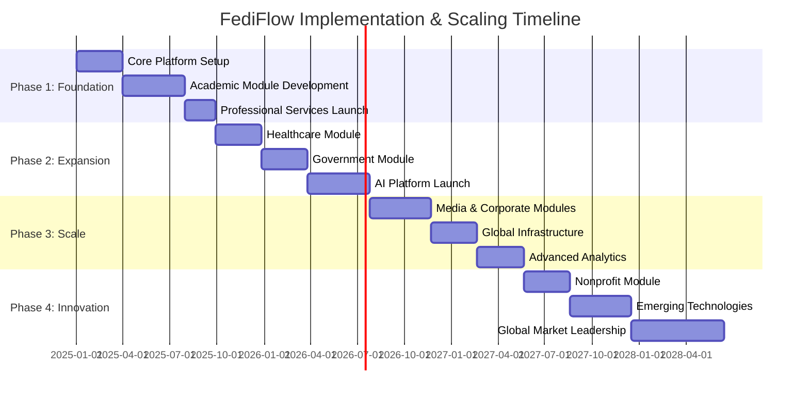
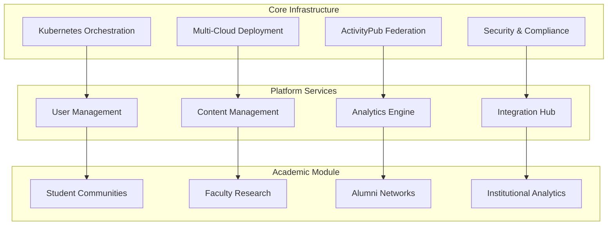
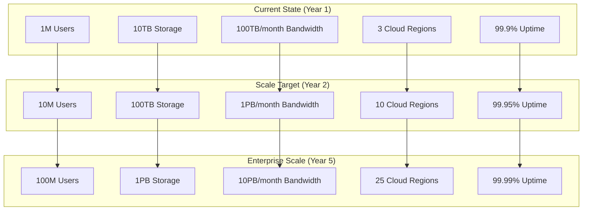
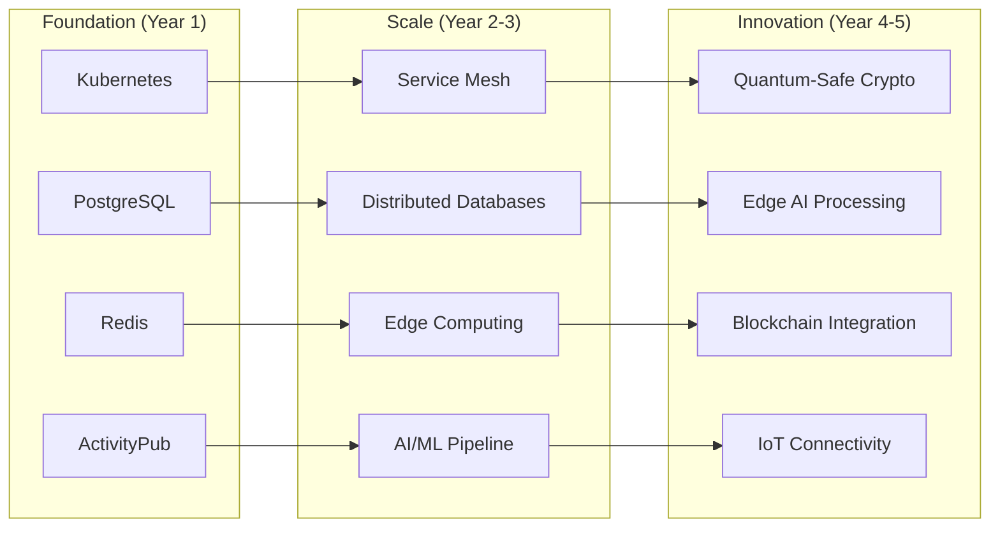
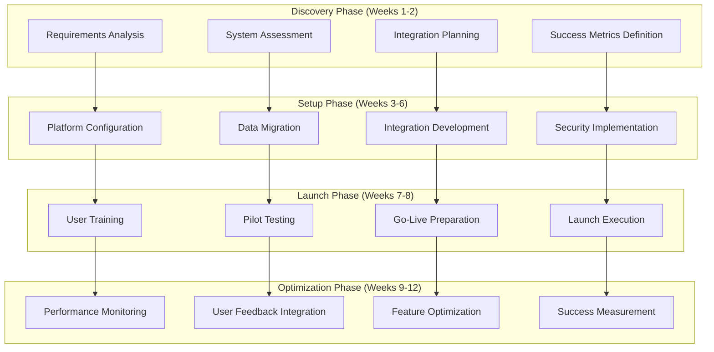
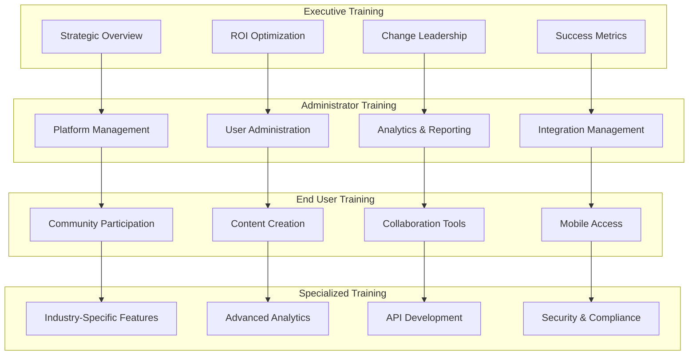
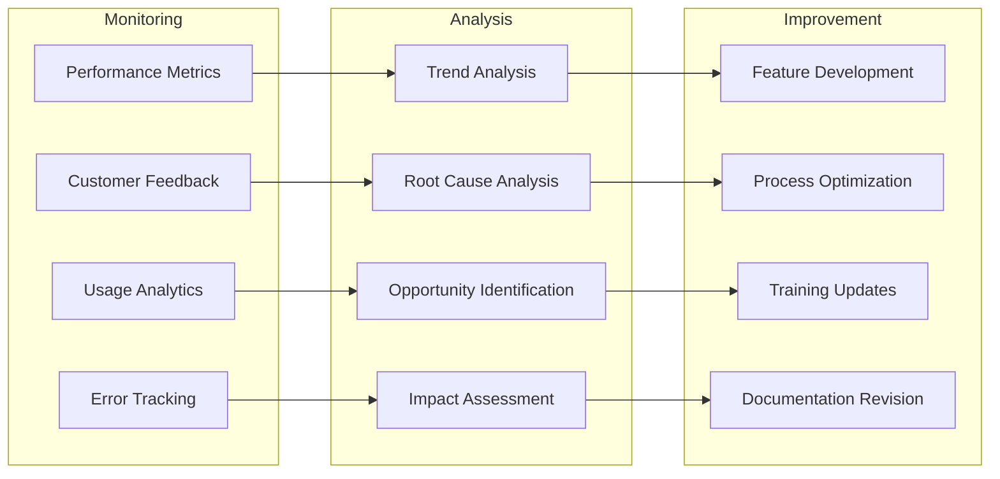
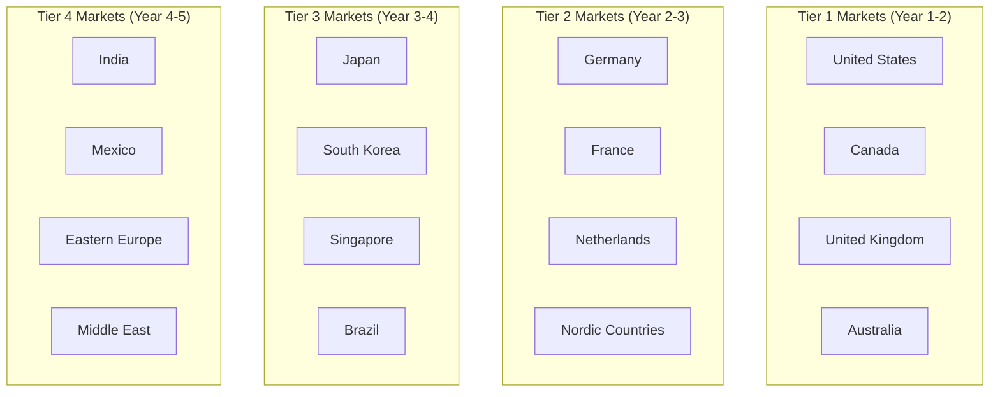
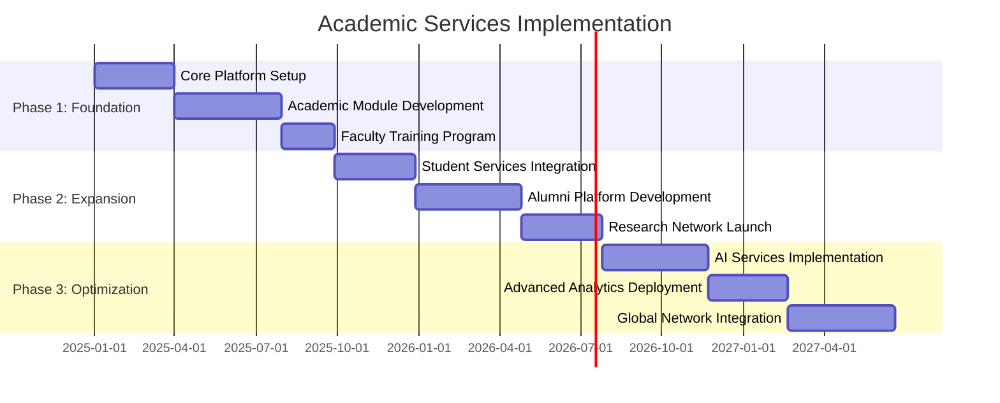

# Implementation & Scaling Strategy

FediFlow's systematic approach to implementation and scaling ensures successful customer onboarding, platform growth, and market expansion while maintaining service quality and operational excellence.

## Phased Implementation Approach

### Implementation Timeline Overview

### Phase 1: Foundation (Months 1-12)

#### Core Platform Development
**Objectives**: Establish foundational infrastructure and launch academic module

**Key Deliverables**:
- Multi-tenant federated platform with enterprise security
- Academic ecosystem with comprehensive university features
- Basic analytics and reporting capabilities
- Professional services team and processes
- Initial customer base of 50-100 academic institutions

**Success Metrics**:
- Platform uptime: 99.9%
- Customer satisfaction: Greater than 4.0/5.0
- Academic module adoption: 80% feature utilization
- Revenue target: $10M ARR

#### Technical Infrastructure

### Phase 2: Expansion (Months 13-24)

#### Industry Module Development
**Objectives**: Launch healthcare and government modules, implement AI platform

**Key Deliverables**:
- Healthcare community platform with HIPAA compliance
- Government citizen engagement platform
- AI-powered content intelligence and analytics
- Advanced integration capabilities
- Customer base expansion to 200-400 organizations

**Success Metrics**:
- Multi-industry presence across 3 sectors
- AI platform adoption: 60% of customers
- Revenue target: $50M ARR
- Customer retention: Greater than 95%

#### Advanced Feature Development
- **Healthcare Module**: Patient communities, provider networks, clinical trial support
- **Government Module**: Citizen services, democratic participation, emergency response
- **AI Platform**: Content analysis, predictive analytics, automated moderation
- **Global Infrastructure**: International deployment with data residency compliance

### Phase 3: Scale (Months 25-36)

#### Market Leadership & Innovation
**Objectives**: Achieve market leadership position, launch advanced technologies

**Key Deliverables**:
- Media & journalism platform with monetization features
- Corporate employee and customer engagement platform
- Advanced AI services and custom model training
- Global infrastructure across 15+ regions
- Customer base of 1,000+ organizations

**Success Metrics**:
- Market leadership in federated enterprise platforms
- Revenue target: $200M ARR
- Global presence across 25+ countries
- Platform innovation leadership

### Phase 4: Innovation (Months 37-48)

#### Comprehensive Ecosystem & Global Expansion
**Objectives**: Complete ecosystem development, achieve global market penetration

**Key Deliverables**:
- Nonprofit and NGO impact platform
- Emerging technology integration (VR/AR, blockchain, IoT)
- Creator economy and individual user platforms
- Comprehensive ecosystem marketplace
- Global market leadership position

**Success Metrics**:
- Complete industry coverage across 6+ verticals
- Revenue target: $500M ARR
- Global market share leadership
- Innovation pipeline for next-generation features

## Technical Scaling Architecture

### Infrastructure Scaling Plan

### Performance & Capacity Planning

#### Scaling Benchmarks by Year
**Year 1 Targets**:
- Concurrent users: 100,000
- API requests/second: 10,000
- Database transactions/second: 5,000
- Storage growth: 2TB/month
- Global latency: less than 300ms

**Year 2 Targets**:
- Concurrent users: 1,000,000
- API requests/second: 100,000
- Database transactions/second: 50,000
- Storage growth: 20TB/month
- Global latency: less than 250ms

**Year 5 Targets**:
- Concurrent users: 10,000,000
- API requests/second: 1,000,000
- Database transactions/second: 500,000
- Storage growth: 200TB/month
- Global latency: less than 200ms

### Technology Stack Evolution

#### Infrastructure Technology Roadmap

## Customer Implementation Strategy

### Onboarding Process Framework

#### Implementation Methodology

### Implementation Tiers by Customer Size

#### Small Organization Implementation (< 1,000 users)
**Timeline**: 4-6 weeks
**Approach**: Standardized setup with minimal customization
**Services Included**:
- Pre-configured platform deployment
- Standard integrations (SSO, basic analytics)
- Online training materials and webinars
- Email and chat support
- Basic success metrics tracking

**Investment**: $25,000-50,000

#### Medium Organization Implementation (1,000-10,000 users)
**Timeline**: 8-12 weeks
**Approach**: Customized setup with moderate integrations
**Services Included**:
- Custom platform configuration
- Advanced integrations (CRM, LMS, business systems)
- On-site and virtual training programs
- Dedicated implementation manager
- Custom analytics and reporting setup

**Investment**: $75,000-200,000

#### Large Enterprise Implementation (> 10,000 users)
**Timeline**: 16-24 weeks
**Approach**: Comprehensive ecosystem deployment
**Services Included**:
- Complete ecosystem customization
- Enterprise-grade integrations and APIs
- Comprehensive training and change management
- Dedicated customer success team
- Custom development and ongoing optimization

**Investment**: $250,000-1,000,000

### Change Management & Training Strategy

#### Training Program Structure

## Operational Excellence Framework

### Quality Assurance & Continuous Improvement

#### Service Level Management
**Platform Performance SLAs**:
- Uptime: 99.9% (Starter) to 99.99% (Sovereign)
- Response time: Less than 100ms for 95% of requests
- Support response: 24 hours (Starter) to 1 hour (Enterprise)
- Issue resolution: 72 hours (non-critical) to 4 hours (critical)
- Data recovery: 24-hour RPO, 4-hour RTO maximum

#### Continuous Improvement Process

### Customer Success Management

#### Success Metrics & KPI Framework
**Customer Health Indicators**:
- Platform adoption rate: Greater than 80% feature utilization
- User engagement: Greater than 70% monthly active users
- Support ticket volume: Less than 5 tickets per 100 users/month
- Customer satisfaction: Greater than 4.0/5.0 rating
- ROI achievement: Greater than 200% within 18 months

#### Success Management Process
- **Onboarding Success**: 90-day optimization program
- **Quarterly Business Reviews**: Strategic alignment and optimization
- **Success Coaching**: Ongoing optimization and best practice sharing
- **Executive Sponsorship**: C-level relationship management for enterprise accounts
- **Community of Practice**: Customer peer learning and knowledge sharing

## Global Expansion Strategy

### Market Entry Framework

#### Geographic Expansion Prioritization

### Localization & Compliance Strategy

#### Regional Adaptation Requirements
**Legal & Regulatory Compliance**:
- Data residency and sovereignty requirements
- Privacy regulation compliance (GDPR, CCPA, etc.)
- Industry-specific regulations by country
- Government procurement and contracting requirements

**Technical Localization**:
- Multi-language platform support (25+ languages)
- Regional data centers and edge computing
- Local currency and payment method support
- Cultural adaptation of features and workflows

**Business Localization**:
- Local partnership and channel development
- Regional pricing and market adaptation
- Local customer success and support teams
- Market-specific marketing and positioning

## Success Measurement & Optimization

### Key Performance Indicators (KPIs)

#### Business Growth Metrics
- **Revenue Growth**: 100%+ year-over-year growth target
- **Customer Acquisition**: 25% month-over-month growth
- **Market Share**: Leadership position in target verticals
- **Customer Lifetime Value**: Greater than $500K average CLV
- **Customer Acquisition Cost**: Less than $50K blended CAC

#### Operational Excellence Metrics
- **Platform Performance**: 99.9%+ uptime across all tiers
- **Customer Satisfaction**: Greater than 4.0/5.0 average rating
- **Support Quality**: Less than 4 hour critical issue resolution
- **Implementation Success**: Greater than 95% on-time, on-budget delivery
- **Employee Satisfaction**: Greater than 4.5/5.0 team satisfaction rating

#### Innovation & Development Metrics
- **Feature Velocity**: 50+ new features per quarter
- **Technology Leadership**: Industry recognition and awards
- **Patent Portfolio**: 25+ patents filed in core technologies
- **Research Investment**: 15% of revenue invested in R&D
- **Partnership Ecosystem**: 100+ certified integration partners

This comprehensive implementation and scaling strategy ensures FediFlow's successful growth from startup to market leader while maintaining operational excellence and customer success throughout the journey.

### Academic Services Implementation Timeline

