# Civic Participation Tools

## Overview

FediFlow's **Civic Participation Tools** empower community institutions to strengthen democratic engagement, facilitate public discourse, and enhance citizen participation in local governance and community decision-making processes.

:::info Democratic Innovation
These tools bridge the gap between traditional civic engagement and modern digital communication, creating **transparent**, **inclusive**, and **accessible** pathways for community participation.
:::

## 🗳️ Core Civic Engagement Features

### Democratic Participation Platform

#### Public Forum Management
- **Town Hall Hosting**: Virtual and hybrid community meetings with federated attendance
- **Issue Discussion Boards**: Structured conversations on local topics and policies
- **Citizen Proposal System**: Platform for community-initiated policy suggestions
- **Transparency Hub**: Access to public documents, meeting minutes, and decision tracking

#### Voting & Polling Infrastructure

### Information Access & Transparency

#### Open Government Integration
- **Meeting Calendars**: Synchronized public meeting schedules across institutions
- **Document Repository**: Searchable archive of public documents and records
- **Budget Transparency**: Visual budget breakdowns and spending tracking
- **Decision Trail**: Historical record of community decisions and their outcomes

#### Accessibility Features
- **Multi-language Support**: Automatic translation for diverse communities
- **Screen Reader Compatibility**: Full accessibility for users with disabilities
- **Mobile Optimization**: Complete functionality on smartphones and tablets
- **Offline Access**: Download key information for communities with limited connectivity

## 🏛️ Institution-Specific Civic Tools

### Public Libraries: Democracy Centers

#### Civic Education Hub
- **Voter Education**: Non-partisan candidate information and ballot guides
- **Government Literacy**: How local government works and citizen rights
- **Legal Resource Center**: Access to legal aid information and self-help resources
- **Digital Equity**: Computer access and digital literacy for civic participation

#### Community Information Clearinghouse
- **Local Services Directory**: Comprehensive guide to community resources
- **Event Coordination**: Public meetings, forums, and civic events
- **News Aggregation**: Local news sources and community journalism
- **Historical Context**: Archive of local political and social history

### Community Centers: Neighborhood Democracy

#### Resident Engagement Platform
- **Neighborhood Councils**: Hyperlocal governance and decision-making
- **Community Priority Setting**: Collaborative identification of local needs
- **Resource Allocation**: Participatory budgeting for community improvements
- **Safety & Security**: Community policing partnership and safety initiatives

#### Local Issue Management

### Religious Organizations: Values-Based Advocacy

#### Faith-Community Civic Engagement
- **Social Justice Initiatives**: Coordinate advocacy on moral and ethical issues
- **Community Service**: Organize volunteer efforts for public good
- **Interfaith Collaboration**: Joint initiatives across religious communities
- **Moral Leadership**: Faith perspective on community challenges

#### Ethical Framework Integration
- **Values-Based Discussion**: Frame civic issues through spiritual/ethical lens
- **Conscience Protection**: Respect for diverse religious viewpoints
- **Service Learning**: Connect faith principles with community action
- **Reconciliation Tools**: Healing and unity building in divided communities

### Museums: Historical Context Providers

#### Civic Memory & Learning
- **Historical Precedent**: Context for current issues based on local history
- **Civic Education Exhibits**: Interactive displays on democracy and citizenship
- **Community Storytelling**: Preserve and share civic engagement stories
- **Cultural Bridge Building**: Use history to connect diverse communities

#### Educational Programming
- **Constitution Day Events**: Annual civic education programming
- **Local Government History**: How institutions evolved and function
- **Citizen Legacy Projects**: Document and celebrate civic leaders
- **Democratic Traditions**: Preserve and teach civic customs and practices

### Nonprofits: Issue Advocacy & Organizing

#### Mission-Driven Civic Engagement
- **Issue Advocacy**: Coordinate campaigns on mission-related topics
- **Coalition Building**: Unite organizations around common causes
- **Policy Research**: Provide evidence-based policy recommendations
- **Grassroots Organizing**: Mobilize community members for civic action

#### Impact Measurement & Reporting
- **Civic Health Metrics**: Track community engagement and participation
- **Policy Impact Assessment**: Measure effectiveness of advocacy efforts
- **Community Needs Assessment**: Identify and prioritize local challenges
- **Success Story Documentation**: Share wins and lessons learned

## 🔐 Privacy & Security for Civic Engagement

### Democratic Privacy Protection
- **Anonymous Participation**: Option for anonymous civic engagement
- **Secure Voting**: Cryptographically secure polling and survey systems
- **Data Sovereignty**: Community control over civic data and analytics
- **Transparency vs. Privacy**: Balance between openness and individual protection

### Anti-Manipulation Safeguards
- **Identity Verification**: Ensure participants are genuine community members
- **Bias Detection**: AI tools to identify and mitigate algorithmic bias
- **Misinformation Prevention**: Fact-checking integration and source verification
- **Foreign Interference Protection**: Safeguards against external manipulation

## 🤝 Cross-Institutional Civic Collaboration

### Coordinated Community Action

```mermaid
flowchart TD
    subgraph "Civic Ecosystem Collaboration"
        LIB[Libraries<br/>📚 Information Access]
        CC[Community Centers<br/>🏢 Local Organizing]
        REL[Religious Orgs<br/>⛪ Values & Service]
        MUS[Museums<br/>🏛️ Historical Context]
        NPO[Nonprofits<br/>🤝 Issue Advocacy]
    end
    
    subgraph "Collaborative Outcomes"
        INFORMED[Informed Citizens]
        ENGAGED[Active Participation]
        UNIFIED[Community Unity]
        EFFECTIVE[Effective Advocacy]
    end
    
    LIB --> INFORMED
    CC --> ENGAGED
    REL --> UNIFIED
    MUS --> INFORMED
    NPO --> EFFECTIVE
```

### Joint Civic Initiatives
- **Community Forums**: Multi-institutional hosting of public discussions
- **Voter Registration Drives**: Coordinated registration and education campaigns
- **Policy Research Collaboratives**: Shared research on local issues
- **Emergency Response**: Coordinated communication during crises

## 📊 Impact Measurement & Analytics

### Civic Health Indicators
- **Participation Rates**: Meeting attendance, forum engagement, voting turnout
- **Information Access**: Document downloads, meeting views, resource usage
- **Community Dialogue**: Quality and quantity of civic discussions
- **Action Outcomes**: Policy changes, community improvements, problem resolution

### Reporting & Accountability
- **Community Dashboards**: Real-time civic engagement metrics
- **Annual Civic Reports**: Comprehensive community health assessments
- **Stakeholder Updates**: Regular reports to funders and partners
- **Continuous Improvement**: Data-driven platform and process enhancement

## 🚀 Implementation Strategy

### Phase 1: Foundation Building (Months 1-6)
1. **Pilot Community Selection**: 3-5 communities with diverse characteristics
2. **Basic Platform Deployment**: Core civic engagement tools
3. **Community Onboarding**: Training for institutions and early users
4. **Governance Framework**: Establish community guidelines and moderation

### Phase 2: Feature Enhancement (Months 7-12)
1. **Advanced Tools**: Polling, document management, analytics
2. **Integration Development**: Connect with existing civic technology
3. **Mobile Optimization**: Full-featured mobile applications
4. **Accessibility Compliance**: Meet WCAG 2.1 AA standards

### Phase 3: Network Expansion (Months 13-18)
1. **Regional Scaling**: Expand to 10+ communities
2. **Cross-Community Features**: Inter-community collaboration tools
3. **API Development**: Third-party integrations and data sharing
4. **Advanced Analytics**: AI-powered insights and recommendations

## 💰 Economic Model for Civic Tools

### Public Value Pricing
- **Grant-Friendly Pricing**: Aligned with typical civic technology budgets
- **Sliding Scale Options**: Based on community size and economic capacity
- **Shared Cost Models**: Multiple institutions jointly fund civic infrastructure
- **Impact-Based ROI**: Demonstrate value through increased civic engagement

### Sustainability Framework
- **Multi-Stakeholder Funding**: Libraries, community centers, nonprofits share costs
- **Government Partnership**: Municipal support for civic technology infrastructure
- **Foundation Support**: Grants from democracy and civic engagement foundations
- **Corporate Sponsorship**: Local business support for community engagement

---

:::success Civic Impact
These tools are designed to strengthen democratic institutions and increase meaningful civic participation. Continue reading about **[Resource Sharing Networks](./resource-sharing-networks.md)** to learn how institutions can collaborate more effectively, or explore **[Volunteer Coordination Systems](./volunteer-coordination-systems.md)** for community service management.
:::
