# Community Engagement Platform

## Platform Overview

The **Community Engagement Platform** is the cornerstone of FediFlow's Community Institutions Module, designed to transform how civic organizations, libraries, community centers, religious institutions, and nonprofits connect with their constituents and collaborate with each other.

:::success Key Differentiator
Unlike traditional social media platforms, our federated approach ensures **community ownership**, **data sovereignty**, and **values-aligned networking** while enabling powerful cross-institutional collaboration.
:::

## 🏛️ Institution-Specific Features

### Public Libraries: Digital Equity Champions

#### Core Capabilities
- **Community Programming Hub**: Event coordination, workshop management, speaker series
- **Digital Resource Sharing**: E-book lending, database access, digital literacy training
- **Local History Archive**: Community-contributed historical content and genealogy
- **Homework Help Network**: Peer tutoring and academic support coordination

#### ROI Impact

**Expected Outcomes:**
- 35% increase in program attendance
- $75K-200K in additional grant funding
- 50% improvement in digital equity metrics
- 40% increase in community partnership collaborations

### Community Centers: Neighborhood Connectors

#### Core Capabilities
- **Resident Services Portal**: Community announcements, service requests, local resources
- **Activity & Sports Leagues**: Registration, scheduling, team communication
- **Neighborhood Watch**: Safety coordination and community alerts
- **Resource Exchange**: Tool libraries, skill sharing, mutual aid networks

#### Federation Benefits
- **Multi-center coordination**: Joint events across community centers
- **Resource pooling**: Shared equipment and program materials
- **Best practice sharing**: Successful program replication
- **Volunteer networking**: Cross-center volunteer opportunities

### Religious Organizations: Faith Community Builders

#### Core Capabilities
- **Congregation Management**: Secure member communication and spiritual discussion
- **Service Coordination**: Volunteer opportunities and community outreach
- **Educational Programs**: Religious study groups and interfaith dialogue
- **Event Management**: Worship services, community events, fundraising

#### Privacy & Security Features
- **Faith-appropriate moderation**: Content filtering aligned with religious values
- **Private congregation spaces**: Secure areas for member-only discussions
- **Interfaith collaboration**: Safe spaces for cross-denominational initiatives
- **Mission-driven networking**: Connect with like-minded organizations

### Museums & Cultural Institutions: Heritage Preservationists

#### Core Capabilities
- **Visitor Engagement**: Interactive exhibits, educational content, virtual tours
- **Research Networks**: Academic collaboration and curatorial partnerships
- **Cultural Events**: Exhibition openings, lectures, workshops, artist showcases
- **Community Collections**: Local artifact contributions and cultural storytelling

#### Cultural Impact Features
- **Digital exhibitions**: Virtual gallery spaces and online collections
- **Educational partnerships**: School programs and university collaborations
- **Artist networks**: Creative professional community building
- **Cultural preservation**: Community-driven heritage documentation

### Nonprofits & NGOs: Mission Amplifiers

#### Core Capabilities
- **Impact Storytelling**: Mission-driven content and success story sharing
- **Volunteer Coordination**: Recruitment, training, and activity management
- **Donor Engagement**: Transparent impact reporting and community building
- **Coalition Building**: Inter-organizational collaboration and advocacy

#### Mission Alignment Tools
- **Cause-based networking**: Connect organizations with similar missions
- **Impact measurement**: Collaborative outcome tracking and reporting
- **Advocacy coordination**: Joint campaigns and policy initiatives
- **Resource sharing**: Grant opportunities and funding collaboration

## 🤝 Cross-Institutional Collaboration Features

### Joint Event Management

```mermaid
flowchart LR
    subgraph "Collaborative Event Planning"
        LIBRARY[📚 Library<br/>Space & Resources]
        MUSEUM[🏛️ Museum<br/>Content & Exhibits]
        CENTER[🏢 Community Center<br/>Activities & Coordination]
        NONPROFIT[🤝 Nonprofit<br/>Mission & Volunteers]
    end
    
    subgraph "Shared Event Outcomes"
        ATTENDANCE[Higher Attendance]
        RESOURCES[Pooled Resources]
        IMPACT[Greater Impact]
        COMMUNITY[Stronger Community]
    end
    
    LIBRARY --> ATTENDANCE
    MUSEUM --> RESOURCES
    CENTER --> IMPACT
    NONPROFIT --> COMMUNITY
```

### Resource Sharing Networks
- **Equipment lending**: Shared AV equipment, furniture, technology
- **Expertise exchange**: Professional development and skill sharing
- **Space coordination**: Venue sharing for events and programs
- **Grant collaboration**: Joint funding applications and shared costs

### Civic Engagement Amplification
- **Voter education**: Non-partisan civic education collaboratives
- **Community forums**: Public discussion spaces on local issues
- **Service coordination**: Streamlined access to community services
- **Emergency response**: Coordinated disaster relief and community support

## 🔧 Technical Implementation

### Federation Architecture

### Privacy & Security Framework
- **Institution-level privacy controls**: Each organization controls its data sharing
- **Community-appropriate moderation**: Configurable content filtering
- **GDPR/CCPA compliance**: Full data protection and user rights
- **Federated identity**: Single sign-on across trusted community institutions

### Scalability & Performance
- **Multi-tenant architecture**: Efficient resource utilization
- **Edge computing**: Fast content delivery to local communities
- **Auto-scaling**: Handle peak loads during community events
- **Offline capabilities**: Essential features work without internet connectivity

## 📊 Implementation Roadmap

### Phase 1: Foundation (Months 1-6)
- **Pilot deployment**: 5 diverse community institutions per target city
- **Core feature development**: Basic federation and community tools
- **Community governance**: Establish moderation and guidelines framework

### Phase 2: Network Growth (Months 7-12)
- **Regional expansion**: Scale to 25+ institutions per metropolitan area
- **Advanced features**: Resource sharing, event coordination, analytics
- **Partnership development**: Integrate with existing civic technology

### Phase 3: Ecosystem Maturity (Months 13-18)
- **Cross-regional federation**: Connect community networks across cities
- **AI-powered features**: Smart recommendations and automated coordination
- **Third-party integrations**: Connect with government services and civic platforms

## 💰 Revenue Model Integration

### Community-Appropriate Pricing
- **Public libraries**: $5K-25K annually (often grant-funded)
- **Community centers**: $3K-15K annually (municipal budgets)
- **Religious organizations**: $2K-20K annually (congregation funding)
- **Museums**: $8K-40K annually (mixed funding sources)
- **Nonprofits**: $1K-30K annually (sliding scale based on budget)

### Value-Based Pricing Tiers
1. **Community Starter**: Basic federation and communication tools
2. **Engagement Pro**: Advanced event management and resource sharing
3. **Network Leader**: Full collaboration suite with analytics and integrations

### Grant Funding Support
- **Grant application assistance**: Help institutions secure technology funding
- **Shared cost models**: Multiple institutions share enterprise features
- **Pilot program discounts**: Reduced rates for early adopters

---

:::tip Community Integration
This platform is designed to strengthen existing community bonds while creating new opportunities for collaboration. Learn more about specific implementation strategies in our **[Civic Participation Tools](./civic-participation-tools.md)** and **[Resource Sharing Networks](./resource-sharing-networks.md)** documentation.
:::
