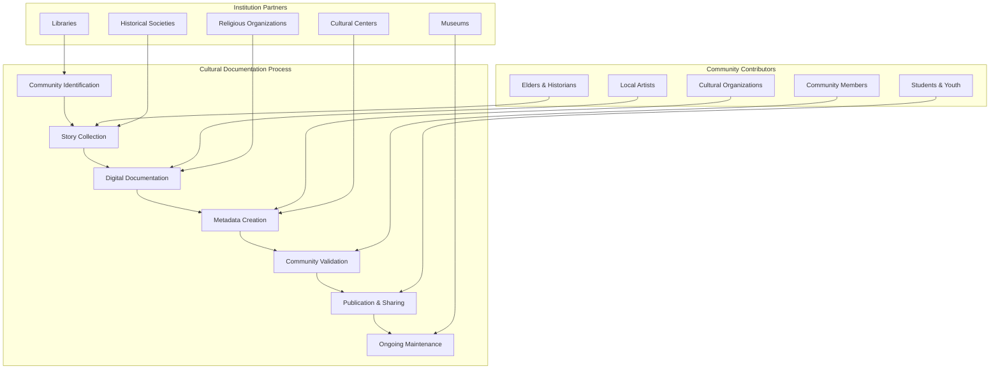
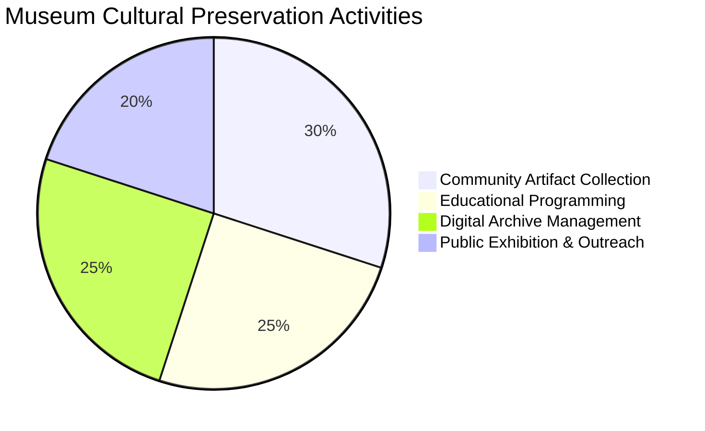
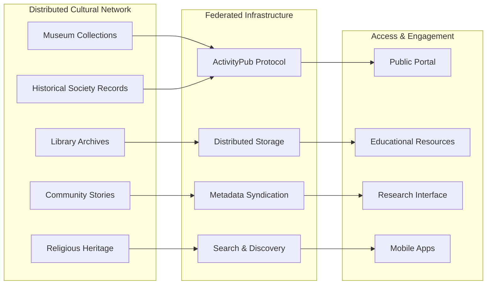
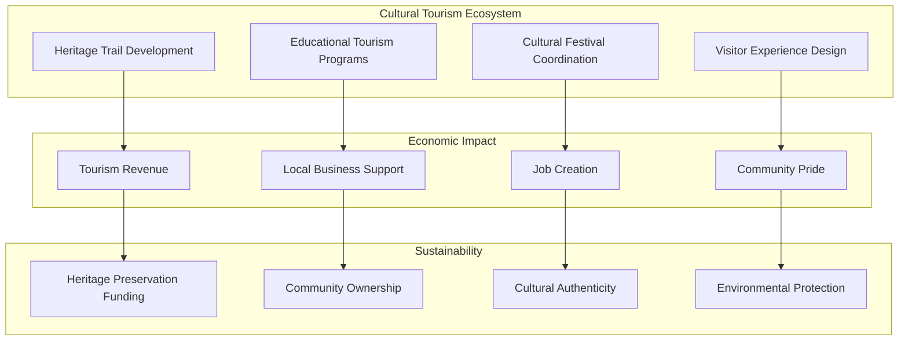

# Cultural Preservation Tools

## Platform Overview

FediFlow's **Cultural Preservation Tools** empower community institutions to digitally preserve, share, and celebrate local heritage through federated cultural networks, collaborative storytelling, and community-driven documentation initiatives.

:::info Cultural Heritage Impact
Digital cultural preservation can increase community engagement with local heritage by **300-500%** while ensuring cultural knowledge survives for future generations through distributed, resilient storage systems.
:::

## 🏛️ Comprehensive Cultural Preservation Framework

### Digital Heritage Documentation

#### Community Artifact Digitization
- **3D Scanning & Photography**: High-resolution documentation of physical artifacts
- **Audio & Video Recording**: Oral histories, traditional music, cultural performances
- **Document Digitization**: Historical papers, photographs, maps, and records
- **Interactive Multimedia**: Virtual reality experiences and augmented reality overlays

#### Collaborative Storytelling Platform

#### Metadata & Cataloging Systems
- **Dublin Core Standards**: Standardized metadata for cultural objects
- **Community Tagging**: Local knowledge integration through community input
- **Multilingual Support**: Documentation in multiple community languages
- **Rights Management**: Copyright and usage permissions for cultural materials

### Living Heritage Programs

#### Oral History Initiatives
- **Elder Interview Projects**: Systematic documentation of community elders' stories
- **Traditional Knowledge Recording**: Preservation of craft techniques, recipes, practices
- **Language Preservation**: Documentation of endangered or minority languages
- **Family History Projects**: Genealogy and family story collection

#### Cultural Practice Documentation
- **Traditional Arts & Crafts**: Video tutorials and technique preservation
- **Music & Performance**: Recording traditional songs, dances, and ceremonies
- **Foodways & Traditions**: Documenting traditional recipes and food practices
- **Seasonal Celebrations**: Recording community festivals and cultural events

## 🏛️ Institution-Specific Cultural Roles

### Museums: Cultural Stewardship Leaders

#### Primary Functions
- **Professional Curation**: Expert guidance on collection development and preservation
- **Conservation Expertise**: Technical knowledge for artifact preservation
- **Educational Programming**: Interpretation and public engagement with cultural heritage
- **Research Coordination**: Academic partnerships and scholarly documentation

#### Digital Collection Management
- **Collection Database**: Comprehensive catalog of community cultural assets
- **Virtual Exhibitions**: Online display of cultural materials and stories
- **Educational Resources**: Curriculum materials based on local heritage
- **Research Portal**: Academic access to cultural documentation

#### Community Engagement

### Libraries: Information & Access Facilitators

#### Primary Functions
- **Digital Infrastructure**: Technology and storage for cultural preservation
- **Community Access**: Public access to cultural materials and archives
- **Research Support**: Assistance with cultural research and documentation
- **Training & Education**: Digital literacy for cultural preservation projects

#### Special Collections
- **Local History Archives**: Comprehensive local historical documentation
- **Genealogy Resources**: Family history research and documentation tools
- **Community Newspaper Archives**: Historical local publication preservation
- **Government Records**: Historical civic and administrative documentation

#### Community Programs
- **StoryCorps Initiatives**: Community storytelling and oral history programs
- **Digital Literacy Training**: Teaching community members preservation skills
- **Cultural Heritage Workshops**: Hands-on preservation and documentation training
- **Intergenerational Programs**: Connecting elders with youth for knowledge transfer

### Religious Organizations: Sacred Heritage Guardians

#### Primary Functions
- **Sacred Story Preservation**: Documentation of religious and spiritual heritage
- **Community Memory Keeping**: Institutional memory and congregational history
- **Interfaith Documentation**: Multi-faith community heritage projects
- **Moral & Ethical Context**: Cultural preservation within values frameworks

#### Spiritual Heritage Documentation
- **Congregational Histories**: Church, synagogue, mosque, temple historical records
- **Religious Art & Architecture**: Documentation of sacred spaces and artifacts
- **Liturgical Traditions**: Recording of religious ceremonies and practices
- **Community Service Legacy**: Documentation of social justice and service work

#### Interfaith Cultural Projects
- **Multi-Faith Heritage**: Collaborative documentation of diverse religious traditions
- **Shared Community History**: Joint preservation of neighborhood religious heritage
- **Cultural Bridge Building**: Using heritage to connect different faith communities
- **Peace & Reconciliation**: Cultural preservation as healing and unity building

### Community Centers: Grassroots Heritage Hubs

#### Primary Functions
- **Neighborhood Documentation**: Hyperlocal cultural and historical preservation
- **Community Event Recording**: Documentation of local celebrations and traditions
- **Resident Story Collection**: Personal and family histories from community members
- **Cultural Activity Coordination**: Programs that generate new cultural content

#### Local Heritage Projects
- **Neighborhood Walking Tours**: Community-created heritage education programs
- **Cultural Mapping**: Geographic documentation of cultural sites and significance
- **Community Art Projects**: Collaborative murals, sculptures, and public art
- **Local Hero Documentation**: Stories of community leaders and notable residents

#### Grassroots Documentation
- **Community-Led Projects**: Resident-initiated cultural preservation efforts
- **Youth Heritage Programs**: Young people documenting community culture
- **Senior Storytelling**: Elder-led heritage sharing and documentation
- **Immigrant Heritage**: Documentation of diverse cultural traditions and experiences

### Historical Societies: Heritage Expertise Centers

#### Primary Functions
- **Professional Standards**: Archival best practices and preservation techniques
- **Research Coordination**: Academic and scholarly cultural research projects
- **Public History**: Making heritage accessible and engaging for community members
- **Grant & Funding**: Securing resources for cultural preservation initiatives

#### Specialized Services
- **Archaeological Documentation**: Physical heritage site documentation and preservation
- **Architectural Heritage**: Historic building and structure documentation
- **Documentary Research**: Professional historical research and fact-checking
- **Heritage Tourism**: Cultural tourism development and promotion

## 🔧 Technology Platform Features

### Federated Cultural Archive System

### Community Contribution Platform
- **Easy Upload Tools**: Simple interfaces for community members to contribute content
- **Quality Control**: Community moderation and professional validation systems
- **Rights Management**: Clear guidelines for intellectual property and permissions
- **Attribution Systems**: Proper credit and recognition for community contributors

### Cross-Cultural Discovery
- **Semantic Search**: Advanced search capabilities across cultural collections
- **Related Content**: AI-powered recommendations for similar cultural materials
- **Cultural Mapping**: Geographic visualization of cultural heritage sites and stories
- **Timeline Visualization**: Chronological exploration of community cultural development

### Educational Integration
- **Curriculum Resources**: Teacher materials based on local cultural heritage
- **Student Projects**: Tools for students to contribute to cultural preservation
- **Virtual Field Trips**: Online exploration of local cultural sites and stories
- **Assessment Tools**: Evaluation resources for heritage education programs

## 🌍 Cross-Institutional Cultural Collaboration

### Joint Heritage Projects

#### Regional Cultural Networks
- **Multi-Community Documentation**: Collaborative heritage projects across neighboring communities
- **Cultural Exchange**: Sharing stories and artifacts between different communities
- **Comparative Studies**: Academic research comparing cultural development across regions
- **Traveling Exhibitions**: Mobile cultural displays shared between institutions

#### Thematic Collections
- **Immigration Stories**: Multi-institutional documentation of immigrant experiences
- **Industry Heritage**: Collaborative preservation of local economic and industrial history
- **Environmental Heritage**: Documentation of landscape changes and environmental history
- **Social Movement Documentation**: Preservation of civil rights and social justice history

### Cultural Tourism Development

## 📊 Impact Measurement & Community Engagement

### Cultural Preservation Metrics

| Impact Category | Key Performance Indicators | Community Benefits |
|---|---|---|
| **Documentation Volume** | Stories collected, artifacts digitized, hours recorded | Preserved cultural knowledge |
| **Community Participation** | Contributors, visitors, educational participants | Increased cultural engagement |
| **Educational Impact** | Curriculum usage, student projects, teacher resources | Enhanced cultural literacy |
| **Tourism Development** | Visitor numbers, heritage trail usage, economic impact | Sustainable cultural economy |
| **Cross-Cultural Connection** | Inter-community exchanges, collaborative projects | Stronger regional identity |

### Digital Preservation Analytics
- **Content Growth**: Rate of new cultural material addition
- **Community Engagement**: User interaction with cultural content
- **Educational Usage**: School and university utilization of heritage materials
- **Research Impact**: Academic and scholarly use of cultural archives

### Cultural Continuity Assessment
- **Knowledge Transfer**: Intergenerational cultural knowledge sharing
- **Practice Preservation**: Continuation of traditional cultural practices
- **Language Vitality**: Support for minority and endangered languages
- **Cultural Innovation**: New expressions building on traditional foundations

## 🚀 Implementation Roadmap

### Phase 1: Foundation & Pilot (Months 1-6)
1. **Community Heritage Assessment**: Identify priority cultural preservation needs
2. **Technology Platform Setup**: Deploy basic cultural documentation and sharing tools
3. **Community Training**: Train institutions and volunteers in digital preservation
4. **Pilot Collections**: Begin with 3-5 foundational heritage documentation projects

### Phase 2: Network Development (Months 7-12)
1. **Cross-Institutional Integration**: Connect cultural collections across partner organizations
2. **Community Contribution Platform**: Launch tools for community-driven documentation
3. **Educational Resource Development**: Create curriculum materials from heritage collections
4. **Quality Assurance Systems**: Implement professional standards and community moderation

### Phase 3: Regional Expansion (Months 13-18)
1. **Network Scaling**: Connect cultural preservation networks across broader geographic areas
2. **Advanced Features**: AI-powered discovery, virtual reality experiences, mobile apps
3. **Tourism Integration**: Develop heritage tourism programs and economic opportunities
4. **Sustainability Planning**: Establish long-term funding and governance models

## 🔐 Ethical Framework & Community Ownership

### Cultural Sensitivity & Rights
- **Community Consent**: Ensure community ownership and control of cultural materials
- **Sacred & Sensitive Content**: Appropriate handling of religious and culturally sensitive materials
- **Indigenous Rights**: Respect for tribal and indigenous cultural preservation protocols
- **Intellectual Property**: Clear guidelines for cultural material ownership and usage

### Privacy & Accessibility
- **Personal Story Protection**: Safeguards for private family and individual stories
- **Accessibility Standards**: Ensure cultural materials are accessible to people with disabilities
- **Multilingual Access**: Support for diverse language communities
- **Digital Divide**: Ensure equitable access across different technological capabilities

### Sustainability & Stewardship
- **Long-term Preservation**: Technical standards for long-term digital preservation
- **Community Stewardship**: Training community members as cultural preservation leaders
- **Funding Diversification**: Multiple revenue streams for sustainable heritage preservation
- **Technology Evolution**: Planning for technological change and migration

## 💰 Economic Model & ROI

### Investment & Returns Analysis

| Investment Category | Annual Cost | Community Value Generated | Cultural ROI |
|---|---|---|---|
| **Technology Infrastructure** | $30K-60K | $200K-500K cultural preservation value | 350-750% |
| **Professional Staff** | $50K-100K | $300K-800K documentation & curation | 400-700% |
| **Community Training** | $20K-40K | $150K-400K volunteer contribution | 400-900% |
| **Equipment & Technology** | $25K-50K | $175K-450K digitization & documentation | 350-800% |
| **Total Investment** | **$125K-250K** | **$825K-2.15M** | **360-760%** |

### Revenue Generation Opportunities
- **Heritage Tourism**: Cultural tourism development and visitor experiences
- **Educational Services**: Curriculum development and teacher training programs
- **Grant Funding**: Cultural preservation grants from foundations and government
- **Corporate Partnerships**: Local business sponsorship of heritage preservation

### Economic Impact
- **Tourism Revenue**: Heritage-based tourism generates local economic activity
- **Cultural Industries**: Support for local artists, craftspeople, and cultural entrepreneurs
- **Property Values**: Heritage preservation can increase neighborhood property values
- **Community Pride**: Intangible but valuable improvements in community identity and cohesion

---

:::success Cultural Legacy
Cultural preservation tools ensure that community heritage survives and thrives in the digital age, creating bridges between past, present, and future. Explore **[Interfaith Collaboration](./interfaith-collaboration.md)** to see how diverse faith communities can work together on heritage preservation, or return to the **[Community Institutions Module](./index.md)** overview for a comprehensive view of community-centered technology solutions.
:::
