# Community Institutions Module

## Executive Overview

The **Community Institutions Module** represents FediFlow's strategic expansion into the civic engagement and community development sector. This module transforms how community institutions—libraries, community centers, religious organizations, museums, and nonprofits—connect, collaborate, and serve their constituencies through federated social networking technology.

:::info Strategic Market Position
Community institutions represent a **$25+ billion addressable market** with over **500,000+ institutions globally** seeking modern digital engagement platforms while maintaining their autonomy and values.
:::

## 🏛️ Target Institution Types

### Primary Community Institutions

| Institution Type | Global Count | Market Size | Key Needs |
|---|---|---|---|
| **Public Libraries** | 120,000+ | $12B annually | Digital equity, community programming, resource sharing |
| **Community Centers** | 50,000+ | $8B annually | Resident engagement, activity coordination, resource management |
| **Religious Organizations** | 300,000+ | $15B annually | Congregation management, spiritual education, community outreach |
| **Museums & Cultural** | 35,000+ | $6B annually | Visitor engagement, educational programming, cultural preservation |
| **Nonprofits/NGOs** | 200,000+ | $10B annually | Mission-driven networking, volunteer coordination, impact tracking |

### Secondary Market Segments

- **Civic Organizations**: Rotary clubs, Lions clubs, professional associations
- **Cultural Centers**: Arts centers, performance venues, creative spaces
- **Historical Societies**: Local history preservation, genealogy services
- **Environmental Groups**: Conservation organizations, sustainability initiatives
- **Youth Organizations**: Scouts, 4-H clubs, youth development programs

## 🎯 Core Value Propositions

### 1. **Federated Community Networks**
Enable institutions to maintain autonomy while participating in broader community ecosystems through ActivityPub federation.

### 2. **Cross-Institutional Collaboration**
Facilitate resource sharing, joint programming, and collaborative initiatives between different types of community institutions.

### 3. **Civic Engagement Amplification**
Strengthen democratic participation and community involvement through integrated digital platforms.

### 4. **Cultural Preservation & Sharing**
Support local history documentation, cultural artifact sharing, and community storytelling initiatives.

### 5. **Resource Optimization**
Maximize community impact through shared resources, coordinated programming, and collaborative funding opportunities.

## 🏗️ Architecture Framework

```mermaid
flowchart TD
    subgraph "Community Institution Network"
        LIB[Public Library<br/>📚 Information Hub]
        CC[Community Center<br/>🏢 Activity Coordinator]
        REL[Religious Org<br/>⛪ Spiritual Community]
        MUS[Museum<br/>🏛️ Cultural Curator]
        NPO[Nonprofit<br/>🤝 Mission Advocate]
    end
    
    subgraph "Shared Services Layer"
        EVENT[📅 Event Management]
        RESOURCE[📦 Resource Sharing]
        VOLUNTEER[👥 Volunteer Network]
        CIVIC[🗳️ Civic Engagement]
        EDUCATION[📖 Educational Programs]
    end
    
    subgraph "Federation Network"
        ACTPUB[ActivityPub Protocol]
        IDENTITY[Federated Identity]
        PRIVACY[Privacy Controls]
        MODERATION[Community Guidelines]
    end
    
    LIB --> EVENT
    CC --> RESOURCE
    REL --> VOLUNTEER
    MUS --> CIVIC
    NPO --> EDUCATION
    
    EVENT --> ACTPUB
    RESOURCE --> IDENTITY
    VOLUNTEER --> PRIVACY
    CIVIC --> MODERATION
    EDUCATION --> ACTPUB
```

## 📊 Market Opportunity Analysis

### Financial Impact Projections

#### Year 1-3 Revenue Potential
- **Tier 1 Markets** (Major metros): $5-50K annual contracts
- **Tier 2 Markets** (Mid-size cities): $3-25K annual contracts  
- **Tier 3 Markets** (Small towns): $1-15K annual contracts

#### Customer Acquisition Trajectory

## 🚀 Implementation Strategy

### Phase 1: Foundation Building (Months 1-6)
1. **Pilot Partner Selection**: 25 diverse community institutions
2. **Core Platform Development**: Basic federation and community features
3. **Governance Framework**: Community-driven moderation and guidelines

### Phase 2: Network Expansion (Months 7-18)
1. **Regional Rollouts**: Target 5 metropolitan areas
2. **Feature Enhancement**: Advanced collaboration tools
3. **Partnership Development**: Library systems, community center networks

### Phase 3: Ecosystem Integration (Months 19-36)
1. **National Scaling**: Expand to 25+ metropolitan areas
2. **Advanced Features**: AI-powered recommendations, analytics
3. **Interoperability**: Integration with existing civic technology

## 🔗 Module Interconnections

This Community Institutions Module integrates seamlessly with:

- **[Academic Services](../academic-services/index.md)**: University-community partnerships
- **[Technical Architecture](../technical-architecture/system-architecture.md)**: Federated infrastructure
- **[Revenue & Monetization](../monetization-strategy/index.md)**: Diversified revenue streams
- **[Ecosystem Architecture](../ecosystem-architecture/index.md)**: Multi-institutional networks

## 📈 Success Metrics

### Community Engagement KPIs
- **Cross-institutional collaboration events**: Target 50+ per quarter
- **Resource sharing transactions**: Target 500+ per month
- **Volunteer coordination efficiency**: 40% improvement
- **Civic participation rates**: 25% increase in partner communities

### Technical Performance Metrics
- **Federation reliability**: 99.9% uptime
- **User engagement**: 60%+ weekly active users
- **Content sharing**: 75%+ cross-institutional content interaction
- **Platform adoption**: 80%+ feature utilization rate

---

:::tip Next Steps
Explore the specific tools and frameworks designed for each community institution type in the following sections, or review our **[Community Engagement Platform](./community-engagement-platform.md)** for comprehensive implementation details.
:::
