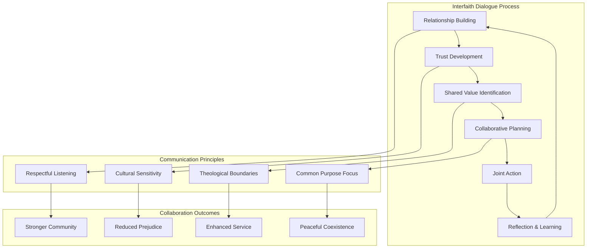
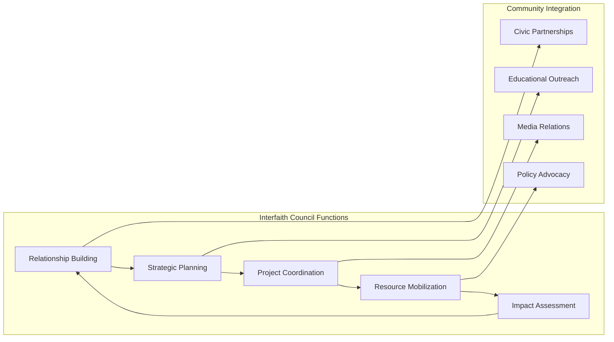
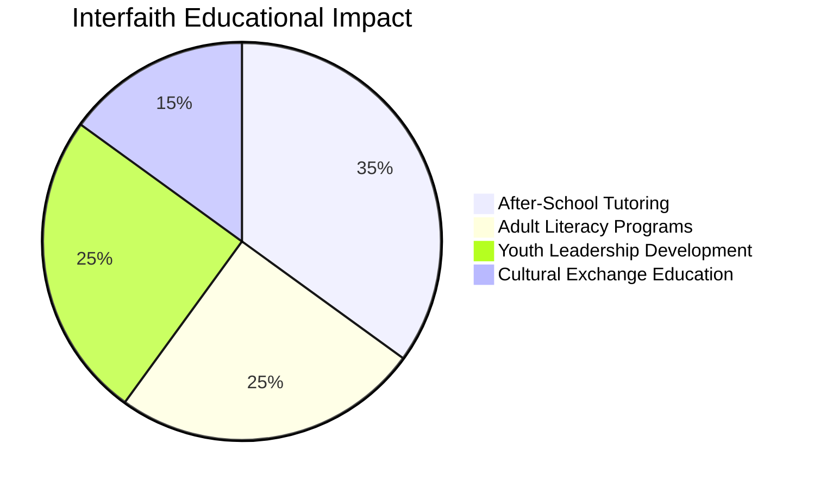
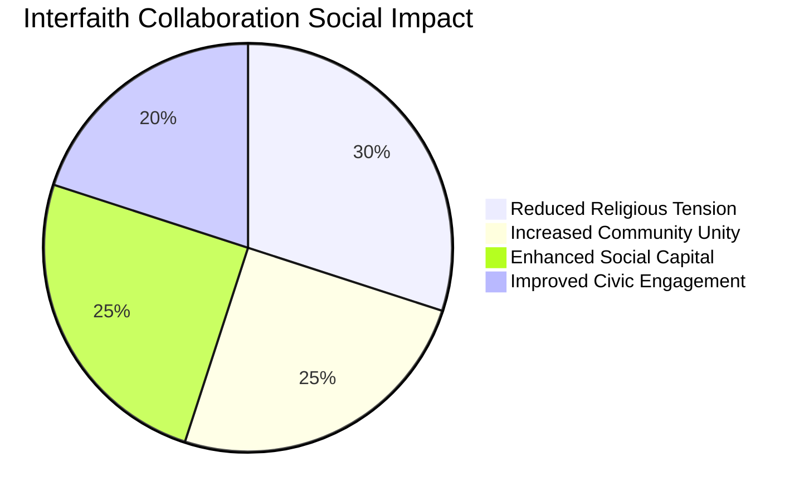

# Interfaith Collaboration

## Platform Overview

FediFlow's **Interfaith Collaboration** tools facilitate meaningful cooperation between diverse religious and spiritual communities while respecting theological differences, promoting shared values, and addressing common community challenges through coordinated action.

:::success Unity in Diversity
Interfaith collaboration can increase community social cohesion by **40-70%** while expanding collective service capacity by **200-400%** through coordinated multi-faith community initiatives.
:::

## 🤝 Interfaith Cooperation Framework

### Shared Values & Common Ground

#### Universal Principles Platform
- **Compassionate Service**: Joint focus on helping those in need regardless of faith background
- **Community Building**: Shared commitment to strengthening neighborhoods and civic life
- **Education & Learning**: Collaborative approach to wisdom sharing and mutual understanding
- **Peace & Justice**: United advocacy for human dignity and social equity

#### Respectful Dialogue Infrastructure

#### Safe Space Guidelines
- **Theological Respect**: Clear boundaries around proselytizing and doctrinal discussions
- **Cultural Sensitivity**: Understanding and honoring diverse religious practices
- **Inclusive Language**: Communication that welcomes all faith traditions
- **Conflict Resolution**: Peaceful approaches to addressing disagreements

### Collaborative Service Programs

#### Community Service Coordination
- **Food Security**: Joint food pantries, soup kitchens, and nutrition programs
- **Housing & Shelter**: Collaborative homeless services and housing assistance
- **Disaster Relief**: Coordinated emergency response and recovery assistance
- **Educational Support**: Tutoring, literacy programs, and scholarship initiatives

#### Social Justice Advocacy
- **Human Rights**: United advocacy for dignity and equality
- **Environmental Stewardship**: Faith-based environmental protection initiatives
- **Economic Justice**: Collaborative anti-poverty and fair wage advocacy
- **Criminal Justice Reform**: Restorative justice and rehabilitation programs

## 🏛️ Faith Community Participation Models

### Large Established Congregations

#### Leadership & Resources
- **Facility Sharing**: Large worship spaces for community events and interfaith gatherings
- **Financial Resources**: Significant budgets for collaborative community service projects
- **Professional Staff**: Clergy and staff with expertise in community organizing
- **Established Networks**: Existing relationships with civic leaders and organizations

#### Interfaith Engagement Capacity
- **Event Hosting**: Ability to host large interfaith conferences and community meetings
- **Project Leadership**: Taking lead roles in major community service initiatives
- **Mentorship Programs**: Supporting smaller congregations in interfaith work
- **Resource Sharing**: Providing equipment, space, and funding for collaborative projects

### Small & Emerging Communities

#### Grassroots Contribution
- **Volunteer Networks**: Dedicated community members with flexible time availability
- **Cultural Diversity**: Unique perspectives and traditions enriching interfaith dialogue
- **Innovation & Creativity**: Fresh approaches to community challenges and solutions
- **Authentic Relationships**: Deep personal connections within their communities

#### Collaborative Benefits
- **Shared Resources**: Access to facilities and resources through larger partners
- **Capacity Building**: Learning opportunities through interfaith collaboration
- **Community Recognition**: Increased visibility and community standing
- **Mission Fulfillment**: Enhanced ability to serve community through partnerships

### Interfaith Organizations & Councils

#### Coordination & Facilitation
- **Neutral Convening**: Providing safe spaces for interfaith dialogue and planning
- **Conflict Mediation**: Professional expertise in resolving interfaith tensions
- **Training & Education**: Workshops on interfaith cooperation best practices
- **Community Representation**: Advocacy for religious freedom and faith community needs

#### Strategic Planning & Implementation

## 🔧 Technology Platform Features

### Federated Faith Network
- **Autonomous Participation**: Each faith community maintains control over their participation level
- **Flexible Collaboration**: Choose specific projects and initiatives to join
- **Respectful Boundaries**: Technology that respects theological and cultural differences
- **Privacy Protection**: Secure communication that protects community autonomy

### Multi-Faith Communication Tools
- **Respectful Messaging**: Communication features designed for interfaith sensitivity
- **Cultural Calendar Integration**: Awareness of diverse religious holidays and observances
- **Translation Services**: Multi-language support for diverse communities
- **Moderation Systems**: Community-driven content moderation respecting all traditions

### Collaborative Project Management
- **Joint Initiative Planning**: Tools for planning and coordinating interfaith projects
- **Resource Sharing**: Platform for sharing facilities, volunteers, and materials
- **Event Coordination**: Multi-faith event planning and promotion
- **Impact Tracking**: Measurement of collaborative community service outcomes

### Educational & Dialogue Features
- **Interfaith Learning**: Educational resources about different faith traditions
- **Dialogue Facilitation**: Structured conversation tools for respectful exchange
- **Cultural Exchange**: Sharing of traditions, practices, and celebrations
- **Wisdom Sharing**: Platform for sharing spiritual insights and teachings (with boundaries)

## 🌍 Community Impact & Service Areas

### Social Services & Community Care

#### Food Security Initiatives
- **Community Food Pantries**: Joint operation of food distribution centers
- **Soup Kitchens & Meal Programs**: Collaborative feeding programs for those in need
- **Community Gardens**: Shared agricultural projects promoting food access and sustainability
- **Nutrition Education**: Culturally sensitive nutrition and cooking programs

#### Housing & Homelessness Services
- **Emergency Shelter**: Coordinated temporary housing assistance
- **Transitional Housing**: Long-term housing support and case management
- **Housing Advocacy**: Joint advocacy for affordable housing and tenant rights
- **Home Repair Programs**: Volunteer services for elderly and low-income homeowners

### Education & Youth Development

#### Educational Support Programs

#### Youth Interfaith Leadership
- **Youth Interfaith Councils**: Young people leading interfaith dialogue and service
- **Service Learning**: Youth volunteer programs across faith communities
- **Cultural Exchange**: Programs for young people to learn about different traditions
- **Leadership Development**: Training programs for future interfaith leaders

### Community Health & Wellness

#### Health Service Coordination
- **Community Health Fairs**: Joint health screening and education events
- **Mental Health Support**: Collaborative counseling and support services
- **Addiction Recovery**: Interfaith addiction recovery and support programs
- **Elderly Care**: Coordinated services for aging community members

#### Wellness & Spiritual Care
- **Chaplaincy Services**: Multi-faith spiritual care in hospitals and institutions
- **Grief Support**: Interfaith bereavement counseling and support groups
- **Meditation & Prayer**: Shared contemplative practices respecting all traditions
- **Healing Services**: Collaborative approaches to spiritual and emotional healing

### Environmental & Creation Care

#### Interfaith Environmental Action
- **Climate Change Advocacy**: United religious voice on environmental issues
- **Creation Care Projects**: Faith-based environmental stewardship initiatives
- **Sustainable Living**: Educational programs on responsible consumption and conservation
- **Environmental Justice**: Advocacy for communities disproportionately affected by pollution

#### Community Beautification
- **Neighborhood Cleanup**: Joint environmental improvement projects
- **Community Gardens**: Shared green space development and maintenance
- **Tree Planting**: Collaborative urban forestry and beautification
- **Recycling Programs**: Faith community waste reduction and recycling initiatives

## 📊 Success Metrics & Impact Assessment

### Interfaith Relationship Quality

| Relationship Indicator | Measurement Method | Target Benchmarks |
|---|---|---|
| **Trust Level** | Community surveys, participation rates | 80%+ positive interfaith relationships |
| **Collaboration Frequency** | Joint project count, shared events | 12+ collaborative initiatives/year |
| **Conflict Resolution** | Mediation success, tension reduction | 90%+ successful conflict resolution |
| **Community Perception** | Public opinion surveys, media coverage | 70%+ positive community perception |

### Community Service Impact
- **Service Volume**: Number of people served through interfaith collaboration
- **Resource Efficiency**: Cost savings through shared resources and coordination
- **Volunteer Engagement**: Hours contributed through interfaith volunteer programs
- **Program Sustainability**: Long-term viability of collaborative service programs

### Social Cohesion Improvement

## 🚀 Implementation Strategy

### Phase 1: Relationship Building (Months 1-6)
1. **Community Mapping**: Identify faith communities and interfaith organizations
2. **Initial Outreach**: Begin relationship building with receptive faith leaders
3. **Trust Development**: Focus on personal relationships and mutual understanding
4. **Pilot Projects**: Start with small, low-risk collaborative initiatives

### Phase 2: Infrastructure Development (Months 7-12)
1. **Platform Deployment**: Launch interfaith collaboration technology tools
2. **Training Programs**: Educate faith communities on interfaith best practices
3. **Project Coordination**: Establish systems for planning and managing joint initiatives
4. **Communication Protocols**: Develop guidelines for respectful interfaith communication

### Phase 3: Network Expansion (Months 13-18)
1. **Broader Participation**: Invite more faith communities into collaboration network
2. **Advanced Projects**: Tackle larger, more complex community challenges
3. **Regional Connections**: Connect local interfaith work with broader networks
4. **Sustainability Planning**: Develop long-term governance and funding models

## 🔐 Ethical Framework & Best Practices

### Theological Respect & Boundaries
- **No Proselytizing**: Clear agreements against evangelizing or converting
- **Doctrine Neutrality**: Focus on shared values rather than theological differences
- **Worship Respect**: Honor diverse worship styles and sacred practices
- **Scripture Sensitivity**: Respectful approach to different religious texts and teachings

### Cultural Competency Requirements
- **Religious Literacy**: Basic understanding of major faith traditions
- **Cultural Sensitivity Training**: Education on diverse religious practices and customs
- **Holiday Awareness**: Recognition and accommodation of diverse religious calendars
- **Dietary Considerations**: Respect for various dietary laws and restrictions

### Inclusive Participation Guidelines
- **Equal Voice**: Ensure all faith traditions have equal participation opportunities
- **Minority Protection**: Special attention to smaller or marginalized faith communities
- **Gender Inclusion**: Respect diverse approaches to gender roles while ensuring participation
- **LGBTQ+ Sensitivity**: Navigate diverse theological positions while maintaining inclusion

## 💰 Economic Model & Sustainability

### Funding & Resource Sharing

| Resource Category | Contribution Model | Sustainability Strategy |
|---|---|---|
| **Facility Use** | Rotating host responsibilities | Shared facility maintenance costs |
| **Staff Time** | Professional staff coordination | Grant funding for interfaith coordinators |
| **Program Costs** | Proportional contribution by size | Joint fundraising and grant applications |
| **Technology Platform** | Shared subscription costs | Tiered pricing based on community size |

### Economic Benefits Analysis
- **Resource Efficiency**: 40-60% cost savings through shared resources and coordination
- **Grant Competitiveness**: Increased funding success through interfaith partnerships
- **Community Economic Impact**: Enhanced social cohesion supporting local economic development
- **Volunteer Value**: Economic value of increased volunteer coordination and deployment

### Revenue Generation Opportunities
- **Educational Programs**: Interfaith education and cultural competency training
- **Consultation Services**: Helping other communities develop interfaith collaboration
- **Event Hosting**: Interfaith conferences, workshops, and cultural celebrations
- **Publishing & Media**: Sharing successful interfaith collaboration models and resources

---

:::tip Peaceful Coexistence
Interfaith collaboration demonstrates that religious diversity strengthens rather than divides communities when approached with respect, understanding, and shared commitment to the common good. This completes our comprehensive Community Institutions Module. Return to the **[Community Institutions Overview](./index.md)** for the full picture of how these tools work together to strengthen community bonds.
:::
