# Resource Sharing Networks

## Platform Overview

FediFlow's **Resource Sharing Networks** transform how community institutions collaborate, pool resources, and maximize their collective impact through federated resource management and intelligent coordination systems.

:::tip Economic Efficiency
Resource sharing can reduce operational costs by **30-50%** while increasing program offerings by **40-70%** through collaborative resource utilization across community institutions.
:::

## 🔄 Core Resource Sharing Framework

### Physical Resource Sharing

#### Equipment & Technology
- **AV Equipment Library**: Shared projectors, sound systems, cameras, lighting
- **Event Supplies**: Tables, chairs, decorations, signage, staging equipment
- **Technology Resources**: Laptops, tablets, wifi hotspots, assistive technology
- **Specialized Tools**: 3D printers, laser cutters, recording equipment, maker space tools

#### Space & Facility Sharing

```mermaid
flowchart LR
    subgraph "Shared Spaces Network"
        LIB[Library<br/>📚 Study Rooms<br/>Meeting Spaces<br/>Computer Labs]
        CC[Community Center<br/>🏢 Gymnasiums<br/>Event Halls<br/>Kitchen Facilities]
        REL[Religious Org<br/>⛪ Fellowship Halls<br/>Classrooms<br/>Parking Lots]
        MUS[Museum<br/>🏛️ Exhibition Space<br/>Auditoriums<br/>Workshop Areas]
    end
    
    subgraph "Booking System"
        CAL[Unified Calendar]
        RES[Reservation System]
        COORD[Coordination Tools]
        BILLING[Cost Sharing]
    end
    
    LIB --> CAL
    CC --> RES
    REL --> COORD
    MUS --> BILLING
```

#### Transportation & Logistics
- **Vehicle Sharing**: Vans, buses, delivery vehicles for community events
- **Delivery Networks**: Coordinated resource transport between institutions
- **Storage Solutions**: Shared warehousing for seasonal or large equipment
- **Setup Crews**: Volunteer teams that assist with event preparation

### Digital Resource Collaboration

#### Content & Knowledge Sharing
- **Educational Materials**: Curriculum, lesson plans, training resources
- **Digital Collections**: Shared databases, digital archives, media libraries
- **Software Licensing**: Bulk purchasing and shared software subscriptions
- **Online Learning**: Cross-institutional course offerings and certifications

#### Technical Infrastructure
- **Shared Hosting**: Collaborative website and database hosting
- **Backup Services**: Distributed data backup and disaster recovery
- **Security Resources**: Shared cybersecurity tools and expertise
- **Technical Support**: Pooled IT support and troubleshooting

## 🏛️ Institution-Specific Resource Contributions

### Public Libraries: Information & Technology Hub

#### Primary Contributions
- **Digital Infrastructure**: High-speed internet, computer labs, printing services
- **Information Resources**: Databases, research tools, educational materials
- **Professional Expertise**: Librarians, research assistance, information literacy training
- **Meeting Spaces**: Quiet study areas, group collaboration rooms, presentation facilities

#### Resource Sharing Impact

### Community Centers: Event & Activity Infrastructure

#### Primary Contributions
- **Large Event Spaces**: Gymnasiums, multipurpose rooms, outdoor areas
- **Recreation Equipment**: Sports gear, fitness equipment, games and activities
- **Kitchen Facilities**: Commercial kitchens for large-scale food preparation
- **Maintenance Services**: Custodial support, facility maintenance, setup assistance

#### Coordination Benefits
- **Increased Capacity**: Host larger events through combined spaces
- **Cost Efficiency**: Share expensive equipment maintenance costs
- **Programming Expansion**: Offer more diverse activities and programs
- **Community Building**: Strengthen neighborhood connections through collaboration

### Religious Organizations: Community Service Infrastructure

#### Primary Contributions
- **Fellowship Spaces**: Large gathering areas for community events
- **Service Networks**: Established volunteer coordination and outreach programs
- **Specialized Equipment**: Sound systems, projection equipment, seating
- **Community Connections**: Deep neighborhood relationships and trust networks

#### Interfaith Collaboration Framework
- **Shared Service Projects**: Joint community service initiatives
- **Resource Pooling**: Combine resources for larger impact projects
- **Cultural Exchange**: Share facilities for diverse community celebrations
- **Crisis Response**: Coordinated emergency assistance and disaster relief

### Museums: Educational & Cultural Resources

#### Primary Contributions
- **Educational Programming**: Docents, educational materials, specialized knowledge
- **Exhibition Spaces**: Flexible display areas for community showcases
- **Cultural Artifacts**: Historical items for educational programming
- **Research Resources**: Archives, specialized collections, expert knowledge

#### Cultural Impact Amplification
- **Traveling Exhibitions**: Share exhibits across multiple institutions
- **Educational Partnerships**: Collaborative programming with schools and libraries
- **Community History**: Preserve and share local cultural heritage
- **Artist Networks**: Support and showcase local creative talent

### Nonprofits: Mission-Driven Resources

#### Primary Contributions
- **Volunteer Networks**: Organized volunteer pools for community projects
- **Grant Writing Expertise**: Shared funding acquisition and management
- **Advocacy Resources**: Policy research, community organizing experience
- **Specialized Programs**: Mission-specific services and expertise

#### Collaborative Impact Scaling
- **Joint Grant Applications**: Larger funding opportunities through partnerships
- **Shared Evaluation**: Collaborative impact measurement and reporting
- **Resource Leveraging**: Combine small budgets for bigger projects
- **Mission Alignment**: Amplify impact through coordinated advocacy

## 🤝 Resource Coordination Technology

### Intelligent Booking System

### Smart Resource Allocation
- **Predictive Analytics**: Forecast resource needs based on historical data
- **Optimization Algorithms**: Maximize resource utilization across network
- **Conflict Resolution**: Automated and manual systems for booking conflicts
- **Cost Sharing**: Fair allocation of shared resource costs and maintenance

### Transportation Coordination
- **Route Optimization**: Efficient resource delivery and pickup scheduling
- **Volunteer Driver Network**: Community volunteers for resource transportation
- **Bulk Delivery**: Coordinated shipments to reduce transportation costs
- **Emergency Resource Deployment**: Rapid resource mobilization for crisis response

## 📊 Economic Impact & ROI

### Cost Savings Analysis

| Resource Category | Individual Cost | Shared Cost | Savings % | Annual Impact |
|---|---|---|---|---|
| **AV Equipment** | $15K-50K | $3K-10K | 60-80% | $12K-40K saved |
| **Event Spaces** | $8K-25K | $2K-6K | 65-75% | $6K-19K saved |
| **Software Licensing** | $5K-20K | $1K-4K | 70-80% | $4K-16K saved |
| **Professional Services** | $10K-30K | $2K-8K | 70-75% | $8K-22K saved |
| **Transportation** | $3K-12K | $1K-3K | 65-75% | $2K-9K saved |
| **Total Potential** | **$41K-137K** | **$9K-31K** | **65-77%** | **$32K-106K** |

### Revenue Enhancement Opportunities
- **Expanded Programming**: Offer more events and services with shared resources
- **Grant Eligibility**: Qualify for larger grants through collaborative applications
- **Corporate Partnerships**: Attract sponsors for joint community initiatives
- **Fee Services**: Generate revenue through resource rental to other organizations

## 🚀 Implementation Roadmap

### Phase 1: Foundation (Months 1-3)
1. **Resource Inventory**: Catalog all shareable resources across pilot institutions
2. **Partnership Agreements**: Establish legal framework for resource sharing
3. **Platform Setup**: Deploy basic booking and coordination system
4. **Staff Training**: Train institutional staff on resource sharing protocols

### Phase 2: Optimization (Months 4-9)
1. **Smart Features**: Implement predictive analytics and optimization algorithms
2. **Mobile Applications**: Launch mobile apps for easy resource access
3. **Integration**: Connect with existing institutional management systems
4. **Quality Assurance**: Establish maintenance and quality control processes

### Phase 3: Expansion (Months 10-18)
1. **Network Growth**: Add more institutions to the resource sharing network
2. **Advanced Features**: Implement AI-driven recommendations and automation
3. **Regional Coordination**: Connect resource networks across geographic areas
4. **Partnership Development**: Integrate with commercial vendors and suppliers

## 🔐 Governance & Quality Control

### Resource Sharing Policies
- **Usage Guidelines**: Clear policies for appropriate resource use
- **Maintenance Standards**: Shared responsibility for resource upkeep
- **Damage Protocols**: Fair procedures for handling damaged or lost items
- **Priority Systems**: Equitable allocation during high-demand periods

### Quality Assurance Framework
- **Regular Inspections**: Scheduled maintenance and safety checks
- **User Feedback**: Rating systems and improvement suggestions
- **Performance Metrics**: Track resource utilization and satisfaction
- **Continuous Improvement**: Regular policy updates based on usage data

### Financial Management
- **Cost Allocation Models**: Fair distribution of shared expenses
- **Budget Planning**: Collaborative planning for resource acquisition
- **Revenue Sharing**: Equitable distribution of resource-generated income
- **Financial Transparency**: Open reporting on resource sharing economics

## 📈 Success Metrics & Analytics

### Utilization Metrics
- **Resource Usage Rates**: Percentage of time resources are actively used
- **Institution Participation**: Number of active resource sharing partnerships
- **Cross-Institutional Bookings**: Frequency of inter-institution resource use
- **Cost Savings Achieved**: Documented financial benefits from sharing

### Community Impact Indicators
- **Program Expansion**: New services enabled by shared resources
- **Event Attendance**: Increased participation in community programming
- **Partner Satisfaction**: Institutional feedback on resource sharing experience
- **Community Engagement**: Overall improvement in civic participation

### Financial Performance
- **ROI Calculation**: Return on investment for resource sharing infrastructure
- **Cost Per Use**: Efficiency metrics for shared resource utilization
- **Revenue Generation**: Income produced through resource sharing activities
- **Budget Impact**: Overall effect on institutional operating costs

---

:::success Collaborative Efficiency
Resource sharing networks demonstrate the power of community cooperation, enabling institutions to achieve more together than they could individually. Explore **[Volunteer Coordination Systems](./volunteer-coordination-systems.md)** to learn how human resources can be shared as effectively as physical ones, or review **[Cultural Preservation Tools](./cultural-preservation-tools.md)** for preserving and sharing community heritage.
:::
