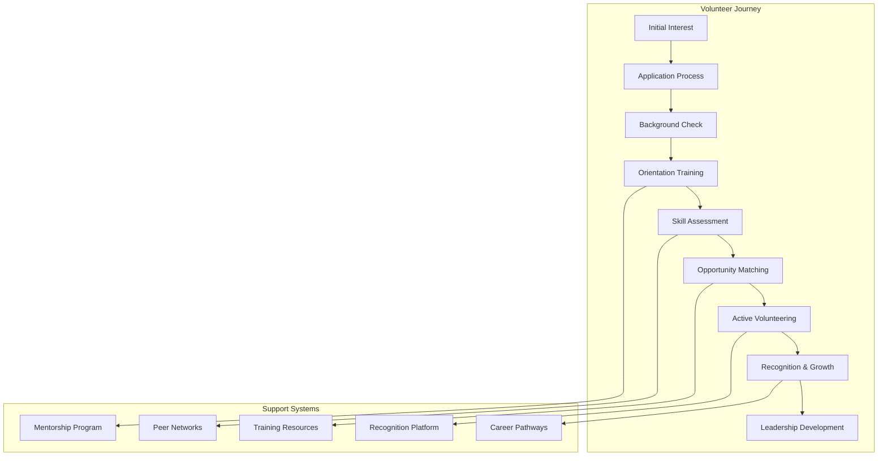
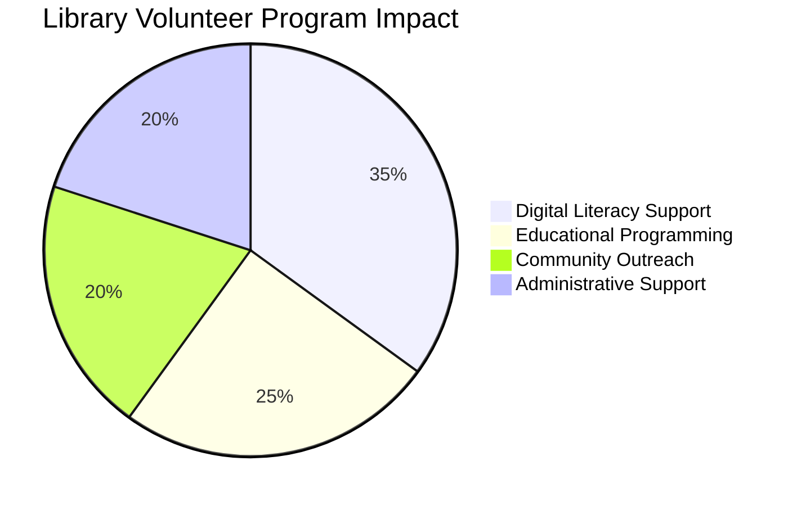
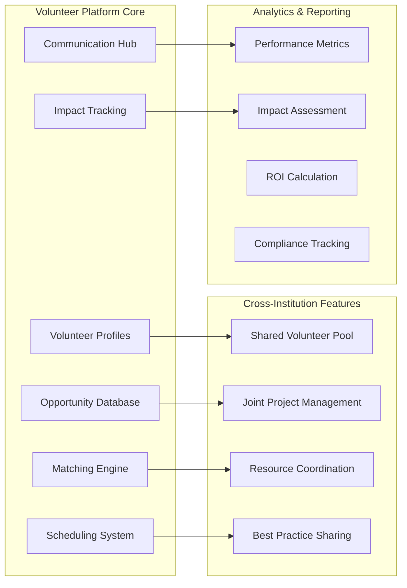
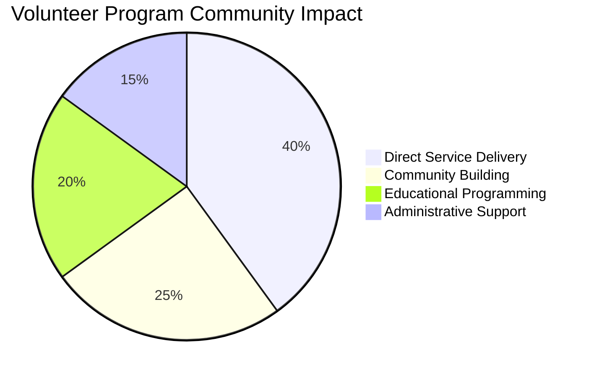

# Volunteer Coordination Systems

## Platform Overview

FediFlow's **Volunteer Coordination Systems** revolutionize how community institutions manage, coordinate, and leverage volunteer networks through federated volunteer management, cross-institutional collaboration, and intelligent matching algorithms.

:::success Community Power
Effective volunteer coordination can increase community impact by **200-400%** while reducing operational costs by **25-40%** through optimized volunteer deployment and cross-institutional collaboration.
:::

## 🤝 Comprehensive Volunteer Management Framework

### Volunteer Lifecycle Management

#### Recruitment & Onboarding
- **Multi-Channel Recruitment**: Social media, website integration, community partnerships
- **Skills-Based Matching**: AI-powered matching of volunteers to opportunities
- **Streamlined Onboarding**: Digital applications, background checks, training modules
- **Orientation Programs**: Standardized training across community institutions

#### Engagement & Retention

#### Performance & Recognition
- **Impact Tracking**: Quantify volunteer contributions and community impact
- **Recognition Systems**: Awards, certificates, social recognition, appreciation events
- **Skill Development**: Training opportunities and professional development
- **Leadership Pathways**: Advancement opportunities within volunteer organizations

### Cross-Institutional Volunteer Sharing

#### Federated Volunteer Network
- **Shared Volunteer Pool**: Volunteers available across multiple community institutions
- **Flexible Assignments**: Volunteers work with different organizations based on need
- **Skill Specialization**: Volunteers deployed where their expertise is most valuable
- **Emergency Response**: Rapid volunteer mobilization for community crises

#### Collaborative Volunteer Programs
- **Joint Projects**: Large-scale community initiatives requiring multiple organizations
- **Seasonal Surge Support**: Share volunteers during peak demand periods
- **Training Consortiums**: Collaborative volunteer training and development
- **Best Practice Sharing**: Exchange successful volunteer management strategies

## 🏛️ Institution-Specific Volunteer Programs

### Public Libraries: Information & Education Volunteers

#### Core Volunteer Roles
- **Digital Literacy Tutors**: Help community members develop computer skills
- **Reading Companions**: Support early literacy and adult reading programs
- **Research Assistants**: Help patrons with complex information needs
- **Program Facilitators**: Lead book clubs, workshops, and educational events

#### Specialized Programs
- **Teen Volunteer Corps**: Youth leadership and community service opportunities
- **Senior Computer Coaches**: Older adults teaching technology to peers
- **Homework Helpers**: Academic support for students after school
- **Community History Volunteers**: Local history research and documentation

#### Impact Metrics

### Community Centers: Activity & Service Coordinators

#### Core Volunteer Roles
- **Sports Coaches**: Youth and adult athletic program leadership
- **Event Coordinators**: Community event planning and execution
- **Maintenance Volunteers**: Facility upkeep and improvement projects
- **Safety Monitors**: Supervision and security for community activities

#### Community Service Programs
- **Neighborhood Cleanup**: Environmental stewardship and beautification
- **Food Security**: Community gardens, food pantries, meal programs
- **Senior Services**: Transportation, companionship, home assistance
- **Youth Mentorship**: After-school programs and leadership development

#### Seasonal Programs
- **Summer Camps**: Counselors and activity leaders for youth programs
- **Holiday Events**: Festival coordination and community celebrations
- **Emergency Response**: Disaster preparedness and response volunteers
- **Health & Wellness**: Fitness instructors and health education volunteers

### Religious Organizations: Faith-Based Service Networks

#### Core Volunteer Roles
- **Worship Support**: Music, ushering, technical assistance, hospitality
- **Religious Education**: Sunday school, adult education, study group leaders
- **Pastoral Care**: Visitation, counseling support, spiritual companionship
- **Administrative Support**: Office assistance, communications, database management

#### Community Outreach Programs
- **Social Justice Advocacy**: Community organizing and policy advocacy
- **Humanitarian Aid**: Disaster relief, refugee assistance, poverty alleviation
- **Interfaith Collaboration**: Cross-denominational community service projects
- **Mission Work**: Local and international service opportunities

#### Special Ministries
- **Youth Programs**: Confirmation classes, youth groups, summer missions
- **Senior Ministries**: Elder care, transportation, friendly visitor programs
- **Family Support**: Childcare, parenting classes, marriage support
- **Healing Ministries**: Support groups, addiction recovery, grief counseling

### Museums: Cultural & Educational Ambassadors

#### Core Volunteer Roles
- **Docents**: Tour guides and educational program facilitators
- **Research Volunteers**: Archives assistance, collection documentation
- **Event Support**: Gallery openings, special exhibitions, fundraising events
- **Technical Assistance**: Digital archiving, website support, social media

#### Educational Programs
- **School Program Assistants**: Support for field trips and educational visits
- **Community Workshop Leaders**: Arts, crafts, and cultural skill sharing
- **Oral History Collectors**: Interview and record community stories
- **Cultural Preservation**: Artifact care, conservation assistance

#### Public Engagement
- **Community Advisory**: Local input on exhibitions and programming
- **Marketing Ambassadors**: Community outreach and promotion
- **Fundraising Support**: Grant writing assistance, donor cultivation
- **Digital Content Creation**: Photography, videography, content development

### Nonprofits: Mission-Driven Advocacy & Service

#### Core Volunteer Roles
- **Program Delivery**: Direct service provision to target populations
- **Advocacy & Outreach**: Community organizing and policy advocacy
- **Fundraising Support**: Event planning, donor relations, grant writing
- **Administrative Assistance**: Data entry, communications, office support

#### Specialized Volunteer Programs
- **Board Service**: Governance, strategic planning, oversight responsibilities
- **Professional Pro Bono**: Legal, accounting, marketing, technical expertise
- **Peer Support**: Volunteers with lived experience providing mentorship
- **Research & Evaluation**: Impact assessment and program improvement

#### Campaign & Project Volunteers
- **Awareness Campaigns**: Public education and community engagement
- **Policy Advocacy**: Legislative outreach and grassroots organizing
- **Emergency Response**: Crisis intervention and disaster assistance
- **Capacity Building**: Training and organizational development support

## 🔧 Technology Platform Features

### Volunteer Management System

### Smart Volunteer Matching
- **Skills & Interest Alignment**: Match volunteers to opportunities based on abilities and preferences
- **Availability Optimization**: Schedule volunteers when they're most needed and available
- **Experience Matching**: Pair experienced volunteers with newcomers for mentorship
- **Impact Maximization**: Deploy volunteers where they can make the greatest difference

### Communication & Coordination Tools
- **Multi-Channel Messaging**: Email, SMS, push notifications, in-app messaging
- **Event Coordination**: Calendar integration, RSVP systems, attendance tracking
- **Resource Sharing**: Equipment, materials, and expertise exchange
- **Emergency Communications**: Rapid volunteer mobilization for urgent needs

### Training & Development Platform
- **Online Learning Modules**: Self-paced training on volunteer skills and responsibilities
- **Certification Programs**: Standardized credentials for volunteer specializations
- **Mentorship Networks**: Peer-to-peer learning and support systems
- **Professional Development**: Career advancement through volunteer experience

## 📊 Impact Measurement & Analytics

### Volunteer Engagement Metrics

| Metric Category | Key Performance Indicators | Target Benchmarks |
|---|---|---|
| **Recruitment** | New volunteers per month, source effectiveness | 15-25 new volunteers/month |
| **Retention** | Volunteer return rate, average tenure | 70%+ annual retention |
| **Engagement** | Hours contributed, projects completed | 10+ hours/volunteer/month |
| **Satisfaction** | Volunteer satisfaction scores, feedback ratings | 4.5+ out of 5.0 rating |
| **Impact** | Community outcomes, service delivery metrics | 20%+ annual improvement |

### Community Impact Assessment

### Economic Value Analysis
- **Volunteer Time Value**: Calculate economic value of volunteer contributions
- **Cost Savings**: Reduced operational costs through volunteer support
- **Revenue Generation**: Volunteer-driven fundraising and program revenue
- **ROI Calculation**: Return on investment for volunteer program infrastructure

## 🚀 Implementation Strategy

### Phase 1: Foundation Building (Months 1-6)
1. **Platform Development**: Core volunteer management system deployment
2. **Pilot Recruitment**: Initial volunteer cohort across partner institutions
3. **Training Programs**: Develop standardized volunteer training curricula
4. **Policy Framework**: Establish volunteer management policies and procedures

### Phase 2: Network Expansion (Months 7-12)
1. **Cross-Institution Integration**: Enable volunteer sharing between organizations
2. **Advanced Features**: Implement smart matching and analytics capabilities
3. **Mobile Applications**: Launch volunteer-friendly mobile interfaces
4. **Quality Assurance**: Establish performance monitoring and improvement systems

### Phase 3: Optimization & Scaling (Months 13-18)
1. **AI Enhancement**: Deploy machine learning for volunteer optimization
2. **Regional Integration**: Connect volunteer networks across broader geographic areas
3. **Corporate Partnerships**: Develop employee volunteer programs with local businesses
4. **Impact Amplification**: Scale successful volunteer programs across network

## 🔐 Safety & Compliance Framework

### Background Check & Screening
- **Standardized Screening**: Consistent background check procedures across institutions
- **Risk Assessment**: Appropriate screening levels based on volunteer roles
- **Ongoing Monitoring**: Periodic re-screening for long-term volunteers
- **Confidentiality Protection**: Secure handling of sensitive volunteer information

### Insurance & Liability
- **Volunteer Insurance**: Comprehensive coverage for volunteer activities
- **Risk Management**: Safety protocols and incident prevention
- **Legal Compliance**: Adherence to employment law and volunteer regulations
- **Documentation Standards**: Proper record-keeping for legal and audit purposes

### Data Privacy & Security
- **GDPR/CCPA Compliance**: Full data protection for volunteer information
- **Secure Communications**: Encrypted messaging and data transmission
- **Access Controls**: Role-based permissions for volunteer data access
- **Retention Policies**: Appropriate data retention and deletion procedures

## 💰 Economic Model & Sustainability

### Cost-Benefit Analysis

| Investment Category | Annual Cost | Volunteer Value Generated | Net ROI |
|---|---|---|---|
| **Platform Infrastructure** | $25K-50K | $150K-400K volunteer time | 300-700% |
| **Staff Coordination** | $40K-80K | $200K-600K service delivery | 250-650% |
| **Training & Development** | $15K-30K | $100K-300K skill enhancement | 350-900% |
| **Technology & Tools** | $10K-25K | $75K-200K efficiency gains | 300-700% |
| **Total Investment** | **$90K-185K** | **$525K-1.5M** | **280-710%** |

### Revenue Enhancement Opportunities
- **Grant Funding**: Volunteer programs increase grant competitiveness
- **Corporate Partnerships**: Employee volunteer programs generate revenue
- **Service Fees**: Fee-for-service volunteer coordination for other organizations
- **Training Revenue**: Sell volunteer training programs to other communities

### Sustainability Framework
- **Multi-Institution Cost Sharing**: Distribute platform costs across partner organizations
- **Government Support**: Municipal funding for community volunteer infrastructure
- **Foundation Grants**: Funding from civic engagement and community development foundations
- **Corporate Sponsorship**: Local business support for volunteer recognition and events

---

:::tip Community Engagement
Volunteer coordination systems are the backbone of community engagement, turning individual passion into collective impact. Continue exploring **[Cultural Preservation Tools](./cultural-preservation-tools.md)** to see how volunteers help preserve community heritage, or learn about **[Interfaith Collaboration](./interfaith-collaboration.md)** for multi-faith community service initiatives.
:::
