# Integration Summary: Complete Member Content Economy & Business Institution Integration

## Comprehensive Integration Overview

The member-driven content economy and business institution licensing have been extensively integrated into FediFlow without removing any existing features or revenue streams. This document summarizes all integration points and enhancements across academic, community, and business institutions.

### ✅ **Executive Summary Enhancements**

#### **Enhanced Revenue Architecture**
- **Expanded from 3 to 15+ revenue streams across all institution types**
- **Total annual value increased from $350K-$2.6M to $2.1M-$12.5M per institution**
- **Added business institution revenue streams worth $500K-$3M annually**
- **Integrated cross-platform content monetization across all 11+ federated platforms**
- **Business networking and commerce integration generating $300K-$2M annually**

#### **New Revenue Streams Added**
1. **Cross-Platform Content Monetization**: $300K-$1.5M annually
2. **Business Networking & Commerce**: $400K-$2M annually
3. **Professional Service Marketplace**: $200K-$1M annually
4. **Industry Collaboration Hub**: $150K-$800K annually
5. **Economic Development Facilitation**: $100K-$600K annually
6. **B2B Partnership Revenue**: $100K-$500K annually
7. **Trade Association Services**: $75K-$400K annually
8. **Professional Certification Programs**: $50K-$300K annually

#### **Enhanced Performance Metrics**
- **Cross-Sector Collaboration**: 400% increase in multi-institutional partnerships
- **Business-Academic Partnerships**: 600% growth in industry-education collaboration
- **Economic Development Impact**: $5M+ in facilitated business development annually
- **Professional Network Growth**: 350% increase in cross-institutional professional connections
- **B2B Commerce Integration**: $2M+ in facilitated business transactions

### ✅ **Core Implementation Strategy Enhancements**

#### **Lifecycle-Aware Identity Framework**
- Added **Creator Profile Development** for automatic creator tools and monetization capabilities
- Integrated **Multi-Platform Creator Presence** with unified analytics across all platforms
- Enhanced **Content Legacy Preservation** for student-to-alumni content evolution

#### **Community Institution Integration**
- Added **Integrated Content Creation Tools** for local organizations
- Enhanced **Revenue Sharing Integration** for community partners
- Created **Local Business Integration Hub** with business-member content partnerships
- Developed **Community Commerce Platform** for commission-based promotions

#### **Business Institution Integration**
- Added **Economic Development Facilitation** tools for EDOs and anchor institutions
- Integrated **Industry Collaboration Platforms** for trade and professional associations
- Created **B2B Marketplace Features** enabling commerce within federated networks
- Developed **Professional Certification Systems** for skill verification and advancement
- Enhanced **Chamber of Commerce Tools** for local business networking and advocacy
- Implemented **Cross-Sector Partnership Hub** connecting business, academic, and community institutions

#### **Cross-Domain Role Activation**
- Enhanced with **Content Creator Skill Mapping** across all platforms
- Added **Revenue-Generating Project Collaboration** opportunities
- Integrated **Professional Creator Development** pathways

### ✅ **Platform-Specific Integration**

#### **All 11+ Federated Platforms Integrated**
Each platform now has specific content creation and monetization strategies:

| Platform | Content Focus | Revenue Model | Monthly Potential |
|---|---|---|---|
| **Mastodon** | Networking, updates, discussions | Sponsored posts, premium features | $50-300/month |
| **PeerTube** | Educational videos, tutorials | Course sales, sponsorships | $300-1500/month |
| **Pixelfed** | Visual storytelling, photography | Print sales, licensing, contests | $100-600/month |
| **WriteFreely** | Long-form content, research | Subscription content, consultation | $200-1200/month |
| **Lemmy** | Forum discussions, Q&A | Premium support, moderation | $100-500/month |
| **Funkwhale** | Audio content, podcasts | Sponsorships, premium content | $150-800/month |
| **Mobilizon** | Event organization, planning | Event revenue sharing | $200-1000/month |
| **BookWyrm** | Reading groups, literature | Affiliate sales, book clubs | $50-250/month |
| **Owncast** | Live streaming, real-time events | Donations, premium access | $200-1200/month |
| **ForgeFed** | Code collaboration, tech projects | Consulting, development services | $300-1500/month |
| **Castopod** | Professional podcasting | Sponsorships, subscriptions | $400-2000/month |

### ✅ **New Documentation Components**

#### **Created New Files**
1. **`member-content-economy.md`** - Comprehensive architecture and implementation
2. **`creator-implementation-guide.md`** - Step-by-step creator onboarding and optimization
3. **Updated `sidebars.ts`** - Added "Core Platform Features" section

#### **Enhanced Existing Files**
1. **`executive-summary.md`** - Integrated all revenue streams and performance metrics
2. **Updated revenue architecture diagrams** - Comprehensive visual representation
3. **Enhanced implementation strategies** - Complete member economy integration

### ✅ **Technical Integration Points**

#### **AI-Powered Content Optimization**
```typescript
interface ContentOptimization {
  contentAnalysis: {
    qualityScore: number;
    engagementPrediction: number;
    monetizationPotential: number;
    platformOptimization: string[];
    crossPlatformSynergy: number;
  };
  
  revenueOptimization: {
    suggestedPricing: number;
    sponsorshipOpportunities: Sponsor[];
    localBusinessMatches: LocalBusiness[];
    seasonalTrends: TrendData;
  };
  
  communityImpact: {
    institutionalAlignment: number;
    localCommunityValue: number;
    educationalValue: number;
    economicMultiplier: number;
  };
}
```

#### **Cross-Platform Content Synchronization**
- **Unified content creation workflow** across all platforms
- **AI-powered platform-specific optimization**
- **Automated cross-platform promotion and discovery**
- **Revenue optimization across multiple monetization channels**

### ✅ **Local Business & Community Integration**

#### **Community Commerce Platform**
- **Member-Business Content Partnerships**: Authentic promotion with revenue sharing
- **Local Event Monetization**: Live streaming and documentation revenue
- **Professional Service Marketplace**: Internal community service economy
- **Regional Economic Development**: Measurable local economic impact

#### **Revenue Sharing Models**
- **Member Creator**: 60-80% of direct monetization
- **Institution**: 15-25% for platform and support
- **Platform**: 5-15% for technology and features  
- **Community**: 5-10% for local business and civic projects

### ✅ **Creator Development Ecosystem**

#### **Creator Advancement Pathways**
1. **Novice Creator**: $0-100/month potential, basic tools
2. **Community Contributor**: $100-500/month potential, enhanced features
3. **Featured Creator**: $500-2000/month potential, premium promotion
4. **Ambassador Creator**: $2000-5000/month potential, leadership roles
5. **Legacy Creator**: $5000+/month potential, institutional partnership

#### **Support Services**
- **Creator Training Programs**: Skills development and platform optimization
- **Professional Tools**: Analytics, editing, marketing resources
- **Mentorship Networks**: Peer learning and expert guidance
- **Resource Access**: Equipment, software, and funding opportunities

### ✅ **Analytics & Performance Tracking**

#### **Comprehensive Creator Dashboard**
- **Multi-platform performance metrics** across all federated platforms
- **Revenue optimization recommendations** and earning projections
- **Community impact measurement** and local economic tracking
- **Cross-platform content amplification** and discovery analytics

#### **Success Metrics Integration**
- **Content Performance**: Engagement rates, quality scores, reach amplification
- **Revenue Generation**: Multiple income streams, consistent growth tracking
- **Community Impact**: Local partnerships, educational value, civic engagement
- **Platform Mastery**: Cross-platform expertise and optimization

### ✅ **Implementation Timeline**

#### **Phase 1: Foundation (Months 1-6)**
- Multi-platform creator tools and monetization systems
- AI content intelligence and optimization
- Creator onboarding and training programs
- **Target**: 500+ creators, $50K+ monthly revenue

#### **Phase 2: Growth (Months 7-12)**
- Local business partnership integration
- Advanced creator development programs
- Cross-platform content syndication
- **Target**: 2,000+ creators, $200K+ monthly revenue

#### **Phase 3: Scale (Months 13-18)**
- Regional expansion and collaboration networks
- Professional creator advancement pathways
- Advanced analytics and optimization
- **Target**: $500K+ monthly revenue, industry recognition

### ✅ **Key Differentiators Maintained**

#### **All Existing Features Preserved**
- ✅ **Institutional Licensing** - Enhanced with creator integration
- ✅ **Corporate Sponsorships** - Expanded to include creator partnerships
- ✅ **Event Monetization** - Enhanced with member content creation
- ✅ **API Marketplace** - Maintained with creator tool integrations
- ✅ **Data Insights** - Enhanced with creator analytics
- ✅ **Community Credits** - Integrated with creator reward systems

#### **Enhanced Value Propositions**
- **Sovereign Data & Analytics** - Now includes creator performance data
- **Hyper-Targeted Engagement** - Amplified through member-generated content
- **Values-Aligned Governance** - Extended to creator community standards
- **Built-In Revenue Engine** - Significantly expanded with member economy
- **Platform-Risk Immunity** - Strengthened through diversified creator content

## Visual Integration Overview

### **Complete System Architecture**

```mermaid
graph TB
    subgraph "Member Creator Ecosystem"
        STUDENTS[👥 Students]
        FACULTY[👨‍🏫 Faculty]
        ALUMNI[🎓 Alumni]
        STAFF[👔 Staff]
        COMMUNITY[🏘️ Community]
    end
    
    subgraph "All 11+ Federated Platforms"
        MASTODON[🐘 Mastodon]
        PEERTUBE[📺 PeerTube]
        PIXELFED[📸 Pixelfed]
        LEMMY[🗣️ Lemmy]
        WRITEFREELY[✍️ WriteFreely]
        FUNKWHALE[🎵 Funkwhale]
        MOBILIZON[📅 Mobilizon]
        BOOKWYRM[📚 BookWyrm]
        OWNCAST[📡 Owncast]
        FORGEFED[⚙️ ForgeFed]
        CASTOPOD[🎙️ Castopod]
    end
    
    subgraph "Revenue Integration Engine"
        CONTENT_MONETIZATION[💰 Content Monetization]
        LOCAL_BUSINESS[🏪 Local Business Integration]
        PEER_SERVICES[🤝 Peer Services]
        CREATOR_SPONSORSHIPS[✨ Creator Sponsorships]
        EDUCATIONAL_LICENSING[📚 Educational Content]
        PROFESSIONAL_SERVICES[💼 Professional Services]
    end
    
    subgraph "Institutional Benefits"
        ENHANCED_ENGAGEMENT[📈 Enhanced Engagement]
        REVENUE_GROWTH[💰 Revenue Growth]
        COMMUNITY_IMPACT[🌍 Community Impact]
        BRAND_AMPLIFICATION[📢 Brand Amplification]
    end
    
    STUDENTS --> MASTODON
    STUDENTS --> PIXELFED
    STUDENTS --> OWNCAST
    FACULTY --> PEERTUBE
    FACULTY --> WRITEFREELY
    FACULTY --> CASTOPOD
    ALUMNI --> WRITEFREELY
    ALUMNI --> FUNKWHALE
    STAFF --> MOBILIZON
    STAFF --> LEMMY
    COMMUNITY --> FORGEFED
    COMMUNITY --> BOOKWYRM
    
    MASTODON --> CONTENT_MONETIZATION
    PEERTUBE --> LOCAL_BUSINESS
    PIXELFED --> PEER_SERVICES
    LEMMY --> CREATOR_SPONSORSHIPS
    WRITEFREELY --> EDUCATIONAL_LICENSING
    FUNKWHALE --> PROFESSIONAL_SERVICES
    
    CONTENT_MONETIZATION --> ENHANCED_ENGAGEMENT
    LOCAL_BUSINESS --> REVENUE_GROWTH
    PEER_SERVICES --> COMMUNITY_IMPACT
    CREATOR_SPONSORSHIPS --> BRAND_AMPLIFICATION
```



### **Revenue Stream Integration Map**

```mermaid
sankey-beta
    "Institutional Licensing" "Academic Revenue",75000
    "Corporate Sponsorships" "Enterprise Revenue",250000
    "Event Monetization" "Academic Revenue",100000
    "API Marketplace" "Enterprise Revenue",200000
    "Data Insights" "Enterprise Revenue",50000
    
    "Member Content Creation" "Member Revenue",200000
    "Local Business Partnerships" "Local Economy",100000
    "Peer-to-Peer Services" "Member Revenue",50000
    "Creator Sponsorships" "Member Revenue",150000
    "Cross-Platform Content" "Academic Revenue",300000
    "Community Commerce" "Local Economy",200000
    "Educational Content" "Academic Revenue",150000
    "Professional Services" "Member Revenue",100000
    "Event Content" "Community Revenue",75000
    "Affiliate Marketing" "Local Economy",50000
    
    "Academic Revenue" "Total Institutional",625000
    "Enterprise Revenue" "Total Institutional",500000
    "Member Revenue" "Total Member",500000
    "Community Revenue" "Total Community",75000
    "Local Economy" "Total Local",350000
```
