```mermaid
flowchart TD
    subgraph "Content Creator Ecosystem"
        STUDENTS[👥 Students<br/>Campus Life, Projects, Learning]
        FACULTY[👨‍🏫 Faculty<br/>Research, Teaching, Expertise]
        ALUMNI[🎓 Alumni<br/>Career Stories, Mentorship, Giving]
        STAFF[👔 Staff<br/>Behind-Scenes, Support, Culture]
        COMMUNITY[🏘️ Community<br/>Local Stories, Partnerships, Events]
    end
    
    subgraph "All Federated Content Platforms"
        MASTODON[🐘 Mastodon<br/>Micro-content, Updates, Discussions]
        PEERTUBE[📺 PeerTube<br/>Educational Content, Events, Stories]
        PIXELFED[📸 Pixelfed<br/>Visual Storytelling, Campus Life]
        LEMMY[🗣️ Lemmy<br/>Knowledge Base, Q&A, Discussions]
        WRITEFREELY[✍️ WriteFreely<br/>Long-form, Research, Blogs]
        FUNKWHALE[🎵 Funkwhale<br/>Podcasts, Audio, Lectures]
        MOBILIZON[📅 Mobilizon<br/>Event Planning, Meetups]
        BOOKWYRM[📚 BookWyrm<br/>Reading Groups, Literature]
        OWNCAST[📡 Owncast<br/>Live Streaming, Real-time Events]
        FORGEFED[⚙️ ForgeFed<br/>Code Projects, Tech Collaboration]
        CASTOPOD[🎙️ Castopod<br/>Professional Podcasting]
    end
    
    subgraph "Value Creation Engine"
        CONTENT_QUALITY[⭐ Content Quality Scoring<br/>AI + Community Curation]
        REVENUE_SHARE[💰 Revenue Sharing<br/>Member Monetization]
        INSTITUTIONAL_VALUE[🏛️ Institutional Value<br/>Brand, Engagement, Mission]
        COMMUNITY_GROWTH[📈 Community Growth<br/>Organic Content, Network Effects]
    end
    
    STUDENTS --> MASTODON
    STUDENTS --> PIXELFED
    STUDENTS --> OWNCAST
    FACULTY --> PEERTUBE
    FACULTY --> WRITEFREELY
    FACULTY --> CASTOPOD
    ALUMNI --> WRITEFREELY
    ALUMNI --> FUNKWHALE
    ALUMNI --> MOBILIZON
    STAFF --> PIXELFED
    STAFF --> MASTODON
    STAFF --> MOBILIZON
    COMMUNITY --> LEMMY
    COMMUNITY --> BOOKWYRM
    COMMUNITY --> FORGEFED
    
    MASTODON --> CONTENT_QUALITY
    PEERTUBE --> REVENUE_SHARE
    PIXELFED --> INSTITUTIONAL_VALUE
    LEMMY --> COMMUNITY_GROWTH
    WRITEFREELY --> CONTENT_QUALITY
    FUNKWHALE --> REVENUE_SHARE
    MOBILIZON --> INSTITUTIONAL_VALUE
    BOOKWYRM --> COMMUNITY_GROWTH
    OWNCAST --> REVENUE_SHARE
    FORGEFED --> CONTENT_QUALITY
    CASTOPOD --> REVENUE_SHARE
    
    CONTENT_QUALITY --> SUCCESS[Sustainable Content Ecosystem]
    REVENUE_SHARE --> SUCCESS
    INSTITUTIONAL_VALUE --> SUCCESS
    COMMUNITY_GROWTH --> SUCCESS
```

# Member-Driven Content Economy: Complete Architecture

## Vision: Every Community Member as a Content Creator & Revenue Partner

Transform your federated platforms from institutional broadcasting channels into **dynamic, member-generated content ecosystems** where students, faculty, alumni, staff, and community members actively create, curate, and monetize content while strengthening institutional mission and community engagement across all 11+ federated platforms.

## Strategic Architecture: Complete Ecosystem Integration

```mermaid
flowchart TD
    subgraph "Content Creator Ecosystem by Role"
        STUDENTS[👥 Students<br/>Campus Life, Projects, Learning<br/>Live Streaming, Study Groups]
        FACULTY[👨‍🏫 Faculty<br/>Research, Teaching, Expertise<br/>Professional Podcasts, Lectures]
        ALUMNI[🎓 Alumni<br/>Career Stories, Mentorship<br/>Professional Networking]
        STAFF[👔 Staff<br/>Behind-the-Scenes, Support, Culture<br/>Institutional Knowledge]
        COMMUNITY[🏘️ Community<br/>Local Stories, Partnerships<br/>Civic Engagement]
    end
    
    subgraph "All 11+ Federated Content Platforms"
        ROW1[🐘 Mastodon | 📺 PeerTube | 📸 Pixelfed | 🗣️ Lemmy]
        ROW2[✍️ WriteFreely | 🎵 Funkwhale | 📅 Mobilizon | 📚 BookWyrm]
        ROW3[📡 Owncast | ⚙️ ForgeFed | 🎙️ Castopod]
    end
    
    subgraph "Value Creation & Monetization Engine"
        CONTENT_AI[🤖 AI Content Intelligence<br/>Quality Scoring, Optimization]
        REVENUE_ENGINE[💰 Multi-Stream Revenue<br/>Content, Sponsorships, Services]
        LOCAL_ECONOMY[🏪 Local Business Integration<br/>Community Commerce, Partnerships]
        ANALYTICS[📊 Creator Analytics<br/>Performance, Earnings, Growth]
    end
    
    subgraph "Revenue Distribution Model"
        MEMBER_EARNINGS[👤 Member Creators: 60-80%<br/>Direct content monetization]
        INSTITUTION_SHARE[🏛️ Institution: 15-25%<br/>Platform, infrastructure, support]
        PLATFORM_FEE[⚙️ Platform: 5-15%<br/>Technology, features, scaling]
        LOCAL_IMPACT[🌍 Community: 5-10%<br/>Local business, civic projects]
    end
    
    STUDENTS --> ROW1
    FACULTY --> ROW1
    ALUMNI --> ROW2
    STAFF --> ROW2
    COMMUNITY --> ROW3
    
    ROW1 --> CONTENT_AI
    ROW2 --> REVENUE_ENGINE
    ROW3 --> LOCAL_ECONOMY
    
    CONTENT_AI --> ANALYTICS
    REVENUE_ENGINE --> ANALYTICS
    LOCAL_ECONOMY --> ANALYTICS
    
    ANALYTICS --> MEMBER_EARNINGS
    ANALYTICS --> INSTITUTION_SHARE
    ANALYTICS --> PLATFORM_FEE
    ANALYTICS --> LOCAL_IMPACT
```

---



---

## Platform-Specific Content Creation & Monetization

### **Multi-Platform Creator Journey Visualization**


### **Content Distribution Flow Across All Platforms**

```mermaid
graph TD
    subgraph "Content Creation Hub"
        CREATOR[👤 Member Creator]
        IDEA[💡 Content Idea]
        PLAN[📋 Content Planning]
    end
    
    subgraph "Platform Distribution"
        MASTODON[🐘 Mastodon<br/>Quick updates, engagement]
        PEERTUBE[📺 PeerTube<br/>Educational videos]
        PIXELFED[📸 Pixelfed<br/>Visual storytelling]
        LEMMY[🗣️ Lemmy<br/>Deep discussions]
        WRITEFREELY[✍️ WriteFreely<br/>Long-form content]
        FUNKWHALE[🎵 Funkwhale<br/>Audio content]
        MOBILIZON[📅 Mobilizon<br/>Event coordination]
        BOOKWYRM[📚 BookWyrm<br/>Reading community]
        OWNCAST[📡 Owncast<br/>Live streaming]
        FORGEFED[⚙️ ForgeFed<br/>Code collaboration]
        CASTOPOD[🎙️ Castopod<br/>Professional podcasts]
    end
    
    subgraph "Revenue Streams"
        DIRECT[💰 Direct Sales]
        SPONSOR[🤝 Sponsorships]
        LOCAL[🏪 Local Business]
        SERVICES[🛠️ Peer Services]
    end
    
    subgraph "Community Impact"
        EDUCATION[📚 Educational Value]
        ECONOMIC[💼 Economic Development]
        SOCIAL[🤝 Social Cohesion]
        CULTURAL[🎭 Cultural Preservation]
    end
    
    CREATOR --> IDEA
    IDEA --> PLAN
    PLAN --> MASTODON
    PLAN --> PEERTUBE
    PLAN --> PIXELFED
    PLAN --> LEMMY
    PLAN --> WRITEFREELY
    PLAN --> FUNKWHALE
    PLAN --> MOBILIZON
    PLAN --> BOOKWYRM
    PLAN --> OWNCAST
    PLAN --> FORGEFED
    PLAN --> CASTOPOD
    
    MASTODON --> DIRECT
    PEERTUBE --> SPONSOR
    PIXELFED --> LOCAL
    LEMMY --> SERVICES
    WRITEFREELY --> DIRECT
    FUNKWHALE --> SPONSOR
    MOBILIZON --> LOCAL
    BOOKWYRM --> SERVICES
    OWNCAST --> DIRECT
    FORGEFED --> SERVICES
    CASTOPOD --> SPONSOR
    
    DIRECT --> EDUCATION
    SPONSOR --> ECONOMIC
    LOCAL --> SOCIAL
    SERVICES --> CULTURAL
```



## Core Implementation Framework

### 1. **Member Content Creator Program**

#### **Role-Based Content Creation Pathways Across All Platforms**

**Student Creators - Multi-Platform Engagement**:
- **Campus Life Documentation** (Mastodon + Pixelfed): Daily life, events, traditions, behind-the-scenes content
- **Live Study Sessions** (Owncast): Real-time study groups, exam prep, collaborative learning
- **Academic Project Showcases** (PeerTube + ForgeFed): Capstone presentations, code projects, creative works
- **Peer Learning Content** (Lemmy + WriteFreely): Study guides, tutorial videos, subject-specific discussions
- **Student Events** (Mobilizon): Campus activities, study groups, social gatherings
- **Academic Reading Groups** (BookWyrm): Course-related literature, peer recommendations
- **Student Podcasts** (Funkwhale + Castopod): Campus news, student perspectives, academic discussions

**Faculty Content Creators - Research & Teaching Excellence**:
- **Research Communication** (WriteFreely + Mastodon): Accessible explanations of complex research, methodology tutorials
- **Educational Video Content** (PeerTube): Lecture series, research presentations, methodology tutorials
- **Live Academic Events** (Owncast): Conference presentations, guest lectures, Q&A sessions
- **Teaching Innovation** (Lemmy + Pixelfed): Pedagogical insights, classroom techniques, educational technology
- **Professional Audio Content** (Castopod): Research podcasts, academic commentary, expert interviews
- **Academic Collaboration** (ForgeFed): Open research projects, data sharing, collaborative tools
- **Reading Recommendations** (BookWyrm): Academic literature, course materials, research resources
- **Conference Organization** (Mobilizon): Academic events, symposiums, research gatherings

**Alumni Creator Network - Professional & Legacy Content**:
- **Career Success Stories** (WriteFreely + PeerTube): Professional journeys, industry insights, mentorship content
- **Professional Networking** (Mastodon + Mobilizon): Industry updates, networking events, career advice
- **Mentorship Programming** (Funkwhale + Owncast): Advice podcasts, live mentoring sessions, career guidance
- **Visual Professional Stories** (Pixelfed): Career milestones, workplace insights, success celebrations
- **Industry Discussion Forums** (Lemmy): Professional insights, industry trends, career development
- **Professional Development** (BookWyrm): Industry reading recommendations, skill development resources
- **Alumni Events** (Mobilizon): Reunions, networking meetups, professional development workshops
- **Legacy Projects** (ForgeFed): Alumni-led initiatives, community projects, institutional contributions

**Staff Content Creators - Institutional Culture & Support**:
- **Behind-the-Scenes Insights** (Pixelfed + Mastodon): Operations stories, campus culture, support services
- **Professional Development** (WriteFreely + Castopod): Administrative insights, best practices, professional growth
- **Community Building Events** (Mobilizon + Owncast): Staff gatherings, professional development, team building
- **Institutional Knowledge** (Lemmy + BookWyrm): Policy discussions, resource sharing, professional literature
- **Support Service Promotion** (PeerTube): Service tutorials, resource guides, student support content
- **Technical Projects** (ForgeFed): Internal tools, process improvements, technical innovation
- **Audio Content Creation** (Funkwhale): Staff podcasts, institutional updates, behind-the-scenes audio

**Community Content Creators - Local Impact & Engagement**:
- **Local Community Stories** (WriteFreely + Mastodon): Community impact, local partnerships, civic engagement
- **Community Events** (Mobilizon + Owncast): Local gatherings, volunteer opportunities, civic meetings
- **Visual Community Documentation** (Pixelfed): Community projects, local businesses, cultural events
- **Community Forums** (Lemmy): Local issues, resource sharing, mutual aid coordination
- **Local Podcasting** (Funkwhale + Castopod): Community voices, local news, civic discussions
- **Community Reading** (BookWyrm): Local literature, community book clubs, cultural preservation
- **Collaborative Projects** (ForgeFed): Open-source community tools, local tech initiatives
- **Live Community Events** (Owncast): Town halls, community forums, local government meetings

#### **Platform-Specific Content Creation Incentives**

| Platform | Content Type | Creator Incentives | Revenue Model | Community Value |
|---|---|---|---|---|
| **Mastodon** | Micro-content, updates, discussions | Engagement bonuses, featured posts | Sponsored content, premium features | Real-time community building |
| **PeerTube** | Educational videos, presentations | Video monetization, course sales | Subscription content, sponsorships | Knowledge sharing, education |
| **Pixelfed** | Visual storytelling, photography | Photo contests, gallery features | Print sales, licensing, sponsorships | Visual community identity |
| **Lemmy** | Forum discussions, Q&A | Expert recognition, moderation roles | Premium support, consultation | Knowledge base development |
| **WriteFreely** | Long-form content, research | Publication opportunities, readership | Subscription content, article sales | Thought leadership platform |
| **Funkwhale** | Audio content, podcasts | Listener analytics, premium features | Podcast sponsorships, premium audio | Audio community engagement |
| **Mobilizon** | Event organization, planning | Event promotion, ticketing tools | Event revenue sharing, sponsorships | Community coordination |
| **BookWyrm** | Reading recommendations, reviews | Literary recognition, curator roles | Book affiliate sales, reading groups | Intellectual community building |
| **Owncast** | Live streaming, real-time events | Live audience analytics, donations | Paid streams, virtual events | Real-time engagement |
| **ForgeFed** | Code collaboration, tech projects | Technical recognition, project leads | Contract opportunities, consulting | Innovation and development |
| **Castopod** | Professional podcasting | Advanced analytics, monetization | Premium subscriptions, sponsorships | Professional audio content |

### 2. **Cross-Platform Content Synchronization & Discovery**

#### **Unified Content Strategy Across All Platforms**

**Content Creation Workflow**:

```mermaid
flowchart LR
    subgraph "Content Creation Flow"
        CREATE[📝 Create Content<br/>Any Platform]
        METADATA[🏷️ Add Metadata<br/>Tags, Categories, Audience]
        DISTRIBUTE[🌐 Cross-Platform<br/>Distribution Rules]
        OPTIMIZE[⚡ Platform-Specific<br/>Optimization]
    end
    
    subgraph "Platform Optimization"
        MASTODON_OPT[🐘 Mastodon<br/>Hashtags, Threading]
        PEERTUBE_OPT[📺 PeerTube<br/>Chapters, Playlists]
        PIXELFED_OPT[📸 Pixelfed<br/>Filters, Collections]
        LEMMY_OPT[🗣️ Lemmy<br/>Categories, Pinning]
        WRITEFREELY_OPT[✍️ WriteFreely<br/>Series, Newsletters]
        FUNKWHALE_OPT[🎵 Funkwhale<br/>Playlists, Albums]
        MOBILIZON_OPT[📅 Mobilizon<br/>Categories, RSVP]
        BOOKWYRM_OPT[📚 BookWyrm<br/>Lists, Reviews]
        OWNCAST_OPT[📡 Owncast<br/>Chat, Scheduling]
        FORGEFED_OPT[⚙️ ForgeFed<br/>Issues, Merge Requests]
        CASTOPOD_OPT[🎙️ Castopod<br/>Episodes, Chapters]
    end
    
    CREATE --> METADATA
    METADATA --> DISTRIBUTE
    DISTRIBUTE --> OPTIMIZE
    
    OPTIMIZE --> MASTODON_OPT
    OPTIMIZE --> PEERTUBE_OPT
    OPTIMIZE --> PIXELFED_OPT
    OPTIMIZE --> LEMMY_OPT
    OPTIMIZE --> WRITEFREELY_OPT
    OPTIMIZE --> FUNKWHALE_OPT
    OPTIMIZE --> MOBILIZON_OPT
    OPTIMIZE --> BOOKWYRM_OPT
    OPTIMIZE --> OWNCAST_OPT
    OPTIMIZE --> FORGEFED_OPT
    OPTIMIZE --> CASTOPOD_OPT
```


**Cross-Platform Content Amplification**:
- **Research Papers** (WriteFreely) → **Discussion Threads** (Lemmy) → **Video Summaries** (PeerTube) → **Social Promotion** (Mastodon)
- **Live Events** (Owncast) → **Event Planning** (Mobilizon) → **Photo Documentation** (Pixelfed) → **Follow-up Podcasts** (Castopod)
- **Code Projects** (ForgeFed) → **Tutorial Videos** (PeerTube) → **Community Discussions** (Lemmy) → **Progress Updates** (Mastodon)
- **Book Clubs** (BookWyrm) → **Discussion Forums** (Lemmy) → **Author Interviews** (Funkwhale) → **Reading Events** (Mobilizon)

---

### **Revenue Distribution Model Visualization**


### **Platform-Specific Revenue Potential**


### **Creator Tier Advancement System**


## 3. **Local Community Partnership Architecture**

### **Comprehensive Partnership Ecosystem**

```mermaid
graph TD
    subgraph "Institution Core"
        ACADEMIC[🏛️ Academic Institution<br/>Students, Faculty, Alumni, Staff]
        PLATFORMS[📱 Federated Platforms<br/>11+ Content & Communication Tools]
        RESOURCES[💼 Institutional Resources<br/>Facilities, Expertise, Networks]
    end
    
    subgraph "Local Business Partners"
        RESTAURANTS[🍕 Food & Hospitality<br/>Student discounts, catering, events]
        RETAIL[🛍️ Retail & Services<br/>Bookstores, tech repair, clothing]
        REAL_ESTATE[🏠 Housing & Property<br/>Student housing, event spaces]
        HEALTHCARE[🏥 Health & Wellness<br/>Clinics, fitness, mental health]
        PROFESSIONAL[💼 Professional Services<br/>Legal, accounting, consulting]
        ENTERTAINMENT[🎭 Entertainment & Culture<br/>Theaters, museums, venues]
        TRANSPORT[🚗 Transportation<br/>Car sharing, public transit, delivery]
        TECH[💻 Technology Partners<br/>ISPs, software, hardware vendors]
    end
    
    subgraph "Community Organizations"
        NONPROFITS[🤝 Nonprofits & NGOs<br/>Social services, advocacy, aid]
        RELIGIOUS[⛪ Religious Organizations<br/>Churches, temples, community centers]
        CIVIC[🏛️ Civic Organizations<br/>Government, libraries, museums]
        UNIONS[👷 Labor Organizations<br/>Trade unions, professional associations]
        COOPS[🔄 Cooperatives<br/>Credit unions, housing, food co-ops]
        CULTURAL[🎨 Cultural Organizations<br/>Arts councils, heritage groups]
    end
    
    subgraph "Innovation Ecosystem"
        STARTUPS[🚀 Local Startups<br/>Tech companies, social enterprises]
        INVESTORS[💰 Investment Groups<br/>Angel investors, VC firms, funds]
        INCUBATORS[🏢 Business Incubators<br/>Accelerators, co-working spaces]
        RESEARCH[🔬 Research Partners<br/>Labs, think tanks, institutes]
    end
    
    subgraph "Partnership Integration Platform"
        API_GATEWAY[🔗 Partnership API Gateway<br/>Third-party integrations]
        DATA_EXCHANGE[📊 Data Exchange Hub<br/>Analytics, insights, reporting]
        PAYMENT_SYSTEM[💳 Payment & Revenue System<br/>Multi-party revenue sharing]
        CONTENT_SYNDICATION[📡 Content Syndication<br/>Cross-platform amplification]
        EVENT_COORDINATION[📅 Event Coordination<br/>Collaborative programming]
    end
    
    ACADEMIC --> API_GATEWAY
    PLATFORMS --> DATA_EXCHANGE
    RESOURCES --> PAYMENT_SYSTEM
    
    RESTAURANTS --> API_GATEWAY
    RETAIL --> DATA_EXCHANGE
    REAL_ESTATE --> PAYMENT_SYSTEM
    HEALTHCARE --> CONTENT_SYNDICATION
    PROFESSIONAL --> EVENT_COORDINATION
    ENTERTAINMENT --> API_GATEWAY
    TRANSPORT --> DATA_EXCHANGE
    TECH --> PAYMENT_SYSTEM
    
    NONPROFITS --> CONTENT_SYNDICATION
    RELIGIOUS --> EVENT_COORDINATION
    CIVIC --> API_GATEWAY
    UNIONS --> DATA_EXCHANGE
    COOPS --> PAYMENT_SYSTEM
    CULTURAL --> CONTENT_SYNDICATION
    
    STARTUPS --> API_GATEWAY
    INVESTORS --> PAYMENT_SYSTEM
    INCUBATORS --> EVENT_COORDINATION
    RESEARCH --> DATA_EXCHANGE
```



### **Third-Party Integration Architecture**

```mermaid
flowchart TD
    subgraph "FediFlow Core Platform"
        UNIFIED_IDENTITY[🆔 Unified Identity System<br/>Single sign-on across partners]
        CONTENT_ENGINE[📝 Content Creation Engine<br/>Multi-platform publishing]
        ANALYTICS_CORE[📊 Analytics Core<br/>Performance tracking]
        REVENUE_ENGINE[💰 Revenue Distribution<br/>Multi-party payments]
    end
    
    subgraph "Third-Party Integration Layer"
        API_MANAGEMENT[🔧 API Management<br/>Rate limiting, authentication, monitoring]
        WEBHOOK_SYSTEM[⚡ Webhook System<br/>Real-time event notifications]
        DATA_CONNECTORS[🔌 Data Connectors<br/>ETL pipelines, sync services]
        SECURITY_LAYER[🛡️ Security Layer<br/>OAuth, encryption, audit logs]
    end
    
    subgraph "Partner Platform Integrations"
        PAYMENT_PARTNERS[💳 Payment Partners<br/>Stripe, PayPal, Square, local banks]
        CRM_SYSTEMS[📋 CRM Integration<br/>Salesforce, HubSpot, custom systems]
        ECOMMERCE[🛒 E-commerce Platforms<br/>Shopify, WooCommerce, BigCommerce]
        MARKETING_TOOLS[📢 Marketing Automation<br/>Mailchimp, Constant Contact]
        SCHEDULING[📅 Scheduling Systems<br/>Calendly, Acuity, Google Calendar]
        LEARNING_MGMT[📚 Learning Management<br/>Moodle, Canvas, Blackboard]
        VIDEO_PLATFORMS[📺 Video Services<br/>Zoom, YouTube, Vimeo]
        SOCIAL_MEDIA[📱 Social Media APIs<br/>Twitter, LinkedIn, Instagram]
    end
    
    subgraph "Local Service Integrations"
        RESTAURANT_POS[🍕 Restaurant POS Systems<br/>Square, Toast, Clover]
        BOOKING_SYSTEMS[🏨 Booking & Reservations<br/>OpenTable, EventBrite]
        DELIVERY_SERVICES[🚚 Delivery Platforms<br/>DoorDash, Uber Eats, local]
        TRANSPORTATION[🚗 Transport APIs<br/>Uber, Lyft, public transit]
        REAL_ESTATE_APIS[🏠 Property Management<br/>Zillow, Apartments.com, local MLS]
        HEALTHCARE_APIS[🏥 Healthcare Systems<br/>Epic, Cerner, local clinics]
        FINANCIAL_APIS[🏦 Financial Services<br/>Banking, credit unions, fintech]
        MUNICIPAL_APIS[🏛️ Government Systems<br/>Permit systems, civic data]
    end
    
    UNIFIED_IDENTITY --> API_MANAGEMENT
    CONTENT_ENGINE --> WEBHOOK_SYSTEM
    ANALYTICS_CORE --> DATA_CONNECTORS
    REVENUE_ENGINE --> SECURITY_LAYER
    
    API_MANAGEMENT --> PAYMENT_PARTNERS
    WEBHOOK_SYSTEM --> CRM_SYSTEMS
    DATA_CONNECTORS --> ECOMMERCE
    SECURITY_LAYER --> MARKETING_TOOLS
    
    API_MANAGEMENT --> RESTAURANT_POS
    WEBHOOK_SYSTEM --> BOOKING_SYSTEMS
    DATA_CONNECTORS --> DELIVERY_SERVICES
    SECURITY_LAYER --> TRANSPORTATION
    
    PAYMENT_PARTNERS --> RESTAURANT_POS
    CRM_SYSTEMS --> BOOKING_SYSTEMS
    ECOMMERCE --> DELIVERY_SERVICES
    MARKETING_TOOLS --> TRANSPORTATION
```



### **Local Value Creation Framework**

```mermaid
sankey-beta
    Institution,Local Business,25
    Institution,Community Orgs,20
    Institution,Startups,15
    Institution,Residents,10
    
    Local Business,Economic Growth,15
    Local Business,Job Creation,10
    Community Orgs,Social Impact,15
    Community Orgs,Civic Engagement,10
    Startups,Innovation,12
    Startups,Investment,8
    Residents,Community Building,8
    Residents,Skills Development,7
    
    Economic Growth,Sustainable Economy,30
    Job Creation,Sustainable Economy,25
    Social Impact,Sustainable Economy,20
    Civic Engagement,Sustainable Economy,15
    Innovation,Sustainable Economy,20
    Investment,Sustainable Economy,15
    Community Building,Sustainable Economy,15
    Skills Development,Sustainable Economy,12
```

---

## 4. **Advanced Partnership Integration Models**

### **Restaurant & Hospitality Integration**


### **Retail & Service Provider Integration**

```mermaid
flowchart TD
    subgraph "Content Creator Activities"
        PRODUCT_REVIEWS[🛍️ Product Reviews<br/>Honest student feedback]
        SERVICE_TUTORIALS[🔧 Service Tutorials<br/>How-to guides, tips]
        SHOPPING_GUIDES[📝 Shopping Guides<br/>Best deals, recommendations]
        BRAND_PARTNERSHIPS[🤝 Brand Collaborations<br/>Sponsored content, campaigns]
    end
    
    subgraph "Retail Partner Integration"
        INVENTORY_API[📦 Inventory Management<br/>Real-time stock levels]
        ECOMMERCE_PLATFORM[🛒 E-commerce Integration<br/>Online shopping, discounts]
        CUSTOMER_DATA[👥 Customer Analytics<br/>Purchase patterns, preferences]
        MARKETING_AUTOMATION[📧 Marketing Tools<br/>Email campaigns, retargeting]
    end
    
    subgraph "Revenue Models"
        AFFILIATE_SALES[💰 Affiliate Marketing<br/>3-8% commission on sales]
        PRODUCT_PLACEMENT[📍 Product Placement<br/>$25-100 per feature]
        BRAND_SPONSORSHIP[💵 Brand Sponsorships<br/>$100-500 per campaign]
        EXCLUSIVE_DEALS[🎯 Exclusive Student Deals<br/>Special pricing, early access]
    end
    
    subgraph "Service Provider Connections"
        BOOKING_SYSTEM[📅 Service Booking<br/>Appointments, consultations]
        REVIEW_PLATFORM[⭐ Review Management<br/>Feedback, ratings, responses]
        SKILL_MATCHING[🎯 Skill Matching<br/>Student needs to services]
        PAYMENT_PROCESSING[💳 Payment Gateway<br/>Service payments, tips]
    end
    
    PRODUCT_REVIEWS --> INVENTORY_API
    SERVICE_TUTORIALS --> ECOMMERCE_PLATFORM
    SHOPPING_GUIDES --> CUSTOMER_DATA
    BRAND_PARTNERSHIPS --> MARKETING_AUTOMATION
    
    INVENTORY_API --> AFFILIATE_SALES
    ECOMMERCE_PLATFORM --> PRODUCT_PLACEMENT
    CUSTOMER_DATA --> BRAND_SPONSORSHIP
    MARKETING_AUTOMATION --> EXCLUSIVE_DEALS
    
    AFFILIATE_SALES --> BOOKING_SYSTEM
    PRODUCT_PLACEMENT --> REVIEW_PLATFORM
    BRAND_SPONSORSHIP --> SKILL_MATCHING
    EXCLUSIVE_DEALS --> PAYMENT_PROCESSING
```



### **Real Estate & Housing Integration**

```mermaid
graph TD
    subgraph "Student Housing Content"
        HOUSING_REVIEWS[🏠 Housing Reviews<br/>Apartment reviews, neighborhood guides]
        MOVE_IN_CONTENT[📦 Move-in Guides<br/>Packing tips, local resources]
        ROOMMATE_MATCHING[👥 Roommate Content<br/>Compatibility guides, introductions]
        NEIGHBORHOOD_TOURS[🗺️ Area Tours<br/>Local amenities, transportation]
    end
    
    subgraph "Property Management Integration"
        LISTING_API[📋 Property Listings<br/>Available units, pricing]
        APPLICATION_SYSTEM[📄 Application Processing<br/>Digital applications, screening]
        MAINTENANCE_API[🔧 Maintenance Requests<br/>Issue reporting, tracking]
        PAYMENT_GATEWAY[💰 Rent Processing<br/>Online payments, receipts]
    end
    
    subgraph "Community Building"
        RESIDENT_EVENTS[🎉 Community Events<br/>Building social activities]
        LOCAL_BUSINESS[🏪 Local Partnerships<br/>Nearby services, discounts]
        SAFETY_NETWORK[🛡️ Safety Resources<br/>Emergency contacts, security]
        SUSTAINABILITY[🌱 Green Initiatives<br/>Recycling, energy saving]
    end
    
    subgraph "Revenue Opportunities"
        REFERRAL_BONUS[💰 Referral Commissions<br/>$200-500 per successful referral]
        CONTENT_SPONSORSHIP[📢 Content Partnerships<br/>Property feature content]
        EVENT_REVENUE[🎪 Event Coordination<br/>Community event management]
        DATA_ANALYTICS[📊 Market Insights<br/>Student housing trends, preferences]
    end
    
    HOUSING_REVIEWS --> LISTING_API
    MOVE_IN_CONTENT --> APPLICATION_SYSTEM
    ROOMMATE_MATCHING --> MAINTENANCE_API
    NEIGHBORHOOD_TOURS --> PAYMENT_GATEWAY
    
    LISTING_API --> RESIDENT_EVENTS
    APPLICATION_SYSTEM --> LOCAL_BUSINESS
    MAINTENANCE_API --> SAFETY_NETWORK
    PAYMENT_GATEWAY --> SUSTAINABILITY
    
    RESIDENT_EVENTS --> REFERRAL_BONUS
    LOCAL_BUSINESS --> CONTENT_SPONSORSHIP
    SAFETY_NETWORK --> EVENT_REVENUE
    SUSTAINABILITY --> DATA_ANALYTICS
```



---

## 5. **API Integration & Technical Architecture**

### **Partnership API Gateway Architecture**

```mermaid
flowchart TD
    subgraph "FediFlow API Gateway"
        AUTH_SERVICE[🔐 Authentication Service<br/>OAuth 2.0, API keys, JWT tokens]
        RATE_LIMITER[⏱️ Rate Limiting<br/>Usage quotas, throttling]
        API_ROUTER[🔄 API Router<br/>Request routing, load balancing]
        MONITORING[📊 API Monitoring<br/>Usage analytics, performance]
    end
    
    subgraph "Partner Integration APIs"
        PAYMENT_API[💳 Payment Processing API<br/>Multi-party revenue distribution]
        CONTENT_API[📝 Content Syndication API<br/>Cross-platform publishing]
        ANALYTICS_API[📈 Analytics API<br/>Performance metrics, insights]
        USER_API[👤 User Management API<br/>Profile sync, preferences]
        EVENT_API[📅 Event Management API<br/>Scheduling, coordination]
        COMMERCE_API[🛒 Commerce API<br/>Product catalog, transactions]
    end
    
    subgraph "Third-Party Service Connectors"
        STRIPE_CONNECTOR[💰 Stripe Connect<br/>Payment processing, marketplace]
        SHOPIFY_CONNECTOR[🛍️ Shopify API<br/>E-commerce integration]
        CALENDAR_CONNECTOR[📅 Calendar APIs<br/>Google, Outlook, Apple]
        EMAIL_CONNECTOR[📧 Email Services<br/>SendGrid, Mailchimp]
        SMS_CONNECTOR[📱 SMS Gateway<br/>Twilio, messaging services]
        MAP_CONNECTOR[🗺️ Mapping APIs<br/>Google Maps, location services]
        SOCIAL_CONNECTOR[📱 Social Media APIs<br/>Facebook, Twitter, Instagram]
        CRM_CONNECTOR[📋 CRM Integration<br/>Salesforce, HubSpot]
    end
    
    subgraph "Local Service APIs"
        RESTAURANT_API[🍕 Restaurant Systems<br/>POS, menu, reservations]
        TRANSPORT_API[🚗 Transportation<br/>Transit, rideshare, parking]
        HOUSING_API[🏠 Housing Platforms<br/>Listings, applications, payments]
        HEALTHCARE_API[🏥 Healthcare Systems<br/>Appointments, records, billing]
        MUNICIPAL_API[🏛️ Government Services<br/>Permits, utilities, civic data]
        EDUCATION_API[📚 Educational Tools<br/>LMS, gradebooks, resources]
    end
    
    AUTH_SERVICE --> PAYMENT_API
    RATE_LIMITER --> CONTENT_API
    API_ROUTER --> ANALYTICS_API
    MONITORING --> USER_API
    
    PAYMENT_API --> STRIPE_CONNECTOR
    CONTENT_API --> SHOPIFY_CONNECTOR
    ANALYTICS_API --> CALENDAR_CONNECTOR
    USER_API --> EMAIL_CONNECTOR
    EVENT_API --> SMS_CONNECTOR
    COMMERCE_API --> MAP_CONNECTOR
    
    STRIPE_CONNECTOR --> RESTAURANT_API
    SHOPIFY_CONNECTOR --> TRANSPORT_API
    CALENDAR_CONNECTOR --> HOUSING_API
    EMAIL_CONNECTOR --> HEALTHCARE_API
    SMS_CONNECTOR --> MUNICIPAL_API
    MAP_CONNECTOR --> EDUCATION_API
```



### **Revenue Distribution System Architecture**

```mermaid
flowchart TD
    subgraph "Revenue Sources"
        CONTENT_SALES[💰 Content Sales<br/>Direct creator revenue]
        SPONSORSHIP_DEALS[🤝 Sponsorships<br/>Brand partnership revenue]
        LOCAL_PARTNERSHIPS[🏪 Local Business<br/>Commission-based revenue]
        SERVICE_FEES[🛠️ Service Marketplace<br/>Transaction fees]
        EVENT_REVENUE[🎪 Event Sales<br/>Ticket sales, registrations]
        AFFILIATE_INCOME[🔗 Affiliate Marketing<br/>Product referral commissions]
    end
    
    subgraph "Revenue Processing Engine"
        SMART_CONTRACTS[📜 Smart Contracts<br/>Automated distribution rules]
        ESCROW_SERVICE[🏦 Escrow Management<br/>Payment holding, dispute resolution]
        TAX_CALCULATION[📊 Tax Processing<br/>Automated tax calculations]
        COMPLIANCE_CHECK[✅ Compliance Verification<br/>AML, KYC, reporting requirements]
        CURRENCY_EXCHANGE[💱 Multi-Currency<br/>International payment support]
        FRAUD_DETECTION[🛡️ Fraud Prevention<br/>ML-based transaction monitoring]
    end
    
    subgraph "Distribution Recipients"
        CREATORS[👤 Content Creators<br/>60-80% revenue share]
        INSTITUTION[🏛️ Institution<br/>15-25% operational share]
        LOCAL_PARTNERS[🏪 Local Partners<br/>5-15% partnership share]
        PLATFORM_FEE[⚙️ Platform Operations<br/>5-10% technology fee]
        COMMUNITY_FUND[🌍 Community Development<br/>2-5% local impact fund]
    end
    
    subgraph "Payment Methods"
        BANK_TRANSFER[🏦 Bank Transfers<br/>ACH, wire transfers]
        DIGITAL_WALLETS[📱 Digital Wallets<br/>PayPal, Venmo, Cash App]
        CRYPTO_PAYMENTS[₿ Cryptocurrency<br/>Bitcoin, Ethereum, stablecoins]
        CHECKS[📄 Physical Checks<br/>Traditional check payments]
        GIFT_CARDS[🎁 Store Credits<br/>Local business gift cards]
    end
    
    CONTENT_SALES --> SMART_CONTRACTS
    SPONSORSHIP_DEALS --> ESCROW_SERVICE
    LOCAL_PARTNERSHIPS --> TAX_CALCULATION
    SERVICE_FEES --> COMPLIANCE_CHECK
    EVENT_REVENUE --> CURRENCY_EXCHANGE
    AFFILIATE_INCOME --> FRAUD_DETECTION
    
    SMART_CONTRACTS --> CREATORS
    ESCROW_SERVICE --> INSTITUTION
    TAX_CALCULATION --> LOCAL_PARTNERS
    COMPLIANCE_CHECK --> PLATFORM_FEE
    CURRENCY_EXCHANGE --> COMMUNITY_FUND
    
    CREATORS --> BANK_TRANSFER
    INSTITUTION --> DIGITAL_WALLETS
    LOCAL_PARTNERS --> CRYPTO_PAYMENTS
    PLATFORM_FEE --> CHECKS
    COMMUNITY_FUND --> GIFT_CARDS
```



---

## 6. **Local Economic Development Metrics**

### **Community Impact Measurement Dashboard**


### **Partnership Growth Timeline**


### **ROI Analysis by Partnership Type**

| Partnership Category | Initial Investment | Monthly Revenue | Break-even (Months) | 12-Month ROI | Community Jobs Created |
|---|---|---|---|---|---|
| **Restaurant Partners** | $15K setup + API | $8K-25K | 2-3 months | 180%-400% | 5-12 positions |
| **Retail Integration** | $20K development | $6K-18K | 3-4 months | 150%-320% | 3-8 positions |
| **Housing Platform** | $35K platform | $12K-40K | 3-4 months | 200%-450% | 8-15 positions |
| **Healthcare APIs** | $25K compliance | $5K-15K | 4-5 months | 120%-280% | 4-10 positions |
| **Professional Services** | $10K integration | $8K-22K | 2-3 months | 200%-500% | 6-12 positions |
| **Entertainment Venues** | $18K setup | $7K-20K | 3-4 months | 160%-380% | 4-9 positions |
| **Transportation** | $22K API costs | $4K-12K | 5-6 months | 100%-240% | 2-6 positions |
| **Municipal Services** | $40K compliance | $8K-25K | 5-6 months | 140%-300% | 10-20 positions |

---

## 7. **Implementation Roadmap & Success Metrics**

### **Partnership Development Phases**

```mermaid
flowchart LR
    subgraph "Phase 1: Foundation (Months 1-6)"
        PARTNER_RECRUIT[🤝 Partner Recruitment<br/>25-50 local businesses]
        API_DEVELOPMENT[🔧 API Development<br/>Core integration platform]
        PILOT_PROGRAMS[🧪 Pilot Programs<br/>5-10 initial partnerships]
        CREATOR_TRAINING[📚 Creator Training<br/>Content strategy, tools]
    end
    
    subgraph "Phase 2: Growth (Months 7-12)"
        SCALE_PARTNERSHIPS[📈 Scale Partnerships<br/>100-200 local businesses]
        ADVANCED_FEATURES[⚡ Advanced Features<br/>AI optimization, analytics]
        REVENUE_OPTIMIZATION[💰 Revenue Optimization<br/>Pricing, distribution models]
        COMMUNITY_PROGRAMS[🌍 Community Programs<br/>Local impact initiatives]
    end
    
    subgraph "Phase 3: Expansion (Months 13-18)"
        REGIONAL_EXPANSION[🗺️ Regional Expansion<br/>Multi-city partnerships]
        ENTERPRISE_APIS[🏢 Enterprise Integration<br/>Large business partnerships]
        ADVANCED_ANALYTICS[📊 Advanced Analytics<br/>Predictive insights, optimization]
        SUSTAINABILITY[♻️ Sustainability Programs<br/>Long-term community impact]
    end
    
    PARTNER_RECRUIT --> SCALE_PARTNERSHIPS
    API_DEVELOPMENT --> ADVANCED_FEATURES
    PILOT_PROGRAMS --> REVENUE_OPTIMIZATION
    CREATOR_TRAINING --> COMMUNITY_PROGRAMS
    
    SCALE_PARTNERSHIPS --> REGIONAL_EXPANSION
    ADVANCED_FEATURES --> ENTERPRISE_APIS
    REVENUE_OPTIMIZATION --> ADVANCED_ANALYTICS
    COMMUNITY_PROGRAMS --> SUSTAINABILITY
```



### **Success Metrics & KPIs**


This comprehensive partnership architecture transforms FediFlow into a **local economic development engine** that creates sustainable value for institutions, empowers individual creators, supports local businesses, and builds resilient community ecosystems through innovative technology integration and collaborative revenue models.

The result is a revolutionary platform that doesn't just connect communities digitally, but actively contributes to their economic prosperity and social cohesion through strategic partnerships and shared value creation.