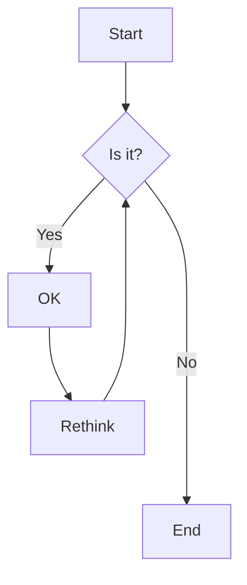
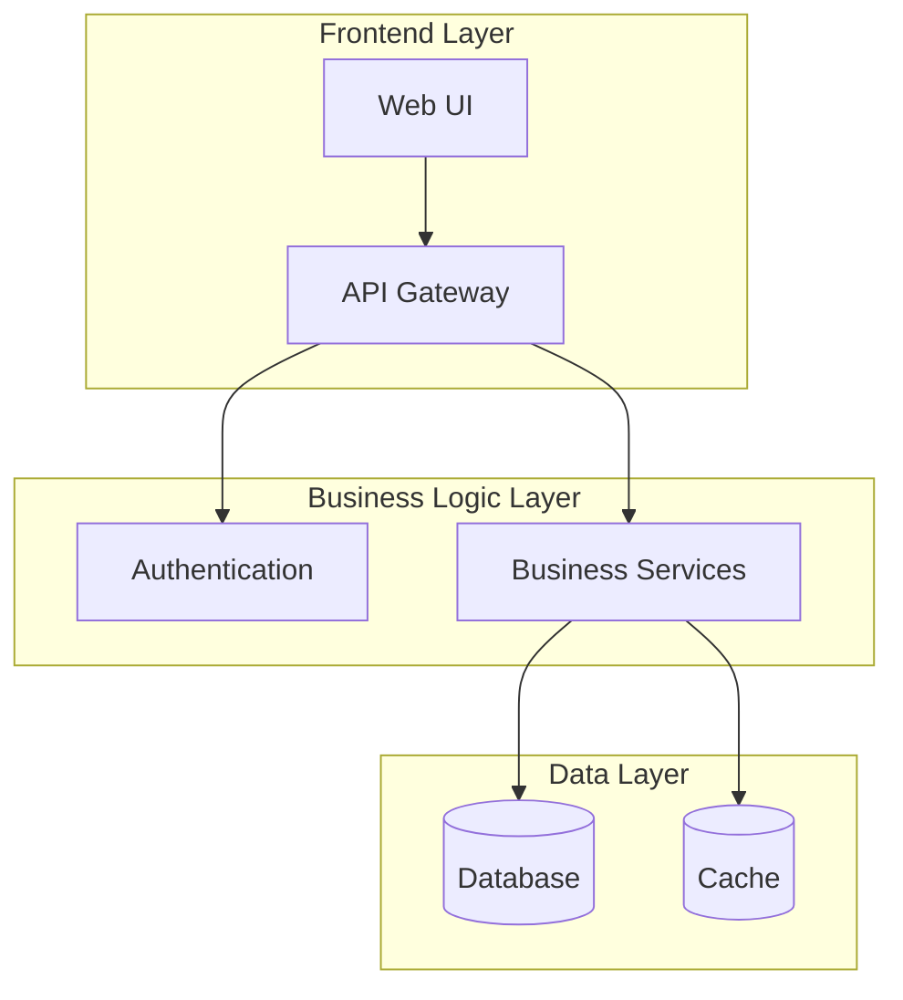
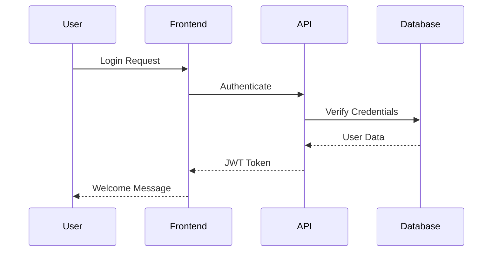
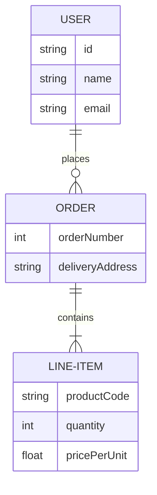

# Mermaid Diagram Test

This page demonstrates Mermaid diagram support in your documentation site.

## Simple Flowchart



## System Architecture Example



## Sequence Diagram



## Entity Relationship Diagram



## Git Flow Diagram

```mermaid
gitgraph
    commit
    branch develop
    checkout develop
    commit
    branch feature
    checkout feature
    commit
    commit
    checkout develop
    merge feature
    checkout main
    merge develop
    commit
```

These diagrams should render properly if Mermaid is configured correctly!
