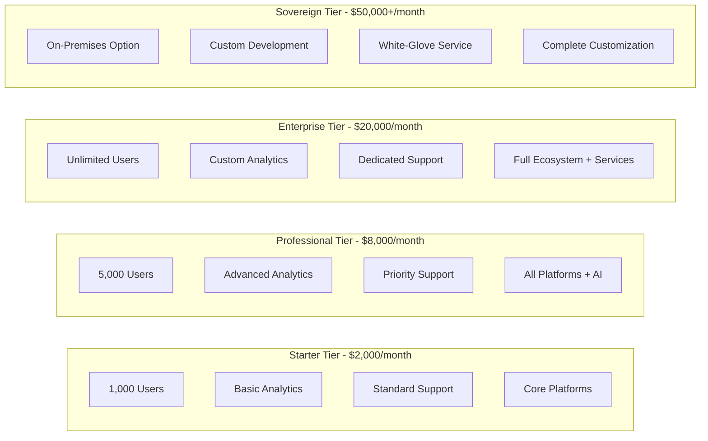
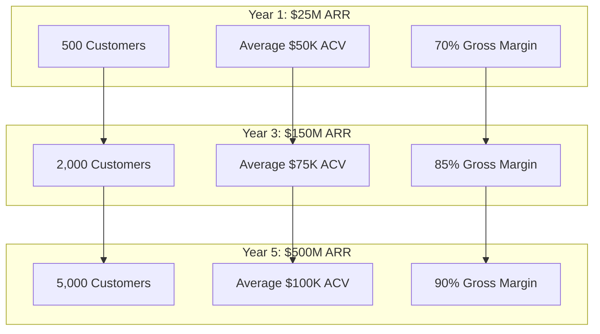

# Comprehensive Pricing & Monetization Strategy

FediFlow's sophisticated pricing model combines subscription tiers, usage-based billing, professional services, and industry-specific revenue streams to maximize value creation for customers while ensuring sustainable growth.

## Tiered Platform Pricing

### Enterprise Subscription Model

### Subscription Tier Details

#### Starter Tier ($2,000/month)
**Target Market**: Small organizations, pilot programs, single departments
- **User Limit**: 1,000 active users
- **Platforms**: Mastodon, Pixelfed, WriteFreely
- **Storage**: 100GB included, $0.50/GB additional
- **Bandwidth**: 1TB/month included, $0.10/GB additional
- **Support**: Email support, community forums
- **Analytics**: Basic engagement metrics and reports
- **API Calls**: 100,000/month included, $0.01 per additional call

#### Professional Tier ($8,000/month)
**Target Market**: Medium organizations, multiple departments, growing communities
- **User Limit**: 5,000 active users
- **Platforms**: All federated platforms + AI features
- **Storage**: 1TB included, $0.30/GB additional
- **Bandwidth**: 10TB/month included, $0.08/GB additional
- **Support**: Priority email, phone support, dedicated success manager
- **Analytics**: Advanced analytics, custom dashboards, predictive insights
- **API Calls**: 1M/month included, $0.005 per additional call
- **Integrations**: Advanced CRM, LMS, and business system integrations

#### Enterprise Tier ($20,000/month)
**Target Market**: Large organizations, universities, healthcare systems, government
- **User Limit**: Unlimited users
- **Platforms**: Full ecosystem with premium features
- **Storage**: 10TB included, $0.20/GB additional
- **Bandwidth**: 100TB/month included, $0.05/GB additional
- **Support**: 24/7 phone, dedicated customer success team, quarterly reviews
- **Analytics**: Real-time analytics, AI-powered insights, custom reporting
- **API Calls**: 10M/month included, $0.001 per additional call
- **Professional Services**: Implementation, training, optimization included

#### Sovereign Tier ($50,000+/month)
**Target Market**: Government agencies, highly regulated industries, enterprise with sovereignty requirements
- **Deployment**: On-premises or private cloud options
- **Customization**: Complete platform customization and white-labeling
- **Support**: White-glove service, dedicated engineering team
- **Compliance**: Enhanced security, audit trails, regulatory compliance
- **SLA**: 99.99% uptime guarantee with financial penalties
- **Professional Services**: Unlimited consulting, custom development

## Usage-Based Revenue Streams

### Granular Service Pricing

#### Content & Data Processing
- **Content Analysis**: $0.02-0.25 per content item
  - Basic text analysis: $0.02
  - Image recognition: $0.05
  - Video processing: $0.15
  - Expert human review: $0.25
- **Data Processing**: $0.001-0.01 per data point processed
- **AI Content Generation**: $0.50-5.00 per generated piece
- **Real-time Translation**: $0.10-0.50 per message translated

#### Infrastructure & Performance
- **Premium Storage**: $0.05-0.15/GB/month
  - Standard storage: $0.05/GB/month
  - High-performance SSD: $0.10/GB/month
  - Instant access archive: $0.15/GB/month
- **Enhanced Bandwidth**: $0.02-0.08/GB
  - Standard CDN: $0.02/GB
  - Premium CDN with edge optimization: $0.05/GB
  - Priority traffic with guaranteed QoS: $0.08/GB

#### API & Integration Services
- **API Calls**: $0.001-0.01 per call
  - Basic read operations: $0.001
  - Write operations: $0.005
  - Complex queries and analytics: $0.01
- **Real-Time APIs**: $0.01-0.10 per WebSocket connection hour
- **Bulk Operations**: $0.0005-0.005 per call (minimum 10,000 calls)

#### Moderation & Safety
- **Automated Moderation**: $0.10-0.50 per item moderated
- **Human Review**: $1.00-2.00 per item requiring human review
- **Crisis Response**: $5,000-50,000 per incident (24/7 emergency response)

## Professional Services Revenue

### Implementation & Consulting Services

#### Platform Implementation
- **Basic Setup**: $50,000-150,000
  - Platform installation and configuration
  - Basic customization and branding
  - Initial user training and onboarding
  - 3-month support included
- **Enterprise Implementation**: $150,000-500,000
  - Complete ecosystem deployment
  - Advanced customization and integrations
  - Comprehensive training programs
  - 12-month support included
- **Sovereign Deployment**: $500,000-2,000,000
  - On-premises infrastructure setup
  - Custom security implementations
  - Regulatory compliance configuration
  - Ongoing support and maintenance

#### Training & Education Programs
- **Basic Training**: $10,000-25,000 per program
  - Administrator training (2-day program)
  - End-user training materials
  - Online learning resources
- **Advanced Training**: $25,000-75,000 per program
  - Custom curriculum development
  - Train-the-trainer programs
  - Ongoing coaching and support
- **Executive Training**: $50,000-100,000 per program
  - C-level strategy workshops
  - ROI optimization sessions
  - Digital transformation consulting

#### Ongoing Consulting Services
- **Strategic Consulting**: $300-500/hour
  - Community strategy development
  - Digital transformation planning
  - Change management support
- **Technical Consulting**: $200-400/hour
  - System optimization and tuning
  - Custom integration development
  - Performance optimization
- **Specialized Consulting**: $500-800/hour
  - Industry-specific expertise
  - Regulatory compliance guidance
  - Crisis management and response

### Custom Development Services

#### Platform Customization
- **Basic Customization**: $25,000-100,000
  - Custom themes and branding
  - Workflow modifications
  - Basic feature enhancements
- **Advanced Customization**: $100,000-500,000
  - Custom modules and features
  - Advanced workflow automation
  - Third-party system integrations
- **Complete Custom Development**: $500,000-2,000,000
  - Fully custom platform variants
  - Industry-specific applications
  - White-label solutions

#### Migration Services
- **Simple Migration**: $25,000-75,000
  - Single platform migration
  - Basic data transfer
  - User account migration
- **Complex Migration**: $75,000-250,000
  - Multi-platform migration
  - Data transformation and cleanup
  - Advanced mapping and integration
- **Enterprise Migration**: $250,000-1,000,000
  - Legacy system integration
  - Phased migration planning
  - Risk mitigation and rollback plans

## Industry-Specific Pricing Models

### Academic Institution Pricing

#### Base Platform Pricing (Institution Size-Based)
- **Small Colleges** (< 5,000 students): $5,000-15,000/month
- **Medium Universities** (5,000-20,000 students): $15,000-35,000/month
- **Large Universities** (> 20,000 students): $35,000-50,000/month

#### Student Services Revenue
- **Student Premium Services**: $25-100/student/year
  - Enhanced career services and networking
  - Priority alumni connections
  - Advanced academic planning tools
- **Alumni Network Access**: $500-2,000/alumni/year
  - Lifetime platform access
  - Professional networking features
  - Exclusive event access

#### Research & Academic Services
- **Research Collaboration Platform**: $25,000-250,000/year
  - Cross-institutional research networks
  - Grant collaboration tools
  - Publication and citation tracking
- **Academic Conference Management**: 10-20% commission on conference revenue
- **Continuing Education Platform**: $200-1,000/course revenue share

### Healthcare Institution Pricing

#### Base Platform Pricing (Patient Volume-Based)
- **Small Practices** (< 10,000 patients): $10,000-25,000/month
- **Medium Healthcare Systems** (10,000-100,000 patients): $25,000-75,000/month
- **Large Health Networks** (> 100,000 patients): $75,000-100,000/month

#### Patient & Provider Services
- **Patient Community Access**: $10-50/patient/month
  - Health education and support communities
  - Condition-specific group access
  - Family support network participation
- **Professional Network**: $200-2,000/provider/year
  - Medical professional networking
  - Continuing education access
  - Research collaboration tools

#### Clinical & Research Services
- **Clinical Trial Support**: $10,000-100,000/trial
  - Patient recruitment and engagement
  - Trial communication management
  - Compliance monitoring and reporting
- **Telemedicine Integration**: $25-100/consultation
  - Integrated community-telemedicine platform
  - Follow-up care coordination
  - Patient education and support

### Government Agency Pricing

#### Base Platform Pricing (Population-Based)
- **Local Government** (< 100,000 population): $15,000-35,000/month
- **Regional Government** (100,000-1M population): $35,000-75,000/month
- **State/National Agencies** (> 1M population): $75,000-150,000/month

#### Citizen Services Revenue
- **Citizen Premium Services**: $5-25/citizen/year
  - Enhanced government service access
  - Priority support and assistance
  - Advanced civic engagement tools
- **Business Services**: $100-1,000/business/year
  - Expedited licensing and permits
  - Business development support
  - Economic incentive program access

#### Specialized Government Services
- **Emergency Response Platform**: $50,000-500,000/year
  - Crisis communication systems
  - Emergency coordination tools
  - Public safety integration
- **Economic Development**: Revenue sharing with business attraction programs
- **Tourism & Promotion**: Partnership revenue with local businesses

## Marketplace & Partner Ecosystem Revenue

### Application & Service Marketplace

#### Marketplace Commission Structure
- **Third-Party Applications**: 30% commission on app sales and subscriptions
- **Professional Services**: 15-25% commission on service bookings
- **Content & Education**: 10-20% commission on premium content sales
- **Integration Partners**: 20-30% revenue share for certified integrations

#### Partner Program Tiers
- **Certified Partner**: 20% revenue share, basic support and marketing
- **Gold Partner**: 25% revenue share, priority support, co-marketing opportunities
- **Platinum Partner**: 30% revenue share, dedicated support, joint go-to-market

### API Partner Program

#### API Monetization Framework
- **Basic API Access**: Included in subscription tiers
- **Premium API Endpoints**: $0.005-0.05 per call for advanced features
- **Real-Time Data Streams**: $0.10-1.00 per minute of streaming data
- **Custom API Development**: $50,000-500,000 for organization-specific endpoints
- **White-Label API**: $100,000-1,000,000 for partner-branded API access

## Revenue Optimization & Analytics

### Dynamic Pricing Engine

#### Pricing Optimization Features
- **Demand-Based Pricing**: Real-time price adjustments based on usage patterns
- **Customer Segmentation**: Customized pricing based on organization size and industry
- **Usage Prediction**: AI-powered forecasting for capacity planning and pricing
- **Competitive Analysis**: Market-based pricing recommendations
- **ROI Optimization**: Customer success metrics tied to pricing adjustments

### Revenue Analytics & Reporting

#### Financial Intelligence Dashboard
- **Revenue Attribution**: Comprehensive tracking of revenue sources and customer segments
- **Customer Lifetime Value**: Predictive CLV modeling for account management
- **Churn Risk Assessment**: Early warning systems for customer retention
- **Upsell Opportunity Detection**: AI-powered identification of expansion opportunities
- **Market Analysis**: Competitive positioning and pricing optimization recommendations

## Global Pricing Strategy

### Regional Market Adaptation

#### Geographic Pricing Tiers
- **Tier 1 Markets** (US, Canada, Western Europe, Australia): Standard pricing
- **Tier 2 Markets** (Eastern Europe, Latin America, Asia-Pacific): 20-30% discount
- **Tier 3 Markets** (Developing economies): 40-60% discount with local partnership requirements
- **Government/Academic Discounts**: Additional 10-25% discount for public sector organizations

#### Currency & Payment Options
- **Multi-Currency Support**: Local currency pricing and billing in 25+ currencies
- **Flexible Payment Terms**: Monthly, quarterly, and annual billing cycles
- **Enterprise Payment Options**: Wire transfer, ACH, purchase orders, and credit terms
- **Government Procurement**: Compliance with government contracting requirements

### Market Entry Pricing

#### Launch Strategy Pricing
- **Early Adopter Program**: 50% discount for first 100 customers in new markets
- **Pilot Program Pricing**: Free 6-month trial for strategic enterprise customers
- **Academic Research Program**: Free platform access for qualifying research institutions
- **Non-Profit Discount**: 30-50% discount for registered non-profit organizations

## Platform Revenue Projections

### FediFlow Revenue Projection Model

### Revenue Growth Metrics
**Year 1 Targets**:
- Customer base: 500 enterprise customers
- Average Contract Value (ACV): $50,000
- Annual Recurring Revenue (ARR): $25M
- Gross Margin: 70%
- Customer distribution: 60% Academic, 25% Healthcare, 15% Government

**Year 3 Targets**:
- Customer base: 2,000 enterprise customers
- Average Contract Value (ACV): $75,000
- Annual Recurring Revenue (ARR): $150M
- Gross Margin: 85%
- Customer distribution: 40% Academic, 25% Healthcare, 15% Government, 10% Media, 10% Corporate

**Year 5 Targets**:
- Customer base: 5,000 enterprise customers
- Average Contract Value (ACV): $100,000
- Annual Recurring Revenue (ARR): $500M
- Gross Margin: 90%
- Customer distribution: Balanced across all six industry verticals

This comprehensive pricing strategy creates multiple revenue streams while ensuring customer success and market penetration across diverse industries and global markets.
