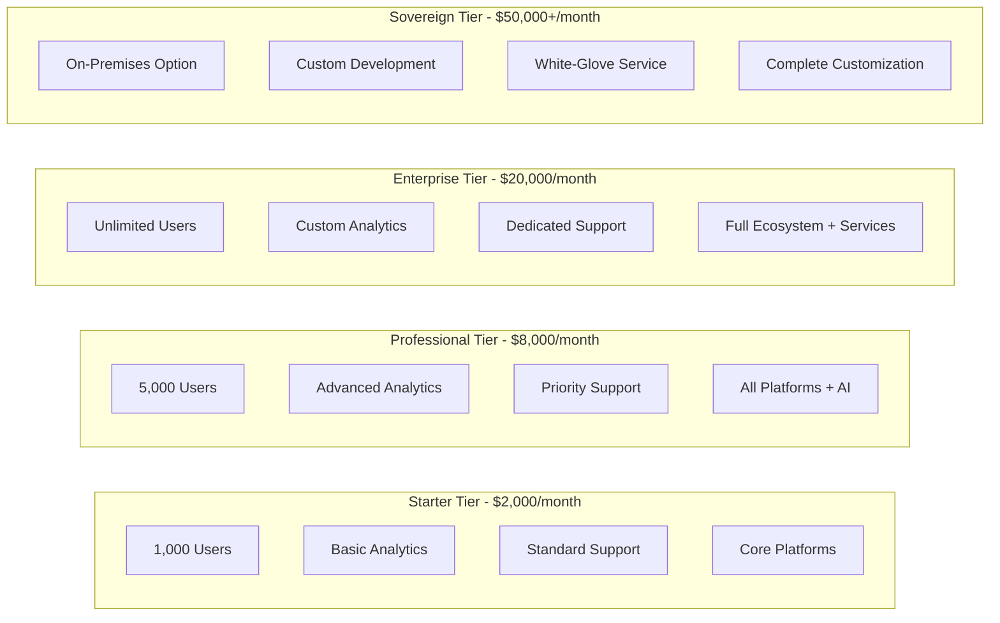
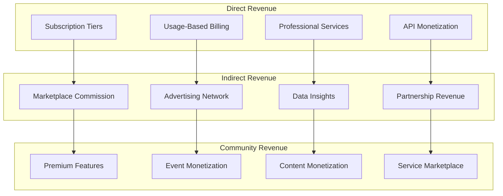
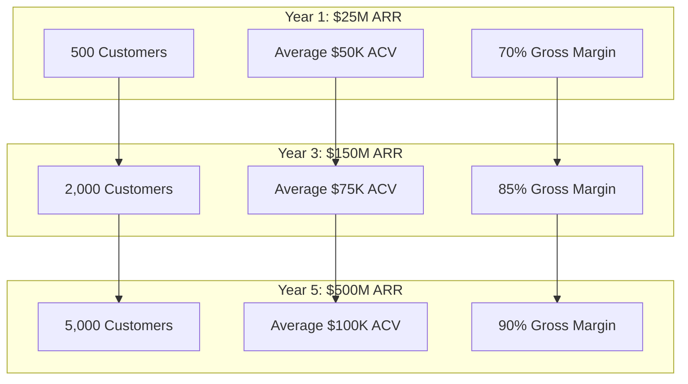

# Comprehensive Pricing & Monetization Strategy

## Tiered Platform Pricing

### Enterprise Subscription Model

## Usage-Based Revenue Streams

### Granular Service Pricing

- **Content Processing**: $0.02-0.25 per content item (automated → expert human review)
- **API Calls**: $0.001-0.01 per call (basic → premium endpoints)
- **Storage**: $0.05-0.15/GB/month (standard → premium with instant access)
- **Bandwidth**: $0.02-0.08/GB (standard → priority CDN)
- **AI Services**: $0.10-5.00 per analysis (sentiment → deep content intelligence)
- **Moderation**: $0.10-2.00 per item (automated → crisis response)

## Professional Services Revenue

### Value-Added Service Pricing

- **Implementation Services**: $50,000-500,000 per project (complexity-based)
- **Training Programs**: $10,000-100,000 per program (scope and audience size)
- **Ongoing Consulting**: $300-800/hour (expertise level and specialization)
- **Custom Development**: $200,000-2,000,000 per project
- **Migration Services**: $25,000-250,000 per platform migrated
- **Crisis Response**: $5,000-50,000 per incident (24/7 emergency response)

## Industry-Specific Revenue Models

### Academic Institution Pricing

- **Base Platform**: $5,000-50,000/month (institution size-based)
- **Student Premium Services**: $25-100/student/year
- **Alumni Network Access**: $500-2,000/alumni/year
- **Research Collaboration**: $25,000-250,000/year
- **Fundraising Tools**: 2-5% of funds raised through platform

### Healthcare Institution Pricing

- **Base Platform**: $10,000-100,000/month (patient volume-based)
- **Patient Community Access**: $10-50/patient/month
- **Professional Network**: $200-2,000/provider/year
- **Clinical Trial Support**: $10,000-100,000/trial
- **Telemedicine Integration**: $25-100/consultation

### Government Agency Pricing

- **Base Platform**: $15,000-150,000/month (population served)
- **Citizen Premium Services**: $5-25/citizen/year
- **Business Services**: $100-1,000/business/year
- **Emergency Response**: $50,000-500,000/year (population-based)
- **Economic Development**: Revenue sharing with business attraction

## Revenue Engine Architecture

### Multi-Stream Revenue Platform

## API Monetization Strategy

### API Revenue Streams

- **Basic API Access**: Included in subscription tiers
- **Premium API Endpoints**: $0.005-0.05 per call for advanced features
- **Real-Time API**: $0.01-0.10 per WebSocket connection hour
- **Bulk API Operations**: $0.0005-0.005 per call (minimum 10,000 calls)
- **Custom API Development**: $50,000-500,000 for organization-specific endpoints
- **API Partner Program**: 20-30% revenue share for certified integrations

## Marketplace & Partner Ecosystem

### Revenue Sharing Model

- **Application Marketplace**: 30% commission on third-party app sales
- **Service Provider Network**: 15-25% commission on service bookings
- **Content Creator Platform**: 10-20% commission on premium content sales
- **Training & Certification**: 40-60% revenue share with training partners
- **Integration Partners**: 20-30% revenue share for certified integrations

## Revenue Projection Model

The ecosystem approach creates multiple revenue streams per customer, dramatically increasing lifetime value while providing sustainable competitive advantages through platform lock-in and network effects.
