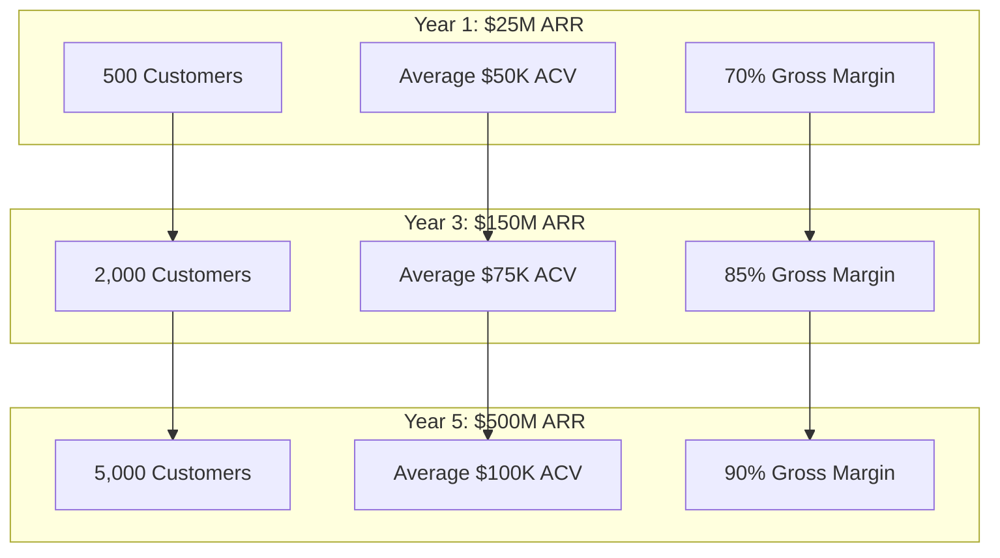

# ROI & Value Creation Framework

## Customer ROI Models by Industry

### Academic Institution ROI

**Year 1 ROI: 250-350%**
- Student recruitment cost reduction: $200,000-800,000
- Alumni engagement improvement: $500,000-2,000,000
- Operational efficiency gains: $300,000-1,200,000
- Risk mitigation value: $500,000-5,000,000

**Years 2-5 ROI: 500-1000%+**
- Research funding increases: $2,000,000-20,000,000
- Endowment growth: $5,000,000-50,000,000
- Competitive positioning: $10,000,000-100,000,000
- Brand value enhancement: Immeasurable long-term value

### Healthcare Institution ROI

**Year 1 ROI: 200-300%**
- Patient engagement improvement: $1,000,000-5,000,000
- Staff efficiency gains: $500,000-2,000,000
- Reputation enhancement: $2,000,000-10,000,000
- Quality improvement: $1,000,000-5,000,000

**Years 2-5 ROI: 400-800%+**
- Clinical outcome improvements: $5,000,000-25,000,000
- Research collaboration value: $2,000,000-10,000,000
- Patient satisfaction increases: $3,000,000-15,000,000
- Regulatory compliance value: $1,000,000-5,000,000

### Government Agency ROI

**Year 1 ROI: 300-500%**
- Citizen service efficiency: $500,000-5,000,000
- Emergency response improvement: $1,000,000-10,000,000
- Economic development: $2,000,000-20,000,000
- Transparency & trust value: Immeasurable civic benefit

**Years 2-5 ROI: 600-1200%+**
- Economic development impact: $10,000,000-100,000,000
- Citizen satisfaction improvements: $5,000,000-50,000,000
- Cost savings from efficiency: $3,000,000-30,000,000
- Democratic engagement value: Immeasurable social benefit

## Platform ROI for FediFlow

### Revenue Projection Model

### Key Performance Indicators

#### Growth & Adoption KPIs
- **Customer Acquisition**: 25% month-over-month growth target
- **Revenue Growth**: $500M ARR by Year 5
- **Platform Adoption**: 90% customer satisfaction and NPS greater than 70
- **Technical Performance**: 99.99% uptime with less than 100ms response times
- **Market Position**: #1 federated platform provider globally

#### Value Delivery KPIs
- **Customer ROI**: Greater than 300% average ROI within 18 months
- **Platform Utilization**: Greater than 80% feature adoption across customer base
- **Community Growth**: 15% monthly active user growth per customer
- **Revenue Impact**: Measurable revenue increases for 90% of customers
- **Retention Rate**: Greater than 95% customer retention with less than 2% churn

## Return on Investment & Local Monetization Opportunities

### Quantifiable ROI for Organizations

#### Direct Cost Savings

**Platform Dependency Reduction**:
- **Traditional Social Media Advertising**: Organizations typically spend $50,000-$500,000 annually on paid social media promotion
- **FediFlow Alternative**: Own platform eliminates paid promotion needs, redirecting budget to community building
- **Agency Fees**: Average $10,000-$50,000/month for social media agency management
- **Crisis Management**: Reduced risk of platform-induced crises saving $100,000-$1,000,000 in reputation recovery costs

**Data & Analytics Value**:
- **Third-Party Analytics Tools**: Eliminate $20,000-$200,000 annual spend on social media analytics platforms
- **Proprietary Data**: Generate valuable first-party data worth $500,000-$5,000,000 annually for strategic decision-making
- **Research Opportunities**: Academic institutions can monetize community data for research grants and studies
- **Competitive Intelligence**: Deep community insights provide strategic advantages worth $100,000+ annually

### Revenue Generation Opportunities

#### Direct Monetization Strategies for Organizations

**Academic Institutions**:
- **Premium Alumni Services**: $500-$2,000/year for exclusive alumni community access and networking
- **Corporate Partnerships**: $50,000-$500,000 annual corporate sponsorship of specialized academic communities
- **Professional Development**: $200-$1,000 per course for exclusive professional development content
- **Research Collaboration**: $25,000-$250,000 per partnership for industry research collaboration platforms

**Healthcare Organizations**:
- **Premium Health Communities**: $20-$100/month for specialized health condition support communities
- **Telemedicine Integration**: $50-$200 per consultation for integrated social-telemedicine services
- **Wellness Programs**: $500-$5,000 per employee annually for corporate wellness community access
- **Medical Education**: $1,000-$10,000 per course for continuing medical education with community support

**Government Agencies**:
- **Premium Citizen Services**: $10-$50/month for enhanced government service access and communication
- **Business Licensing**: $500-$5,000 for premium business community access and expedited services
- **Economic Development**: $10,000-$100,000 annual fees for premium economic development community access
- **Tourism Promotion**: Revenue sharing with local businesses for tourism community promotion

### Enhanced Community Engagement ROI

#### Measurable Community Outcomes

**Increased Engagement Metrics**:
- **Traditional Platform Engagement**: Average 1-3% engagement rate on centralized platforms
- **Federated Community Engagement**: 15-30% engagement rate in specialized community environments
- **Community Retention**: 80-95% retention rate compared to 20-40% on traditional platforms
- **Content Effectiveness**: 5-10x higher content reach within target demographic communities

**Community Value Creation**:
- **User-Generated Content**: $50,000-$500,000 annual value from community-created content
- **Peer-to-Peer Support**: $100,000-$1,000,000 annual value from reduced customer service costs through community support
- **Knowledge Sharing**: $250,000-$2,500,000 annual value from institutional knowledge preservation and sharing
- **Innovation Collaboration**: $500,000-$5,000,000 annual value from community-driven innovation and problem-solving

### Implementation ROI Timeline

**Year 1 ROI**: 150-200%
- Immediate cost savings from reduced platform dependency
- Enhanced community engagement driving operational efficiency
- Initial revenue generation from community monetization

**Year 2-3 ROI**: 300-500%
- Established community monetization strategies generating significant revenue
- Data-driven insights creating competitive advantages
- Reduced crisis management and reputation recovery costs

**Year 4-5 ROI**: 500-1000%+
- Full community monetization potential realized
- Strategic partnerships and collaborations generating substantial revenue
- Long-term brand value and competitive positioning established
- Complete platform independence and data sovereignty achieved

## Academic Institution ROI Model

### Comprehensive Academic ROI Framework

```mermaid
flowchart TD
    subgraph "Student Success ROI"
        SS_ROI1[3-7% Retention Improvement]
        SS_ROI2[$500K-2M Early Warning Value]
        SS_ROI3[15% Academic Performance Gain]
        SS_ROI4[$300K-1.2M Career Services Value]
    end
    
    subgraph "Research Impact ROI"
        RI_ROI1[300% Research Visibility Increase]
        RI_ROI2[50% Collaboration Growth]
        RI_ROI3[25% Grant Success Improvement]
        RI_ROI4[$2M-20M Funding Increase]
    end
    
    subgraph "Alumni Engagement ROI"
        AE_ROI1[200% Engagement Increase]
        AE_ROI2[30% Giving Growth]
        AE_ROI3[$5M-50M Fundraising Impact]
        AE_ROI4[300% Volunteer Participation]
    end
    
    subgraph "Total Institutional ROI"
        T_ROI[500-1000% 5-Year ROI]
    end
    
    SS_ROI1 --> T_ROI
    SS_ROI2 --> T_ROI
    RI_ROI1 --> T_ROI
    RI_ROI2 --> T_ROI
    AE_ROI1 --> T_ROI
    AE_ROI2 --> T_ROI
```

### Year 1 Academic Value Realization
- **Student recruitment cost reduction**: $200K-800K
- **Faculty research collaboration**: $500K-2M value
- **Alumni engagement improvement**: $1M-5M impact
- **Operational efficiency gains**: $300K-1.2M savings

### Years 2-5 Cumulative Value
- **Research funding increases**: $10M-100M
- **Endowment growth acceleration**: $25M-250M
- **Competitive positioning value**: Immeasurable strategic advantage
- **Brand value enhancement**: Long-term institutional reputation

### Academic Excellence Monitoring
- **Student Success Tracking**: Real-time analytics on academic performance correlation
- **Faculty Satisfaction Measurement**: Regular surveys and engagement assessment
- **Alumni Relationship Quality**: Long-term engagement and giving trend analysis
- **Research Impact Assessment**: Citation tracking and collaboration success measurement
- **Institutional Reputation Monitoring**: Media coverage and ranking impact analysis
