# Local Partnerships Architecture

## Vision: Institutional-Community Economic Integration

Transform your FediFlow platform into a **local economic development engine** by creating deep partnerships between institutional communities and local businesses, community organizations, and civic entities. This comprehensive partnership architecture generates sustainable revenue streams while strengthening community bonds and local economic resilience.

### **Strategic Partnership Ecosystem**

```mermaid
flowchart TD
    subgraph "Institution Ecosystem"
        INSTITUTION[🏛️ Academic Institution<br/>Students, Faculty, Alumni, Staff]
        PLATFORMS[📱 11+ Federated Platforms<br/>Content & Communication Hub]
        RESOURCES[💼 Institutional Assets<br/>Facilities, Expertise, Network]
        COMMUNITY_MEMBERS[👥 Community Members<br/>Local Residents, Professionals]
    end
    
    subgraph "Local Business Network"
        FOOD_HOSPITALITY[🍕 Food & Hospitality<br/>Restaurants, Cafes, Catering]
        RETAIL_SERVICES[🛍️ Retail & Services<br/>Shops, Repair, Personal Services]
        HOUSING_REAL_ESTATE[🏠 Housing & Real Estate<br/>Student Housing, Rentals]
        HEALTH_WELLNESS[🏥 Health & Wellness<br/>Medical, Fitness, Mental Health]
        PROFESSIONAL_SERVICES[💼 Professional Services<br/>Legal, Financial, Consulting]
        ENTERTAINMENT_CULTURE[🎭 Entertainment & Culture<br/>Venues, Arts, Recreation]
        TRANSPORTATION[🚗 Transportation<br/>Transit, Rideshare, Delivery]
        TECHNOLOGY[💻 Technology Partners<br/>ISP, Software, Hardware]
    end
    
    subgraph "Community Organizations"
        NONPROFITS[🤝 Nonprofit Organizations<br/>Social Services, Advocacy]
        RELIGIOUS_ORGS[⛪ Religious Communities<br/>Churches, Temples, Centers]
        CIVIC_GOVERNMENT[🏛️ Civic & Government<br/>City Hall, Libraries, Museums]
        LABOR_UNIONS[👷 Labor Organizations<br/>Trade Unions, Associations]
        COOPERATIVES[🔄 Cooperatives<br/>Credit Unions, Food Co-ops]
        CULTURAL_GROUPS[🎨 Cultural Organizations<br/>Arts Councils, Heritage Groups]
    end
    
    subgraph "Innovation & Investment"
        STARTUPS[🚀 Local Startups<br/>Tech Companies, Social Enterprises]
        INVESTORS[💰 Investment Community<br/>Angels, VCs, Impact Funds]
        INCUBATORS[🏢 Business Incubators<br/>Accelerators, Co-working Spaces]
        RESEARCH_PARTNERS[🔬 Research Organizations<br/>Labs, Think Tanks, Institutes]
    end
    
    subgraph "Partnership Technology Platform"
        API_GATEWAY[🔗 Partnership API Gateway<br/>Third-party System Integration]
        DATA_ANALYTICS[📊 Shared Analytics Hub<br/>Community Impact Metrics]
        PAYMENT_SYSTEM[💳 Multi-Party Revenue<br/>Automated Distribution Engine]
        CONTENT_AMPLIFICATION[📡 Content Syndication<br/>Cross-platform Promotion]
        EVENT_COORDINATION[📅 Collaborative Events<br/>Joint Programming Platform]
        RESOURCE_SHARING[🤝 Resource Exchange<br/>Skills, Assets, Knowledge]
    end
    
    INSTITUTION --> API_GATEWAY
    PLATFORMS --> DATA_ANALYTICS
    RESOURCES --> PAYMENT_SYSTEM
    COMMUNITY_MEMBERS --> CONTENT_AMPLIFICATION
    
    FOOD_HOSPITALITY --> API_GATEWAY
    RETAIL_SERVICES --> DATA_ANALYTICS
    HOUSING_REAL_ESTATE --> PAYMENT_SYSTEM
    HEALTH_WELLNESS --> CONTENT_AMPLIFICATION
    PROFESSIONAL_SERVICES --> EVENT_COORDINATION
    ENTERTAINMENT_CULTURE --> RESOURCE_SHARING
    TRANSPORTATION --> API_GATEWAY
    TECHNOLOGY --> DATA_ANALYTICS
    
    NONPROFITS --> CONTENT_AMPLIFICATION
    RELIGIOUS_ORGS --> EVENT_COORDINATION
    CIVIC_GOVERNMENT --> RESOURCE_SHARING
    LABOR_UNIONS --> API_GATEWAY
    COOPERATIVES --> DATA_ANALYTICS
    CULTURAL_GROUPS --> PAYMENT_SYSTEM
    
    STARTUPS --> API_GATEWAY
    INVESTORS --> PAYMENT_SYSTEM
    INCUBATORS --> EVENT_COORDINATION
    RESEARCH_PARTNERS --> RESOURCE_SHARING
```



---

## Core Partnership Models

### **1. Local Business Integration Framework**

```mermaid
flowchart LR
    subgraph "Member-Generated Content"
        AUTHENTIC_REVIEWS[⭐ Authentic Reviews<br/>Student & community feedback]
        EVENT_COVERAGE[📸 Event Documentation<br/>Business events, promotions]
        EDUCATIONAL_CONTENT[📺 Educational Videos<br/>How-to guides, tutorials]
        SOCIAL_PROMOTION[📱 Social Media Content<br/>Check-ins, experiences, stories]
        COMMUNITY_STORIES[✍️ Community Stories<br/>Business owner profiles, history]
    end
    
    subgraph "Business Partner Benefits"
        TARGETED_MARKETING[🎯 Targeted Marketing<br/>Authentic community promotion]
        CUSTOMER_INSIGHTS[📊 Customer Analytics<br/>Demographic data, preferences]
        EVENT_COORDINATION[📅 Event Marketing<br/>Community event partnerships]
        LOYALTY_PROGRAMS[🎁 Loyalty Integration<br/>Student & community discounts]
        BRAND_AMPLIFICATION[📢 Brand Storytelling<br/>Community-driven narratives]
    end
    
    subgraph "Revenue Generation"
        COMMISSION_SALES[💰 Commission Revenue<br/>3-10% on referred transactions]
        SPONSORED_CONTENT[💵 Sponsored Content<br/>$50-500 per campaign]
        EVENT_PARTNERSHIPS[🎪 Event Revenue Sharing<br/>Co-hosted activities]
        DATA_MONETIZATION[📈 Analytics Services<br/>Market insights, trend reports]
        AFFILIATE_MARKETING[🔗 Affiliate Programs<br/>Product recommendation income]
    end
    
    subgraph "Community Impact"
        LOCAL_EMPLOYMENT[👥 Job Creation<br/>Student employment opportunities]
        ECONOMIC_MULTIPLIER[📈 Economic Growth<br/>Increased local spending]
        SKILL_DEVELOPMENT[🎓 Skills Training<br/>Real-world experience programs]
        COMMUNITY_COHESION[🤝 Social Bonds<br/>Stronger community connections]
    end
    
    AUTHENTIC_REVIEWS --> TARGETED_MARKETING
    EVENT_COVERAGE --> CUSTOMER_INSIGHTS
    EDUCATIONAL_CONTENT --> EVENT_COORDINATION
    SOCIAL_PROMOTION --> LOYALTY_PROGRAMS
    COMMUNITY_STORIES --> BRAND_AMPLIFICATION
    
    TARGETED_MARKETING --> COMMISSION_SALES
    CUSTOMER_INSIGHTS --> SPONSORED_CONTENT
    EVENT_COORDINATION --> EVENT_PARTNERSHIPS
    LOYALTY_PROGRAMS --> DATA_MONETIZATION
    BRAND_AMPLIFICATION --> AFFILIATE_MARKETING
    
    COMMISSION_SALES --> LOCAL_EMPLOYMENT
    SPONSORED_CONTENT --> ECONOMIC_MULTIPLIER
    EVENT_PARTNERSHIPS --> SKILL_DEVELOPMENT
    DATA_MONETIZATION --> COMMUNITY_COHESION
```



### **2. Community Organization Partnership Model**

```mermaid
graph TD
    subgraph "Institutional Resources"
        STUDENT_VOLUNTEERS[👥 Student Volunteers<br/>Service learning, civic engagement]
        FACULTY_EXPERTISE[👨‍🏫 Faculty Knowledge<br/>Research, consultation, training]
        FACILITIES[🏢 Institutional Facilities<br/>Meeting spaces, equipment, venues]
        TECHNOLOGY[💻 Technology Resources<br/>Platforms, tools, digital literacy]
        NETWORKS[🌐 Professional Networks<br/>Alumni, corporate, government]
    end
    
    subgraph "Community Organization Needs"
        VOLUNTEER_SUPPORT[🤝 Volunteer Support<br/>Events, programs, operations]
        PROFESSIONAL_SERVICES[💼 Pro Bono Services<br/>Legal, marketing, technical]
        RESEARCH_ASSISTANCE[🔬 Research Support<br/>Data analysis, impact studies]
        EVENT_COORDINATION[📅 Event Support<br/>Planning, promotion, execution]
        CAPACITY_BUILDING[📈 Capacity Development<br/>Training, systems, strategy]
    end
    
    subgraph "Collaborative Programs"
        SERVICE_LEARNING[📚 Service Learning<br/>Academic credit for community work]
        RESEARCH_PARTNERSHIPS[🔬 Community Research<br/>Faculty-community collaboration]
        PROFESSIONAL_DEVELOPMENT[🎓 Skills Exchange<br/>Training programs, workshops]
        ADVOCACY_CAMPAIGNS[📢 Community Advocacy<br/>Joint civic engagement initiatives]
        RESOURCE_SHARING[🔄 Resource Exchange<br/>Equipment, space, expertise]
    end
    
    subgraph "Mutual Benefits"
        STUDENT_EXPERIENCE[👥 Real-World Learning<br/>Practical skills, civic engagement]
        COMMUNITY_IMPACT[🌍 Enhanced Services<br/>Increased capacity, effectiveness]
        INSTITUTIONAL_MISSION[🎯 Mission Fulfillment<br/>Community engagement goals]
        SUSTAINABLE_PARTNERSHIPS[♻️ Long-term Collaboration<br/>Ongoing mutual support]
    end
    
    STUDENT_VOLUNTEERS --> VOLUNTEER_SUPPORT
    FACULTY_EXPERTISE --> PROFESSIONAL_SERVICES
    FACILITIES --> EVENT_COORDINATION
    TECHNOLOGY --> CAPACITY_BUILDING
    NETWORKS --> RESEARCH_ASSISTANCE
    
    VOLUNTEER_SUPPORT --> SERVICE_LEARNING
    PROFESSIONAL_SERVICES --> RESEARCH_PARTNERSHIPS
    RESEARCH_ASSISTANCE --> PROFESSIONAL_DEVELOPMENT
    EVENT_COORDINATION --> ADVOCACY_CAMPAIGNS
    CAPACITY_BUILDING --> RESOURCE_SHARING
    
    SERVICE_LEARNING --> STUDENT_EXPERIENCE
    RESEARCH_PARTNERSHIPS --> COMMUNITY_IMPACT
    PROFESSIONAL_DEVELOPMENT --> INSTITUTIONAL_MISSION
    ADVOCACY_CAMPAIGNS --> SUSTAINABLE_PARTNERSHIPS
    RESOURCE_SHARING --> STUDENT_EXPERIENCE
```



---

## Partnership Revenue Models

### **Multi-Party Revenue Distribution**

```mermaid
sankey-beta
    Content Creator,Direct Sales,40
    Content Creator,Sponsorships,30
    Content Creator,Affiliate,20
    Content Creator,Services,25
    
    Local Business,Marketing Budget,35
    Local Business,Sales Commission,25
    Local Business,Event Sponsorship,20
    Local Business,Data Insights,15
    
    Institution,Platform Revenue,20
    Institution,Partnership Fees,15
    Institution,Event Revenue,10
    Institution,Consulting,12
    
    Direct Sales,Creator Earnings,35
    Sponsorships,Creator Earnings,25
    Affiliate,Creator Earnings,18
    Services,Creator Earnings,22
    
    Marketing Budget,Business Growth,30
    Sales Commission,Business Growth,20
    Event Sponsorship,Business Growth,18
    Data Insights,Business Growth,12
    
    Platform Revenue,Institution Fund,18
    Partnership Fees,Institution Fund,13
    Event Revenue,Institution Fund,8
    Consulting,Institution Fund,10
    
    Creator Earnings,Community Economy,100
    Business Growth,Community Economy,80
    Institution Fund,Community Economy,49
```

### **Partnership ROI Analysis**

| Partnership Type | Setup Cost | Monthly Revenue | Break-even | 12-Month ROI | Jobs Created |
|---|---|---|---|---|---|
| **Restaurant Partnerships** | $15K | $8K-25K | 2-3 months | 180%-400% | 5-12 |
| **Retail Integration** | $20K | $6K-18K | 3-4 months | 150%-320% | 3-8 |
| **Housing Platform** | $35K | $12K-40K | 3-4 months | 200%-450% | 8-15 |
| **Healthcare Services** | $25K | $5K-15K | 4-5 months | 120%-280% | 4-10 |
| **Professional Services** | $10K | $8K-22K | 2-3 months | 200%-500% | 6-12 |
| **Entertainment Venues** | $18K | $7K-20K | 3-4 months | 160%-380% | 4-9 |
| **Transportation APIs** | $22K | $4K-12K | 5-6 months | 100%-240% | 2-6 |
| **Community Organizations** | $12K | $3K-10K | 4-5 months | 90%-200% | 8-20 |

---

## Implementation Timeline

### **Partnership Development Phases**


### **Success Metrics Dashboard**


This comprehensive partnership architecture creates a sustainable ecosystem where institutions, local businesses, community organizations, and individual creators all benefit from collaborative value creation and shared economic success.