# Platform-Driven Institutional Transformation

## Full-Stack Integration Strategy for Federated Institution Networks

FediFlow goes beyond simple platform onboarding to achieve **complete digital transformation of partner institutions into interdependent nodes** within a smart, federated infrastructure. This comprehensive strategy converts traditional institutions into modern, interconnected organizations that leverage shared tools, intelligence, and networks for exponential value creation.

### **Transformation Vision**

```mermaid
graph TB
    subgraph "Traditional Institution Model"
        ISOLATED[🏢 Isolated Operations<br/>Disconnected systems, manual processes]
        LIMITED[📊 Limited Analytics<br/>Basic reporting, reactive decisions]
        SILOED[🔒 Siloed Resources<br/>No resource sharing, duplicated efforts]
        MANUAL[📝 Manual Workflows<br/>Paper-based, inefficient processes]
    end
    
    subgraph "FediFlow Transformation"
        FEDERATED[🌐 Federated Operations<br/>Connected systems, automated workflows]
        INTELLIGENT[🧠 AI-Powered Intelligence<br/>Predictive analytics, proactive insights]
        NETWORKED[🤝 Networked Resources<br/>Shared talent, collaborative services]
        AUTOMATED[⚡ Smart Automation<br/>Digital-first, efficient operations]
    end
    
    subgraph "Value Creation Multipliers"
        PRODUCTIVITY[📈 5x Productivity Gains<br/>Automated processes, shared resources]
        INSIGHTS[🎯 10x Better Decisions<br/>AI-powered analytics, predictive modeling]
        NETWORK[🌟 Exponential Network Effects<br/>Cross-institutional collaboration]
        INNOVATION[💡 Accelerated Innovation<br/>Shared knowledge, rapid iteration]
    end
    
    ISOLATED --> FEDERATED
    LIMITED --> INTELLIGENT
    SILOED --> NETWORKED
    MANUAL --> AUTOMATED
    
    FEDERATED --> PRODUCTIVITY
    INTELLIGENT --> INSIGHTS
    NETWORKED --> NETWORK
    AUTOMATED --> INNOVATION
```



---

## 🚀 **Pillar 1: Multi-Tier Onboarding & Infrastructure Conversion**

### **Institutional Readiness Assessment Framework**

```typescript
interface InstitutionalReadinessScorecard {
  digitalMaturity: {
    currentTechStack: 'legacy' | 'hybrid' | 'modern';
    digitalLiteracy: number; // 1-10 scale
    automationLevel: number; // percentage of automated processes
    dataManagement: 'manual' | 'basic_digital' | 'advanced';
  };
  
  organizationalCapacity: {
    staffTechSkills: number; // 1-10 average
    changeReadiness: number; // 1-10 scale
    budgetForDigitization: number; // annual budget
    leadershipBuyIn: 'low' | 'medium' | 'high';
  };
  
  serviceMaturity: {
    memberEngagement: number; // engagement metrics
    operationalEfficiency: number; // process efficiency score
    partnershipLevel: number; // collaboration index
    impactMeasurement: 'none' | 'basic' | 'advanced';
  };
  
  federationReadiness: {
    dataSharingWillingness: boolean;
    crossOrgCollaboration: boolean;
    openToPlatformIntegration: boolean;
    networkEffectUnderstanding: boolean;
  };
}
```

### **Custom Onboarding Wizard by Institution Type**

```mermaid
flowchart TD
    subgraph "Institution Type Detection"
        CHAMBER[🏢 Chamber of Commerce<br/>Business networking focus]
        TRADE[🤝 Trade Association<br/>Industry-specific services]
        PROF[👔 Professional Association<br/>Certification & development]
        EDO[📈 Economic Development<br/>Investment & growth]
        BIA[🏬 Business Improvement Area<br/>District revitalization]
        ANCHOR[⚓ Economic Anchor<br/>Major institutional presence]
    end
    
    subgraph "Customized Setup Flows"
        CHAMBER_SETUP[🛠️ Chamber Setup<br/>Member directory, event management,<br/>advocacy tools, business referrals]
        TRADE_SETUP[🛠️ Trade Setup<br/>Standards development, certification,<br/>market research, government relations]
        PROF_SETUP[🛠️ Professional Setup<br/>Career services, continuing education,<br/>networking, certification tracking]
        EDO_SETUP[🛠️ EDO Setup<br/>Investment tracking, business retention,<br/>workforce development, impact metrics]
        BIA_SETUP[🛠️ BIA Setup<br/>District marketing, event coordination,<br/>business support, infrastructure planning]
        ANCHOR_SETUP[🛠️ Anchor Setup<br/>Community engagement, research collaboration,<br/>workforce development, economic impact]
    end
    
    CHAMBER --> CHAMBER_SETUP
    TRADE --> TRADE_SETUP
    PROF --> PROF_SETUP
    EDO --> EDO_SETUP
    BIA --> BIA_SETUP
    ANCHOR --> ANCHOR_SETUP
```



### **Federated Identity & Access Layer**

```typescript
interface FederatedIdentitySystem {
  userRoles: {
    executives: {
      permissions: ['strategic_planning', 'budget_approval', 'partnership_decisions'];
      dashboards: ['executive_overview', 'performance_metrics', 'strategic_insights'];
      crossOrgAccess: 'peer_executive_network';
    };
    
    staff: {
      permissions: ['program_management', 'member_services', 'event_coordination'];
      dashboards: ['operational_metrics', 'member_engagement', 'task_management'];
      crossOrgAccess: 'professional_development_network';
    };
    
    members: {
      permissions: ['profile_management', 'networking', 'resource_access'];
      dashboards: ['member_portal', 'networking_opportunities', 'resource_library'];
      crossOrgAccess: 'federated_member_network';
    };
    
    serviceUsers: {
      permissions: ['service_access', 'feedback_submission', 'basic_networking'];
      dashboards: ['service_portal', 'community_directory', 'local_resources'];
      crossOrgAccess: 'community_service_network';
    };
  };
  
  federatedFeatures: {
    singleSignOn: 'cross_institution_authentication';
    sharedProfiles: 'unified_professional_identity';
    crossOrgPermissions: 'collaborative_project_access';
    networkCredentials: 'federated_reputation_system';
  };
}
```

---

## 🔌 **Pillar 2: API-Driven Operational Backbone**

### **Unified API Gateway Architecture**

```mermaid
graph TB
    subgraph "Legacy System Connectors"
        CRM_LEGACY[📊 Legacy CRM<br/>Salesforce, HubSpot, custom]
        WEBSITE[🌐 Website<br/>WordPress, Drupal, custom]
        DIRECTORIES[📋 Member Directories<br/>Excel, Access, proprietary]
        ACCOUNTING[💰 Accounting<br/>QuickBooks, Xero, custom]
        EVENT[🎪 Event Management<br/>Eventbrite, custom systems]
        EMAIL[📧 Email Marketing<br/>Mailchimp, Constant Contact]
    end
    
    subgraph "FediFlow API Gateway"
        AUTH_API[🔐 Authentication API<br/>SSO, role management]
        SYNC_API[🔄 Data Sync API<br/>Real-time synchronization]
        WORKFLOW_API[⚡ Workflow API<br/>Automation orchestration]
        ANALYTICS_API[📊 Analytics API<br/>Cross-system insights]
        FEDERATION_API[🌐 Federation API<br/>Cross-institution connectivity]
    end
    
    subgraph "Modern Service Layer"
        MEMBER_MGMT[👥 Member Management<br/>Unified member profiles]
        EVENT_COORD[🎪 Event Coordination<br/>Cross-institutional events]
        COLLAB_TOOLS[🤝 Collaboration Tools<br/>Project management, communication]
        PAYMENT_PROC[💳 Payment Processing<br/>Multi-party revenue sharing]
        CONTENT_MGMT[📝 Content Management<br/>Cross-platform publishing]
    end
    
    CRM_LEGACY --> AUTH_API
    WEBSITE --> SYNC_API
    DIRECTORIES --> WORKFLOW_API
    ACCOUNTING --> ANALYTICS_API
    EVENT --> FEDERATION_API
    EMAIL --> FEDERATION_API
    
    AUTH_API --> MEMBER_MGMT
    SYNC_API --> EVENT_COORD
    WORKFLOW_API --> COLLAB_TOOLS
    ANALYTICS_API --> PAYMENT_PROC
    FEDERATION_API --> CONTENT_MGMT
```



### **No-Code Automation Panel**

```typescript
interface AutomationWorkflowBuilder {
  triggers: {
    memberJoin: 'new_member_registration';
    eventRegistration: 'event_signup_completed';
    paymentReceived: 'payment_processed';
    formSubmission: 'contact_form_submitted';
    scheduleTime: 'time_based_trigger';
    apiWebhook: 'external_system_notification';
  };
  
  actions: {
    sendEmail: {template: string; recipients: string[]};
    updateDatabase: {table: string; fields: object};
    createTask: {assignee: string; dueDate: Date};
    generateReport: {type: string; recipients: string[]};
    crossOrgNotify: {institutions: string[]; message: string};
    triggerFederation: {platforms: string[]; content: object};
  };
  
  conditions: {
    memberTier: 'premium' | 'standard' | 'basic';
    institutionType: string;
    geographicLocation: string;
    membershipDuration: number;
    engagementLevel: 'high' | 'medium' | 'low';
  };
  
  workflowExamples: {
    newMemberOnboarding: 'trigger:memberJoin → action:sendEmail → action:createTask';
    eventPromotion: 'trigger:scheduleTime → condition:memberTier → action:crossOrgNotify';
    paymentProcessing: 'trigger:paymentReceived → action:updateDatabase → action:generateReport';
  };
}
```

---

## 🧠 **Pillar 3: Federated Intelligence & Decision-Making**

### **Predictive Business Dashboards**

```mermaid
dashboard
    title Executive Intelligence Dashboard
    
    card totalMembers "Total Network Members" 45678
    card activeInstitutions "Active Institutions" 234
    card monthlyGrowth "Monthly Growth Rate" 12.5%
    card networkValue "Network Economic Value" $125M
    
    chart membershipGrowth "Membership Growth Forecast" {
        data [
            ["Jan", 40000],
            ["Feb", 42000],
            ["Mar", 45000],
            ["Apr", 48000],
            ["May", 52000],
            ["Jun", 57000]
        ]
        type line
        color "#2563eb"
    }
    
    chart institutionPerformance "Institution Performance Matrix" {
        data [
            ["Chambers", 85, 120],
            ["Trade Assoc", 92, 110],
            ["Professional", 78, 95],
            ["EDOs", 88, 105]
        ]
        type scatter
        color "#10b981"
    }
    
    chart economicImpact "Economic Impact Distribution" {
        data [
            ["Job Creation", 35],
            ["Business Development", 28],
            ["Investment Facilitation", 22],
            ["Innovation Projects", 15]
        ]
        type pie
        color ["#f59e0b", "#ef4444", "#8b5cf6", "#06b6d4"]
    }
```

### **AI Research Assistant Integration**

```typescript
interface AIResearchAssistant {
  grantWritingSupport: {
    opportunityScanning: 'automated_grant_database_monitoring';
    proposalDrafting: 'ai_assisted_proposal_generation';
    budgetOptimization: 'cost_effectiveness_analysis';
    submissionTracking: 'deadline_and_status_management';
  };
  
  strategicPlanning: {
    marketAnalysis: 'competitive_landscape_research';
    trendForecasting: 'industry_trend_prediction';
    scenarioPlanning: 'what_if_analysis_modeling';
    stakeholderMapping: 'relationship_network_analysis';
  };
  
  policyResearch: {
    regulatoryMonitoring: 'policy_change_alerts';
    impactAssessment: 'policy_effect_analysis';
    advocacySupport: 'position_paper_development';
    complianceGuidance: 'regulatory_requirement_tracking';
  };
  
  economicAnalysis: {
    regionalEconomics: 'local_economic_indicator_tracking';
    industryInsights: 'sector_specific_analysis';
    impactMeasurement: 'roi_and_outcome_calculation';
    benchmarking: 'peer_institution_comparison';
  };
}
```

---

## 👥 **Pillar 4: Networked Human Capital & Services Exchange**

### **Resource Sharing Exchange Platform**

```mermaid
graph TB
    subgraph "Available Resources"
        HR_SERVICES[👥 HR Services<br/>Recruitment, training, policy development]
        LEGAL_SERVICES[⚖️ Legal Services<br/>Contract review, compliance, IP protection]
        MARKETING[📢 Marketing Services<br/>Brand development, digital marketing, PR]
        DESIGN[🎨 Design Services<br/>Graphic design, web development, UX/UI]
        ACCOUNTING[💰 Accounting Services<br/>Bookkeeping, financial planning, auditing]
        GRANT_WRITING[📝 Grant Writing<br/>Proposal development, research, submission]
    end
    
    subgraph "Service Exchange Mechanisms"
        SKILL_MATCHING[🎯 AI-Powered Skill Matching<br/>Automatic resource-need pairing]
        TIME_BANKING[⏰ Time Banking System<br/>Credit-based service exchange]
        COST_SHARING[💰 Cost Sharing Pools<br/>Shared service subscriptions]
        PROJECT_TEAMS[👥 Cross-Institutional Teams<br/>Collaborative project formation]
    end
    
    subgraph "Quality Assurance"
        REPUTATION[⭐ Reputation System<br/>Service provider ratings]
        CERTIFICATION[🏆 Skill Certification<br/>Verified competency tracking]
        INSURANCE[🛡️ Professional Insurance<br/>Liability coverage for services]
        MEDIATION[🤝 Dispute Resolution<br/>Conflict resolution processes]
    end
    
    HR_SERVICES --> SKILL_MATCHING
    LEGAL_SERVICES --> TIME_BANKING
    MARKETING --> COST_SHARING
    DESIGN --> PROJECT_TEAMS
    ACCOUNTING --> PROJECT_TEAMS
    GRANT_WRITING --> SKILL_MATCHING
    
    SKILL_MATCHING --> REPUTATION
    TIME_BANKING --> CERTIFICATION
    COST_SHARING --> INSURANCE
    PROJECT_TEAMS --> MEDIATION
```



### **Staffing Pool Registry & Management**

```typescript
interface StaffingPoolRegistry {
  talentProfiles: {
    coreSkills: string[];
    availabilityHours: number;
    hourlyRate: number;
    institutionAffiliation: string;
    certifications: string[];
    languages: string[];
    remoteCapability: boolean;
  };
  
  projectMatching: {
    skillRequirements: string[];
    projectDuration: number;
    budgetRange: [number, number];
    timelineFlexibility: 'rigid' | 'flexible' | 'very_flexible';
    collaborationStyle: 'independent' | 'team' | 'mixed';
  };
  
  workArrangements: {
    secondments: 'temporary_staff_exchange';
    consultingProjects: 'short_term_specialized_work';
    collaborativeProjects: 'multi_institution_initiatives';
    trainingDelivery: 'skills_transfer_programs';
    mentorshipPrograms: 'experience_sharing_relationships';
  };
  
  compensationModels: {
    directPayment: 'traditional_fee_for_service';
    institutionalCredit: 'time_banking_system';
    resourceExchange: 'service_for_service_trading';
    sharedCosts: 'collaborative_funding_arrangements';
  };
}
```

---

## 💼 **Pillar 5: Smart Capital & Investment Enablement**

### **Capital Matchmaking Engine**

```mermaid
flowchart LR
    subgraph "Capital Sources"
        GRANTS[💰 Grants<br/>Federal, state, foundation grants]
        PHILANTHROPY[🎁 Philanthropy<br/>Individual donors, family foundations]
        ESG_FUNDS[🌱 ESG Investment<br/>Impact investors, ESG funds]
        CDFIS[🏦 CDFIs<br/>Community development financial institutions]
        IMPACT_INV[📈 Impact Investors<br/>Mission-aligned investment capital]
        CROWDFUNDING[👥 Crowdfunding<br/>Community-supported projects]
    end
    
    subgraph "AI Matching Algorithm"
        PROJECT_ANALYSIS[🔍 Project Analysis<br/>Scope, impact, feasibility assessment]
        FUNDER_PROFILING[📊 Funder Profiling<br/>Investment criteria, history, preferences]
        COMPATIBILITY_SCORING[🎯 Compatibility Scoring<br/>Project-funder fit analysis]
        TIMING_OPTIMIZATION[⏰ Timing Optimization<br/>Application deadline management]
    end
    
    subgraph "Investment Pipeline"
        LEAD_GENERATION[📞 Lead Generation<br/>Automated opportunity identification]
        PROPOSAL_DEVELOPMENT[📝 Proposal Development<br/>AI-assisted application creation]
        RELATIONSHIP_MANAGEMENT[🤝 Relationship Management<br/>Funder relationship tracking]
        SUCCESS_TRACKING[📈 Success Tracking<br/>Outcome measurement, reporting]
    end
    
    GRANTS --> PROJECT_ANALYSIS
    PHILANTHROPY --> FUNDER_PROFILING
    ESG_FUNDS --> COMPATIBILITY_SCORING
    CDFIS --> TIMING_OPTIMIZATION
    IMPACT_INV --> TIMING_OPTIMIZATION
    CROWDFUNDING --> PROJECT_ANALYSIS
    
    PROJECT_ANALYSIS --> LEAD_GENERATION
    FUNDER_PROFILING --> PROPOSAL_DEVELOPMENT
    COMPATIBILITY_SCORING --> RELATIONSHIP_MANAGEMENT
    TIMING_OPTIMIZATION --> SUCCESS_TRACKING
```



### **Investment Pipeline Manager**

```typescript
interface InvestmentPipelineManager {
  pipelineStages: {
    identification: {
      opportunities: OpportunityLead[];
      sources: string[];
      scoringCriteria: ScoringMatrix;
      priorityRanking: number;
    };
    
    qualification: {
      eligibilityCheck: boolean;
      requirementsMatch: number; // percentage
      competitiveAnalysis: CompetitorData[];
      successProbability: number; // 0-1
    };
    
    development: {
      proposalStatus: 'draft' | 'review' | 'final';
      collaborators: string[];
      budgetDetails: BudgetBreakdown;
      timelineTarget: Date;
    };
    
    submission: {
      submissionDate: Date;
      trackingNumber: string;
      followUpSchedule: Date[];
      responsibilityMatrix: ResponsibilityMap;
    };
    
    monitoring: {
      decisionTimeline: Date;
      interimCommunications: Communication[];
      successMetrics: Metric[];
      alternativePlans: ContingencyPlan[];
    };
  };
  
  portfolioAnalytics: {
    totalPipelineValue: number;
    successRate: number;
    averageApplicationTime: number;
    topPerformingSources: string[];
    seasonalTrends: TrendData[];
  };
}
```

---

## 🌐 **Pillar 6: Service Delivery as Modular APIs**

### **API-Exposed Institution Services**

```mermaid
graph TB
    subgraph "Chamber of Commerce APIs"
        MEMBER_VERIFY[✅ Member Verification API<br/>Authenticate business memberships]
        BIZ_REGISTRY[📋 Business Registry API<br/>Registration, licensing support]
        NETWORKING[🤝 Networking Events API<br/>Event access, scheduling]
        ADVOCACY[📢 Advocacy Alerts API<br/>Policy updates, action items]
    end
    
    subgraph "Trade Association APIs"
        STANDARDS[📋 Industry Standards API<br/>Compliance checking, documentation]
        CERTIFICATION[🏆 Certification API<br/>Professional credential verification]
        MARKET_DATA[📊 Market Research API<br/>Industry insights, trends]
        TRAINING[📚 Training Programs API<br/>Course access, completion tracking]
    end
    
    subgraph "Economic Development APIs"
        INVESTMENT[💰 Investment Opportunities API<br/>Project matching, due diligence]
        WORKFORCE[👥 Workforce Development API<br/>Skills training, placement services]
        INCENTIVES[🎁 Business Incentives API<br/>Tax credits, grants, programs]
        SITE_SELECTION[📍 Site Selection API<br/>Location analysis, demographics]
    end
    
    subgraph "Professional Association APIs"
        CAREER_SERVICES[💼 Career Services API<br/>Job placement, career coaching]
        CPE_TRACKING[📈 CPE Tracking API<br/>Continuing education management]
        PEER_NETWORKS[👥 Peer Networking API<br/>Professional connections, mentoring]
        EXPERTISE[🎯 Expert Directory API<br/>Specialist identification, booking]
    end
```



### **Revenue-Generating Service Marketplace**

```typescript
interface ServiceMarketplace {
  serviceCategories: {
    consultingServices: {
      businessPlanning: '$150-500/hour';
      marketResearch: '$200-800/project';
      regulatoryCompliance: '$175-600/hour';
      strategicPlanning: '$250-1000/day';
    };
    
    educationalServices: {
      workshopDelivery: '$500-2500/session';
      customTraining: '$1000-5000/program';
      certificationPrograms: '$100-500/participant';
      webinarSeries: '$200-1000/series';
    };
    
    technicalServices: {
      systemIntegration: '$100-300/hour';
      dataAnalysis: '$150-400/hour';
      digitalTransformation: '$200-600/hour';
      cybersecurityAudit: '$250-800/assessment';
    };
    
    eventServices: {
      eventPlanning: '$50-200/hour';
      speakerBureau: '$500-5000/engagement';
      venueCoordination: '$25-100/hour';
      virtualEventManagement: '$75-250/hour';
    };
  };
  
  qualityAssurance: {
    providerVerification: 'background_check_and_credential_verification';
    serviceStandards: 'quality_metrics_and_performance_tracking';
    clientFeedback: 'rating_and_review_system';
    disputeResolution: 'mediation_and_arbitration_services';
  };
  
  revenueSharing: {
    platformFee: '5-10%';
    institutionCommission: '10-15%';
    providerEarnings: '75-85%';
    networkBonuses: 'cross_institutional_collaboration_incentives';
  };
}
```

---

## 🧭 **Pillar 7: Ecosystem Governance, Growth, and Standardization**

### **Digital Constitution Framework**

```mermaid
graph TB
    subgraph "Core Principles"
        DATA_SOVEREIGNTY[🛡️ Data Sovereignty<br/>Institutions own their data]
        OPEN_FEDERATION[🌐 Open Federation<br/>Interoperable, non-proprietary standards]
        DEMOCRATIC_GOV[🗳️ Democratic Governance<br/>Stakeholder representation in decisions]
        ETHICAL_AI[🤖 Ethical AI<br/>Transparent, fair, accountable algorithms]
        ECONOMIC_EQUITY[⚖️ Economic Equity<br/>Fair value distribution across network]
    end
    
    subgraph "Operational Standards"
        DATA_SHARING[🔄 Data Sharing Protocols<br/>Privacy-preserving data exchange]
        SECURITY_STANDARDS[🔒 Security Standards<br/>Unified cybersecurity requirements]
        QUALITY_METRICS[📊 Quality Metrics<br/>Service level agreements, performance KPIs]
        INNOVATION_SHARING[💡 Innovation Sharing<br/>Open source contribution requirements]
    end
    
    subgraph "Governance Mechanisms"
        STAKEHOLDER_COUNCIL[👥 Stakeholder Council<br/>Elected representative body]
        TECHNICAL_COMMITTEE[⚙️ Technical Committee<br/>Architecture and standards oversight]
        ETHICS_BOARD[🎯 Ethics Board<br/>AI and data use oversight]
        DISPUTE_RESOLUTION[🤝 Dispute Resolution<br/>Conflict mediation processes]
    end
    
    DATA_SOVEREIGNTY --> DATA_SHARING
    OPEN_FEDERATION --> SECURITY_STANDARDS
    DEMOCRATIC_GOV --> QUALITY_METRICS
    ETHICAL_AI --> INNOVATION_SHARING
    ECONOMIC_EQUITY --> INNOVATION_SHARING
    
    DATA_SHARING --> STAKEHOLDER_COUNCIL
    SECURITY_STANDARDS --> TECHNICAL_COMMITTEE
    QUALITY_METRICS --> ETHICS_BOARD
    INNOVATION_SHARING --> DISPUTE_RESOLUTION
```



### **Incentive Engine & Performance Framework**

```typescript
interface IncentiveEngine {
  performanceMetrics: {
    digitizationScore: {
      weight: 25;
      criteria: ['api_usage', 'automation_level', 'data_quality'];
      rewards: 'platform_fee_discounts';
    };
    
    collaborationIndex: {
      weight: 30;
      criteria: ['cross_org_projects', 'resource_sharing', 'network_contributions'];
      rewards: 'shared_revenue_bonuses';
    };
    
    impactMeasurement: {
      weight: 25;
      criteria: ['member_growth', 'economic_impact', 'service_quality'];
      rewards: 'recognition_and_grants';
    };
    
    innovationAdoption: {
      weight: 20;
      criteria: ['new_feature_usage', 'beta_participation', 'feedback_contribution'];
      rewards: 'early_access_privileges';
    };
  };
  
  rewardStructure: {
    earlyAdopters: {
      benefits: ['50%_platform_fee_discount', 'priority_support', 'co_marketing_opportunities'];
      duration: '24_months';
      requirements: 'first_100_institutions';
    };
    
    highPerformers: {
      benefits: ['revenue_sharing_bonuses', 'governance_voting_rights', 'innovation_grants'];
      eligibility: 'top_25%_performance_score';
      reviewCycle: 'quarterly';
    };
    
    networkContributors: {
      benefits: ['reduced_service_fees', 'premium_feature_access', 'speaking_opportunities'];
      criteria: 'significant_knowledge_or_resource_sharing';
      recognition: 'annual_awards_program';
    };
  };
}
```

---

## 🛠️ **Implementation Roadmap: 5-Phase Deployment**

### **Phase 1: Foundation (Months 1-6)**
- **Institution Assessment & Onboarding**: 25 pilot institutions across 5 categories
- **Core API Development**: Essential connectors and federation protocols
- **Basic Intelligence Layer**: Dashboards and reporting capabilities
- **Success Metrics**: 90% successful onboarding, 50% productivity improvement

### **Phase 2: Integration (Months 7-12)**
- **Advanced Automation**: No-code workflow builder deployment
- **Resource Sharing Platform**: Human capital exchange implementation
- **AI Assistant Beta**: Grant writing and research support tools
- **Success Metrics**: 100 institutions, 75% using advanced features

### **Phase 3: Intelligence (Months 13-18)**
- **Predictive Analytics**: Full AI-powered forecasting and insights
- **Capital Marketplace**: Investment matching and pipeline management
- **Service API Exposure**: Institution services as federated APIs
- **Success Metrics**: 250 institutions, $10M+ in facilitated funding

### **Phase 4: Ecosystem (Months 19-24)**
- **Governance DAO**: Stakeholder council and democratic decision-making
- **Global Federation**: International institution network expansion
- **Advanced AI Services**: Comprehensive research and planning assistance
- **Success Metrics**: 500+ institutions, 95% retention rate

### **Phase 5: Scale (Months 25-36)**
- **Market Leadership**: Dominant position in institutional federation
- **Platform Economy**: Self-sustaining ecosystem with network effects
- **Innovation Lab**: R&D for next-generation institutional tools
- **Success Metrics**: 1,000+ institutions, $100M+ ecosystem value

### **Success Measurement Framework**

```mermaid
dashboard
    title Transformation Success Metrics
    
    card digitalMaturity "Average Digital Maturity Score" 8.5/10
    card productivity "Productivity Improvement" +275%
    card collaboration "Cross-Institutional Projects" 1,234
    card networkValue "Total Network Value" $250M
    
    chart adoptionCurve "Platform Adoption Curve" {
        data [
            ["Month 6", 25],
            ["Month 12", 100],
            ["Month 18", 250],
            ["Month 24", 500],
            ["Month 30", 750],
            ["Month 36", 1000]
        ]
        type line
        color "#10b981"
    }
    
    chart valueCreation "Value Creation by Category" {
        data [
            ["Efficiency Gains", 40],
            ["Revenue Generation", 25],
            ["Cost Savings", 20],
            ["Innovation Value", 15]
        ]
        type pie
        color ["#3b82f6", "#f59e0b", "#ef4444", "#8b5cf6"]
    }
```

## Conclusion

This platform-driven institutional transformation strategy positions FediFlow as the foundational infrastructure for the **next generation of institutional collaboration and economic development**. By systematically converting traditional institutions into intelligent, networked nodes within a federated ecosystem, we create unprecedented value through:

**🚀 Exponential Value Creation**
- 5x productivity gains through automation and resource sharing
- 10x better decision-making through AI-powered intelligence
- Unlimited network effects through cross-institutional collaboration

**🌟 Competitive Advantages**
- First-mover advantage in institutional federation technology
- Network effects that create insurmountable competitive moats
- Platform economy benefits that compound over time

**📈 Scalable Growth Model**
- Self-reinforcing adoption cycles driven by network value
- Multiple revenue streams that grow with ecosystem expansion
- Global expansion potential across all institution types

This comprehensive transformation framework ensures that FediFlow becomes not just a platform, but the **essential infrastructure layer for institutional success in the digital age**.
