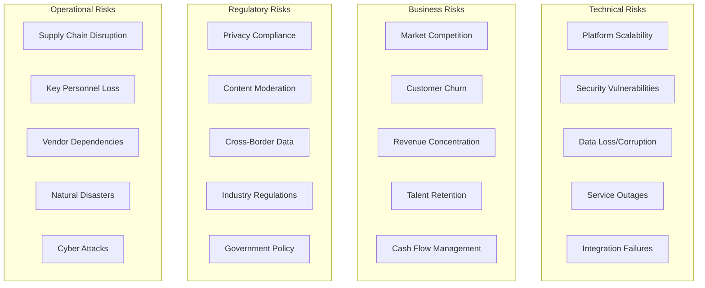
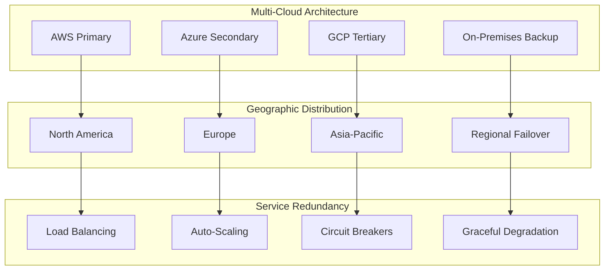
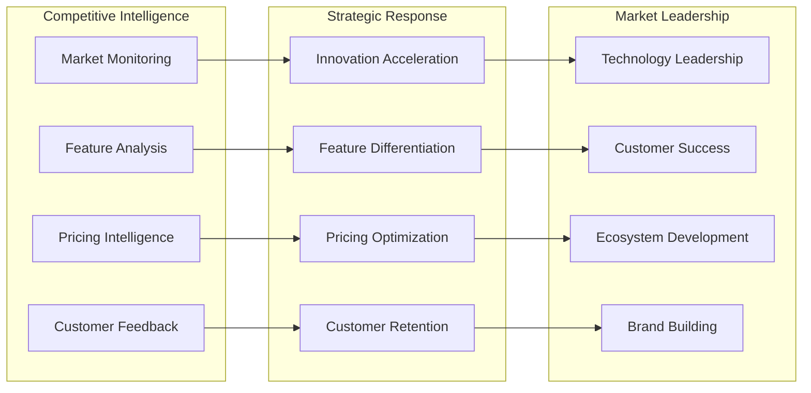
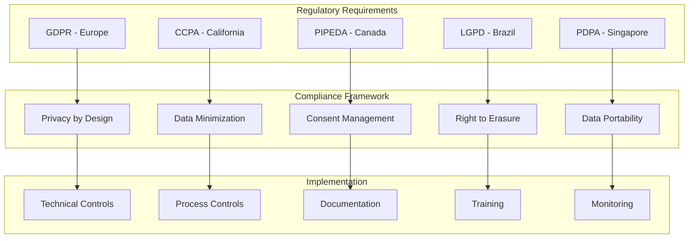
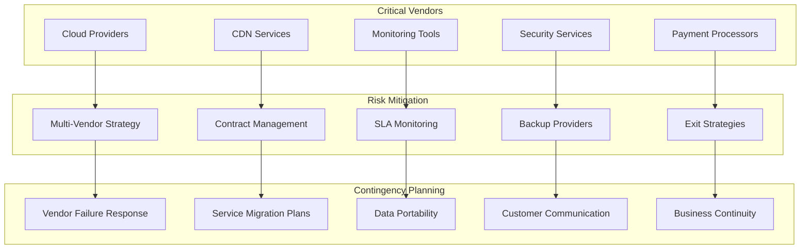

# Risk Management & Mitigation Strategy

FediFlow's comprehensive risk management framework addresses technical, business, regulatory, and market risks to ensure sustainable growth and operational resilience.

## Risk Assessment Framework

### Risk Categories & Impact Analysis

### Risk Probability & Impact Matrix

| Risk Category | High Probability | Medium Probability | Low Probability |
|---------------|------------------|-------------------|-----------------|
| **High Impact** | Platform Security Breach | Major Customer Churn | Regulatory Shutdown |
| **Medium Impact** | Talent Retention Issues | Service Outages | Vendor Lock-in |
| **Low Impact** | Minor Integration Failures | Local Compliance Issues | Supply Chain Delays |

## Technical Risk Mitigation

### Platform Resilience Strategy

#### Infrastructure Redundancy

#### Security Risk Mitigation
**Zero-Trust Security Model**:
- **Identity Verification**: Multi-factor authentication for all users
- **Network Segmentation**: Microsegmentation with least-privilege access
- **Encryption**: End-to-end encryption for all data in transit and at rest
- **Monitoring**: 24/7 SOC with AI-powered threat detection
- **Incident Response**: Sub-hour response time for security incidents

**Specific Security Measures**:
- Regular penetration testing and vulnerability assessments
- Bug bounty program with responsible disclosure
- SIEM integration with automated threat response
- Data loss prevention (DLP) tools and monitoring
- Regular security training for all personnel

#### Data Protection & Recovery
**Backup Strategy**:
- **Real-time Replication**: Continuous data replication across regions
- **Point-in-Time Recovery**: 15-minute recovery point objective (RPO)
- **Disaster Recovery**: 4-hour recovery time objective (RTO)
- **Data Integrity**: Continuous integrity checking and validation
- **Compliance**: Automated compliance monitoring and reporting

**Data Sovereignty Measures**:
- Regional data residency compliance
- Customer data encryption with customer-managed keys
- Data portability and export capabilities
- Right to erasure and data deletion procedures
- Audit trails for all data access and modifications

### Technology Risk Assessment

#### Platform Scalability Risks
**Risk**: Inability to scale platform to meet growing demand
**Mitigation Strategies**:
- Horizontal scaling architecture with microservices
- Auto-scaling groups with predictive scaling
- Performance testing and capacity planning
- CDN optimization for global content delivery
- Database sharding and read replicas

**Monitoring & Alerts**:
- Real-time performance monitoring
- Capacity utilization alerts at 70% threshold
- Automated scaling triggers
- Performance degradation alerts
- Customer impact assessment and communication

#### Integration Risk Management
**Risk**: Third-party integration failures affecting customer operations
**Mitigation Strategies**:
- Redundant integration pathways
- Circuit breaker patterns for external APIs
- Integration health monitoring and alerting
- Fallback mechanisms and graceful degradation
- Comprehensive integration testing and validation

## Business Risk Mitigation

### Market & Competitive Risk Management

#### Competition Response Strategy

#### Customer Concentration Risk
**Risk**: Over-dependence on large customers creating revenue vulnerability
**Mitigation Strategies**:
- Diversified customer portfolio across industries
- No single customer greater than 10% of total revenue
- Long-term contracts with enterprise customers
- Customer success programs to increase retention
- Expansion within existing customer accounts

**Customer Success Metrics**:
- Customer health scoring and early warning systems
- Regular customer satisfaction surveys and NPS tracking
- Proactive customer success management
- Customer advisory board for strategic feedback
- Executive relationship management for key accounts

### Financial Risk Management

#### Revenue Diversification Strategy
**Multiple Revenue Streams**:
- Subscription revenue (60-70% of total)
- Professional services (15-20% of total)
- Usage-based billing (10-15% of total)
- Marketplace and partnerships (5-10% of total)

**Geographic Revenue Distribution**:
- North America: 50-60%
- Europe: 25-30%
- Asia-Pacific: 10-15%
- Other regions: 5-10%

#### Cash Flow Management
**Working Capital Optimization**:
- Annual subscription billing to improve cash flow
- Accounts receivable management with 30-day terms
- Expense forecasting and budget management
- Credit line and banking relationships
- Financial reporting and variance analysis

### Talent & Human Resources Risk

#### Key Personnel Retention
**Risk**: Loss of critical team members affecting operations and growth
**Mitigation Strategies**:
- Competitive compensation and equity programs
- Professional development and career advancement opportunities
- Strong company culture and employee engagement
- Knowledge documentation and cross-training
- Succession planning for key positions

**Talent Acquisition Strategy**:
- Diverse recruitment pipeline and employer branding
- Remote-first culture enabling global talent access
- Internship and university partnership programs
- Employee referral programs and incentives
- Continuous learning and development programs

## Regulatory & Compliance Risk Management

### Data Privacy & Protection Compliance

#### Global Privacy Regulation Compliance

#### Industry-Specific Compliance
**Healthcare (HIPAA)**:
- Business Associate Agreements (BAAs) with healthcare customers
- Administrative, physical, and technical safeguards
- Regular risk assessments and compliance audits
- Incident response procedures for healthcare data
- Staff training on healthcare privacy requirements

**Education (FERPA)**:
- Educational record protection and access controls
- Parental consent and student rights management
- Directory information handling procedures
- Audit trails for educational record access
- Staff training on student privacy requirements

**Government (FedRAMP)**:
- Government cloud security authorization
- Continuous monitoring and compliance reporting
- Security control implementation and documentation
- Regular security assessments and audits
- Government-specific incident response procedures

### Content Moderation & Platform Governance

#### Content Policy Risk Management
**Risk**: Inappropriate content affecting platform reputation and compliance
**Mitigation Strategies**:
- AI-powered content moderation with human oversight
- Community guidelines and terms of service
- User reporting and appeal processes
- Transparency reports and policy updates
- Legal compliance monitoring and response

**Moderation Framework**:
- Automated content scanning and filtering
- Human moderator review for edge cases
- Community-based moderation and governance
- Appeals process and policy enforcement
- Regular policy review and updates

## Operational Risk Management

### Vendor & Supply Chain Risk

#### Vendor Dependency Management

#### Supply Chain Security
**Third-Party Risk Assessment**:
- Vendor security assessments and audits
- Supply chain security requirements
- Continuous vendor monitoring and alerts
- Incident response coordination with vendors
- Regular vendor relationship reviews

### Crisis Management & Business Continuity

#### Crisis Response Framework
**Incident Classification**:
- **Level 1**: Minor service disruption (less than 1% customers affected)
- **Level 2**: Moderate service impact (1-10% customers affected)
- **Level 3**: Major service outage (greater than 10% customers affected)
- **Level 4**: Critical security or data breach incident
- **Level 5**: Catastrophic event affecting core operations

**Response Team Structure**:
- Incident Commander (executive leadership)
- Technical Response Team (engineering and operations)
- Customer Communication Team (customer success and marketing)
- Legal and Compliance Team (legal and privacy officers)
- External Communications Team (PR and media relations)

#### Business Continuity Planning
**Continuity Strategies**:
- Remote work capabilities for all personnel
- Distributed team structure across time zones
- Redundant office locations and facilities
- Cloud-based infrastructure and operations
- Financial reserves for 12+ months operation

**Recovery Procedures**:
- Documented recovery procedures for all critical systems
- Regular disaster recovery testing and drills
- Alternative facility arrangements and agreements
- Vendor emergency contact and escalation procedures
- Customer communication templates and procedures

## Insurance & Financial Protection

### Risk Transfer Strategies

#### Insurance Coverage Portfolio
**Cyber Liability Insurance**:
- $50M+ coverage for data breaches and cyber attacks
- Business interruption coverage for service outages
- Privacy liability coverage for regulatory violations
- Cyber extortion and ransomware coverage
- Vendor and third-party liability coverage

**Professional Liability Insurance**:
- Errors and omissions coverage for service delivery
- Technology professional liability coverage
- Directors and officers liability insurance
- Employment practices liability insurance
- General commercial liability insurance

#### Financial Risk Management
**Financial Reserves**:
- 12-month operating expense cash reserves
- Credit facilities and banking relationships
- Diversified investment portfolio for reserves
- Foreign exchange hedging strategies
- Regular financial stress testing and scenario planning

## Monitoring & Continuous Improvement

### Risk Monitoring Dashboard

#### Key Risk Indicators (KRIs)
**Technical KRIs**:
- Platform uptime and performance metrics
- Security incident frequency and severity
- Data backup success rates and recovery times
- Integration health and failure rates
- Capacity utilization and scaling metrics

**Business KRIs**:
- Customer churn rates and satisfaction scores
- Revenue concentration and diversification metrics
- Employee turnover and satisfaction rates
- Vendor performance and SLA compliance
- Market share and competitive positioning

#### Risk Review Process
**Monthly Risk Assessment**:
- Risk register review and updates
- KRI analysis and trend identification
- Mitigation strategy effectiveness review
- New risk identification and assessment
- Cross-functional risk committee meetings

**Quarterly Risk Strategy Review**:
- Comprehensive risk framework evaluation
- Strategic risk appetite and tolerance review
- Risk mitigation investment prioritization
- Regulatory and compliance update review
- Board-level risk reporting and oversight

This comprehensive risk management framework ensures FediFlow maintains operational resilience, customer trust, and sustainable growth while navigating the complex challenges of the enterprise software market.
