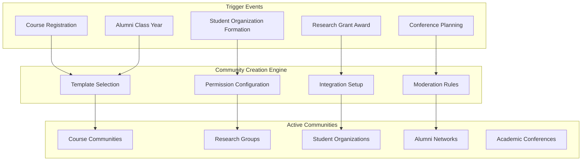
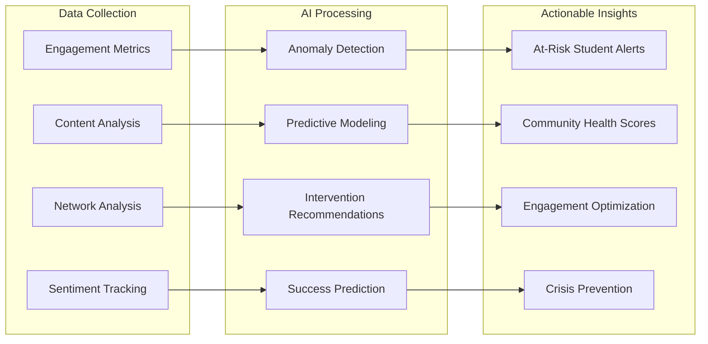
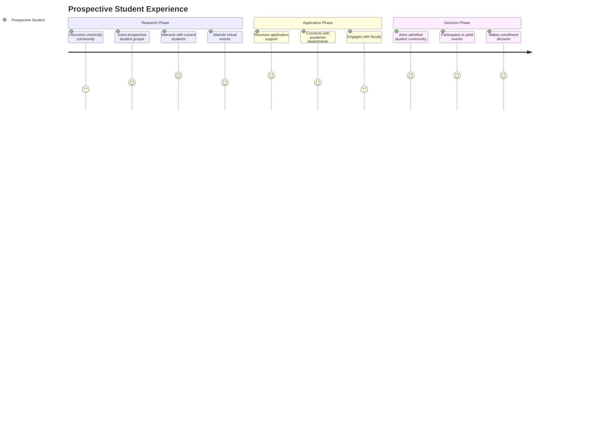
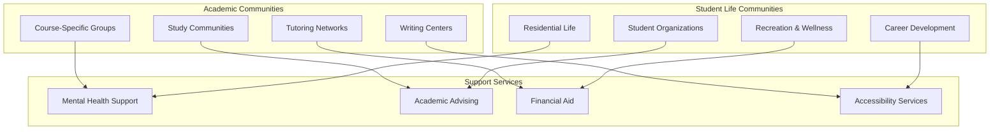
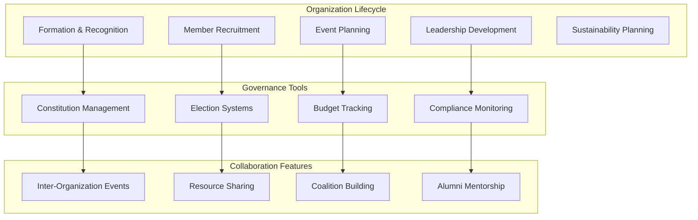
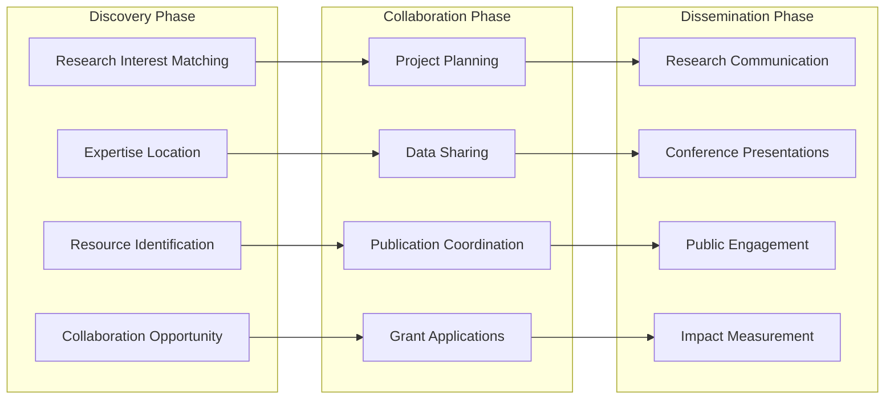
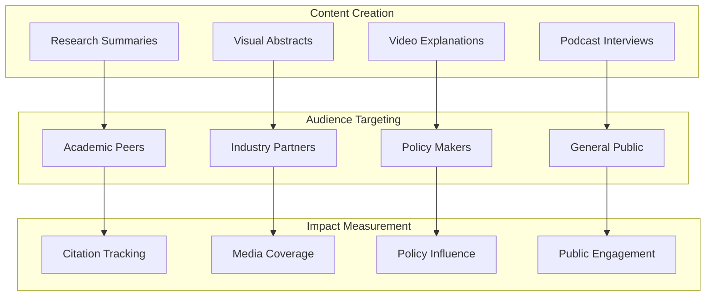
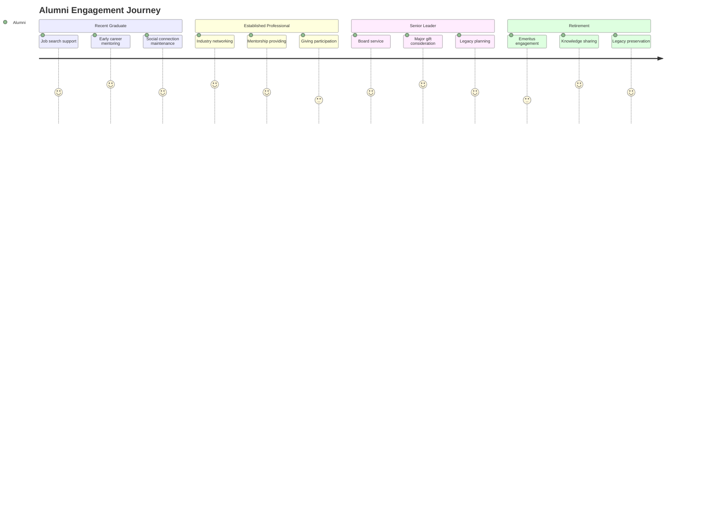
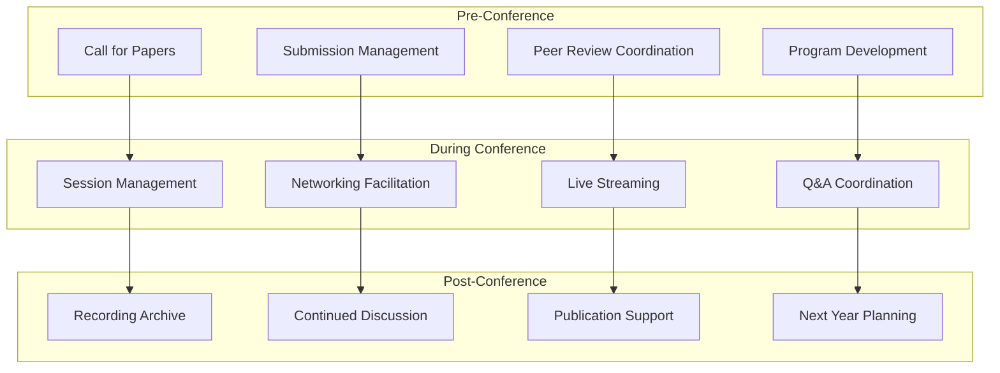
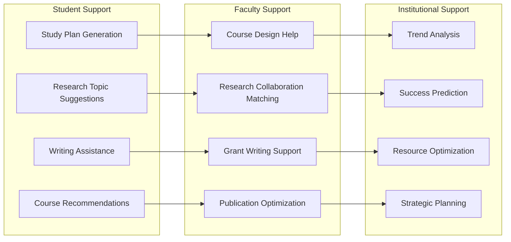

# Technical Implementation Details

This document provides detailed technical specifications and implementation details for FediFlow's academic services platform, including automated community provisioning, AI-powered analytics, and comprehensive student lifecycle management.

## Core Community Services Architecture

### Community Creation & Management Engine

#### Automated Community Provisioning

#### Community Types & Technical Specifications

**Academic Course Communities**
- **Automatic Creation**: Triggered by course registration in SIS (Student Information System)
- **Membership**: Auto-enrolled students, faculty, teaching assistants
- **Lifecycle**: Follows academic calendar (creation, active period, archive)
- **Features**: Assignment discussions, study groups, resource sharing
- **Integration**: Canvas/Blackboard LMS, gradebook sync, attendance tracking
- **Privacy**: FERPA-compliant student record protection
- **Moderation**: Professor oversight, TA moderation, academic integrity monitoring

**Research Collaboration Communities**
- **Creation Triggers**: Grant applications, research project initiation, publication collaboration
- **Membership**: Principal investigators, co-investigators, graduate students, lab members
- **Features**: Data sharing, methodology discussions, publication collaboration
- **Integration**: Research management systems, grant tracking, publication databases
- **Security**: IRB compliance, intellectual property protection, secure data sharing
- **Cross-Institutional**: Federation with partner universities and research institutions

**Student Organization Communities**
- **Creation Process**: Student petition, advisor approval, constitution submission
- **Governance**: Officer roles, election systems, budget tracking
- **Features**: Event planning, member recruitment, communication channels
- **Integration**: Campus event management, budget systems, student affairs
- **Oversight**: Advisor monitoring, institutional policy compliance

### Advanced Community Intelligence

#### AI-Powered Community Health Monitoring

#### Community Health Metrics
- **Engagement Velocity**: Post frequency, response times, interaction depth
- **Network Density**: Connection patterns, influence mapping, collaboration frequency
- **Content Quality**: Academic relevance, resource sharing, knowledge creation
- **Member Satisfaction**: Sentiment analysis, feedback scores, retention rates
- **Goal Achievement**: Learning outcomes, research progress, event success

## Student Lifecycle Management Implementation

### Prospective Student Journey

#### Virtual Campus Discovery Community

#### International Student Recruitment Technical Implementation
**Community Setup**: Country-specific recruitment communities with cultural liaisons
**Services Provided**:
- Multilingual support communities (Spanish, Mandarin, Arabic, Hindi, French)
- Cultural integration workshops and discussions
- Visa and immigration guidance communities
- Pre-arrival academic preparation groups
- Local student ambassador connections

**Technical Integration**:
- Immigration services API integration
- International student office systems
- Academic advising platforms
- Translation services (real-time and asynchronous)
- Time zone-aware event scheduling

**Success Metrics**:
- Application conversion rates
- Enrollment confirmations
- Student satisfaction scores
- Cultural integration success
- Academic preparation effectiveness

### Current Student Engagement & Success

#### Academic Support Ecosystem

#### First-Year Experience Communities Technical Specification
**Community Setup**: Cohort-based first-year communities with peer mentors
**Services Provided**:
- Orientation and transition support
- Academic skill development workshops
- Social integration activities
- Campus resource navigation
- Peer mentor matching and support
- Parent and family engagement

**Technical Integration**:
- Academic advising systems
- Residence life management platforms
- Student affairs databases
- Parent/family communication systems
- Academic support services APIs

**Success Metrics**:
- Retention rates (semester and annual)
- GPA improvement tracking
- Satisfaction scores
- Social integration metrics
- Campus resource utilization

### Student Organization & Leadership Development

#### Comprehensive Organization Management

#### Student Government Digital Democracy Implementation
**Community Setup**: Campus-wide student government community with democratic tools
**Technical Features**:
- Digital voting and election management systems
- Policy discussion and debate forums
- Budget transparency and input collection
- Campus issue reporting and resolution tracking
- Student feedback aggregation and analysis
- Administrative communication and updates

**Integration Points**:
- University administration systems
- Budget and financial systems
- Policy databases and document management
- Campus facilities and services APIs
- Communication and notification systems

## Faculty Research & Collaboration

### Cross-Institutional Research Networks

#### Research Collaboration Ecosystem

#### Interdisciplinary Research Communities Technical Implementation
**Community Setup**: Theme-based research communities crossing traditional disciplines
**Services Provided**:
- Researcher discovery and matching algorithms
- Methodology sharing and consultation platforms
- Equipment and resource sharing networks
- Joint funding opportunity identification
- Collaborative publication support tools
- Conference and symposium coordination

**Technical Integration**:
- Research databases (ORCID, ResearchGate, institutional repositories)
- Funding systems (grants.gov, institutional funding databases)
- Publication platforms (journal APIs, preprint servers)
- Equipment management systems
- Calendar and scheduling integration

### Research Impact & Communication

#### Research Dissemination Platform

## Alumni Engagement & Advancement

### Alumni Lifecycle Management

#### Alumni Engagement Journey

#### Alumni Career Network Platform Technical Implementation
**Community Setup**: Industry and geographic alumni communities with professional focus
**Services Provided**:
- Job posting and recruitment support systems
- Mentorship matching and coordination algorithms
- Industry insight sharing platforms
- Professional development workshops and webinars
- Business networking events and coordination
- Career transition support and counseling

**Technical Integration**:
- Career services platforms (Handshake, Symplicity)
- HR systems and job boards
- Professional databases (LinkedIn, industry-specific platforms)
- CRM systems for relationship management
- Payment processing for events and services

## Academic Conference & Event Management

### Conference Lifecycle Management

#### Hybrid Academic Conference Management Technical Specification
**Community Setup**: Conference-specific communities with hybrid participation support
**Technical Services**:
- Virtual and in-person session coordination systems
- Interactive poster session management platforms
- Networking event facilitation tools
- Real-time translation services integration
- Accessibility accommodation systems
- Continuing education credit tracking

**Integration Points**:
- Conference management systems (Eventbrite, Cvent)
- Video platforms (Zoom, WebEx, custom streaming)
- Translation services (real-time and post-processing)
- Learning management systems for credit tracking
- Payment processing for registration and fees

## Advanced AI-Powered Academic Services

### Intelligent Content & Learning Support

#### Academic AI Assistant Suite

### Predictive Academic Analytics Implementation
**Capabilities**:
- Student success prediction and intervention recommendations
- Faculty research impact forecasting
- Alumni giving potential assessment
- Enrollment trend analysis and optimization
- Course demand prediction and scheduling
- Resource allocation optimization

**Technical Implementation**:
- Machine learning models trained on institutional data
- Real-time data processing and prediction pipelines
- FERPA-compliant data processing with anonymization
- Integration with institutional research systems
- Dashboard and reporting interfaces

**Privacy & Compliance**:
- Differential privacy techniques for sensitive data
- Role-based access controls for predictions
- Audit trails for all AI-driven decisions
- Explainable AI for intervention recommendations
- Regular bias detection and mitigation

**ROI Measurement**:
- $500K-2M annual value from improved outcomes
- Reduction in student dropout rates
- Increased research collaboration success
- Improved resource allocation efficiency
- Enhanced institutional decision-making

This technical implementation framework provides the detailed specifications needed to deploy FediFlow's comprehensive academic ecosystem while ensuring compliance, security, and measurable value creation for educational institutions.
